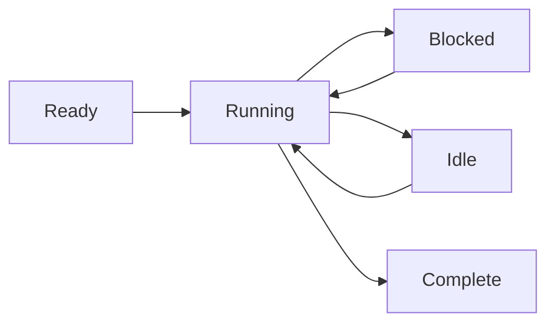

# Prozessmodell

Wippy führt Code in isolierten Prozessen aus — leichtgewichtigen Zustandsautomaten, die über Nachrichtenübermittlung kommunizieren. Dieser aktorenbasierte Ansatz eliminiert Probleme mit gemeinsamem Zustand und macht nebenläufige Programmierung vorhersagbar.

## Zustandsmaschinen-Ausführung

Jeder Prozess folgt demselben Muster: Initialisieren, schrittweise Ausführung mit Unterbrechung bei blockierenden Operationen, und Beenden bei Abschluss. Der Scheduler verteilt Tausende von Prozessen auf einen Worker-Pool und führt andere Prozesse aus, während einer auf E/A wartet.

Prozesse unterstützen mehrere gleichzeitige Unterbrechungen — Sie können mehrere asynchrone Operationen starten und auf eine beliebige oder alle warten. Dies ermöglicht effiziente parallele E/A, ohne zusätzliche Prozesse zu starten.



Prozesse sind nicht auf Lua beschränkt. Die Laufzeitumgebung unterstützt jede Zustandsautomaten-Implementierung — Go-basierte Prozesse und WebAssembly-Module sind geplant.

<warning>
Prozesse sind leichtgewichtig, aber nicht kostenlos. Jeder Prozess beginnt mit etwa 13 KB Grundspeicher. Dynamische Speicherreservierungen und Heap-Wachstum kommen während der Ausführung hinzu.
</warning>

## Process Hosts

Wippy führt mehrere Process Hosts innerhalb einer einzigen Laufzeitumgebung aus, jeder mit unterschiedlichen Fähigkeiten und Sicherheitsgrenzen. Systemprozesse, die privilegierte Funktionen ausführen, können in einem Host leben, isoliert von Hosts, die Benutzersitzungen ausführen. Hosts können einschränken, was Prozesse tun dürfen — in Erlang bräuchten Sie separate Knoten für dieses Isolationsniveau.

Einige Hosts sind spezialisiert. Der Terminal-Host führt beispielsweise einen einzelnen Prozess aus, gewährt ihm aber Zugriff auf E/A-Operationen, die andere Hosts verweigern. Dies ermöglicht es Ihnen, Vertrauensstufen in einer Bereitstellung zu mischen — Systemdienste mit vollem Zugriff neben isoliertem Benutzercode.

## Sicherheitsmodell

Jeder Prozess wird unter einer Aktoridentität und Sicherheitsrichtlinie ausgeführt. Typischerweise ist dies der Benutzer, der den Aufruf initiiert hat, aber Systemprozesse laufen unter einem Systemaktor mit anderen Berechtigungen.

Zugriffskontrolle funktioniert auf mehreren Ebenen. Einzelne Prozesse haben ihre eigenen Zugriffsebenen. Das Senden von Nachrichten zwischen Hosts kann aufgrund der Sicherheitsrichtlinie verboten werden — ein isolierter Benutzerprozess darf möglicherweise überhaupt keine Nachrichten an System-Hosts senden. Die dem aktuellen Aktor zugeordnete Richtlinie bestimmt, welche Operationen erlaubt sind.

## Prozesse starten

Erstellen Sie Hintergrundprozesse mit `process.spawn()`:

```lua
local pid = process.spawn("app.workers:handler", "app:processes", arg1, arg2)
```

Das erste Argument ist der Registry-Eintrag, das zweite ist der Process Host, und die verbleibenden Argumente werden an den Prozess übergeben.

Spawn-Varianten steuern Lebenszyklus-Beziehungen:

| Funktion | Verhalten |
|----------|-----------|
| `spawn` | Fire and Forget |
| `spawn_monitored` | EXIT-Ereignisse empfangen, wenn Kindprozess beendet wird |
| `spawn_linked` | Bidirektional — jeder Absturz benachrichtigt den anderen |

## Message-Passing

Prozesse kommunizieren über Nachrichten, niemals über gemeinsamen Speicher:

```lua
process.send(target_pid, "topic", payload)
```

Nachrichten vom selben Absender kommen in Reihenfolge an. Nachrichten von verschiedenen Absendern können sich überlappen. Die Zustellung erfolgt ohne Bestätigung — verwenden Sie Anfrage-Antwort-Muster, wenn Sie eine Bestätigung benötigen.

<note>
Prozesse können sich in einem lokalen Namensverzeichnis registrieren und anstelle der PID über den Namen adressiert werden (z. B. <code>session_manager</code>). Ein globales Verzeichnis für knotenübergreifende Adressierung ist geplant.
</note>

## Supervision

Jeder Prozess kann andere überwachen. Ein Prozess startet Kindprozesse mit Überwachung, beobachtet EXIT-Ereignisse und startet sie bei Fehlern neu. Dies folgt Erlangs Philosophie „Lass es abstürzen": Prozesse stürzen bei unerwarteten Bedingungen ab, und der überwachende Prozess behandelt die Wiederherstellung.

```lua
local worker = process.spawn_monitored("app.workers:handler", "app:processes")
local event = process.events():receive()

if event.kind == process.event.EXIT and event.result.error then
    worker = process.spawn_monitored("app.workers:handler", "app:processes")
end
```

Auf oberster Ebene bietet die Laufzeitumgebung Dienste, die langlebige Prozesse starten und überwachen — ähnlich wie systemd unter Linux. Definieren Sie einen `process.service`-Eintrag, damit die Laufzeitumgebung einen Prozess verwaltet:

```yaml
- name: worker.service
  kind: process.service
  process: app.workers:handler
  host: app:processes
  lifecycle:
    auto_start: true
    restart:
      max_attempts: 5
      delay: 1s
```

Der Dienst startet automatisch, startet bei Abstürzen mit Verzögerung neu und integriert sich in die Lebenszyklus-Verwaltung der Laufzeitumgebung.

## Prozess-Upgrade

Laufende Prozesse können ihren Code aktualisieren, ohne ihre Identität zu verlieren. Rufen Sie `process.upgrade()` auf, um zu einer neuen Definition zu wechseln und dabei PID, Postfach und Überwachungsbeziehungen zu erhalten:

```lua
process.upgrade("app.workers:v2", current_state)
```

Das erste Argument ist der neue Registry-Eintrag (oder nil, um die aktuelle Definition neu zu laden). Zusätzliche Argumente werden an die neue Version übergeben, sodass Sie den Zustand über die Aktualisierung hinweg transportieren können. Der Prozess setzt die Ausführung sofort mit dem neuen Code fort.

Dies ermöglicht das Neuladen von Code während der Entwicklung und unterbrechungsfreie Aktualisierungen in der Produktion. Die Laufzeitumgebung speichert kompilierte Prototypen, sodass Aktualisierungen keine wiederholten Kompilierungskosten verursachen. Wenn eine Aktualisierung aus irgendeinem Grund fehlschlägt, stürzt der Prozess ab und normale Überwachungsmechanismen greifen — ein überwachender Elternprozess kann ihn mit der vorherigen Version neu starten oder den Fehler eskalieren.

## Scheduling

Der Aktor-Scheduler verwendet Arbeitsverteilung über CPU-Kerne. Jeder Worker hat eine lokale Warteschlange für Cache-Lokalität, mit einer globalen Warteschlange für die Verteilung. Prozesse unterbrechen bei blockierenden Operationen, wodurch Tausende nebenläufig auf einer Handvoll Threads ausgeführt werden können.
