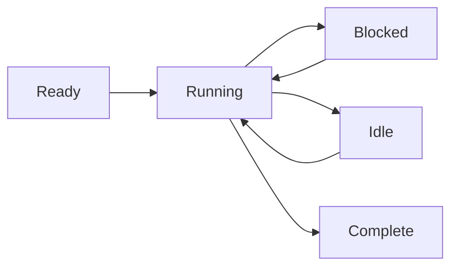

# Prozessmodell

Wippy führt Code in isolierten Prozessen aus — leichtgewichtigen Zustandsmaschinen, die über Message-Passing kommunizieren. Dieser Actor-Modell-Ansatz eliminiert Shared-State-Bugs und macht nebenläufige Programmierung vorhersagbar.

## Zustandsmaschinen-Ausführung

Jeder Prozess folgt demselben Muster: Initialisieren, schrittweise Ausführung mit Yielding bei blockierenden Operationen, und Schließen bei Abschluss. Der Scheduler multiplext Tausende von Prozessen über einen Worker-Pool und führt andere Prozesse aus, während einer auf I/O wartet.

Prozesse unterstützen mehrere gleichzeitige Yields — Sie können mehrere asynchrone Operationen starten und auf eine beliebige oder alle warten. Dies ermöglicht effizientes paralleles I/O, ohne zusätzliche Prozesse zu starten.



Prozesse sind nicht auf Lua beschränkt. Die Runtime unterstützt jede Zustandsmaschinen-Implementierung — Go-basierte Prozesse und WebAssembly-Module sind geplant.

<warning>
Prozesse sind leichtgewichtig, aber nicht kostenlos. Jeder Prozess beginnt mit etwa 13KB Basis-Overhead. Dynamische Allokationen und Heap-Wachstum kommen während der Ausführung hinzu.
</warning>

## Process Hosts

Wippy führt mehrere Process Hosts innerhalb einer einzigen Runtime aus, jeder mit unterschiedlichen Fähigkeiten und Sicherheitsgrenzen. Systemprozesse, die privilegierte Funktionen ausführen, können in einem Host leben, isoliert von Hosts, die Benutzersitzungen ausführen. Hosts können einschränken, was Prozesse tun dürfen — in Erlang bräuchten Sie separate Nodes für dieses Isolationsniveau.

Einige Hosts sind spezialisiert. Der Terminal-Host führt beispielsweise einen einzelnen Prozess aus, gewährt ihm aber Zugriff auf I/O-Operationen, die andere Hosts verweigern. Dies ermöglicht es Ihnen, Vertrauensstufen in einem Deployment zu mischen — Systemdienste mit vollem Zugriff neben sandboxed Benutzercode.

## Sicherheitsmodell

Jeder Prozess wird unter einer Actor-Identität und Sicherheitsrichtlinie ausgeführt. Typischerweise ist dies der Benutzer, der den Aufruf initiiert hat, aber Systemprozesse laufen unter einem System-Actor mit anderen Privilegien.

Zugriffskontrolle funktioniert auf mehreren Ebenen. Einzelne Prozesse haben ihre eigenen Zugriffsebenen. Das Senden von Nachrichten zwischen Hosts kann basierend auf der Sicherheitsrichtlinie verboten werden — ein sandboxed Benutzerprozess darf möglicherweise überhaupt keine Nachrichten an System-Hosts senden. Die an den aktuellen Actor angehängte Richtlinie bestimmt, welche Operationen erlaubt sind.

## Prozesse starten

Erstellen Sie Hintergrundprozesse mit `process.spawn()`:

```lua
local pid = process.spawn("app.workers:handler", "app:processes", arg1, arg2)
```

Das erste Argument ist der Registry-Eintrag, das zweite ist der Process Host, und die verbleibenden Argumente werden an den Prozess übergeben.

Spawn-Varianten steuern Lebenszyklus-Beziehungen:

| Funktion | Verhalten |
|----------|-----------|
| `spawn` | Fire and Forget |
| `spawn_monitored` | EXIT-Events empfangen, wenn Kind beendet wird |
| `spawn_linked` | Bidirektional — jeder Absturz benachrichtigt den anderen |

## Message-Passing

Prozesse kommunizieren über Nachrichten, niemals über Shared Memory:

```lua
process.send(target_pid, "topic", payload)
```

Nachrichten vom selben Absender kommen in Reihenfolge an. Nachrichten von verschiedenen Absendern können sich überschneiden. Die Zustellung ist Fire-and-Forget — verwenden Sie Request-Response-Muster, wenn Sie eine Bestätigung benötigen.

<note>
Prozesse können sich in einer lokalen Namensregistry registrieren und anstelle der PID über den Namen adressiert werden (z.B. <code>session_manager</code>). Globale Registry für knotenübergreifende Adressierung ist geplant.
</note>

## Supervision

Jeder Prozess kann andere überwachen, indem er sie monitort. Ein Prozess startet Kinder mit Monitoring, beobachtet EXIT-Events und startet sie bei Fehlern neu. Dies folgt Erlangs "Let it crash"-Philosophie: Prozesse crashen bei unerwarteten Bedingungen, und der überwachende Prozess behandelt die Wiederherstellung.

```lua
local worker = process.spawn_monitored("app.workers:handler", "app:processes")
local event = process.events():receive()

if event.kind == process.event.EXIT and event.result.error then
    worker = process.spawn_monitored("app.workers:handler", "app:processes")
end
```

Auf Root-Ebene bietet die Runtime Dienste, die langlebige Prozesse starten und überwachen — ähnlich wie systemd in Linux. Definieren Sie einen `process.service`-Eintrag, damit die Runtime einen Prozess verwaltet:

```yaml
- name: worker.service
  kind: process.service
  process: app.workers:handler
  host: app:processes
  lifecycle:
    auto_start: true
    restart:
      max_attempts: 5
      delay: 1s
```

Der Dienst startet automatisch, startet bei Abstürzen mit Backoff neu und integriert sich in das Lifecycle-Management der Runtime.

## Prozess-Upgrade

Laufende Prozesse können ihren Code aktualisieren, ohne ihre Identität zu verlieren. Rufen Sie `process.upgrade()` auf, um zu einer neuen Definition zu wechseln und dabei PID, Mailbox und Supervision-Beziehungen zu erhalten:

```lua
process.upgrade("app.workers:v2", current_state)
```

Das erste Argument ist der neue Registry-Eintrag (oder nil, um die aktuelle Definition neu zu laden). Zusätzliche Argumente werden an die neue Version übergeben, sodass Sie Zustand über das Upgrade hinweg transportieren können. Der Prozess setzt die Ausführung sofort mit dem neuen Code fort.

Dies ermöglicht Hot-Code-Reload während der Entwicklung und Zero-Downtime-Updates in der Produktion. Die Runtime cacht kompilierte Protos, sodass Upgrades nicht wiederholt Kompilierungskosten verursachen. Wenn ein Upgrade aus irgendeinem Grund fehlschlägt, crasht der Prozess und normale Supervision-Semantik greift — ein überwachendes Elternteil kann ihn mit der vorherigen Version neu starten oder den Fehler eskalieren.

## Scheduling

Der Actor-Scheduler verwendet Work-Stealing über CPU-Kerne. Jeder Worker hat eine lokale Queue für Cache-Lokalität, mit einer globalen Queue für die Verteilung. Prozesse yielden bei blockierenden Operationen, was es ermöglicht, Tausende nebenläufig auf einer Handvoll Threads auszuführen.
