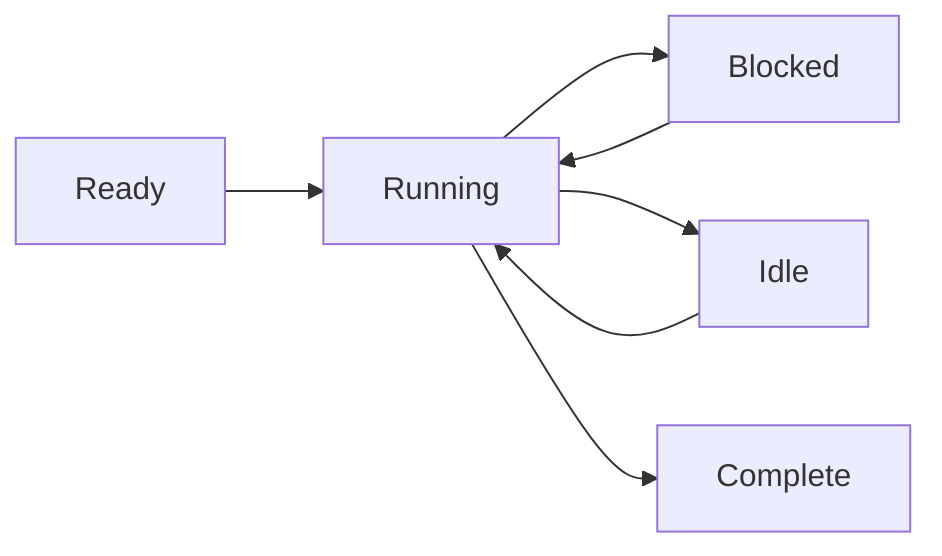

# Prozessmodell

Wippy führt Code in isolierten Prozessen aus: leichtgewichtigen Zustandsautomaten, die durch Nachrichten statt gemeinsamen Speicher kommunizieren. Dieses Aktormodell gibt jedem Prozess eigenen Zustand und einen eigenen Lebenszyklus.

Diese Seite beschreibt Lebenszyklus und Isolationsmodell. Die [Referenz zur Prozessverwaltung](../lua/core/process.md) behandelt Start, Nachrichten, Monitoring, Registry und Upgrade-APIs. Runtime-verwaltete Service-Felder finden Sie unter [Process Host und Services](../system/process-host.md).

## Ausführung als Zustandsautomat

Jeder Prozess initialisiert sich, schreitet durch seine Ausführung fort, gibt bei blockierenden Operationen die Ausführung frei und schließt nach Abschluss. Der Scheduler multiplext Prozesse über einen Worker-Pool und führt andere Arbeit aus, während ein Prozess auf E/A wartet.

Prozesse unterstützen mehrere gleichzeitige Wartezustände. Dadurch kann Code mehrere asynchrone Operationen starten und auf eine oder alle warten, ohne zusätzliche Prozesse zu erzeugen.


```mermaid
flowchart LR
    Ready --> Running
    Running --> Blocked
    Running --> Idle
    Blocked --> Running
    Idle --> Running
    Running --> Complete
```

Prozesse sind nicht auf Lua beschränkt. Die Runtime unterstützt über den Kind `process.wasm` auch WebAssembly-Module; ihre Prozessarchitektur kann weitere Implementierungen von Zustandsautomaten unterstützen.

<warning>
Prozesse sind leichtgewichtig, aber nicht kostenlos. Jeder Prozess verursacht geringe Grundkosten für Zustand, Inbox und Scheduler-Buchführung; dynamische Allokationen vergrößern diesen Speicherbedarf während der Ausführung.
</warning>

## Process Hosts

Wippy kann mehrere Process Hosts mit jeweils eigenen Capabilities und Sicherheitsgrenzen in einer Runtime betreiben. Privilegierte Systemprozesse können in einem anderen Host laufen als Hosts, die Benutzersitzungen ausführen.

Einige Hosts sind spezialisiert. Der Terminal-Host verwendet beispielsweise einen Scheduler-Worker
und stellt zugelassenen Prozessen Terminal-E/A-Kontext bereit; er
erzwingt keine Lebensdauerbegrenzung auf einen einzelnen Prozess. Getrennte Hosts erlauben einer Bereitstellung,
Prozesse mit unterschiedlichen Vertrauensstufen auszuführen.

## Sicherheitsmodell

Jeder Prozess wird unter einer Akteuridentität und Sicherheitsrichtlinie ausgeführt. Üblicherweise ist dies der Benutzer, der den Aufruf initiiert hat; Systemprozesse verwenden einen Systemakteur mit anderen Berechtigungen.

Zugriffskontrolle greift auf mehreren Ebenen. Sicherheitsrichtlinien können einzelne Prozessoperationen und die Nachrichtenübermittlung zwischen Hosts einschränken. Die Richtlinie des aktuellen Akteurs bestimmt, welche Operationen erlaubt sind.

Die Auswirkungen der Prozessisolation auf die Sicherheit erläutert das [Sicherheitsmodell](./security-model.md).

## Prozesse starten

Erstellen Sie Hintergrundprozesse mit `process.spawn()`:

```lua
local pid, err = process.spawn("app.workers:handler", "app:processes", arg1, arg2)
if err then return nil, err end
return pid
```

Das erste Argument ist der Registry-Eintrag, das zweite der Process Host; die übrigen Argumente werden an den Prozess übergeben.

Spawn-Varianten steuern Lebenszyklusbeziehungen:

| Funktion | Verhalten |
|----------|----------|
| `spawn` | Unabhängigen Prozess starten |
| `spawn_monitored` | EXIT-Ereignisse empfangen, wenn das Kind endet |
| `spawn_linked` | Abnormales Beenden wird in beide Richtungen weitergegeben; mit `trap_links: true` erhält der Peer `LINK_DOWN`, statt selbst zu scheitern |

## Nachrichtenübermittlung

Prozesse kommunizieren durch Nachrichten statt gemeinsamem Speicher:

```lua
local ok, err = process.send(target_pid, "topic", payload)
if err then return nil, err end
return ok
```

Nachrichten desselben Absenders kommen in Reihenfolge an. Nachrichten verschiedener Absender können sich überlagern. Die Zustellung erfolgt ohne Bestätigung; verwenden Sie Anfrage-Antwort-Muster, wenn Sie eine Bestätigung benötigen.

<note>
Prozesse können sich in einer lokalen Namensregistry registrieren und statt über eine PID über einen Namen wie <code>session_manager</code> angesprochen werden. Über <code>process.registry</code> lassen sich Namen außerdem clusterweit für die knotenübergreifende Adressierung in den Scopes EVENTUAL auf Gossip-Basis sowie CONSISTENT und STRONG auf Raft-Basis registrieren.
</note>

## Supervision

Jeder Prozess kann andere Prozesse durch Monitoring überwachen. Ein Supervisor startet überwachte Kinder, beobachtet EXIT-Ereignisse und entscheidet, ob sie nach einem Fehler neu gestartet werden.

```lua
local worker, spawn_err = process.spawn_monitored("app.workers:handler", "app:processes")
if spawn_err then return nil, spawn_err end

local event, open = process.events():receive()
if not open then return nil, errors.new("process event channel closed") end

if event.kind == process.event.EXIT and event.result.error then
    local replacement, restart_err = process.spawn_monitored("app.workers:handler", "app:processes")
    if restart_err then return nil, restart_err end
    worker = replacement
end
```

Auf Runtime-Ebene können Services lang laufende Prozesse starten und überwachen. Definieren Sie einen `process.service`-Eintrag, damit die Runtime einen Prozess verwaltet:

```yaml
- name: worker.service
  kind: process.service
  process: app.workers:handler
  host: app:processes
  lifecycle:
    auto_start: true
    restart:
      max_attempts: 5
      initial_delay: 1s
```

Der Service startet automatisch und ist in die Lebenszyklusverwaltung der Runtime eingebunden. In der festgelegten Runtime zählt der erste fehlgeschlagene Start zu `max_attempts`; der Wert `5` erlaubt also höchstens vier weitere Starts. Jeder Retry wartet mit Jitter um `initial_delay`; die Verzögerung wächst zwischen den Versuchen nicht an.

## Prozess-Upgrades

Laufende Prozesse können ihren Code aktualisieren, ohne ihre Identität zu verlieren. Rufen Sie `process.upgrade()` auf, um zu einer neuen Definition zu wechseln und PID, Mailbox sowie Supervision-Beziehungen zu behalten:

```lua
process.upgrade("app.workers:v2", current_state)
```

Das erste Argument ist der neue Registry-Eintrag oder `nil`, um die aktuelle Definition neu zu laden. Zusätzliche Argumente werden an die neue Version übergeben, damit Zustand über das Upgrade hinweg transportiert werden kann. Der Prozess setzt die Ausführung sofort mit dem neuen Code fort.

Die Runtime speichert kompilierte Prototypen zwischen, um wiederholte Kompilierung zu vermeiden. Schlägt ein Upgrade fehl, stürzt der Prozess ab und normales Supervision-Verhalten greift; ein überwachender Elternprozess kann ihn neu starten oder den Fehler eskalieren.

## Scheduling

Der Actor-Scheduler verwendet Work-Stealing über CPU-Kerne hinweg. Jeder Worker hat eine lokale Queue für Cache-Lokalität sowie eine globale Queue zur Arbeitsverteilung. Prozesse geben die Ausführung bei blockierenden Operationen frei, damit andere Prozesse im Worker-Pool laufen können.
