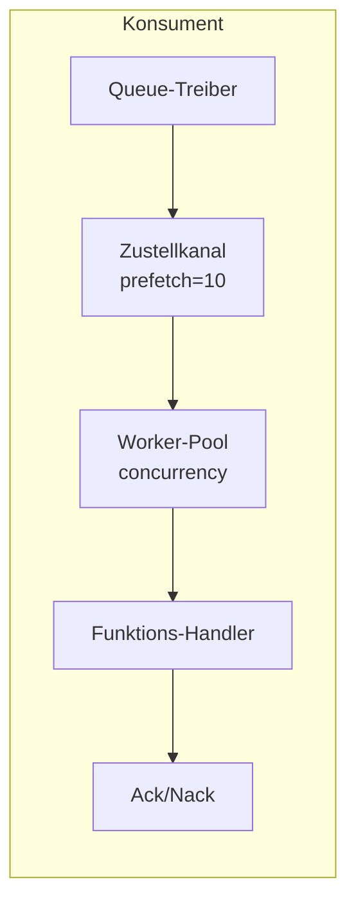

# Queue-Konsumenten

Queue-Konsumenten verarbeiten Nachrichten aus Queues mittels Worker-Pools.

## Übersicht



## Konfiguration

| Option | Standard | Max | Beschreibung |
|--------|----------|-----|--------------|
| `queue` | Erforderlich | - | Queue-Registry-ID |
| `func` | Erforderlich | - | Handler-Funktions-Registry-ID |
| `concurrency` | 1 | 1000 | Worker-Anzahl |
| `prefetch` | 10 | 10000 | Nachrichtenpuffer-Größe |

## Entry-Definition

```yaml
- name: order_consumer
  kind: queue.consumer
  queue: app:orders
  func: app:process_order
  concurrency: 5
  prefetch: 20
  lifecycle:
    auto_start: true
    depends_on:
      - app:orders
```

## Handler-Funktion

Die Handler-Funktion empfängt den Nachrichteninhalt:

```lua
-- process_order.lua
local json = require("json")

local function handler(body)
    local order = json.decode(body)

    -- Bestellung verarbeiten
    local result, err = process_order(order)
    if err then
        -- Fehler zurückgeben löst Nack aus (Requeue)
        return nil, err
    end

    -- Erfolg löst Ack aus
    return result
end

return handler
```

```yaml
- name: process_order
  kind: function.lua
  source: file://process_order.lua
  modules:
    - json
```

## Bestätigung

| Ergebnis | Aktion | Effekt |
|----------|--------|--------|
| Erfolg | Ack | Nachricht aus Queue entfernt |
| Fehler | Nack | Nachricht erneut eingereiht (treiberabhängig) |

## Worker-Pool

- Worker laufen als nebenläufige Goroutinen
- Jeder Worker verarbeitet eine Nachricht auf einmal
- Nachrichten werden Round-Robin aus dem Delivery-Channel verteilt
- Prefetch-Puffer ermöglicht es dem Treiber, voraus zu liefern

### Beispiel

```
concurrency: 3
prefetch: 10

Ablauf:
1. Treiber liefert bis zu 10 Nachrichten in den Puffer
2. 3 Worker holen nebenläufig aus dem Puffer
3. Wenn Worker fertig sind, füllt sich der Puffer nach
4. Gegendruck wenn alle Worker beschäftigt und Puffer voll
```

## Kontrolliertes Herunterfahren

Beim Stoppen:
1. Keine neuen Lieferungen mehr annehmen
2. Worker-Kontexte abbrechen
3. Auf laufende Nachrichten warten (mit Timeout)
4. Timeout-Fehler zurückgeben wenn Worker nicht fertig werden

## Queue-Deklaration

```yaml
# Queue-Treiber (Memory für Dev/Test)
- name: queue_driver
  kind: queue.driver.memory
  lifecycle:
    auto_start: true

# Queue-Definition
- name: orders
  kind: queue.queue
  driver: app:queue_driver
  options:
    queue_name: orders      # Namen überschreiben (Standard: Entry-Name)
    max_length: 10000       # Maximale Queue-Größe
    durable: true           # Neustarts überleben
```

| Option | Beschreibung |
|--------|--------------|
| `queue_name` | Queue-Namen überschreiben (Standard: Entry-ID-Name) |
| `max_length` | Maximale Queue-Größe |
| `durable` | Neustarts überleben (treiberabhängig) |

## Memory-Treiber

Eingebaute In-Memory-Queue für Entwicklung/Tests:

- Kind: `queue.driver.memory`
- Nachrichten im Speicher gehalten
- Nack reiht Nachricht an den Anfang der Queue ein
- Keine Persistenz über Neustarts hinweg

## Siehe auch

- [Message Queue](lua/storage/queue.md) - Queue-Modul-Referenz
- [Queue-Konfiguration](system/queue.md) - Queue-Treiber und Entry-Definitionen
- [Supervision-Bäume](guides/supervision.md) - Consumer-Lebenszyklus
- [Prozessverwaltung](lua/core/process.md) - Prozess-Spawning und Kommunikation
