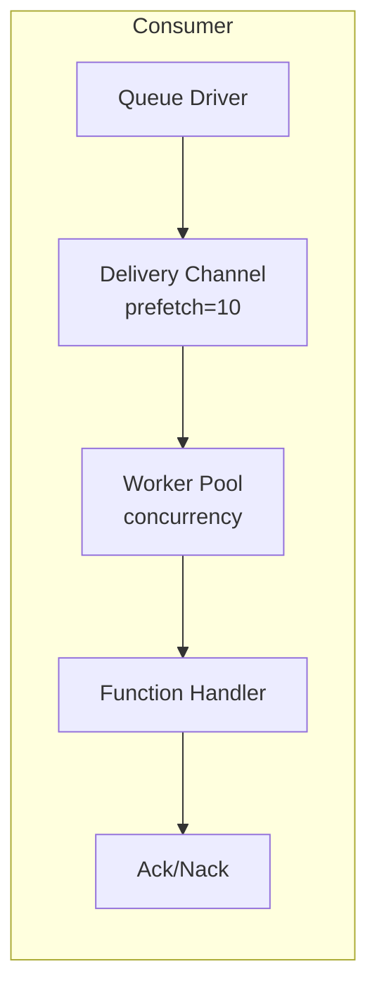

# Queue-Konsumenten

Queue-Consumer liefern Nachrichten über einen konfigurierbaren Worker-Pool aus einer Queue an Funktionshandler.

## Übersicht


```mermaid
flowchart LR
    subgraph Consumer
        QD[Queue Driver] --> DC[Delivery Channel<br/>prefetch=10]
        DC --> WP[Worker Pool<br/>concurrency]
        WP --> FH[Function Handler]
        FH --> AN[Ack/Nack]
    end
```

## Konfiguration

| Option | Standard | Max | Beschreibung |
|--------|----------|-----|--------------|
| `queue` | Erforderlich | - | Queue-Registry-ID |
| `func` | Erforderlich | - | Handler-Funktions-Registry-ID |
| `concurrency` | 1 | 1000 | Worker-Anzahl |
| `prefetch` | 10 | 10000 | Größe des gemeinsamen Zustellungspuffers; AMQP verwendet sie außerdem als QoS-Prefetch-Anzahl des Channels |
| `auto_ack` | false | - | Backend-spezifische Auto-Ack-Option; bei AMQP fordert `true` die Broker-Bestätigung bei Zustellung an |
| `driver_options` | `{}` | - | Treiberspezifische Consumer-Optionen |

## Entry-Definition

```yaml
- name: order_consumer
  kind: queue.consumer
  queue: app:orders
  func: app:process_order
  concurrency: 5
  prefetch: 20
  lifecycle:
    auto_start: true
    requires:
      - app:orders
```

## Handler-Funktion

Die Handler-Funktion erhält den Body, nachdem der Codec der Queue ihn dekodiert hat. Mit `queue.message()` greifen Sie auf die aktuelle Zustellung und deren Metadaten zu:

```lua
-- process_order.lua
local queue = require("queue")
local logger = require("logger")

local function main(order)
    local msg, msg_err = queue.message()
    if msg_err then
        return nil, msg_err
    end

    logger:info("processing order", {
        message_id = msg:id(),
        order_id = order.id
    })

    return {processed = true, order_id = order.id}
end

return {main = main}
```

```yaml
- name: process_order
  kind: function.lua
  source: file://process_order.lua
  method: main
  modules:
    - queue
    - logger
```

## Bestätigung

Sofern der Handler die Zustellung nicht explizit abschließt, verwendet der Consumer das Ergebnis des Funktionsaufrufs:

| Handler-Ergebnis | Aktion | Effekt |
|-----------------|--------|--------|
| Abschluss ohne Aufruffehler | Ack | Nachricht aus der Queue entfernt |
| Zurückgegebener oder ausgelöster Aufruffehler | Nack | Erneute Zustellung ist treiberabhängig |

Gewöhnliche Rückgabewerte einschließlich `false` wählen das Bestätigungsverhalten nicht aus. Verwenden Sie `msg:ack()` oder `msg:nack()` für einen expliziten Abschluss. Der Abschluss erfolgt genau einmal: Der erste gewinnt. Bei AMQP mit `auto_ack: true` bestätigt der Broker bei Zustellung; ein späterer Handlerfehler kann daher keine erneute Zustellung durch den Broker auslösen.

## Worker-Pool

- Worker laufen als nebenläufige Goroutinen
- Jeder Worker verarbeitet eine Nachricht auf einmal
- Worker beziehen Nachrichten aus einem gemeinsamen Delivery-Channel. Der nächste freie Worker erhält die nächste Nachricht; Reihenfolge oder Rotation zwischen Workern ist nicht garantiert.
- Der Prefetch-Puffer erlaubt dem Treiber, Nachrichten vor der Verarbeitung zu liefern.

### Beispiel

```
concurrency: 3
prefetch: 10

Flow:
1. Driver delivers up to 10 messages to buffer
2. 3 workers pull from buffer concurrently
3. As workers finish, buffer refills
4. Backpressure when all workers busy and buffer full
```

## Kontrolliertes Herunterfahren

Beim Herunterfahren:
1. Keine neuen Lieferungen mehr annehmen
2. Worker-Kontexte abbrechen
3. Auf laufende Nachrichten warten (mit Timeout)
4. Timeout-Fehler zurückgeben wenn Worker nicht fertig werden

## Queue-Deklaration

```yaml
# Queue driver (memory for dev/test)
- name: queue_driver
  kind: queue.driver.memory
  lifecycle:
    auto_start: true

# Queue definition
- name: orders
  kind: queue.queue
  driver: app:queue_driver
  queue_name: orders        # Override name (default: entry name)
  codec: json/plain         # Payload codec (optional; json/plain is the default)
  dead_letter:              # Accepted configuration; not enforced by built-in drivers
    queue: app:dlq
    max_attempts: 5
  driver_options:
    memory:
      max_length: 10000     # Memory driver: bounded queue size
```

| Feld | Beschreibung |
|------|--------------|
| `queue_name` | Queue-Namen überschreiben (Standard: Entry-ID-Name) |
| `codec` | Name des Payload-Codecs |
| `dead_letter.queue` | Akzeptierte Registry-ID einer Dead-Letter-Queue; von integrierten Treibern nicht durchgesetzt |
| `dead_letter.max_attempts` | Akzeptierte Versuchszahl; von integrierten Treibern nicht durchgesetzt |
| `driver_options` | Treiberspezifische Einstellungen, nach Treibernamen geschlüsselt |

<note>
Kein integrierter Treiber zählt derzeit Versuche oder routet Nachrichten anhand des `dead_letter`-Blocks. Die Runtime übersetzt diesen Block nicht in AMQP-Queue-Argumente; gewöhnliche AMQP-Consumerfehler fordern eine erneute Einreihung an. Brokerseitiges Dead-Lettering muss daher außerhalb dieses Blocks konfiguriert und ausgelöst werden. Der Memory-Treiber routet nicht an eine DLQ.
</note>

## Memory-Treiber

Der integrierte In-Memory-Treiber ist für Entwicklung und Tests vorgesehen:

- Kind: `queue.driver.memory`
- Nachrichten im Speicher gehalten
- Nack versucht, eine Kopie der Nachricht am Ende der Queue einzureihen; dieser Versuch kann scheitern, wenn die begrenzte Queue voll ist
- Keine Persistenz über Neustarts hinweg

## Siehe auch

- [Message Queue](../lua/storage/queue.md) — Referenz des Queue-Moduls
- [Queue-Konfiguration](../system/queue.md) — Queue-Treiber und Entry-Definitionen
- [Supervision](./supervision.md) — Consumer-Lebenszyklus
- [Prozessverwaltung](../lua/core/process.md) — Prozessstart und Kommunikation
