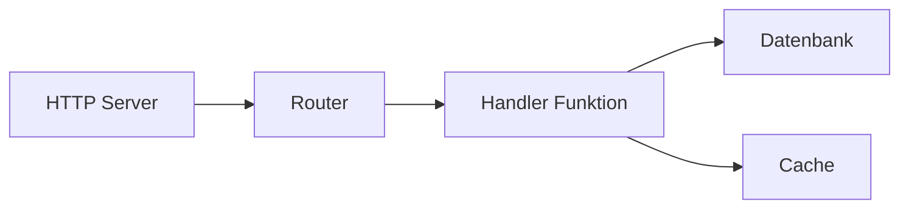
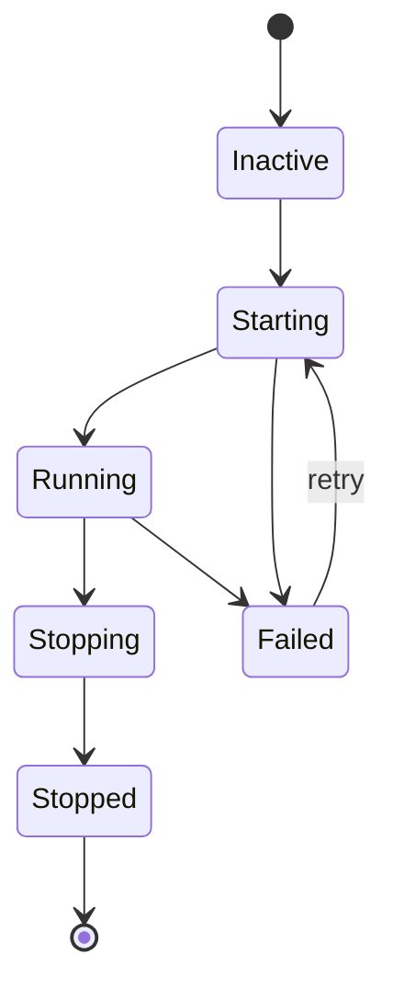

# Supervision

Der Supervisor verwaltet Dienst-Lebenszyklen, behandelt Startreihenfolge, automatische Neustarts und Graceful Shutdown. Dienste mit `auto_start: true` werden beim Anwendungsstart gestartet.

## Lebenszyklus-Konfiguration

Dienste registrieren sich beim Supervisor mit einem `lifecycle`-Block. Für Prozesse verwenden Sie `process.service` um eine Prozessdefinition zu umhüllen:

```yaml
# Prozessdefinition (der Code)
- name: worker_process
  kind: process.lua
  source: file://worker.lua
  method: main

# Überwachter Dienst (umhüllt den Prozess mit Lebenszyklus-Verwaltung)
- name: worker
  kind: process.service
  process: app:worker_process
  host: app:processes
  lifecycle:
    auto_start: true
    start_timeout: 30s
    stop_timeout: 10s
    stable_threshold: 5s
    depends_on:
      - app:database
    restart:
      initial_delay: 2s
      max_delay: 60s
      max_attempts: 10
```

| Feld | Standard | Beschreibung |
|------|----------|--------------|
| `auto_start` | `false` | Automatisch starten wenn Supervisor startet |
| `start_timeout` | `10s` | Maximale erlaubte Zeit für den Start |
| `stop_timeout` | `10s` | Maximale Zeit für Graceful Shutdown |
| `stable_threshold` | `5s` | Laufzeit bevor Dienst als stabil gilt |
| `depends_on` | `[]` | Dienste die zuerst laufen müssen |

## Abhängigkeitsauflösung

Der Supervisor löst Abhängigkeiten aus zwei Quellen auf:

1. **Explizite Abhängigkeiten** deklariert in `depends_on`
2. **Registry-extrahierte Abhängigkeiten** aus Entry-Referenzen (z.B. `database: app:db` in Ihrer Konfiguration)



Abhängigkeiten starten vor Abhängigen. Wenn Dienst C von A und B abhängt, müssen sowohl A als auch B den `Running`-Zustand erreichen, bevor C startet.

<tip>
Sie müssen Infrastruktur-Einträge wie Datenbanken nicht in <code>depends_on</code> deklarieren. Der Supervisor extrahiert Abhängigkeiten automatisch aus Registry-Referenzen in Ihrer Entry-Konfiguration.
</tip>

## Neustart-Richtlinie

Wenn ein Dienst fehlschlägt, versucht der Supervisor es mit exponentiellem Backoff erneut:

```yaml
lifecycle:
  restart:
    initial_delay: 1s      # Erste Wiederholungswartezeit
    max_delay: 90s         # Maximale Verzögerungsobergrenze
    backoff_factor: 2.0    # Verzögerungsmultiplikator pro Versuch
    jitter: 0.1            # ±10% Randomisierung
    max_attempts: 0        # 0 = unendliche Wiederholungen
```

| Versuch | Basis-Verzögerung | Mit Jitter (±10%) |
|---------|-------------------|-------------------|
| 1 | 1s | 0.9s - 1.1s |
| 2 | 2s | 1.8s - 2.2s |
| 3 | 4s | 3.6s - 4.4s |
| 4 | 8s | 7.2s - 8.8s |
| ... | ... | ... |
| N | 90s | 81s - 99s (gedeckelt) |

Wenn ein Dienst länger als `stable_threshold` läuft, wird der Wiederholungszähler zurückgesetzt. Dies verhindert, dass vorübergehende Fehler die Verzögerungen dauerhaft eskalieren.

### Terminale Fehler

Diese Fehler stoppen Wiederholungsversuche:

- Context-Abbruch
- Explizite Beendigungsanforderung
- Als nicht wiederholbar markierte Fehler

## Sicherheitskontext

Dienste können mit einer bestimmten Sicherheitsidentität laufen:

```yaml
# Prozessdefinition
- name: admin_worker_process
  kind: process.lua
  source: file://admin_worker.lua
  method: main

# Überwachter Dienst mit Sicherheitskontext
- name: admin_worker
  kind: process.service
  process: app:admin_worker_process
  host: app:processes
  lifecycle:
    auto_start: true
    security:
      actor:
        id: "service:admin-worker"
        meta:
          role: admin
      groups:
        - app:admin_policies
      policies:
        - app:data_access
```

Der Sicherheitskontext setzt:

| Feld | Beschreibung |
|------|--------------|
| `actor.id` | Identitäts-String für diesen Dienst |
| `actor.meta` | Schlüssel-Wert-Metadaten (Rolle, Berechtigungen, etc.) |
| `groups` | Anzuwendende Richtliniengruppen |
| `policies` | Anzuwendende einzelne Richtlinien |

Im Dienst laufender Code erbt diesen Sicherheitskontext. Das `security`-Modul kann dann Berechtigungen prüfen:

```lua
local security = require("security")

if security.can("delete", "users") then
    -- erlaubt
end
```

<note>
Wenn kein Sicherheitskontext konfiguriert ist, läuft der Dienst ohne Actor. Im strikten Modus (Standard) schlagen Sicherheitsprüfungen fehl. Konfigurieren Sie einen Sicherheitskontext für Dienste, die Autorisierung benötigen.
</note>

## Dienstzustände



Der Supervisor überführt Dienste durch diese Zustände:

| Zustand | Beschreibung |
|---------|--------------|
| `Inactive` | Registriert aber nicht gestartet |
| `Starting` | Start in Bearbeitung |
| `Running` | Läuft normal |
| `Stopping` | Graceful Shutdown in Bearbeitung |
| `Stopped` | Sauber beendet |
| `Failed` | Fehler aufgetreten, kann wiederholt werden |

## Start- und Shutdown-Reihenfolge

**Start**: Erst Abhängigkeiten, dann Abhängige. Dienste auf derselben Abhängigkeitsebene können parallel starten.

**Shutdown**: Erst Abhängige, dann Abhängigkeiten. Dies stellt sicher, dass abhängige Dienste fertig werden, bevor ihre Abhängigkeiten stoppen.

```
Start:    database → cache → handler → http_server
Shutdown: http_server → handler → cache → database
```

## Siehe auch

- [Prozessmodell](concept-process-model.md) - Prozess-Lebenszyklus
- [Konfiguration](guide-configuration.md) - YAML-Konfigurationsformat
- [Sicherheitsmodul](lua-security.md) - Berechtigungsprüfungen in Lua
