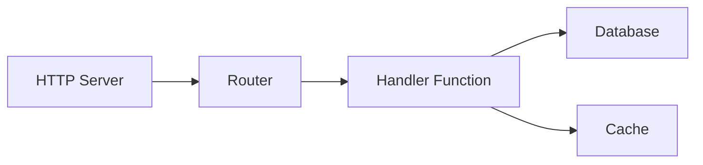
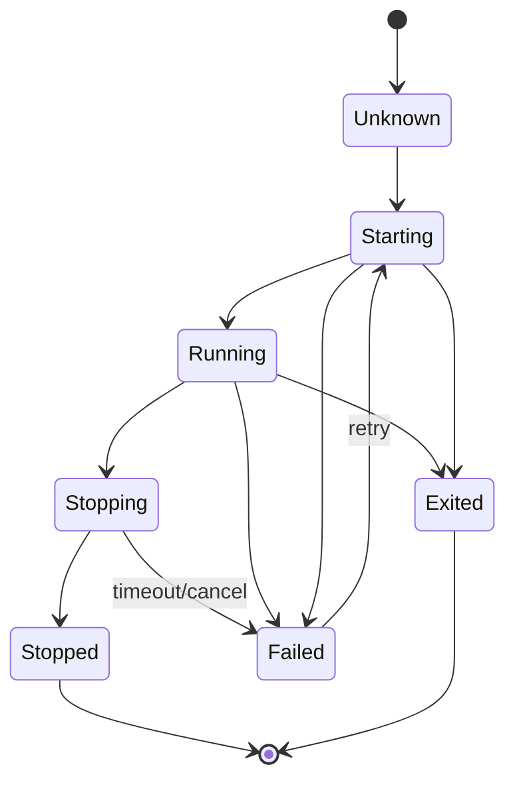

# Supervision

Der Supervisor verwaltet Service-Start, Abhängigkeitsreihenfolge, Restarts und kontrolliertes Herunterfahren. Services mit `auto_start: true` starten beim Anwendungsboot.

## Lebenszyklus-Konfiguration

Dienste registrieren sich beim Supervisor mit einem `lifecycle`-Block. Für Prozesse verwenden Sie `process.service` um eine Prozessdefinition zu umhüllen:

```yaml
# Process definition (the code)
- name: worker_process
  kind: process.lua
  source: file://worker.lua
  method: main

# Supervised service (wraps the process with lifecycle management)
- name: worker
  kind: process.service
  process: app:worker_process
  host: app:processes
  lifecycle:
    auto_start: true
    startup: required
    start_timeout: 30s
    stop_timeout: 10s
    stable_threshold: 5s
    requires:
      - app:database
    restart:
      initial_delay: 2s
      max_delay: 60s
      max_attempts: 10
```

`host` muss einen konfigurierten Process Host referenzieren. Ein Eintrag unter `requires` muss entweder einen anderen überwachten Service auflösen oder über die Registry-Abhängigkeitsextraktion einen überwachten Service, dem die referenzierte Ressource gehört.

| Feld | Standard | Beschreibung |
|------|----------|--------------|
| `auto_start` | `false` | Beim Start des Supervisors automatisch starten |
| `startup` | `required` | Startrichtlinie für eine Auto-Start-Wurzel: `required` blockiert den Boot bei Fehlern; `optional` darf fehlschlagen und weitere Versuche ausführen, ohne unabhängige Zweige zu blockieren |
| `start_timeout` | `10s` | Maximale erlaubte Zeit für den Start |
| `stop_timeout` | `10s` | Maximale Zeit für Graceful Shutdown |
| `stable_threshold` | `5s` | Laufzeit bevor Dienst als stabil gilt |
| `requires` | `[]` | Dienste, die zuerst laufen müssen (Legacy-Alias: `depends_on`) |
| `startup` | `required` | `required` meldet einen fehlgeschlagenen oder blockierten Auto-Start als Transaktionsfehler; `optional` lässt den Dienst im Hintergrund weiter versuchen, ohne den Batch scheitern zu lassen |

## Abhängigkeitsauflösung

Der Supervisor löst Abhängigkeiten aus zwei Quellen auf:

1. **Explizite Abhängigkeiten** deklariert in `requires` (oder dem Legacy-`depends_on`)
2. **Registry-extrahierte Abhängigkeiten** aus Entry-Referenzen (z.B. `database: app:db` in Ihrer Konfiguration)


```mermaid
graph LR
    A[HTTP Server] --> B[Router]
    B --> C[Handler Function]
    C --> D[Database]
    C --> E[Cache]
```

Abhängigkeiten starten vor Abhängigen. Wenn Dienst C von A und B abhängt, müssen sowohl A als auch B den `Running`-Zustand erreichen, bevor C startet.

<tip>
Sie müssen Infrastruktur-Einträge wie Datenbanken nicht in <code>requires</code> deklarieren. Der Supervisor extrahiert Abhängigkeiten automatisch aus Registry-Referenzen in Ihrer Entry-Konfiguration.
</tip>

## Neustart-Richtlinie

Wenn ein Service fehlschlägt, führt der Supervisor gemäß seinem `restart`-Block weitere Versuche aus:

```yaml
lifecycle:
  restart:
    initial_delay: 1s      # First retry wait
    max_delay: 90s         # Accepted backoff cap; see current behavior below
    backoff_factor: 2.0    # Accepted multiplier; see current behavior below
    jitter: 0.1            # ±10% randomization
    max_attempts: 0        # 0 = infinite retries
```

In Runtime v0.3.32a erzeugt der Supervisor für jeden Retry einen neuen Backoff-Rechner und verwendet nur dessen erstes Intervall. Jeder Retry wartet daher `initial_delay` mit dem konfigurierten Jitter, bei den gezeigten Werten 0,9 bis 1,1 Sekunden. `backoff_factor` und `max_delay` werden als Konfigurationsfelder akzeptiert, ändern diesen Ablauf in der festgelegten Runtime jedoch nicht.

`max_attempts` zählt den ersten fehlgeschlagenen Start mit. Der Wert `1` erlaubt keinen Retry, `10` höchstens neun weitere Starts. `0` erlaubt unbegrenzt viele Versuche.

Wenn ein Dienst länger als `stable_threshold` läuft, wird der Wiederholungszähler zurückgesetzt. Dies verhindert, dass vorübergehende Fehler die Verzögerungen dauerhaft eskalieren.

### Terminale Fehler

Diese Fehler stoppen Wiederholungsversuche:

- Context-Abbruch
- Explizite Beendigungsanforderung
- Als nicht wiederholbar markierte Fehler

## Sicherheitskontext

Dienste können mit einer bestimmten Sicherheitsidentität laufen:

```yaml
# Process definition
- name: admin_worker_process
  kind: process.lua
  source: file://admin_worker.lua
  method: main

# Supervised service with security context
- name: admin_worker
  kind: process.service
  process: app:admin_worker_process
  host: app:processes
  lifecycle:
    auto_start: true
    security:
      actor:
        id: "service:admin-worker"
        meta:
          role: admin
      groups:
        - app:admin_policies
      policies:
        - app:data_access
```

Der Sicherheitskontext setzt:

| Feld | Beschreibung |
|------|--------------|
| `actor.id` | Identitäts-String für diesen Dienst |
| `actor.meta` | Schlüssel-Wert-Metadaten (Rolle, Berechtigungen, etc.) |
| `groups` | Anzuwendende Richtliniengruppen |
| `policies` | Anzuwendende einzelne Richtlinien |

Im Dienst laufender Code erbt diesen Sicherheitskontext. Das `security`-Modul kann dann Berechtigungen prüfen:

```lua
local security = require("security")

if security.can("delete", "users") then
    -- allowed
end
```

<note>
Wenn kein Security-Block konfiguriert ist, fügt der Supervisor keinen servicespezifischen Akteur oder Policy-Scope hinzu; bereits im Elternkontext vorhandene Sicherheitswerte bleiben geerbt. Im Strict Mode, der standardmäßig aktiv ist, wird eine Prüfung mit unvollständigem resultierenden Sicherheitskontext abgelehnt. Konfigurieren Sie für Services mit Autorisierungsbedarf einen vollständigen Sicherheitskontext.
</note>

## Neuregistrierung und Ersetzung

Eine Registry-Änderung kann eine ID neu registrieren, für die bereits ein Controller läuft. Trägt die Registrierung dieselbe Dienstinstanz, wird nichts angetastet. Trägt sie eine **andere** Instanz — der Manager hat den Dienst neu gebaut, weil sich seine Konfiguration geändert hat — nimmt der Supervisor den bestehenden Controller außer Dienst und übernimmt den Ersatz.

Die Außerdienststellung betrifft mehr als nur den einen Dienst. Ein laufender Abhängiger hält die überholte Instanz fest und kann daher nicht gegen einen Dienst weiterlaufen, der unter ihm ersetzt wird; die Außerdienststellungs-Hülle umfasst den ersetzten Dienst plus jeden laufenden Dienst, der von ihm abhängt, gestoppt in Abhängigkeitsreihenfolge (Abhängige zuerst). Bereits gestoppte Dienste werden kein zweites Mal gestoppt — ein Manager, der seine eigene Instanz vor der Neuregistrierung stoppt, sieht kein überflüssiges `Stop`.

Die Übergabe ist transaktional:

1. Der Plan wird berechnet, ohne etwas anzutasten, sodass ein Fehler bei der Planung die laufende Menge unverändert lässt.
2. Der Stop-Batch läuft. **Schlägt ein Stop fehl, wird die Übergabe abgelehnt**: Die vom Batch bereits gestoppten Dienste werden wieder hochgefahren und der Fehler gemeldet. Ein Dienst, der nicht wieder hochgefahren werden konnte, wird in diesem Fehler benannt. Der Supervisor besitzt am Ende dieselbe laufende Menge wie vor dem Commit, nie eine halb außer Dienst gestellte.
3. Erst nachdem der Batch erfolgreich war, werden die außer Dienst gestellten Controller verworfen und abgebrochen, was die überholten Dienstinstanzen freigibt.
4. Der Ersatz wird über denselben abhängigkeitsbewussten Sequencer wie jeder andere Start erzeugt und gestartet, und die für die Übergabe gestoppten Abhängigen kommen gegen die übernommene Instanz wieder hoch.

Ein Dienst, der vor der Ersetzung lief, wird danach neu gestartet, selbst wenn die neue Registrierung `auto_start: false` setzt — das Ersetzen eines aktiven Dienstes ist ein Update, kein implizites Stoppen. Der Neustart eines gestoppten Abhängigen richtet sich nach dessen eigener Neustart-Richtlinie und blockiert den Commit nicht.

## Dienstzustände


```mermaid
stateDiagram-v2
    [*] --> Unknown
    Unknown --> Starting
    Starting --> Running
    Running --> Stopping
    Stopping --> Stopped
    Stopping --> Failed : timeout/cancel
    Stopped --> [*]

    Running --> Failed
    Starting --> Failed
    Failed --> Starting : retry
    Running --> Exited
    Starting --> Exited
    Exited --> [*]
```

Der Supervisor überführt Dienste durch diese Zustände:

| Zustand | Beschreibung |
|---------|--------------|
| `Unknown` | Registriert aber nicht gestartet |
| `Starting` | Start in Bearbeitung |
| `Running` | Läuft normal |
| `Stopping` | Kontrolliertes Herunterfahren in Bearbeitung |
| `Stopped` | Sauber beendet |
| `Exited` | Durch ausdrückliche Anforderung oder einen nicht wiederholbaren/terminalen Fehler beendet |
| `Failed` | Fehler aufgetreten, kann wiederholt werden |

## Start- und Herunterfahrreihenfolge :id=startup-and-shutdown-order

**Start**: Erst Abhängigkeiten, dann Abhängige. Dienste auf derselben Abhängigkeitsebene können parallel starten.

**Herunterfahren**: Erst Abhängige, dann Abhängigkeiten. Dies stellt sicher, dass abhängige Dienste fertig werden, bevor ihre Abhängigkeiten stoppen.

```
Startup:  database → cache → handler → http_server
Shutdown: http_server → handler → cache → database
```

Bei SIGINT oder SIGTERM beginnt die Runtime einen sauberen Shutdown, und die gesamte Sequenz läuft unter einem einzigen Budget: `shutdown.timeout` in der Runtime-Konfiguration (Standard 30s). Dieses Budget ist eine frische Deadline, die den unterbrochenen Kontext nicht erbt, sodass ein Strg-C den Shutdown der Komponenten nicht abschneidet; das `stop_timeout` pro Dienst begrenzt darin weiterhin jeden einzelnen Stop. Ein zweites Signal überspringt die Sequenz und beendet sofort.

```yaml
# .wippy.yaml
shutdown:
  timeout: 60s
```

## Siehe auch

- [Prozessmodell](concepts/process-model.md) — Prozesslebenszyklus
- [Konfiguration](guides/configuration.md) — YAML-Konfigurationsformat
- [Sicherheitsmodul](lua/security/security.md) — Berechtigungsprüfungen in Lua
