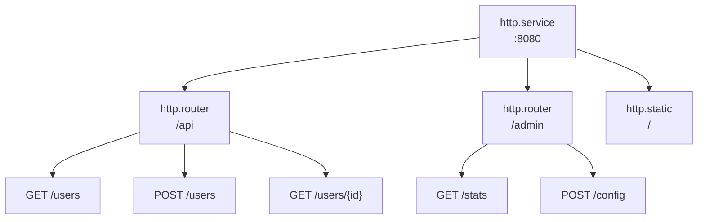

# Routing

Router gruppieren Endpunkte unter URL-Präfixen und wenden gemeinsame Middleware an. Endpunkte definieren HTTP-Handler.

## Architektur



Einträge referenzieren Eltern über Metadaten:
- Router: `meta.server: app:gateway`
- Endpunkte: `meta.router: app:api`

## Router-Konfiguration

```yaml
- name: api
  kind: http.router
  meta:
    server: gateway
  prefix: /api/v1
  middleware:
    - cors
    - compress
  options:
    cors.allow.origins: "*"
  post_middleware:
    - endpoint_firewall
```

| Feld | Typ | Beschreibung |
|------|-----|--------------|
| `meta.server` | Registry-ID | Übergeordneter HTTP-Server |
| `prefix` | string | URL-Präfix für alle Routen |
| `middleware` | []string | Pre-Match-Middleware |
| `options` | map | Middleware-Optionen |
| `post_middleware` | []string | Post-Match-Middleware |
| `post_options` | map | Post-Match-Middleware-Optionen |

## Endpunkt-Konfiguration

```yaml
- name: get_user
  kind: http.endpoint
  meta:
    router: api
  method: GET
  path: /users/{id}
  func: app.users:get_user
```

| Feld | Typ | Beschreibung |
|------|-----|--------------|
| `meta.router` | Registry-ID | Übergeordneter Router |
| `method` | string | HTTP-Methode (GET, POST, PUT, DELETE, PATCH, HEAD) |
| `path` | string | URL-Pfadmuster (beginnt mit `/`) |
| `func` | Registry-ID | Handler-Funktion |

## Pfadparameter

Verwenden Sie `{param}`-Syntax für URL-Parameter:

```yaml
- name: get_post
  kind: http.endpoint
  meta:
    router: api
  method: GET
  path: /users/{user_id}/posts/{post_id}
  func: get_user_post
```

Zugriff im Handler:

```lua
local http = require("http")

local function handler()
    local req = http.request()
    local user_id = req:param("user_id")
    local post_id = req:param("post_id")

    -- ...
end
```

### Wildcard-Pfade

Verbleibende Pfadsegmente mit `{param...}` erfassen:

```yaml
- name: serve_files
  kind: http.endpoint
  meta:
    router: api
  method: GET
  path: /files/{filepath...}
  func: serve_file
```

```lua
-- Anfrage: GET /api/v1/files/docs/guides/readme.md
local file_path = req:param("filepath")  -- "docs/guides/readme.md"
```

Der Wildcard muss das letzte Segment im Pfad sein.

## Handler-Funktionen

Endpunkt-Handler verwenden das `http`-Modul für Zugriff auf Request- und Response-Objekte. Siehe [HTTP-Modul](lua-http.md) für die vollständige API.

```lua
local http = require("http")
local json = require("json")

local function handler()
    local req = http.request()
    local res = http.response()

    local user_id = req:param("id")
    local user = get_user(user_id)

    res:status(200)
    res:write(json.encode(user))
end

return { handler = handler }
```

## Middleware-Optionen

Middleware-Optionen verwenden Punkt-Notation mit dem Middleware-Namen als Präfix:

```yaml
middleware:
  - cors
  - ratelimit
  - token_auth
options:
  cors.allow.origins: "https://app.example.com"
  cors.allow.methods: "GET,POST,PUT,DELETE"
  ratelimit.requests: "100"
  ratelimit.window: "1m"
  token_auth.store: "app:tokens"
  token_auth.header.name: "Authorization"
```

Post-Match-Middleware verwendet `post_options`:

```yaml
post_middleware:
  - endpoint_firewall
post_options:
  endpoint_firewall.default_policy: "deny"
```

## Pre-Match vs Post-Match Middleware

**Pre-Match** (`middleware`) läuft vor dem Routen-Matching:
- CORS (behandelt OPTIONS-Preflight)
- Komprimierung
- Rate-Limiting
- Real-IP-Erkennung
- Token-Authentifizierung (Kontext-Anreicherung)

**Post-Match** (`post_middleware`) läuft nachdem Route gematcht ist:
- Endpoint-Firewall (benötigt Routen-Info für Autorisierung)
- Ressourcen-Firewall
- WebSocket-Relay

```yaml
middleware:        # Pre-Match: alle Anfragen an diesen Router
  - cors
  - compress
  - token_auth     # Reichert Kontext mit Actor/Scope an

post_middleware:   # Post-Match: nur gematchte Routen
  - endpoint_firewall  # Verwendet Actor von token_auth
```

<tip>
Token-Authentifizierung kann Pre-Match sein, da sie nur Kontext anreichert - sie blockiert keine Anfragen. Autorisierung erfolgt in Post-Match-Middleware wie <code>endpoint_firewall</code>, die den von <code>token_auth</code> gesetzten Actor verwendet.
</tip>

## Vollständiges Beispiel

```yaml
version: "1.0"
namespace: app

entries:
  # Server
  - name: gateway
    kind: http.service
    addr: ":8080"
    lifecycle:
      auto_start: true

  # API-Router
  - name: api
    kind: http.router
    meta:
      server: gateway
    prefix: /api/v1
    middleware:
      - cors
      - compress
      - ratelimit
    options:
      cors.allow.origins: "https://app.example.com"
      ratelimit.requests: "100"
      ratelimit.window: "1m"

  # Handler-Funktion
  - name: get_users
    kind: function.lua
    source: file://handlers/users.lua
    method: list
    modules:
      - http
      - json
      - sql

  # Endpunkte
  - name: list_users
    kind: http.endpoint
    meta:
      router: api
    method: GET
    path: /users
    func: get_users

  - name: get_user
    kind: http.endpoint
    meta:
      router: api
    method: GET
    path: /users/{id}
    func: app:get_user_by_id

  - name: create_user
    kind: http.endpoint
    meta:
      router: api
    method: POST
    path: /users
    func: app:create_user
```

## Geschützte Routen

Gängiges Muster mit Authentifizierung:

```yaml
entries:
  # Öffentliche Routen (keine Auth)
  - name: public
    kind: http.router
    meta:
      server: gateway
    prefix: /api/public
    middleware:
      - cors

  # Geschützte Routen
  - name: protected
    kind: http.router
    meta:
      server: gateway
    prefix: /api
    middleware:
      - cors
      - token_auth
    options:
      token_store: app:tokens
    post_middleware:
      - endpoint_firewall
```

## Siehe auch

- [Server](http-server.md) - HTTP-Server-Konfiguration
- [Statische Dateien](http-static.md) - Statische Datei-Bereitstellung
- [Middleware](http-middleware.md) - Verfügbare Middleware
- [HTTP-Modul](lua-http.md) - Lua-HTTP-API
