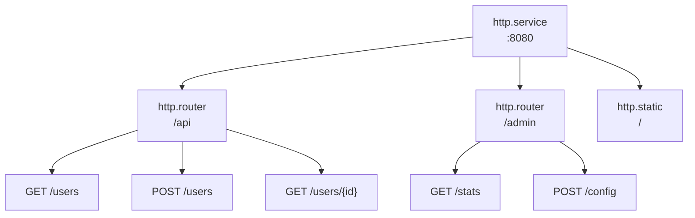

# Routing

Ein `http.router` gruppiert Endpunkte unter einem URL-Präfix und wendet gemeinsame Middleware an. Jeder `http.endpoint` definiert einen HTTP-Handler.

**Klassifikation: Routing-Referenz.** Konfigurationsblöcke sind Registry-Teilfragmente, sofern sie nicht einen Namespace und jeden referenzierten Eintrag enthalten. Handler-Blöcke verwenden Funktions-IDs der Anwendung, anstatt eine Datenschicht zu definieren.

## Architektur


```mermaid
flowchart TB
    S[http.service<br/>:8080] --> R1[http.router<br/>/api]
    S --> R2[http.router<br/>/admin]
    S --> ST[http.static<br/>/]

    R1 --> E1[GET /users]
    R1 --> E2[POST /users]
    R1 --> E3["GET /users/{id}"]

    R2 --> E4[GET /stats]
    R2 --> E5[POST /config]
```

Einträge referenzieren Eltern über Metadaten:
- Router: `meta.server: app:gateway`
- Endpunkte: `meta.router: app:api`

## Router-Konfiguration

```yaml
- name: api
  kind: http.router
  meta:
    server: gateway
  prefix: /api/v1
  middleware:
    - cors
    - compress
  options:
    cors.allow.origins: "*"
  post_middleware:
    - endpoint_firewall
```

| Feld | Typ | Beschreibung |
|------|-----|--------------|
| `meta.server` | Registry-ID | Übergeordneter HTTP-Server |
| `prefix` | string | URL-Präfix für alle Routen |
| `middleware` | []string | Pre-Match-Middleware |
| `options` | map | Middleware-Optionen |
| `post_middleware` | []string | Post-Match-Middleware |
| `post_options` | map | Post-Match-Middleware-Optionen |

## Endpunkt-Konfiguration

```yaml
- name: get_user
  kind: http.endpoint
  meta:
    router: api
  method: GET
  path: /users/{id}
  func: app.users:get_user
```

| Feld | Typ | Beschreibung |
|------|-----|--------------|
| `meta.router` | Registry-ID | Übergeordneter Router |
| `method` | string | HTTP-Methode: `GET`, `POST`, `PUT`, `DELETE`, `PATCH`, `HEAD`, `OPTIONS`, `TRACE` oder `*` für jede Methode |
| `path` | string | URL-Pfadmuster (beginnt mit `/`) |
| `func` | Registry-ID | Handler-Funktion |

## Pfadparameter

Verwenden Sie `{param}`-Syntax für URL-Parameter:

```yaml
- name: get_post
  kind: http.endpoint
  meta:
    router: api
  method: GET
  path: /users/{user_id}/posts/{post_id}
  func: get_user_post
```

Zugriff im Handler:

```lua
local http = require("http")

local function handler()
    local req, req_err = http.request()
    if req_err then return nil, req_err end
    local user_id, user_err = req:param("user_id")
    if user_err then return nil, user_err end
    local post_id, post_err = req:param("post_id")
    if post_err then return nil, post_err end

    return {user_id = user_id, post_id = post_id}
end
```

### Wildcard-Pfade

Verbleibende Pfadsegmente mit `{param...}` erfassen:

```yaml
- name: serve_files
  kind: http.endpoint
  meta:
    router: api
  method: GET
  path: /files/{filepath...}
  func: serve_file
```

Der Wildcard-Parameter erfasst die verbleibenden Segmente. Eine Anfrage wie `GET /api/v1/files/docs/guides/readme.md` wird daher mit `req:param("filepath")` gleich `docs/guides/readme.md` weitergeleitet.

Der Wildcard muss das letzte Segment im Pfad sein.

## Handler-Funktionen

Endpunkt-Handler verwenden das Modul `http`, um auf Request- und Response-Objekte zuzugreifen. Die API-Referenz finden Sie unter [HTTP-Modul](lua/http/http.md).

```lua
local http = require("http")
local funcs = require("funcs")

local function handler()
    local req, req_err = http.request()
    if req_err then return nil, req_err end
    local res, res_err = http.response()
    if res_err then return nil, res_err end

    local user_id, param_err = req:param("id")
    if param_err then return nil, param_err end
    local user, call_err = funcs.call("app.users:get_user", user_id)
    if call_err then return nil, call_err end

    local status_err = res:set_status(http.STATUS.OK)
    if status_err then return nil, status_err end
    local write_err = res:write_json(user)
    if write_err then return nil, write_err end
    return true
end

return { handler = handler }
```

## Middleware-Optionen

Middleware-Optionen verwenden Punkt-Notation mit dem Middleware-Namen als Präfix:

```yaml
middleware:
  - cors
  - ratelimit
  - token_auth
options:
  cors.allow.origins: "https://app.example.com"
  cors.allow.methods: "GET,POST,PUT,DELETE"
  ratelimit.requests: "100"
  ratelimit.window: "1m"
  token_auth.store: "app:tokens"
  token_auth.header.name: "Authorization"
```

Post-Match-Middleware verwendet `post_options`:

```yaml
post_middleware:
  - endpoint_firewall
post_options:
  endpoint_firewall.action: "access"
```

## Pre-Handler- und Post-Match-Middleware

**Pre-Handler** (`middleware`) läuft, nachdem der Server eine Route ausgewählt hat, aber bevor Routenparameter und Endpunktmetadaten an den Request-Kontext angefügt werden:
- CORS (behandelt OPTIONS-Preflight)
- Komprimierung
- Rate-Limiting
- Real-IP-Erkennung
- Token-Authentifizierung (Kontext-Anreicherung)

**Post-Match** (`post_middleware`) läuft, nachdem Routenparameter und Endpunktmetadaten angefügt wurden:
- Endpoint-Firewall (benötigt Routen-Info für Autorisierung)
- Ressourcen-Firewall
- WebSocket-Relay

```yaml
middleware:        # Before endpoint metadata: matched routes only
  - cors
  - compress
  - token_auth     # Enriches context with actor/scope

post_middleware:   # Post-match: matched routes only
  - endpoint_firewall  # Uses actor from token_auth
```

<tip>
Token-Authentifizierung gehört in die Pre-Handler-Kette, weil sie den Request-Kontext vor der Autorisierung anreichert. Autorisierungs-Middleware wie <code>endpoint_firewall</code> gehört in die Post-Match-Kette, weil sie die ID des abgeglichenen Endpunkts benötigt. Bei nicht abgeglichenen Anfragen läuft keine der beiden Router-Ketten.
</tip>

## Router- und Endpunktverdrahtung

Dieses Beispiel definiert den Handler-Eintrag für die Liste. Die Funktions-IDs `app:get_user_by_id` und `app:create_user` verweisen auf Handler, die an anderer Stelle im selben Namespace definiert sind.

```yaml
version: "1.0"
namespace: app

entries:
  # Server
  - name: gateway
    kind: http.service
    addr: ":8080"
    lifecycle:
      auto_start: true

  # API Router
  - name: api
    kind: http.router
    meta:
      server: gateway
    prefix: /api/v1
    middleware:
      - cors
      - compress
      - ratelimit
    options:
      cors.allow.origins: "https://app.example.com"
      ratelimit.requests: "100"
      ratelimit.window: "1m"

  # Handler function
  - name: get_users
    kind: function.lua
    source: file://handlers/users.lua
    method: list
    modules:
      - http
      - json
      - sql

  # Endpoints
  - name: list_users
    kind: http.endpoint
    meta:
      router: api
    method: GET
    path: /users
    func: get_users

  - name: get_user
    kind: http.endpoint
    meta:
      router: api
    method: GET
    path: /users/{id}
    func: app:get_user_by_id

  - name: create_user
    kind: http.endpoint
    meta:
      router: api
    method: POST
    path: /users
    func: app:create_user
```

## Geschützte Routen

Die folgende Konfiguration trennt öffentliche Routen von Routen, die Authentifizierung und Autorisierung erfordern:

```yaml
entries:
  # Public routes (no auth)
  - name: public
    kind: http.router
    meta:
      server: gateway
    prefix: /api/public
    middleware:
      - cors

  # Protected routes
  - name: protected
    kind: http.router
    meta:
      server: gateway
    prefix: /api
    middleware:
      - cors
      - token_auth
    options:
      token_auth.store: app:tokens
    post_middleware:
      - endpoint_firewall
```

## Siehe auch

- [Server](http/server.md) – HTTP-Server-Konfiguration
- [Statische Dateien](http/static.md) – Bereitstellung statischer Dateien
- [Middleware](http/middleware.md) – Verfügbare Middleware
- [HTTP-Modul](lua/http/http.md) – Lua-HTTP-API
