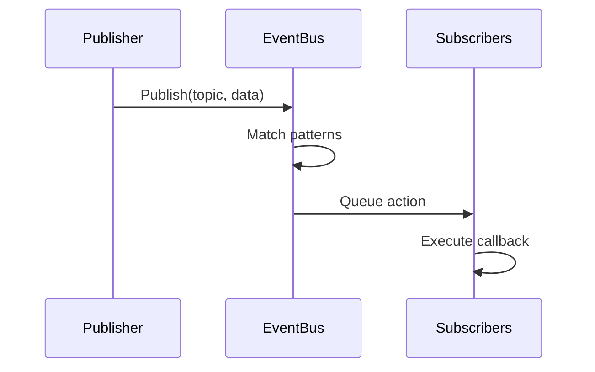
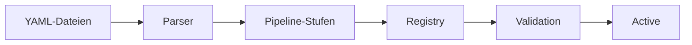
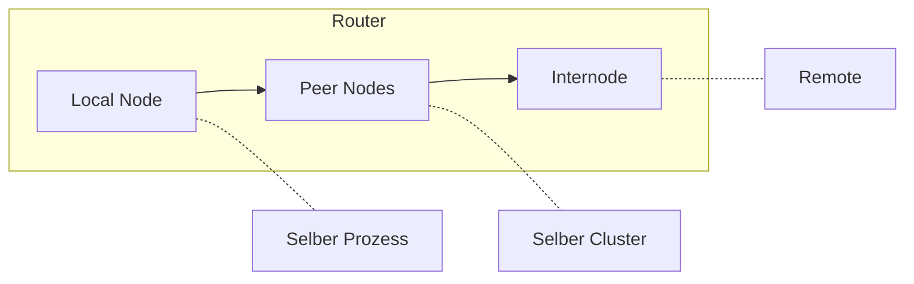

# Architektur

<note>
Diese Seite ist in Bearbeitung. Inhalte können unvollständig sein oder sich ändern.
</note>

Wippy ist ein geschichtetes System, das auf Go aufgebaut ist. Komponenten initialisieren sich in Abhängigkeitsreihenfolge, kommunizieren über einen Event-Bus und führen Lua-Prozesse über einen Work-Stealing-Scheduler aus.

## Schichten

| Schicht | Komponenten |
|---------|-------------|
| Anwendung | Lua-Prozesse, Funktionen, Workflows |
| Runtime | Lua-Engine (gopher-lua), 50+ Module |
| Services | HTTP, Queue, Storage, Temporal |
| System | Topologie, Factory, Functions, Contracts |
| Core | Scheduler, Registry, Dispatcher, EventBus, Relay |
| Infrastruktur | AppContext, Logger, Transcoder |

Jede Schicht hängt nur von den Schichten darunter ab. Die Core-Schicht stellt fundamentale Primitive bereit, während Services höhere Abstraktionen darauf aufbauen.

## Boot-Sequenz

Der Anwendungsstart durchläuft vier Phasen.

### Phase 1: Infrastruktur

Erstellt Kerninfrastruktur bevor Komponenten geladen werden:

| Komponente | Zweck |
|------------|-------|
| AppContext | Versiegeltes Dictionary für Komponentenreferenzen |
| EventBus | Pub/Sub für Inter-Komponenten-Kommunikation |
| Transcoder | Payload-Serialisierung (JSON, YAML, Lua) |
| Logger | Strukturiertes Logging mit Event-Streaming |
| Relay | Nachrichtenrouting (Node, Router, Mailbox) |

### Phase 2: Komponentenladung

Der Loader löst Abhängigkeiten via topologischer Sortierung auf und lädt Komponenten Level für Level. Komponenten auf demselben Level laden parallel.

| Level | Komponenten | Abhängigkeiten |
|-------|-------------|----------------|
| 0 | PIDGen | keine |
| 1 | Dispatcher | PIDGen |
| 2 | Registry | Dispatcher |
| 3 | Finder, Supervisor | Registry |
| 4 | Topology | Supervisor |
| 5 | Lifecycle | Topology |
| 6 | Factory | Lifecycle |
| 7 | Functions | Factory |

Jede Komponente hängt sich während Load an den Kontext an, wodurch Services für abhängige Komponenten verfügbar werden.

### Phase 3: Aktivierung

Nach dem Laden aller Komponenten:

1. **Dispatcher einfrieren** - Sperrt Command-Handler-Registry für lock-freie Lookups
2. **AppContext versiegeln** - Keine Schreibzugriffe mehr erlaubt, ermöglicht lock-freie Lesezugriffe
3. **Komponenten starten** - Ruft `Start()` auf jeder Komponente mit `Starter`-Interface auf

### Phase 4: Entry-Ladung

Registry-Einträge (aus YAML-Dateien) werden geladen und validiert:

1. Einträge aus Projektdateien geparst
2. Pipeline-Stufen transformieren Einträge (Override, Link, Bytecode)
3. Services markiert mit `auto_start: true` starten
4. Supervisor überwacht registrierte Services

## Komponenten

Komponenten sind Go-Services, die am Anwendungslebenszyklus teilnehmen.

### Lebenszyklusphasen

| Phase | Methode | Zweck |
|-------|---------|-------|
| Load | `Load(ctx) (ctx, error)` | Initialisieren und an Kontext anhängen |
| Start | `Start(ctx) error` | Aktiven Betrieb beginnen |
| Stop | `Stop(ctx) error` | Graceful Shutdown |

Komponenten deklarieren Abhängigkeiten. Der Loader baut einen gerichteten azyklischen Graphen und führt in topologischer Reihenfolge aus. Shutdown erfolgt in umgekehrter Reihenfolge.

### Standardkomponenten

| Komponente | Abhängigkeiten | Zweck |
|------------|----------------|-------|
| PIDGen | keine | Prozess-ID-Generierung |
| Dispatcher | PIDGen | Command-Handler-Dispatch |
| Registry | Dispatcher | Entry-Speicherung und Versionierung |
| Finder | Registry | Entry-Lookup und Suche |
| Supervisor | Registry | Service-Neustartrichtlinien |
| Topology | Supervisor | Prozess-Eltern/Kind-Baum |
| Lifecycle | Topology | Service-Lebenszyklus-Management |
| Factory | Lifecycle | Prozess-Spawning |
| Functions | Factory | Zustandslose Funktionsaufrufe |

## Event-Bus

Asynchrones Pub/Sub für Inter-Komponenten-Kommunikation.

### Design

- Einzelne Dispatcher-Goroutine verarbeitet alle Events
- Queue-basierte Action-Zustellung verhindert Publisher-Blockierung
- Pattern-Matching unterstützt exakte Topics und Wildcards (`*`)
- Kontextbasierter Lebenszyklus bindet Subscriptions an Cancellation

### Event-Fluss

### Gängige Topics

| Topic | Publisher | Zweck |
|-------|-----------|-------|
| `registry.entry.*` | Registry | Entry-Änderungen |
| `process.started` | Topology | Prozess-Lebenszyklus |
| `process.stopped` | Topology | Prozess-Lebenszyklus |
| `supervisor.state.*` | Supervisor | Service-Zustandsänderungen |

## Registry

Versionierte Speicherung für Entry-Definitionen.

### Features

- **Versionierter Zustand** - Jede Mutation erstellt neue Version
- **History** - SQLite-gestützte Historie für Audit-Trail
- **Beobachtung** - Spezifische Einträge auf Änderungen beobachten
- **Ereignisgesteuert** - Publiziert Events bei Mutationen

### Entry-Lebenszyklus

Pipeline-Stufen transformieren Einträge:

| Stufe | Zweck |
|-------|-------|
| Override | Konfigurations-Overrides anwenden |
| Disable | Einträge nach Muster entfernen |
| Link | Requirements und Abhängigkeiten auflösen |
| Bytecode | Lua zu Bytecode kompilieren |
| EmbedFS | Dateisystem-Einträge sammeln |

## Relay

Nachrichtenrouting zwischen Prozessen über Nodes hinweg.

### Drei-Stufen-Routing

1. **Local** - Direkte Zustellung innerhalb desselben Nodes
2. **Peer** - Weiterleitung an Peer-Nodes im Cluster
3. **Internode** - Routing zu Remote-Nodes via Netzwerk

### Mailbox

Jeder Node hat eine Mailbox mit Worker-Pool:

- FNV-1a-Hashing weist Sender Workern zu
- Erhält Per-Sender-Nachrichtenreihenfolge
- Worker verarbeiten Nachrichten parallel
- Back-Pressure wenn Queue voll

## AppContext

Versiegeltes Dictionary für Komponentenreferenzen.

| Eigenschaft | Verhalten |
|-------------|-----------|
| Vor Versiegelung | RWMutex-geschützte Schreibzugriffe |
| Nach Versiegelung | Lock-freie Lesezugriffe, Panic bei Schreibzugriff |
| Duplikat-Schlüssel | Panic |
| Typsicherheit | Typisierte Getter-Funktionen |

Komponenten hängen Services während der Load-Phase an. Nach Boot-Abschluss wird AppContext für optimale Leseleistung versiegelt.

## Shutdown

Graceful Shutdown erfolgt in umgekehrter Abhängigkeitsreihenfolge:

1. SIGINT/SIGTERM löst Shutdown aus
2. Supervisor stoppt verwaltete Services
3. Komponenten mit `Stopper`-Interface erhalten `Stop()`
4. Infrastruktur-Cleanup

Zweites Signal erzwingt sofortigen Exit.

## Siehe auch

- [Scheduler](internal-scheduler.md) - Prozessausführung
- [Event-Bus](internal-events.md) - Pub/Sub-System
- [Registry](internal-registry.md) - Zustandsverwaltung
- [Command-Dispatch](internal-dispatch.md) - Yield-Behandlung
