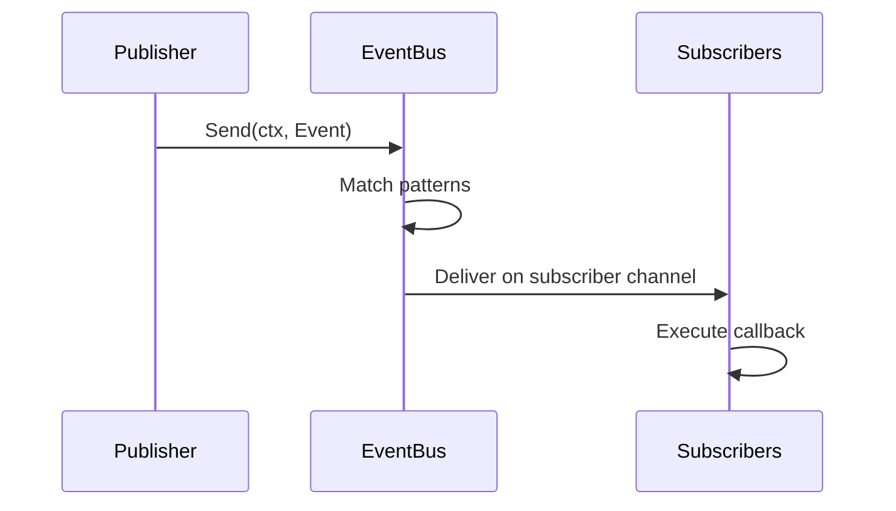
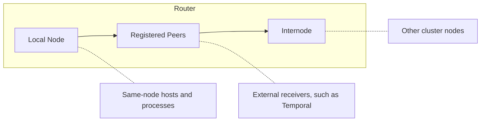

# Architektur

Wippy ist ein geschichtetes System, das auf Go aufgebaut ist. Komponenten initialisieren sich in Abhängigkeitsreihenfolge, kommunizieren über einen Event-Bus und führen Lua-Prozesse über einen Work-Stealing-Scheduler aus.

Diese Seite ist eine Implementierungsreferenz. Diagramme und Go-Typen beschreiben Interna der Runtime, keine Registry-Einträge oder Erweiterungs-APIs für Anwendungen.

## Schichten

| Schicht | Komponenten |
|---------|-------------|
| Anwendung | Lua-Prozesse, Funktionen, Workflows |
| Runtime | Lua-Engine (wippyai/go-lua) und Runtime-Module |
| Services | HTTP, Queue, Storage, Temporal |
| System | Topologie, Factory, Functions, Contracts |
| Core | Scheduler, Registry, Dispatcher, EventBus, Relay |
| Infrastruktur | AppContext, Logger, Transcoder |

Jede Schicht hängt nur von den Schichten darunter ab. Die Core-Schicht stellt fundamentale Primitive bereit, während Services höhere Abstraktionen darauf aufbauen.

## Boot-Sequenz

Der Anwendungsstart durchläuft vier Phasen.

### Phase 1: Infrastruktur

Erstellt Kerninfrastruktur bevor Komponenten geladen werden:

| Komponente | Zweck |
|------------|-------|
| AppContext | Versiegeltes Dictionary für Komponentenreferenzen |
| EventBus | Pub/Sub für Inter-Komponenten-Kommunikation |
| Transcoder | Payload-Serialisierung (JSON, YAML, Lua) |
| Logger | Strukturiertes Logging mit Event-Streaming |
| Relay | Nachrichtenrouting (Node, Router, Mailbox) |

### Phase 2: Komponentenladung

Der Loader löst Abhängigkeiten durch topologische Sortierung auf und lädt Komponenten sequenziell, Ebene für Ebene. Auch Komponenten derselben Ebene werden nacheinander geladen.

Abhängigkeitskanten bestimmen die Ebenen. Paketgruppen wie Core und System erzwingen keine zusätzliche globale Reihenfolge. Komponenten ohne Abhängigkeitskante können deshalb unabhängig von ihrer Paketgruppe derselben Ebene angehören.

Jede Komponente bindet sich beim Laden an den Kontext, wodurch ihre Services für abhängige Komponenten verfügbar werden.

### Phase 3: Aktivierung

Nach dem Laden aller Komponenten:

1. **Runtime-Services starten** – Ruft `StartRuntimeServices(ctx)` auf
2. **Dispatcher einfrieren** – Sperrt die Registry der Command-Handler für sperrfreie Abfragen
3. **AppContext versiegeln** – Verhindert weitere Schreibzugriffe und ermöglicht sperrfreie Lesezugriffe
4. **Komponenten starten** – Ruft `Start()` für jede Komponente mit `Starter`-Interface auf

### Phase 4: Entry-Ladung

Registry-Einträge aus den Projektmanifesten `_index.json`, `_index.yaml` und `_index.yml` werden geladen und validiert:

1. Einträge aus Projektdateien geparst
2. Pipeline-Stufen transformieren Einträge (Override, Link, Bytecode)
3. Services markiert mit `auto_start: true` starten
4. Supervisor überwacht registrierte Services

## Komponenten

Komponenten sind Go-Services, die am Anwendungslebenszyklus teilnehmen.

### Lebenszyklusphasen

| Phase | Methode | Zweck |
|-------|---------|-------|
| Load | `Load(ctx) (ctx, error)` | Initialisieren und an Kontext anhängen |
| Start | `Start(ctx) error` | Aktiven Betrieb beginnen |
| Stop | `Stop(ctx) error` | Kontrolliertes Herunterfahren |

Komponenten deklarieren Abhängigkeiten. Der Loader baut einen gerichteten azyklischen Graphen und führt in topologischer Reihenfolge aus. Shutdown erfolgt in umgekehrter Reihenfolge.

### Standardkomponenten

| Komponente | Abhängigkeiten | Zweck |
|------------|----------------|-------|
| PIDGen | keine | Prozess-ID-Generierung |
| Dispatcher | keine | Dispatch von Command-Handlern |
| Registry | Artifact | Speicherung und Versionierung von Einträgen |
| Finder | Registry | Entry-Lookup und Suche |
| Supervisor | Registry | Service-Neustartrichtlinien |
| Topology | keine | Eltern-Kind-Baum der Prozesse |
| Lifecycle | Topology | Service-Lebenszyklus-Management |
| Factory | keine | Erzeugen von Prozessen |
| Functions | Registry | Ausführung gepoolter Funktionen |

## Event-Bus

Asynchrones Pub/Sub für Inter-Komponenten-Kommunikation.

### Design

- Einzelne Dispatcher-Goroutine verarbeitet alle Events
- Publisher stellen Aktionen in eine Queue, ohne auf die Zustellung an Abonnenten zu warten
- Der Musterabgleich unterstützt exakte Werte, `*`, `**` und Alternativen innerhalb eines Segments
- Kontextbasierter Lebenszyklus bindet Subscriptions an Cancellation

### Event-Fluss

```mermaid
sequenceDiagram
    participant P as Publisher
    participant B as EventBus
    participant S as Subscribers

    P->>B: Send(ctx, Event)
    B->>B: Match patterns
    B->>S: Deliver on subscriber channel
    S->>S: Execute callback
```

### Gängige Topics

Events führen `System` und `Kind` als getrennte Felder. Die integrierten Systeme veröffentlichen:

| System | Art | Zweck |
|--------|------|-------|
| `registry` | `entry.create`, `entry.update`, `entry.delete`, `entry.accept`, `entry.reject` | Entry-Mutationen |
| `registry` | `registry.begin`, `registry.commit`, `registry.discard` | Transaktionsgrenzen |
| `process` | `factory.register`, `factory.delete`, `factory.accept`, `factory.reject` | Factory-Registrierung für Process-Kinds |
| `supervisor` | `service.register`, `service.remove`, `service.update`, `service.start`, `service.stop` | Service-Lebenszyklus |

## Registry

Versionierte Speicherung für Entry-Definitionen.

### Features

- **Versionierter Zustand** - Jede Mutation erstellt neue Version
- **Historie** – Standardmäßig im Arbeitsspeicher; optional SQLite-gestützt für ein dauerhaftes Audit-Protokoll (`history_type: sqlite`)
- **Beobachtung** - Spezifische Einträge auf Änderungen beobachten
- **Ereignisgesteuert** - Publiziert Events bei Mutationen

### Entry-Lebenszyklus

```mermaid
flowchart LR
    YAML[YAML Files] --> Parser
    Parser --> Stages[Pipeline Stages]
    Stages --> Registry
    Registry --> Validation
    Validation --> Active
```

Pipeline-Stufen transformieren Einträge:

| Stufe | Zweck |
|-------|-------|
| Override | Konfigurations-Overrides anwenden |
| Deaktivieren | Einträge nach Muster entfernen |
| Link | Requirements und Abhängigkeiten auflösen |
| Bytecode | Lua zu Bytecode kompilieren |
| EmbedFS | Dateisystem-Einträge sammeln |

## Relay

Nachrichtenrouting zwischen Prozessen über Nodes hinweg.

### Drei-Stufen-Routing

```mermaid
flowchart LR
    subgraph Router
        Local[Local Node] --> Peer[Registered Peers]
        Peer --> Inter[Internode]
    end

    Local -.- L[Same-node hosts and processes]
    Peer -.- P[External receivers, such as Temporal]
    Inter -.- I[Other cluster nodes]
```

1. **Local** – Direkte Zustellung zwischen Hosts und Prozessen desselben Nodes
2. **Peer** – Weiterleitung an einen registrierten externen Empfänger, etwa Temporal
3. **Internode** – Netzwerk-Routing zu einem anderen Cluster-Node als Fallback

### Mailbox

Jeder Node hat eine Mailbox mit Worker-Pool:

- FNV-1a-Hashing weist Sender Workern zu
- Erhält Per-Sender-Nachrichtenreihenfolge
- Worker verarbeiten Nachrichten parallel
- Back-Pressure wenn Queue voll

## AppContext

Versiegeltes Dictionary für Komponentenreferenzen.

| Eigenschaft | Verhalten |
|-------------|-----------|
| Vor Versiegelung | Single-Threaded-Schreibzugriffe während Boot |
| Nach Versiegelung | Lock-freie Lesezugriffe, Panic bei Schreibzugriff |
| Duplikat-Schlüssel | Panic |
| Typsicherheit | Typisierte Getter-Funktionen |

Komponenten binden ihre Services während der Ladephase an. Nach Abschluss des Starts wird AppContext für optimale Leseleistung versiegelt.

## Herunterfahren :id=shutdown

Das kontrollierte Herunterfahren erfolgt in umgekehrter Abhängigkeitsreihenfolge:

1. SIGINT/SIGTERM löst Shutdown aus
2. Supervisor stoppt verwaltete Services
3. Komponenten mit `Stopper`-Interface erhalten `Stop()`
4. Infrastruktur-Cleanup

Zweites Signal erzwingt sofortigen Exit.

## Siehe auch

- [Scheduler](internals/scheduler.md) – Prozessausführung
- [Event-Bus](internals/events.md) – Pub/Sub-System
- [Registry](internals/registry.md) – Zustandsverwaltung
- [Command-Dispatch](internals/dispatch.md) – Yield-Behandlung
