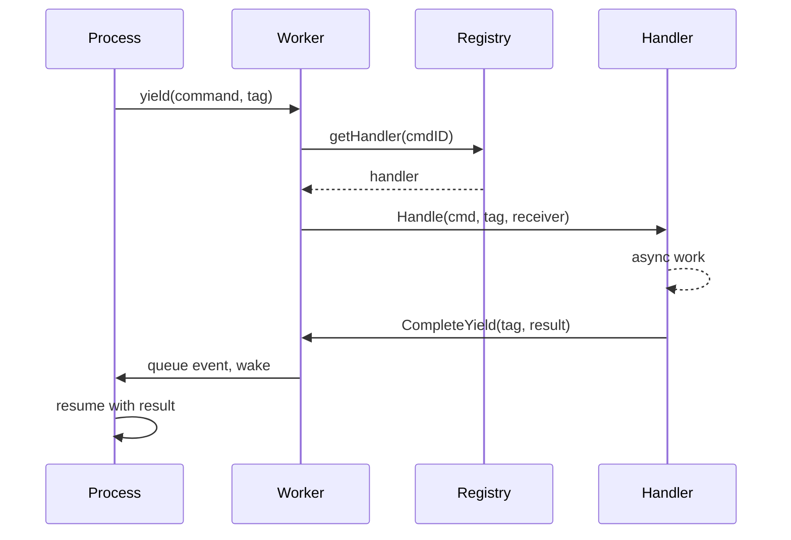

# Command-Dispatch

Das Dispatch-System routet Commands von Prozessen zu Handlern. Prozesse yielden Commands mit Korrelationstags, Handler führen asynchrone Arbeit aus, und Ergebnisse fließen über Event-Queues zurück.

## Fluss



## Command-Registry

Die Registry speichert Handler in einer hybriden Struktur:

```go
type Registry struct {
    handlers [256]Handler         // System-Commands: O(1) Index
    extended map[CommandID]Handler // Erweiterte Commands: Map-Lookup
    frozen   atomic.Bool          // Lock-frei nach Boot
}
```

System-Commands (0-255) verwenden Array-Indexierung. Erweiterte Commands verwenden Map-Lookup. Nach `Freeze()` sind alle Lookups lock-frei.

### Command-ID-Bereiche

| Bereich | Modul | Beispiele |
|---------|-------|-----------|
| 1-9 | process | Send, Spawn, Terminate, Monitor, Link |
| 10-29 | clock | Sleep, Ticker, Timer |
| 50-59 | stream | Read, Write, Close, Seek |
| 60-79 | http | Request, RequestBatch |
| 80-89 | websocket | Connect, Send, Receive |
| 90-99 | event | Subscribe, Send |
| 100-119 | sql | Query, Execute, Transaction ops |
| 120-129 | store | Get, Set, Delete, Has |
| 130-139 | security | ValidateToken, CreateToken |
| 140-149 | function | Call, AsyncStart, AsyncCancel |
| 150-159 | exec | ProcessWait |
| 160-169 | cloudstorage | Upload, Download, List, Presigned URLs |
| 170-179 | eval | Compile, Run, CreateProcess |
| 180-189 | workflow | SideEffect, Call, Version, UpsertAttrs |
| 190-199 | contract | Open, Call, AsyncCall, AsyncCancel |
| 256+ | custom | Benutzerdefinierte Services |

Registrierung erfolgt während Boot via `MustRegisterCommands()`. Kollisionen verursachen Panic beim Start.

## Commands definieren

Commands sind Datenstrukturen mit einer eindeutigen `CommandID`:

```go
const MyCommand dispatcher.CommandID = 200

type MyCmd struct {
    Input  string
    Option int
}

var myCmdPool = sync.Pool{New: func() any { return &MyCmd{} }}

func (c *MyCmd) CmdID() dispatcher.CommandID { return MyCommand }

func (c *MyCmd) Release() {
    c.Input = ""
    c.Option = 0
    myCmdPool.Put(c)
}
```

Pool-Wiederverwendung eliminiert Allokationen in Hot-Paths. Registrierung bei Package-Init:

```go
func init() {
    dispatcher.MustRegisterCommands("myservice", MyCommand)
}
```

## Dispatcher

Ein Dispatcher gruppiert verwandte Handler. Er implementiert `RegisterAll` um Handler zu registrieren und Lebenszyklus-Methoden für Setup/Teardown:

```go
type Handler interface {
    Handle(ctx context.Context, cmd Command, tag uint64, receiver ResultReceiver) error
}

type ResultReceiver interface {
    CompleteYield(tag uint64, data any, err error)
}
```

```go
type Dispatcher struct {
    // Service-Zustand
}

func (d *Dispatcher) RegisterAll(register func(id dispatcher.CommandID, h dispatcher.Handler)) {
    register(myapi.MyCommand, dispatcher.HandlerFunc(d.handleMyCommand))
}

func (d *Dispatcher) handleMyCommand(ctx context.Context, cmd Command, tag uint64, receiver ResultReceiver) error {
    c := cmd.(*myapi.MyCmd)
    go func() {
        result := doWork(c)
        if ctx.Err() == nil {
            receiver.CompleteYield(tag, result, nil)
        }
    }()
    return nil
}
```

Als Boot-Komponente registrieren:

```go
func MyDispatcher() boot.Component {
    return boot.New(boot.P{
        Name:      "dispatcher.myservice",
        DependsOn: []boot.Name{DispatcherName},
        Load: func(ctx context.Context) (context.Context, error) {
            reg := dispatcher.GetRegistrar(ctx)
            svc := myservice.NewDispatcher()
            svc.RegisterAll(reg.Register)
            return ctx, nil
        },
    })
}
```

## Yields und Korrelation

Wenn ein Prozess asynchrone Arbeit benötigt, yieldet er einen Command mit einem Korrelationstag:

```go
type Yield struct {
    Cmd Command
    Tag uint64    // Prozess-lokaler Zähler für Korrelation
}
```

Der Worker extrahiert Yields aus `StepOutput` nach jedem Step und dispatcht sie an Handler. Jedes Tag identifiziert die Anfrage eindeutig, sodass Ergebnisse zurückgemappt werden können.

## Siehe auch

- [Scheduler](internals/scheduler.md) - Prozessausführung
- [Module](internals/modules.md) - Lua-Modul-Integration
- [Prozessmodell](concepts/process-model.md) - High-Level-Konzepte
