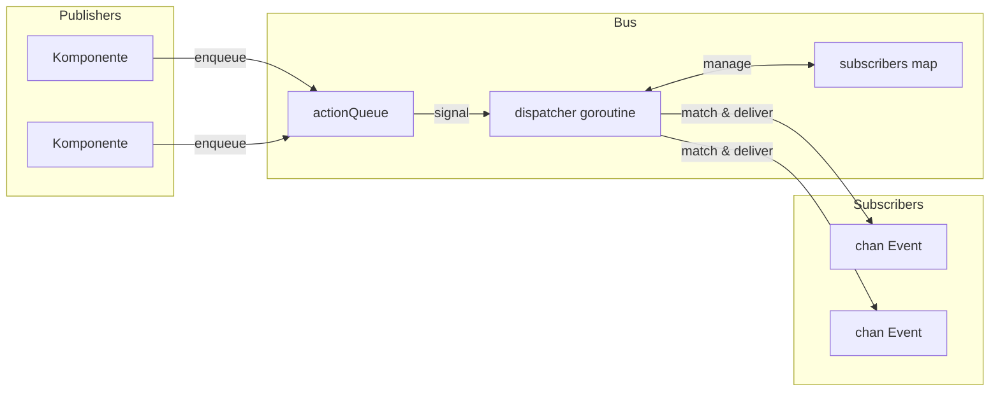

# Event-Bus

Der Event-Bus ist ein Pub/Sub-System mit einer einzelnen Dispatcher-Goroutine. Publisher reihen Actions ein, der Dispatcher verarbeitet sie sequentiell, und Subscriber empfangen passende Events auf Channels.

## Event-Struktur

```go
type Event struct {
    System string  // Komponente/Modul (z.B. "registry", "process")
    Kind   string  // Event-Typ (z.B. "create", "update", "exit")
    Path   string  // Entitäts-Identifier
    Data   any     // Payload
}
```

## Bus-Architektur



Der Bus speichert Zustand in einer einfachen Struktur:

```go
type Bus struct {
    subscribers       map[SubscriberID]sub
    subscriberCounter uint64

    actionQueue []action
    spareQueue  []action
    actionMu    sync.Mutex
    actionReady chan struct{}  // buffered=1

    closed atomic.Bool
}
```

Alle Änderungen laufen durch die Dispatcher-Goroutine, wodurch Race-Conditions ohne komplexe Sperrmechanismen vermieden werden.

## Actions

Vier Action-Typen fließen durch die Queue:

| Action | Verhalten |
|--------|-----------|
| Subscribe | Fügt Subscriber zur Map hinzu, antwortet auf done-Channel |
| Unsubscribe | Entfernt Subscriber, antwortet auf done-Channel |
| Send | Liefert Event an passende Subscriber |
| Stop | Leert Subscriber, draint Queue, beendet Loop |

Subscribe und Unsubscribe blockieren bis der Dispatcher bestätigt. Send ist Fire-and-Forget.

## Queue-Swapping

Der Dispatcher verwendet Slice-Swapping um Allokationen im Steady-State zu vermeiden:

```go
func (b *Bus) processActions() bool {
    b.actionMu.Lock()
    actions := b.actionQueue
    b.actionQueue = b.spareQueue[:0]
    b.spareQueue = nil
    b.actionMu.Unlock()

    for i := range actions {
        // action verarbeiten
    }

    clear(actions)
    b.actionMu.Lock()
    b.spareQueue = actions[:0]
    b.actionMu.Unlock()
    return true
}
```

Zwei Slices alternieren: eines für Verarbeitung, eines für neue Ankünfte. Der `actionReady`-Channel ist auf 1 gepuffert, sodass Signaling nie blockiert und mehrere Enqueues in einem Wakeup verschmelzen.

## Pattern-Matching

Subscriptions kompilieren Patterns einmal bei Subscribe-Zeit:

```go
type sub struct {
    subID   SubscriberID
    ctx     context.Context
    system  *wildcard.Wildcard
    kind    *wildcard.Wildcard
    eventCh chan<- Event
}
```

Das Wildcard-Paket unterstützt drei Pattern-Typen:

| Pattern | Matched |
|---------|---------|
| `registry` | Nur exakter Match |
| `*` | Einzelnes Segment |
| `**` | Null oder mehr Segmente |
| `(a\|b)` | Alternation innerhalb Segment |

Patterns splitten auf `.`, also matched `registry.*` `registry.create` aber nicht `registry.entry.create`. Das Pattern `registry.**` matched alle drei: `registry`, `registry.create` und `registry.entry.create`.

## Event-Zustellung

Während Send-Verarbeitung iteriert der Dispatcher Subscriber:

```go
for id, s := range b.subscribers {
    if s.system != nil && !s.system.Match(a.event.System) {
        continue
    }
    if s.kind != nil && !s.kind.Match(a.event.Kind) {
        continue
    }

    select {
    case <-a.ctx.Done():
        goto cleanup
    case <-s.ctx.Done():
        expiredSubs = append(expiredSubs, id)
    case s.eventCh <- a.event:
    }
}
```

Wenn ein Subscriber-Kontext gecancelt ist, wird er während dieses Zustellungsdurchlaufs zur Entfernung markiert. Der Event-Kontext kann auch Zustellung mitten in der Iteration canceln.

## Lua-Prozess-Bridge

Der Events-Dispatcher verbindet Go-Events mit Lua-Prozessen. Er subscribt einmal auf alle Events (`"**"`) und routet intern basierend auf Prozess-Subscriptions:

```go
type Dispatcher struct {
    bus    event.Bus
    node   relay.Node
    subID  SubscriberID
    eventC chan event.Event

    mu   sync.RWMutex
    subs map[string]*subscription  // topic -> subscription
}
```

Wenn ein Lua-Prozess via `events.subscribe()` subscribt, speichert der Dispatcher Pattern und Ziel-PID. Passende Events werden verpackt und via Relay gesendet:

```go
func (d *Dispatcher) routeEvent(evt event.Event) {
    d.mu.RLock()
    defer d.mu.RUnlock()

    for _, sub := range d.subs {
        if !matchPattern(sub.system, evt.System) {
            continue
        }
        if sub.kind != "" && !matchPattern(sub.kind, evt.Kind) {
            continue
        }

        data := map[string]any{
            "system": evt.System,
            "kind":   evt.Kind,
            "path":   evt.Path,
        }
        if evt.Data != nil {
            data["data"] = evt.Data
        }

        pkg := relay.NewPackage(pid.PID{}, sub.pid, sub.topic, payload.New(data))
        d.node.Send(pkg)
    }
}
```

## Hilfstypen

### Subscriber

Wrappt Channel-Subscription mit einem Callback:

```go
handler, err := eventbus.NewSubscriber(ctx, bus, "registry", "*.created",
    func(evt Event) {
        // handle
    })
defer handler.Close()
```

Startet zwei Goroutines: eine liest Events und ruft Handler auf, eine andere wartet auf Kontext-Cancellation zum Unsubscriben.

### EventRouter

Verwaltet mehrere Handler mit zentralisiertem Lebenszyklus:

```go
router, err := eventbus.StartRouter(ctx, bus,
    WithHandlers(handler1, handler2),
    WithLogger(log))
defer router.Stop()
```

Jeder Handler implementiert `Pattern()` und `Handle()`. Der Router erstellt einen Subscriber für jeden und schließt alle bei Stop.

### Awaiter

Synchrones Warten auf ein spezifisches Event:

```go
awaiter := eventbus.NewAwaiter(bus, "registry", "accept")
waiter, _ := awaiter.Prepare(ctx, "service-id")
defer waiter.Close()

bus.Send(ctx, triggeringEvent)

result := waiter.Wait()  // blockiert bis Match oder Timeout
```

Das Vorbereiten-dann-Warten-Muster vermeidet Race-Conditions: Erst abonnieren, bevor das Ereignis ausgelöst wird, das die Antwort erzeugt.

## Shutdown

1. `Stop()` setzt atomar closed-Flag und reiht Stop-Action ein
2. Dispatcher leert Subscriber-Map
3. Verbleibende queued Actions werden drainiert:
   - Subscribe-Requests erhalten "bus is closed" Fehler
   - Unsubscribe-Requests schließen sofort ab
   - Send-Events werden verworfen
4. WaitGroup wird abgeschlossen

## Siehe auch

- [Registry](internals/registry.md) - Primärer Event-Producer
- [Command-Dispatch](internals/dispatch.md) - Prozess-zu-Handler-Routing
