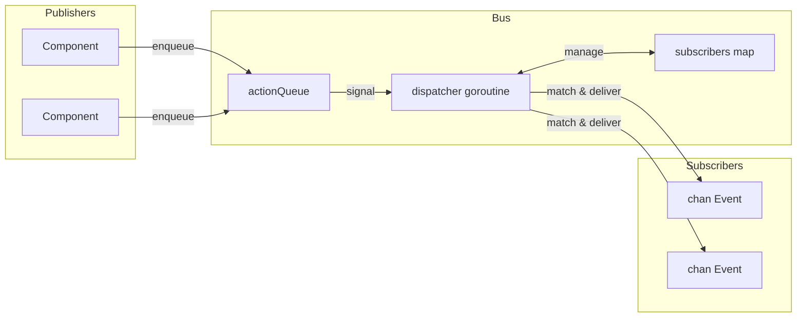

# Event-Bus

Der Event-Bus verarbeitet eingereihte Pub/Sub-Aktionen in einer Dispatcher-Goroutine und stellt passende Events über Subscriber-Channels zu.

Die Go-Ausschnitte sind Implementierungs- und Erweiterungsfragmente. Sie setzen einen vorhandenen Komponentenkontext, Logger, Handler und Ereignistypen der Anwendung voraus.

## Event-Struktur

```go
type Event struct {
    System string  // Component/module (e.g., "registry", "process")
    Kind   string  // Event type (e.g., "create", "update", "exit")
    Path   string  // Entity identifier
    Data   any     // Payload
    Aux    any     // In-process dispatcher context; not propagated to processes
}
```

## Bus-Architektur


```mermaid
flowchart LR
    subgraph Publishers
        P1[Component]
        P2[Component]
    end

    subgraph Bus
        Q[actionQueue]
        D[dispatcher goroutine]
        S[subscribers map]
    end

    subgraph Subscribers
        S1[chan Event]
        S2[chan Event]
    end

    P1 & P2 -->|enqueue| Q
    Q -->|signal| D
    D -->|match & deliver| S1 & S2
    D <-->|manage| S
```

Der Bus speichert Zustand in einer einfachen Struktur:

```go
type Bus struct {
    subscribers       map[SubscriberID]sub
    subscriberCounter uint64
    maxSubscribers    int

    actionQueue []action
    spareQueue  []action
    actionMu    sync.Mutex
    actionReady chan struct{}  // buffered=1

    closed atomic.Bool
}
```

Alle Änderungen laufen durch die Dispatcher-Goroutine, wodurch Race-Conditions ohne komplexe Sperrmechanismen vermieden werden.

## Actions

Vier Action-Typen fließen durch die Queue:

| Action | Verhalten |
|--------|-----------|
| Subscribe | Fügt Subscriber zur Map hinzu, antwortet auf done-Channel |
| Unsubscribe | Entfernt Subscriber, antwortet auf done-Channel |
| Send | Liefert Event an passende Subscriber |
| Stop | Leert Subscriber, draint Queue, beendet Loop |

Subscribe und Unsubscribe blockieren, bis der Dispatcher bestätigt. Send arbeitet nach dem Fire-and-Forget-Prinzip. Der Bus akzeptiert höchstens `DefaultMaxSubscribers` Abonnements, standardmäßig 4096; darüber hinaus schlägt das Abonnement mit `ErrSubscribersCapReached` fehl.

`Subscribe` wird mit `ErrSubscribersCapReached` abgelehnt, sobald der Bus `DefaultMaxSubscribers` (4096) aktive Subscriptions hält.

`Subscribe` schlägt sofort fehl, wenn der Subscription-Kontext bereits abgebrochen ist, und erneut im Dispatcher, wenn er vor der Ownership-Entscheidung abgebrochen wird — der Bus übernimmt niemals einen Channel, den er nicht installiert hat.

`Unsubscribe` ist eine Ownership-Barriere, kein Best-Effort-Hinweis. Es kehrt erst zurück, nachdem der Dispatcher bestätigt hat, sodass der Aufrufer den Channel freigeben kann in dem Wissen, dass der Bus keine laufende Send-Referenz mehr hält. Trifft es nach `Stop` ein, wartet die Bestätigung, bis der Dispatcher den bereits gedrainten Batch vollständig zugestellt hat.

`Stop` ist ebenfalls terminal: Ein zweites nebenläufiges `Stop` kehrt nicht vorzeitig über das bereits gesetzte closed-Flag zurück, sondern wartet, bis der Dispatcher gedraint und beendet ist.

## Queue-Swapping

Der Dispatcher verwendet Slice-Swapping um Allokationen im Steady-State zu vermeiden:

```go
func (b *Bus) processActions() bool {
    b.actionMu.Lock()
    actions := b.actionQueue
    b.actionQueue = b.spareQueue[:0]
    b.spareQueue = nil
    b.actionMu.Unlock()

    for i := range actions {
        // process action
    }

    clear(actions)
    b.actionMu.Lock()
    b.spareQueue = actions[:0]
    b.actionMu.Unlock()
    return true
}
```

Zwei Slices alternieren: eines für Verarbeitung, eines für neue Ankünfte. Der `actionReady`-Channel ist auf 1 gepuffert, sodass Signaling nie blockiert und mehrere Enqueues in einem Wakeup verschmelzen.

## Pattern-Matching

Subscriptions kompilieren Patterns einmal bei Subscribe-Zeit:

```go
type sub struct {
    subID   SubscriberID
    ctx     context.Context
    system  *wildcard.Wildcard
    kind    *wildcard.Wildcard
    eventCh chan<- Event
}
```

Das Wildcard-Paket unterstützt drei Pattern-Typen:

| Pattern | Matched |
|---------|---------|
| `registry` | Nur exakter Match |
| `*` | Einzelnes Segment |
| `**` | Null oder mehr Segmente |
| `(a\|b)` | Alternation innerhalb Segment |

Muster werden an `.` in Segmente geteilt. Daher trifft `registry.*` auf `registry.create`, aber nicht auf `registry.entry.create`. Das Muster `registry.**` trifft auf alle drei Werte: `registry`, `registry.create` und `registry.entry.create`.

## Event-Zustellung

Während Send-Verarbeitung iteriert der Dispatcher Subscriber:

```go
for id, s := range b.subscribers {
    if s.system != nil && !s.system.Match(a.event.System) {
        continue
    }
    if s.kind != nil && !s.kind.Match(a.event.Kind) {
        continue
    }

    select {
    case <-a.ctx.Done():
        goto cleanup
    case <-s.ctx.Done():
        expiredSubs = append(expiredSubs, id)
    case s.eventCh <- a.event:
    }
}
```

Wenn ein Subscriber-Kontext gecancelt ist, wird er während dieses Zustellungsdurchlaufs zur Entfernung markiert. Der Event-Kontext kann auch Zustellung mitten in der Iteration canceln.

## Lua-Prozess-Bridge

Der Events-Dispatcher verbindet Go-Events mit Lua-Prozessen. Er subscribt einmal auf alle Events (`"**"`) und routet intern basierend auf Prozess-Subscriptions:

```go
type Dispatcher struct {
    bus    event.Bus
    node   relay.Node
    subID  SubscriberID
    eventC chan event.Event

    mu   sync.RWMutex
    subs map[string]*subscription  // topic -> subscription
}
```

Wenn ein Lua-Prozess via `events.subscribe()` subscribt, speichert der Dispatcher Pattern und Ziel-PID. Passende Events werden verpackt und via Relay gesendet:

```go
func (d *Dispatcher) routeEvent(evt event.Event) {
    d.mu.RLock()
    defer d.mu.RUnlock()

    for _, sub := range d.subs {
        if !matchPattern(sub.system, evt.System) {
            continue
        }
        if sub.kind != "" && sub.kind != "*" && !matchPattern(sub.kind, evt.Kind) {
            continue
        }

        data := map[string]any{
            "system": evt.System,
            "kind":   evt.Kind,
            "path":   evt.Path,
        }
        if evt.Data != nil {
            data["data"] = evt.Data
        }

        pkg := relay.NewPackage(pid.PID{}, sub.pid, sub.topic, payload.New(data))
        d.node.Send(pkg)
    }
}
```

## Hilfstypen

### Subscriber

Wrappt Channel-Subscription mit einem Callback:

```go
handler, err := eventbus.NewSubscriber(ctx, bus, "registry", "entry.*",
    func(evt Event) {
        // handle
    })
if err != nil {
    return err
}
defer handler.Close()
```

Startet zwei Goroutines: eine liest Events und ruft Handler auf, eine andere wartet auf Kontext-Cancellation zum Unsubscriben.

### EventRouter

Verwaltet mehrere Handler mit zentralisiertem Lebenszyklus:

```go
router, err := eventbus.StartRouter(ctx, bus,
    WithHandlers(handler1, handler2),
    WithLogger(log))
if err != nil {
    return err
}
defer router.Stop()
```

Jeder Handler implementiert `Pattern()` und `Handle()`. Der Router erstellt einen Subscriber für jeden und schließt alle bei Stop.

### AwaitService

Request-Response über Pub/Sub. Er hält eine einzige Subscription pro `(system, kind)`-Paar und leitet Events anhand von `Path` an die Waiter weiter:

```go
svc := eventbus.NewAwaitService(bus)
svc.Start(ctx)
defer svc.Stop()

waiter, _ := svc.Prepare(ctx, "test", "response.(accept|reject)", "test/path", 5*time.Second)
defer waiter.Close()

bus.Send(ctx, triggeringEvent)

result := waiter.Wait()  // liefert AwaitResult{Event, Accepted, Error}
```

`Prepare` registriert den Waiter, bevor das auslösende Event gesendet wird, und vermeidet so die Race-Condition, bei der die Antwort eintrifft, bevor das Warten registriert ist. `Wait` blockiert, bis ein passendes `Path`-Event eintrifft oder der Timeout abläuft (Standard `DefaultAwaitTimeout`, 30s, wenn nicht positiv). `Accepted` ist true, wenn die Event-Kind `accept`, `*.accept` oder `*.accepted` ist; andernfalls gilt die Kind als Ablehnung und ein `error` in `Data` erscheint als `Error`. Die Komfortfunktion `Await(ctx, system, kind, path, timeout)` kombiniert Prepare und Wait. Die Boot-Infrastruktur registriert einen AwaitService im Kontext (`event.GetAwaitService`).

## Herunterfahren :id=shutdown

1. `Stop()` setzt atomar closed-Flag und reiht Stop-Action ein
2. Dispatcher leert Subscriber-Map
3. Verbleibende queued Actions werden drainiert:
   - Subscribe-Requests erhalten "bus is closed" Fehler
   - Unsubscribe-Requests schließen sofort ab
   - Send-Events werden verworfen
4. WaitGroup wird abgeschlossen

## Siehe auch

- [Registry](internals/registry.md) – primärer Event-Produzent
- [Command-Dispatch](internals/dispatch.md) – Routing vom Prozess zum Handler
