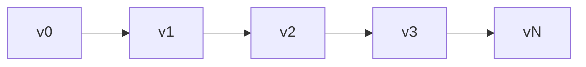
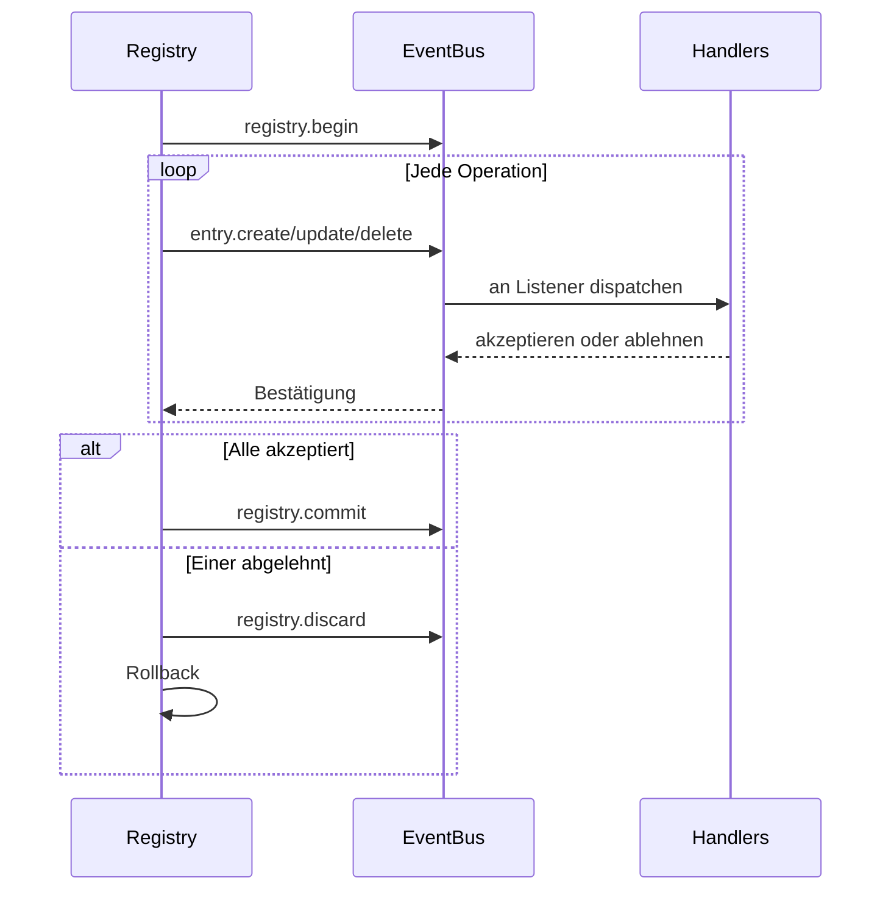

# Registry-Interna

Die Registry ist ein versionierter, ereignisgesteuerter Zustandsspeicher. Sie pflegt eine vollständige Versionshistorie, unterstützt Transaktionen und verbreitet Änderungen über den Event-Bus.

## Entry-Speicherung

Einträge werden als geordnetes Slice mit einer Hash-Map-Index für O(1)-Lookups gespeichert:

```go
type Entry struct {
    ID   ID              // namespace:name
    Kind Kind            // Entry-Typ
    Meta attrs.Bag       // Metadaten
    Data payload.Payload // Inhalt
}
```

Entry-IDs verwenden Gos `unique`-Paket zum Internieren - identische IDs teilen sich denselben Speicher.

## Versionskette

Jede Version zeigt auf ihren Parent. Pfadberechnung verwendet einen Graph-Algorithmus um die kürzeste Route zwischen zwei Versionen zu finden:



## ChangeSets

Ein ChangeSet ist eine geordnete Liste von Operationen, die einen Zustand in einen anderen transformieren:

| Operation | OriginalEntry | Zweck |
|-----------|---------------|-------|
| Create | nil | Neuen Eintrag hinzufügen |
| Update | alter Wert | Existierenden modifizieren |
| Delete | gelöschter Wert | Eintrag entfernen |

`OriginalEntry` ermöglicht Umkehrung - Updates speichern den vorherigen Wert, Deletes speichern was entfernt wurde.

### Deltas erstellen

`BuildDelta(oldState, newState)` generiert minimale Operationen:

1. Zustände vergleichen, Änderungen identifizieren
2. Deletes in umgekehrter Abhängigkeitsreihenfolge sortieren (Abhängige zuerst)
3. Creates/Updates in Vorwärts-Abhängigkeitsreihenfolge sortieren (Abhängigkeiten zuerst)

### Squashing

Mehrere ChangeSets verschmelzen durch Verfolgung des Endzustands pro Eintrag:

```
Create + Update = Create (mit aktualisiertem Wert)
Create + Delete = ∅ (heben sich auf)
Update + Delete = Delete
Delete + Create = Update
```

## Transaktionen



Handler haben 30 Sekunden um jede Operation zu akzeptieren oder abzulehnen. Bei Ablehnung führt die Registry ein Rollback durch, indem sie das inverse Delta berechnet und anwendet.

### Nicht-propagierende Einträge

Einige Arten überspringen den Event-Bus komplett:
- `registry.entry` - Anwendungskonfigurationen
- `ns.requirement` - Namespace-Requirements
- `ns.dependency` - Modul-Abhängigkeiten

## Abhängigkeitsauflösung

Einträge können Abhängigkeiten von anderen Einträgen deklarieren. Der Resolver extrahiert Abhängigkeiten über registrierte Muster:

```go
resolver.RegisterPattern(PathConfig{
    Path: "meta.server",
    AllowWildcard: true,
})
```

Abhängigkeiten werden aus Entry-Meta- und -Data-Feldern extrahiert und dann für topologische Sortierung während Zustandsübergängen verwendet.

## Versionshistorie

History-Backends:

| Implementierung | Anwendungsfall |
|-----------------|----------------|
| SQLite | Produktions-Persistenz |
| Memory | Testen |
| Nil | Keine Historie |

SQLite verwendet WAL-Modus mit Tabellen für Versionen, ChangeSets (MessagePack-kodiert) und Metadaten.

### Navigation

Pfadberechnung findet die kürzeste Route zwischen Versionen:

```go
Path(v0, v3) = [v1, v2, v3]  // ChangeSets vorwärts anwenden
Path(v3, v1) = [v2, v1]      // Umgekehrte ChangeSets anwenden
```

`LoadState()` spielt Historie von einer Baseline ab ohne neue Versionen zu erstellen - wird beim Boot verwendet.

## Finder

Query-Engine mit LRU-Caching für Entry-Suche:

| Operator | Präfix | Beispiel |
|----------|--------|----------|
| Glob | (keiner) | `.kind=function.*` |
| Regex | `~` | `~meta.path=/api/.*` |
| Contains | `*` | `*meta.tags=backend` |
| Prefix | `^` | `^meta.name=user` |
| Suffix | `$` | `$meta.path=Handler` |

Cache invalidiert bei Versionsänderung.

## Siehe auch

- [Registry](concepts/registry.md) - High-Level-Konzepte
- [Events](internals/events.md) - Event-Bus-Details
