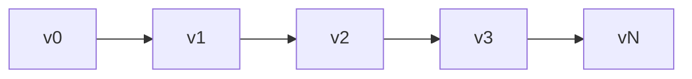
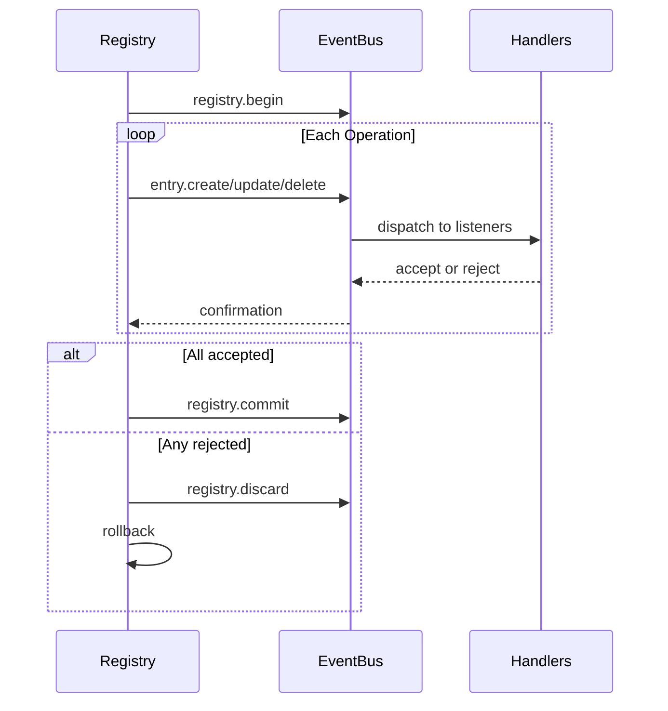

# Registry-Interna

Die Registry speichert versionierte Entry-Zustände, unterstützt Transaktionen und Historie und verbreitet Änderungen über den Event-Bus.

Die Go- und Query-Ausschnitte dieser Seite dokumentieren interne Datenstrukturen und die Finder-Syntax; sie sind keine eigenständigen Anwendungsbeispiele.

## Entry-Speicherung

Einträge werden als geordnetes Slice mit einer Hash-Map-Index für O(1)-Lookups gespeichert:

```go
type Entry struct {
    ID   ID              // namespace:name
    Kind Kind            // Entry type
    Meta attrs.Bag       // Metadata
    Data payload.Payload // Content
}
```

Entry-IDs verwenden Gos `unique`-Paket zum Internieren - identische IDs teilen sich denselben Speicher.

## Versionskette

Jede Version zeigt auf ihren Parent. Pfadberechnung verwendet einen Graph-Algorithmus um die kürzeste Route zwischen zwei Versionen zu finden:


```mermaid
flowchart LR
    v0[v0] --> v1[v1] --> v2[v2] --> v3[v3] --> vN[vN]
```

## ChangeSets

Ein ChangeSet ist eine geordnete Liste von Operationen, die einen Zustand in einen anderen transformieren:

| Operation | OriginalEntry | Zweck |
|-----------|---------------|-------|
| Create | nil | Neuen Eintrag hinzufügen |
| Update | alter Wert | Existierenden modifizieren |
| Delete | gelöschter Wert | Eintrag entfernen |

`OriginalEntry` ermöglicht Umkehrung - Updates speichern den vorherigen Wert, Deletes speichern was entfernt wurde.

### Deltas erstellen

`BuildDelta(oldState, newState)` generiert minimale Operationen:

1. Zustände vergleichen, Änderungen identifizieren
2. Deletes in umgekehrter Abhängigkeitsreihenfolge sortieren (Abhängige zuerst)
3. Creates/Updates in Vorwärts-Abhängigkeitsreihenfolge sortieren (Abhängigkeiten zuerst)

### Squashing

Mehrere ChangeSets verschmelzen durch Verfolgung des Endzustands pro Eintrag:

```
Create + Update = Create (with updated value)
Create + Delete = ∅ (cancel out)
Update + Delete = Delete
Delete + Create = Update
```

## Transaktionen


```mermaid
sequenceDiagram
    participant R as Registry
    participant B as EventBus
    participant H as Handlers

    R->>B: registry.begin
    loop Each Operation
        R->>B: entry.create/update/delete
        B->>H: dispatch to listeners
        H-->>B: accept or reject
        B-->>R: confirmation
    end
    alt All accepted
        R->>B: registry.commit
    else Any rejected
        R->>B: registry.discard
        R->>R: rollback
    end
```

Standardmäßig wartet die Registry bei jeder Operation 30 Sekunden darauf, dass Listener sie akzeptieren oder ablehnen. `registry.event_wait_timeout` ändert diesen Timeout pro Operation. Bei Ablehnung führt die Registry ein Rollback durch, indem sie das inverse Delta berechnet und anwendet.

### Nicht-propagierende Einträge

Einige Arten überspringen den Event-Bus komplett:
- `registry.entry` - Anwendungskonfigurationen
- `ns.requirement` - Namespace-Requirements
- `ns.dependency` - Modul-Abhängigkeiten
- `ns.definition` - Modul-Metadaten (Readme, Wiki, Lizenz, Autoren)

`registry.dispatch_internal_kinds` ersetzt diese Standardliste.

## Abhängigkeitsauflösung

Einträge können Abhängigkeiten von anderen Einträgen deklarieren. Der Resolver extrahiert Abhängigkeiten über registrierte Muster:

```go
resolver.RegisterPattern(registry.DependencyPattern{
    Path:          "meta.server",
    AllowWildcard: true,
})
```

Abhängigkeiten werden aus Entry-Meta- und -Data-Feldern extrahiert und dann für topologische Sortierung während Zustandsübergängen verwendet.

## Versionshistorie

History-Backends:

| Implementierung | Anwendungsfall |
|-----------------|----------------|
| SQLite | Produktions-Persistenz |
| PostgreSQL | Produktions-Persistenz, geteilt über Knoten |
| Memory | Standard, wenn `history_type` nicht gesetzt ist; Testen |
| Nil | Keine Historie |

SQLite verwendet WAL-Modus mit Tabellen für Versionen, ChangeSets (MessagePack-kodiert) und Metadaten. PostgreSQL wird mit `registry.history_type: postgres` plus `history_dsn`/`history_schema` ausgewählt (siehe [Konfiguration](guides/configuration.md#registry)).

Die Historie persistiert auch die exakte Abhängigkeitsauflösung jeder Version: Wenn eine `ns.dependency`-Änderung angewendet wird, wird der aufgelöste Modulgraph inhaltsadressiert neben dem ChangeSet gespeichert. Boot und Rollback spielen den gespeicherten Graphen wieder ab, statt neu aufzulösen, sodass eine Version stets mit den Versionen abgeglichen wird, mit denen sie aufgelöst wurde. Das Historie-Schema migriert automatisch beim ersten Boot nach einem Upgrade; eine bereits vorhandene Version wird beim ersten Besuch einmal aufgelöst und als Checkpoint gespeichert.

### Navigation

Pfadberechnung findet die kürzeste Route zwischen Versionen:

```go
Path(v0, v3) = [v1, v2, v3]  // Apply changesets forward
Path(v3, v1) = [v2, v1]      // Apply reversed changesets
```

`LoadState()` spielt Historie von einer Baseline ab ohne neue Versionen zu erstellen - wird beim Boot verwendet.

## Finder

Query-Engine mit LRU-Caching für Entry-Suche:

| Operator | Präfix | Beispiel |
|----------|--------|----------|
| Glob auf Root-Feld | `.` vor dem Root-Feld | `.kind=function.*` |
| Regex | `~` | `~meta.path=/api/.*` |
| Contains | `*` | `*meta.tags=backend` |
| Prefix | `^` | `^meta.name=user` |
| Suffix | `$` | `$meta.path=Handler` |

Cache invalidiert bei Versionsänderung.

Der Glob-Abgleich gilt für die Root-Felder `.kind`, `.name`, `.ns` und `.id`. Kriterien für `meta.*` ohne Präfix verwenden einen Gleichheitsvergleich.

## Siehe auch

- [Registry](concepts/registry.md) – übergeordnete Konzepte
- [Events](internals/events.md) – Details zum Event-Bus
