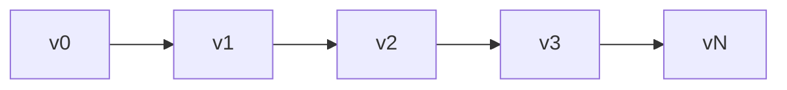
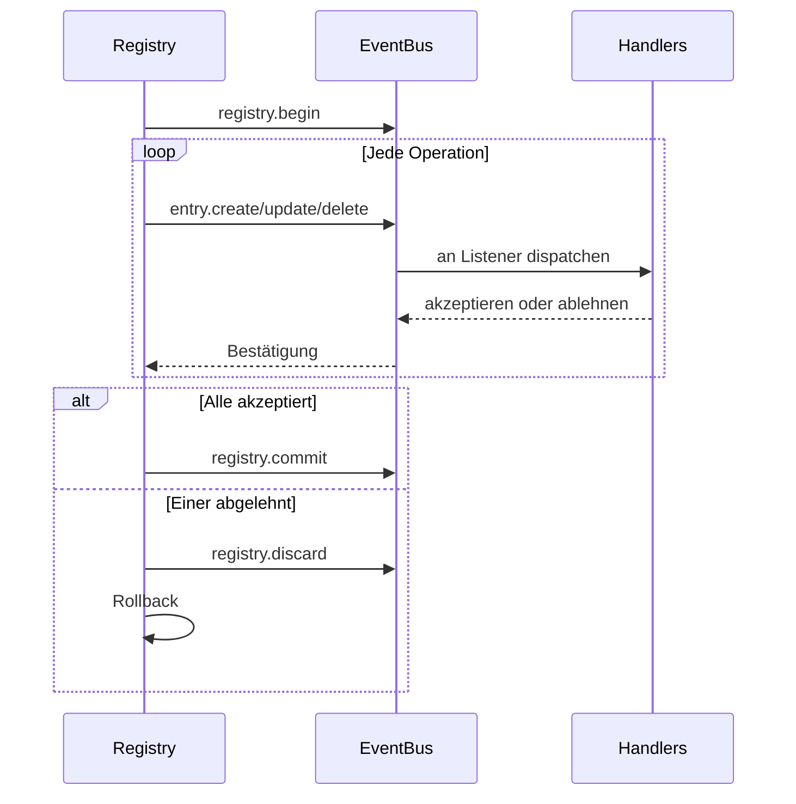

# Registry-Interna

Die Registry ist ein versionierter, ereignisgesteuerter Zustandsspeicher. Sie pflegt eine vollständige Versionshistorie, unterstützt Transaktionen und verbreitet Änderungen über den Event-Bus.

## Entry-Speicherung

Einträge werden als geordnetes Slice mit einer Hash-Map-Index für O(1)-Lookups gespeichert:

```go
type Entry struct {
    ID       ID              // namespace:name
    Kind     Kind            // Entry-Typ
    Meta     attrs.Bag       // Autoren-Metadaten
    Data     payload.Payload // Inhalt
    Registry EntryMetadata   // Registry-eigene Herkunft
}

type EntryMetadata struct {
    Owner string // Deployment-Quelle, die den Eintrag geliefert hat
    Root  bool   // Vom Deployment ausgewählte Abhängigkeitsdeklaration
}
```

Entry-IDs verwenden Gos `unique`-Paket zum Internieren - identische IDs teilen sich denselben Speicher.

`Registry` gehört der Registry, nicht dem Autor des Eintrags. `Owner` wird aus der Deployment-Quelle vergeben; `Root` wird aus dem schreibseitigen Feld `dependency_root` eines `ns.dependency`-Eintrags gesetzt. Die gewöhnlichen Entry-APIs geben nur `ID`, `Kind`, `Meta` und `Data` zurück; die Herkunft wird über die Snapshot-State-API gelesen.

## Snapshot

`Registry.Snapshot()` gibt eine atomare Sicht zurück: die Version, die Einträge dieser Version und die Registry-eigenen Zustandsmetadaten derselben Version.

```go
type Snapshot struct {
    Registry StateMetadata
    Version  Version
    Entries  State
}

type StateMetadata struct {
    Resolution *DependencyResolution
}
```

Version, Einträge und Auflösung als einen Wert zu lesen verhindert, dass ein Aufrufer Einträge mit einer Auflösung aus einer anderen Version paart. Der ausgewählte Modulgraph wird einmal pro Snapshot gespeichert, statt an jedem Eintrag wiederholt zu werden.

## Overlays

`OverlayWriter` ist eine optionale Registry-Fähigkeit für prozesslokale Einträge:

```go
type OverlayWriter interface {
    ApplyOverlay(context.Context, string, uint64, ChangeSet) (uint64, error)
    GetOverlay(string) (State, uint64, error)
}
```

Overlay-Einträge werden unter einem logischen Owner-String gruppiert. Sie gehen in den effektiven Zustand ein und durchlaufen dieselbe topologische Sortierung und dieselben Handler-Übergänge wie dauerhafte Einträge, sodass Dienste für sie normal starten und stoppen, aber sie erzeugen nie eine Historienversion. Nach einem Kaltstart sind sie leer und müssen von ihrem besitzenden Steuerdienst abgeglichen werden.

Schreibvorgänge sind optimistisch nebenläufig: `GetOverlay` gibt die aktuelle Generation des Owners zurück, und `ApplyOverlay` committet nur, wenn diese Generation noch aktuell ist, andernfalls gibt es einen wiederholbaren `Conflict` zurück. Jedes erfolgreiche Anwenden vergibt eine neue prozessweit eindeutige Generation, und für Owner, die mutiert haben, wird ein Tombstone behalten, damit eine ABA-Folge nicht für ein unverändertes Overlay gehalten werden kann.

Die bei jedem Anwenden validierten Kompositionsregeln:

- Ein Eintrag darf nur erstellt werden, wenn weder ein dauerhafter noch ein Overlay-Eintrag seine ID hält.
- Nur die besitzende Identität darf ihre Overlay-Einträge aktualisieren oder löschen.
- Overlay-Einträge dürfen keine Registry-eigenen Metadaten tragen und keine Kinds verwenden, die von Registry-Direktiven beansprucht werden.
- Ein Löschen darf keinen Eintrag entfernen, von dem ein überlebender Eintrag abhängt.
- Abhängigkeitskanten dürfen keine Owner-Grenzen überschreiten, und dauerhafte Einträge dürfen nicht von Overlay-Einträgen abhängen.

## Versionskette

Jede Version zeigt auf ihren Parent. Pfadberechnung verwendet einen Graph-Algorithmus um die kürzeste Route zwischen zwei Versionen zu finden:


```mermaid
flowchart LR
    v0[v0] --> v1[v1] --> v2[v2] --> v3[v3] --> vN[vN]
```

## ChangeSets

Ein ChangeSet ist eine geordnete Liste von Operationen, die einen Zustand in einen anderen transformieren:

| Operation | OriginalEntry | Zweck |
|-----------|---------------|-------|
| Create | nil | Neuen Eintrag hinzufügen |
| Update | alter Wert | Existierenden modifizieren |
| Delete | gelöschter Wert | Eintrag entfernen |

`OriginalEntry` ermöglicht Umkehrung - Updates speichern den vorherigen Wert, Deletes speichern was entfernt wurde.

### Deltas erstellen

`BuildDelta(oldState, newState)` generiert minimale Operationen:

1. Zustände vergleichen, Änderungen identifizieren
2. Deletes in umgekehrter Abhängigkeitsreihenfolge sortieren (Abhängige zuerst)
3. Creates/Updates in Vorwärts-Abhängigkeitsreihenfolge sortieren (Abhängigkeiten zuerst)

### Squashing

Mehrere ChangeSets verschmelzen durch Verfolgung des Endzustands pro Eintrag:

```
Create + Update = Create (mit aktualisiertem Wert)
Create + Delete = ∅ (heben sich auf)
Update + Delete = Delete
Delete + Create = Update
```

## Transaktionen


```mermaid
sequenceDiagram
    participant R as Registry
    participant B as EventBus
    participant H as Handlers

    R->>B: registry.begin
    loop Jede Operation
        R->>B: entry.create/update/delete
        B->>H: an Listener dispatchen
        H-->>B: akzeptieren oder ablehnen
        B-->>R: Bestätigung
    end
    alt Alle akzeptiert
        R->>B: registry.commit
    else Einer abgelehnt
        R->>B: registry.discard
        R->>R: Rollback
    end
```

Handler haben 30 Sekunden um jede Operation zu akzeptieren oder abzulehnen. Bei Ablehnung führt die Registry ein Rollback durch, indem sie das inverse Delta berechnet und anwendet.

### Nicht-propagierende Einträge

Einige Arten überspringen den Event-Bus komplett:
- `registry.entry` - Anwendungskonfigurationen
- `ns.requirement` - Namespace-Requirements
- `ns.dependency` - Modul-Abhängigkeiten
- `ns.definition` - Modul-Metadaten (Readme, Wiki, Lizenz, Autoren)

Dies ist die Standardmenge; `registry.dispatch_internal_kinds` in der Laufzeitkonfiguration ersetzt sie.

## Abhängigkeitsauflösung

Einträge können Abhängigkeiten von anderen Einträgen deklarieren. Der Resolver extrahiert Abhängigkeiten über registrierte Muster:

```go
resolver.RegisterPattern(registry.DependencyPattern{
    Path:          "meta.server",
    AllowWildcard: true,
})
```

Abhängigkeiten werden aus Entry-Meta- und -Data-Feldern extrahiert und dann für topologische Sortierung während Zustandsübergängen verwendet.

### Richtlinie für Abhängigkeitszugriff

Der Zugriff auf externe Abhängigkeiten ist ein request-bezogener Kontextwert, kein globales Flag:

| Richtlinie | Wirkung |
|------------|---------|
| `DependencyAccessUnspecified` | Aufrufer entscheiden; der eigene Standard des Aufrufers gilt |
| `DependencyAccessOnline` | Externe Auflösung und Artefakt-Download sind erlaubt |
| `DependencyAccessVerifiedOffline` | Externer Zugriff ist verboten; die Auflösung nutzt gelockte Manifeste und lokal vorhandene Artefakte |

`LoadState()` fällt auf verifiziert-offline zurück, wenn der Kontext nichts angibt, sodass der Boot einen gespeicherten Graphen ohne Netzwerkzugriff wieder abspielt. Das Wiederherstellen einer Deployment-Baseline schaltet den Kontext auf online, weil es die von dieser Baseline benannten Module holen muss. Unter verifiziert-offline ersetzt ein Manifest-Provider, der nur gelockte Module ausliefert, den Hub-Provider, und ein fehlendes Artefakt schlägt als fehlender Beleg fehl, statt einen Download auszulösen.

## Versionshistorie

History-Backends:

| Implementierung | Anwendungsfall |
|-----------------|----------------|
| SQLite | Produktions-Persistenz |
| PostgreSQL | Produktions-Persistenz, geteilt über Knoten |
| Memory | Standard, wenn `history_type` nicht gesetzt ist; Testen |
| Nil | Keine Historie |

SQLite verwendet WAL-Modus mit Tabellen für Versionen, ChangeSets (MessagePack-kodiert) und Metadaten. PostgreSQL wird mit `registry.history_type: postgres` plus `history_dsn`/`history_schema` ausgewählt (siehe [Konfiguration](guides/configuration.md#registry)).

Die Historie persistiert auch die exakte Abhängigkeitsauflösung jeder Version: Wenn eine `ns.dependency`-Änderung angewendet wird, wird der aufgelöste Modulgraph inhaltsadressiert neben dem ChangeSet gespeichert. Boot und Rollback spielen den gespeicherten Graphen wieder ab, statt neu aufzulösen, sodass eine Version stets mit den Versionen abgeglichen wird, mit denen sie aufgelöst wurde. Das Historie-Schema migriert automatisch beim ersten Boot nach einem Upgrade; eine bereits vorhandene Version wird beim ersten Besuch einmal aufgelöst und als Checkpoint gespeichert.

### Navigation

Pfadberechnung findet die kürzeste Route zwischen Versionen:

```go
Path(v0, v3) = [v1, v2, v3]  // ChangeSets vorwärts anwenden
Path(v3, v1) = [v2, v1]      // Umgekehrte ChangeSets anwenden
```

`LoadState()` spielt Historie von einer Baseline ab ohne neue Versionen zu erstellen - wird beim Boot verwendet.

## Finder

Query-Engine mit LRU-Caching für Entry-Suche:

| Operator | Präfix | Beispiel |
|----------|--------|----------|
| Glob | (keiner) | `.kind=function.*` |
| Regex | `~` | `~meta.path=/api/.*` |
| Contains | `*` | `*meta.tags=backend` |
| Prefix | `^` | `^meta.name=user` |
| Suffix | `$` | `$meta.path=Handler` |

Cache invalidiert bei Versionsänderung.

## Siehe auch

- [Registry](concepts/registry.md) - High-Level-Konzepte
- [Events](internals/events.md) - Event-Bus-Details
