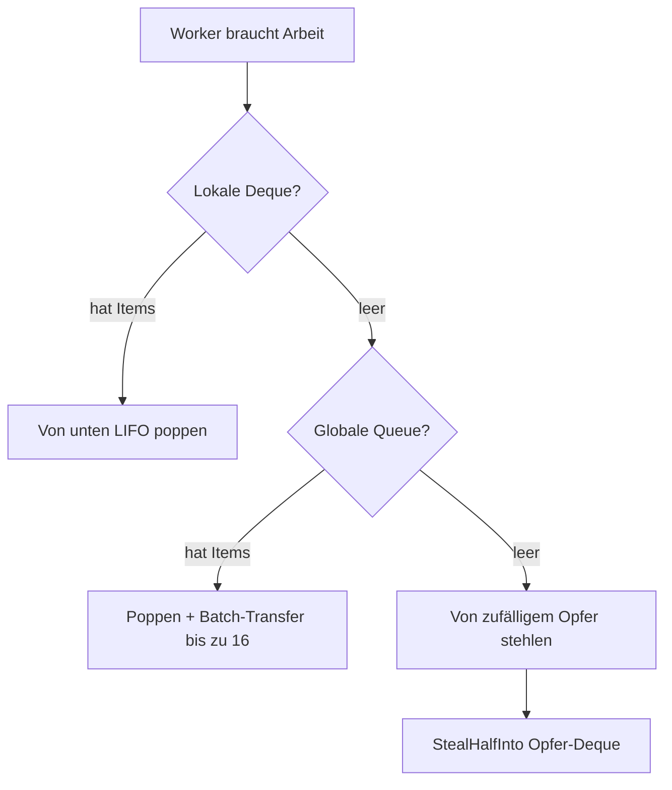
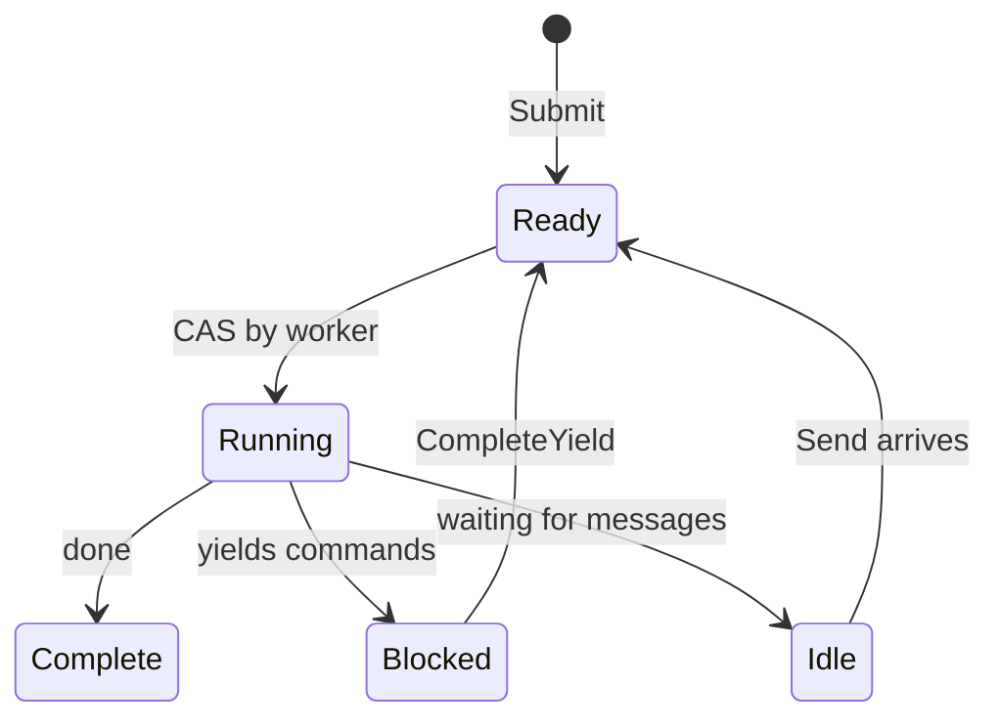

# Scheduler

Der Scheduler führt Prozesse mit einem Work-Stealing-Design aus. Worker pflegen lokale Deques und stehlen voneinander, wenn sie untätig sind.

## Process-Interface

Der Scheduler arbeitet mit jedem Typ, der das `Process`-Interface implementiert:

```go
type Process interface {
    Init(ctx context.Context, method string, input payload.Payloads) error
    Step(events []Event, out *StepOutput) error
    Close()
}
```

| Methode | Zweck |
|---------|-------|
| `Init` | Prozess mit Entry-Methodenname und Eingabeargumenten vorbereiten |
| `Step` | Zustandsmaschine mit eingehenden Events vorantreiben, Yields in Output schreiben |
| `Close` | Ressourcen freigeben |

Der `method`-Parameter in `Init` spezifiziert welchen Einstiegspunkt aufgerufen werden soll. Eine Prozessinstanz kann mehrere Einstiegspunkte exponieren, und der Aufrufer wählt welchen er ausführen möchte. Dies dient auch als Verifikation, dass der Scheduler den Prozess korrekt initiiert.

Der Scheduler ruft `Step()` wiederholt auf, übergibt Events (Yield-Completions, Nachrichten) und sammelt Yields (Commands zum Dispatchen). Der Prozess schreibt seinen Status und alle Yields in den `StepOutput`-Buffer.

```go
type Event struct {
    Type  EventType  // EventYieldComplete oder EventMessage
    Tag   uint64     // Korrelationstag für Yield-Completions
    Data  any        // Ergebnisdaten oder Nachrichten-Payload
    Error error      // Fehler wenn Yield fehlgeschlagen
}
```

## Struktur

Der Scheduler startet standardmäßig `GOMAXPROCS` Worker. Jeder Worker hat eine lokale Deque für cache-freundlichen LIFO-Zugriff. Eine globale FIFO-Queue behandelt neue Submissions und Cross-Worker-Transfers. Prozesse werden per PID für Nachrichtenrouting verfolgt.

## Arbeit finden



Worker prüfen Quellen in Prioritätsreihenfolge:

| Priorität | Quelle | Muster |
|-----------|--------|--------|
| 1 | Lokale Deque | LIFO Pop, lock-frei, cache-freundlich |
| 2 | Globale Queue | FIFO Pop mit Batch-Transfer |
| 3 | Andere Worker | Hälfte von Opfer-Deque stehlen |

Beim Poppen von global nehmen Worker ein Item und transferieren bis zu 16 weitere in Batch zu ihrer lokalen Deque.

## Chase-Lev-Deque

Jeder Worker besitzt eine Chase-Lev Work-Stealing-Deque:

```go
type Deque struct {
    buffer atomic.Pointer[dequeBuffer]
    top    atomic.Int64  // Diebe stehlen hier (CAS)
    bottom atomic.Int64  // Besitzer pusht/poppt hier
}
```

Der Besitzer pusht und poppt von unten (LIFO) ohne Synchronisation. Diebe stehlen von oben (FIFO) per CAS. Dies gibt dem Besitzer cache-freundlichen Zugriff auf kürzlich gepushte Items während ältere Arbeit an Stealer verteilt wird.

`StealHalfInto` nimmt die Hälfte der Items in einer CAS-Operation und reduziert Contention.

## Adaptives Spinning

Bevor auf der Condition-Variable blockiert wird, spinnen Worker adaptiv:

| Spin-Count | Aktion |
|------------|--------|
| < 4 | Enger Loop |
| 4-15 | Thread yielden (`runtime.Gosched`) |
| >= 16 | Auf Condition-Variable blockieren |

## Prozesszustände



| Zustand | Beschreibung |
|---------|--------------|
| Ready | Für Ausführung eingereiht |
| Running | Worker führt Step() aus |
| Blocked | Wartet auf Yield-Completion |
| Idle | Wartet auf Nachrichten |
| Complete | Ausführung beendet |

Ein Wakeup-Flag behandelt Race-Conditions: Wenn ein Handler `CompleteYield` aufruft, während der Worker noch den Prozess besitzt (Running), setzt er das Flag. Der Worker prüft das Flag nach dem Dispatchen und reiht bei gesetztem Flag neu ein.

## Event-Queue

Jeder Prozess hat eine MPSC (Multi-Producer, Single-Consumer) Event-Queue:

- **Producer**: Command-Handler (`CompleteYield`), Nachrichtensender (`Send`)
- **Consumer**: Worker draint Events in `Step()`

## Nachrichtenrouting

Der Scheduler implementiert `relay.Receiver` um Nachrichten an Prozesse zu routen. Wenn `Send()` aufgerufen wird, schlägt er die Ziel-PID in der `byPID`-Map nach, pusht die Nachricht als Event in die Prozess-Queue und weckt den Prozess wenn idle durch Pushen in die globale Queue.

## Shutdown

Bei Shutdown sendet der Scheduler Cancel-Events an alle laufenden Prozesse und wartet auf deren Abschluss oder Timeout. Worker beenden sich sobald keine Arbeit mehr übrig ist.

## Siehe auch

- [Command-Dispatch](internal-dispatch.md) - Wie Yields Handler erreichen
- [Prozessmodell](concept-process-model.md) - High-Level-Konzepte
