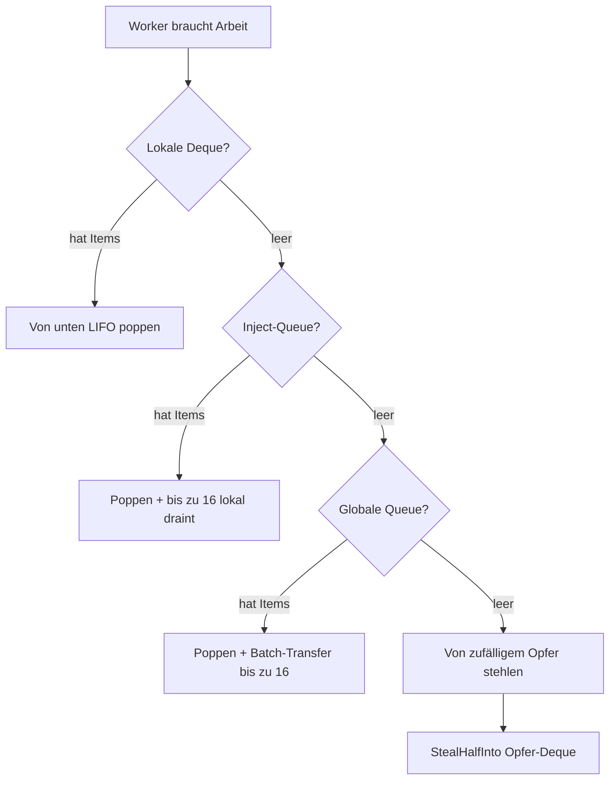
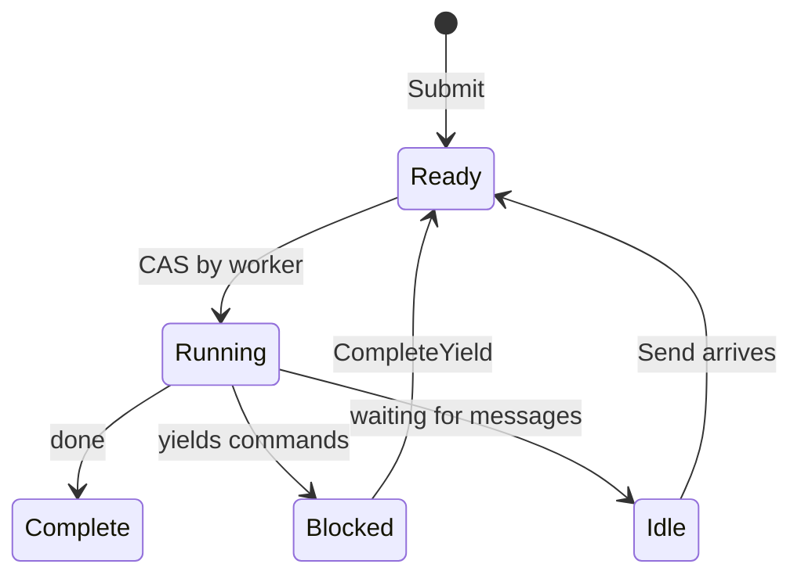

# Scheduler

Der Scheduler führt Prozesse auf Workern mit lokalen Deques, Inject-Queues, einer globalen Queue und Work-Stealing aus.

Diese Seite ist eine Implementierungsreferenz. Ihre Go-Strukturen und Diagramme beschreiben den Scheduler der festgelegten Runtime, keine von Anwendungscode zu implementierenden APIs.

## Process-Interface

Der Scheduler arbeitet mit jedem Typ, der das `Process`-Interface implementiert:

```go
type Process interface {
    Init(ctx context.Context, method string, input payload.Payloads) error
    Step(events []Event, out *StepOutput) error
    Close()
}
```

| Methode | Zweck |
|---------|-------|
| `Init` | Prozess mit Entry-Methodenname und Eingabeargumenten vorbereiten |
| `Step` | Zustandsmaschine mit eingehenden Events vorantreiben, Yields in Output schreiben |
| `Close` | Ressourcen freigeben |

Der Parameter `method` von `Init` legt den aufzurufenden Einstiegspunkt fest. Eine Prozessinstanz kann mehrere Einstiegspunkte bereitstellen; der Aufrufer wählt den auszuführenden aus.

Der Scheduler ruft `Step()` wiederholt auf, übergibt Events (Yield-Completions, Nachrichten) und sammelt Yields (Commands zum Dispatchen). Der Prozess schreibt seinen Status und alle Yields in den `StepOutput`-Buffer.

```go
type Event struct {
    Type  EventType  // EventYieldComplete or EventMessage
    Tag   uint64     // Correlation tag for yield completions
    Data  any        // Result data or message payload
    Error error      // Error if yield failed
}
```

## Struktur

Der Scheduler startet standardmäßig `GOMAXPROCS` Worker. Jeder Worker hat eine lokale Deque für cache-freundlichen LIFO-Zugriff und eine Worker-eigene MPSC-Inject-Queue für asynchrone Completions mit Affinität zu diesem Worker. Eine globale FIFO-Queue behandelt neue Submissions und affinitätslose Neueinreihungen. Prozesse werden per PID für Nachrichtenrouting verfolgt.

## Arbeit finden


```mermaid
flowchart TD
    W[Worker braucht Arbeit] --> L{Lokale Deque?}
    L -->|hat Items| LP[Von unten LIFO poppen]
    L -->|leer| I{Inject-Queue?}
    I -->|hat Items| IP[Poppen + bis zu 16 lokal draint]
    I -->|leer| G{Globale Queue?}
    G -->|hat Items| GP[Poppen + Batch-Transfer bis zu 16]
    G -->|leer| S[Von zufälligem Opfer stehlen]
    S --> SH[StealHalfInto Opfer-Deque]
```

Worker prüfen Quellen in Prioritätsreihenfolge:

| Priorität | Quelle | Muster |
|-----------|--------|--------|
| 1 | Lokale Deque | LIFO Pop, lock-frei, cache-freundlich |
| 2 | Inject-Queue | MPSC-Pop affiner asynchroner Completions, bis zu 16 lokal draint |
| 3 | Globale Queue | FIFO Pop mit Batch-Transfer |
| 4 | Andere Worker | Hälfte von Opfer-Deque stehlen |

Beim Poppen aus der Inject- oder globalen Queue nehmen Worker ein Item und verschieben bis zu 16 weitere in ihre lokale Deque.

## Chase-Lev-Deque

Jeder Worker besitzt eine Chase-Lev Work-Stealing-Deque:

```go
type Deque struct {
    buffer atomic.Pointer[dequeBuffer]
    top    atomic.Int64  // Thieves steal from here (CAS)
    bottom atomic.Int64  // Owner pushes/pops here
}
```

Der Besitzer pusht und poppt ohne Mutex von unten (LIFO); beim Poppen des letzten Elements koordiniert er sich per CAS mit Dieben. Diebe stehlen per CAS von oben (FIFO). So erhält der Besitzer cachefreundlichen Zugriff auf zuletzt hinzugefügte Elemente, während ältere Arbeit an Diebe verteilt wird.

`StealHalfInto` übernimmt in einer CAS-Operation höchstens die Hälfte der verfügbaren Elemente, begrenzt durch den Zielpuffer. Die Steal-Versuche der Worker verwenden einen Puffer für 32 Elemente.

## Adaptives Spinning

Bevor auf der Condition-Variable blockiert wird, spinnen Worker adaptiv:

| Spin-Count | Aktion |
|------------|--------|
| < 4 | Enger Loop |
| 4-15 | Thread yielden (`runtime.Gosched`) |
| >= 16 | Auf Condition-Variable blockieren |

## Prozesszustände


```mermaid
stateDiagram-v2
    [*] --> Ready: Submit
    Ready --> Running: CAS by worker
    Running --> Complete: done
    Running --> Blocked: yields commands
    Running --> Idle: waiting for messages
    Blocked --> Ready: CompleteYield
    Idle --> Ready: Send arrives
```

| Zustand | Beschreibung |
|---------|--------------|
| Ready | Für Ausführung eingereiht |
| Running | Worker führt Step() aus |
| Blocked | Wartet auf Yield-Completion |
| Idle | Wartet auf Nachrichten |
| Complete | Ausführung beendet |

Ein Wakeup-Flag behandelt Race-Conditions: Wenn ein Handler `CompleteYield` aufruft, während der Worker noch den Prozess besitzt (Running), setzt er das Flag. Der Worker prüft das Flag nach dem Dispatchen und reiht bei gesetztem Flag neu ein.

## Event-Queue

Jeder Prozess hat eine MPSC (Multi-Producer, Single-Consumer) Event-Queue:

- **Producer**: Command-Handler (`CompleteYield`), Nachrichtensender (`Send`)
- **Consumer**: Worker draint Events in `Step()`

Ein Generationszähler schützt die Queue. Jeder Producer bindet sich an die Generation, die er beobachtet hat; `Reset` erhöht sie, sodass ein Sender aus einer früheren Ausführung nicht in eine wiederverwendete Queue pushen kann.

Gewöhnlicher Event-Verkehr ist unbegrenzt. Die Verrechnung ist pro Nachricht opt-in: Eine Nachricht, die `MaxItems` oder `MaxBytes` trägt, wird gegen ein Budget pro Topic zugelassen, und das strengste für ein Topic gesehene Limit gewinnt. Eine Nachricht hält ihre Reservierung, bis der konsumierende Prozess sie freigibt, und Terminals verbrauchen nie Backlog-Kapazität.

Ist das Budget eines Topics erschöpft, hängt die Queue an der Stelle der überlaufenden Nachricht eine synthetische Nachricht an, die `message queue limit exceeded` gefolgt von einem Terminal-Payload trägt. Weiterer Verkehr auf diesem Topic wird verworfen, bis die Queue zurückgesetzt wird, sodass eine begrenzte Subscription mit einem Fehler-Terminal endet statt unbegrenzt zu wachsen.

## Nachrichtenrouting

Der Scheduler implementiert `relay.Receiver` um Nachrichten an Prozesse zu routen. `Send` delegiert an `SendContext` mit einem Background-Kontext; `SendContext` prüft die Cancellation vor dem Nachschlagen des Ziels und vor der Zulassung, weil die Zulassung selbst nicht blockiert und nach Erfolg nicht rückgängig zu machen ist.

Beide schlagen die Ziel-PID in der `byPID`-Map nach und pushen das Package unter der aktuellen Generation des Prozessors in die Prozess-Queue. Die Zulassung hat drei Ausgänge:

| Ergebnis | Bedeutung | Package-Ownership |
|----------|-----------|-------------------|
| Accepted | Die Queue hat das Package übernommen | Queue, vom Scheduler nach der Verarbeitung freigegeben |
| Dropped | Ein Budget pro Topic ist übergelaufen und die Queue hat nichts behalten außer ihrem eigenen Overflow-Terminal | Aufrufer, sofort freigegeben |
| Rejected | Die Queue ist geschlossen oder die Generation ist veraltet | Aufrufer; `SendContext` gibt `ErrProcessClosed` zurück |

Ein zugelassener oder verworfener Push weckt anschließend den Prozess, wenn er idle oder blockiert ist. Die Neueinreihung läuft über injectOrGlobal, das in die Worker-eigene Inject-Queue des letzten Workers pusht, wenn der Prozess eine bekannte Worker-Affinität hat, und sonst auf die globale Queue zurückfällt.

## Herunterfahren :id=shutdown

Bei Shutdown sendet der Scheduler Cancel-Events an alle laufenden Prozesse und wartet auf deren Abschluss oder Timeout. Worker beenden sich sobald keine Arbeit mehr übrig ist.

## Siehe auch

- [Command-Dispatch](internals/dispatch.md) – wie Yields Handler erreichen
- [Prozessmodell](concepts/process-model.md) – übergeordnete Konzepte
