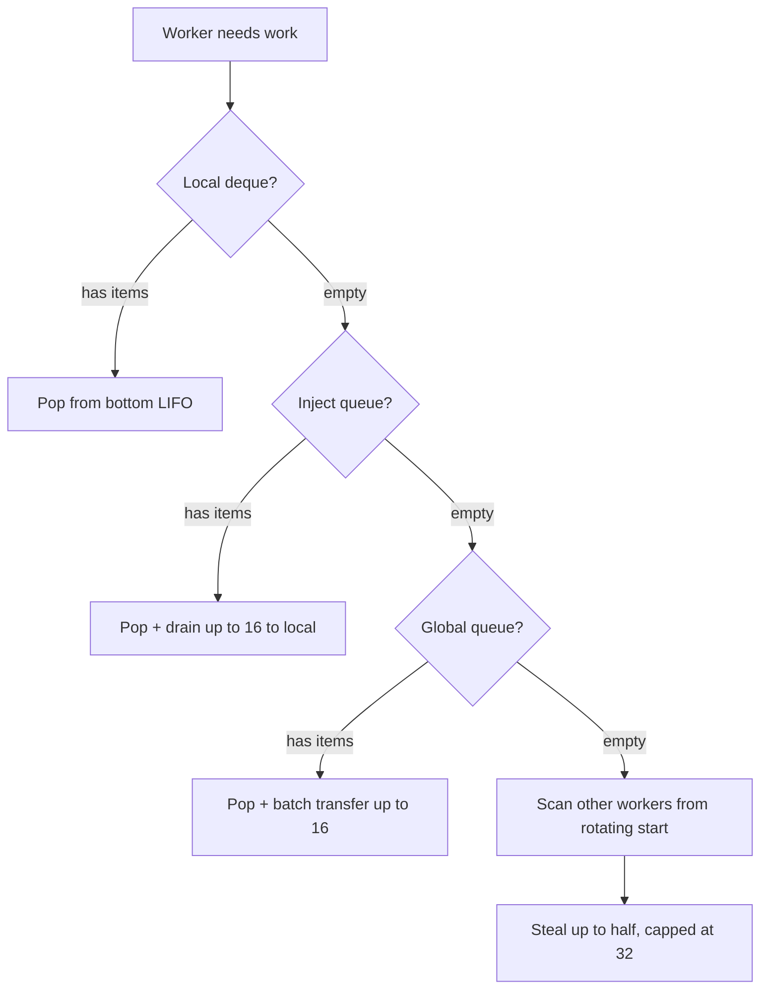
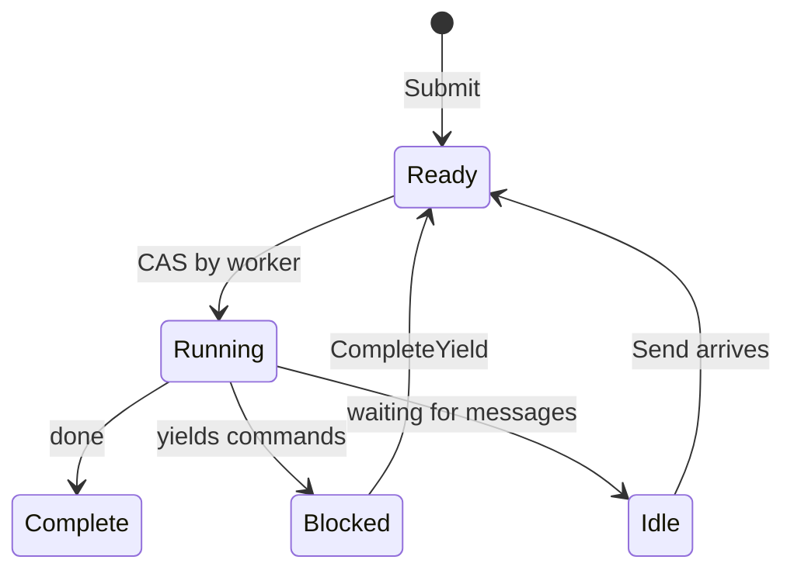

# Scheduler

Der Scheduler führt Prozesse auf Workern mit lokalen Deques, Inject-Queues, einer globalen Queue und Work-Stealing aus.

Diese Seite ist eine Implementierungsreferenz. Ihre Go-Strukturen und Diagramme beschreiben den Scheduler der festgelegten Runtime, keine von Anwendungscode zu implementierenden APIs.

## Process-Interface

Der Scheduler arbeitet mit jedem Typ, der das `Process`-Interface implementiert:

```go
type Process interface {
    Init(ctx context.Context, method string, input payload.Payloads) error
    Step(events []Event, out *StepOutput) error
    Close()
}
```

| Methode | Zweck |
|---------|-------|
| `Init` | Prozess mit Entry-Methodenname und Eingabeargumenten vorbereiten |
| `Step` | Zustandsmaschine mit eingehenden Events vorantreiben, Yields in Output schreiben |
| `Close` | Ressourcen freigeben |

Der Parameter `method` von `Init` legt den aufzurufenden Einstiegspunkt fest. Eine Prozessinstanz kann mehrere Einstiegspunkte bereitstellen; der Aufrufer wählt den auszuführenden aus.

Der Scheduler ruft `Step()` wiederholt auf, übergibt Events (Yield-Completions, Nachrichten) und sammelt Yields (Commands zum Dispatchen). Der Prozess schreibt seinen Status und alle Yields in den `StepOutput`-Buffer.

```go
type Event struct {
    Type  EventType  // EventYieldComplete or EventMessage
    Tag   uint64     // Correlation tag for yield completions
    Data  any        // Result data or message payload
    Error error      // Error if yield failed
}
```

## Struktur

Der Scheduler startet standardmäßig `GOMAXPROCS` Worker. Jeder Worker besitzt eine lokale Deque für cachefreundlichen LIFO-Zugriff und eine eigene MPSC-Inject-Queue für erneut eingereihte Arbeit mit Worker-Affinität, einschließlich Yield-Abschlüssen und Nachrichten-Wakeups. Eine globale FIFO-Queue verarbeitet neue Submissions und erneut eingereihte Arbeit ohne Affinität. Für das Nachrichtenrouting werden Prozesse anhand ihrer PID verfolgt.

## Arbeit finden


```mermaid
flowchart TD
    W[Worker needs work] --> L{Local deque?}
    L -->|has items| LP[Pop from bottom LIFO]
    L -->|empty| I{Inject queue?}
    I -->|has items| IP[Pop + drain up to 16 to local]
    I -->|empty| G{Global queue?}
    G -->|has items| GP[Pop + batch transfer up to 16]
    G -->|empty| S[Scan other workers from rotating start]
    S --> SH[Steal up to half, capped at 32]
```

Worker prüfen Quellen in Prioritätsreihenfolge:

| Priorität | Quelle | Muster |
|-----------|--------|--------|
| 1 | Lokale Deque | LIFO Pop, lock-frei, cache-freundlich |
| 2 | Inject-Queue | MPSC-Pop für affine Requeues und Events; bis zu 16 weitere lokal übernehmen |
| 3 | Globale Queue | FIFO-Pop mit Batch-Transfer |
| 4 | Andere Worker | Ab einem rotierenden Startindex suchen und pro Versuch höchstens 32 Elemente, maximal die Hälfte, stehlen |

Beim Poppen aus der Inject- oder globalen Queue übernehmen Worker ein Element und verschieben bis zu 16 weitere in ihre lokale Deque.

## Chase-Lev-Deque

Jeder Worker besitzt eine Chase-Lev Work-Stealing-Deque:

```go
type Deque struct {
    buffer atomic.Pointer[dequeBuffer]
    top    atomic.Int64  // Thieves steal from here (CAS)
    bottom atomic.Int64  // Owner pushes/pops here
}
```

Der Besitzer pusht und poppt ohne Mutex von unten (LIFO); beim Poppen des letzten Elements koordiniert er sich per CAS mit Dieben. Diebe stehlen per CAS von oben (FIFO). So erhält der Besitzer cachefreundlichen Zugriff auf zuletzt hinzugefügte Elemente, während ältere Arbeit an Diebe verteilt wird.

`StealHalfInto` übernimmt in einer CAS-Operation höchstens die Hälfte der verfügbaren Elemente, begrenzt durch den Zielpuffer. Die Steal-Versuche der Worker verwenden einen Puffer für 32 Elemente.

## Adaptives Spinning

Bevor auf der Condition-Variable blockiert wird, spinnen Worker adaptiv:

| Spin-Count | Aktion |
|------------|--------|
| < 4 | Enger Loop |
| 4-15 | Thread yielden (`runtime.Gosched`) |
| >= 16 | Auf Condition-Variable blockieren |

## Prozesszustände


```mermaid
stateDiagram-v2
    [*] --> Ready: Submit
    Ready --> Running: CAS by worker
    Running --> Complete: done
    Running --> Blocked: yields commands
    Running --> Idle: waiting for messages
    Blocked --> Ready: CompleteYield
    Idle --> Ready: Send arrives
```

| Zustand | Beschreibung |
|---------|--------------|
| Ready | Für Ausführung eingereiht |
| Running | Worker führt Step() aus |
| Blocked | Wartet auf Yield-Completion |
| Idle | Wartet auf Nachrichten |
| Complete | Ausführung beendet |

Ein Wakeup-Flag behandelt Race-Conditions: Wenn ein Handler `CompleteYield` aufruft, während der Worker noch den Prozess besitzt (Running), setzt er das Flag. Der Worker prüft das Flag nach dem Dispatchen und reiht bei gesetztem Flag neu ein.

## Event-Queue

Jeder Prozess hat eine MPSC (Multi-Producer, Single-Consumer) Event-Queue:

- **Producer**: Command-Handler (`CompleteYield`), Nachrichtensender (`Send`)
- **Consumer**: Worker draint Events in `Step()`

## Nachrichtenrouting

Der Scheduler implementiert `relay.Receiver`, um Nachrichten an Prozesse zu leiten. Bei `Send()` sucht er die Ziel-PID in der Map `byPID`, legt die Nachricht als Event in die Prozess-Queue und weckt den Prozess, wenn er idle oder blockiert ist. Die Wiedereinreihung erfolgt über `injectOrGlobal`: Bei bekannter Worker-Affinität landet der Prozess in der Inject-Queue seines letzten Workers, andernfalls in der globalen Queue.

## Herunterfahren :id=shutdown

Bei Shutdown sendet der Scheduler Cancel-Events an alle laufenden Prozesse und wartet auf deren Abschluss oder Timeout. Worker beenden sich sobald keine Arbeit mehr übrig ist.

## Siehe auch

- [Command-Dispatch](./dispatch.md) – wie Yields Handler erreichen
- [Prozessmodell](../concepts/process-model.md) – übergeordnete Konzepte
