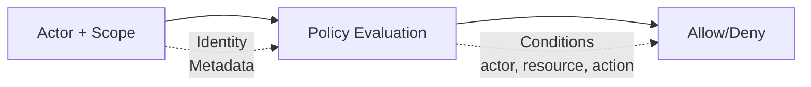

# Sicherheitsmodell

Wippy implementiert attributbasierte Zugriffskontrolle mit Actors und Policy-Scopes. Richtlinien bewerten Aktionen und Ressourcen anhand der Metadaten von Actor und Ressource.

Diese Seite ist eine Konfigurations- und API-Referenz. Vollständige Beispiele benennen die benötigten Registry-Einträge; kürzere Lua- und YAML-Blöcke veranschaulichen eine einzelne Operation oder ein Konfigurationsfragment in einem bestehenden Sicherheitskontext.



## Entry-Typen

| Art | Beschreibung |
|------|--------------|
| `security.policy` | Deklarative Richtlinie mit Bedingungen |
| `security.policy.expr` | Expression-basierte Richtlinie |
| `security.token_store` | Token-Speicherung und -Validierung |

## Actors

Ein Actor identifiziert die handelnde Identität.

```lua
local security = require("security")

-- Create actor with metadata
local actor = security.new_actor("user:123", {
    role = "admin",
    team = "backend",
    department = "engineering",
    clearance = 3
})

-- Access actor properties
local id = actor:id()        -- "user:123"
local meta = actor:meta()    -- {role="admin", ...}
```

### Actor im Kontext

```lua
-- Get current actor from context
local errors = require("errors")

local actor = security.actor()
if not actor then
    return nil, errors.new({ kind = errors.PERMISSION_DENIED, message = "Kein Actor im Kontext" })
end
```

## Richtlinien

Richtlinien definieren Zugriffsregeln mit Aktionen, Ressourcen, Bedingungen und Effekten.

### Deklarative Richtlinie

```yaml
# src/security/_index.yaml
version: "1.0"
namespace: app.security

entries:
  # Admin full access
  - name: admin_policy
    kind: security.policy
    policy:
      actions: "*"
      resources: "*"
      effect: allow
      conditions:
        - field: actor.meta.role
          operator: eq
          value: admin
    groups:
      - admin

  # Read-only access
  - name: readonly_policy
    kind: security.policy
    policy:
      actions:
        - "*.read"
        - "*.get"
        - "*.list"
      resources: "*"
      effect: allow
    groups:
      - default

  # Resource owner access
  - name: owner_policy
    kind: security.policy
    policy:
      actions:
        - read
        - write
        - delete
      resources: "document:*"
      effect: allow
      conditions:
        - field: meta.owner
          operator: eq
          value_from: actor.id
    groups:
      - default

  # Deny confidential without clearance
  - name: deny_confidential
    kind: security.policy
    policy:
      actions: "*"
      resources: "document:*"
      effect: deny
      conditions:
        - field: meta.classification
          operator: eq
          value: confidential
        - field: actor.meta.clearance
          operator: lt
          value: 3
    groups:
      - security
```

### Richtlinienstruktur

```text
policy:
  actions: "*" | "action" | ["action1", "action2"]
  resources: "*" | "resource" | ["res1", "res2"]
  effect: allow | deny
  conditions:  # Optional
    - field: "field.path"
      operator: "eq"
      value: "static_value"
      # OR
      value_from: "other.field.path"
```

### Expression-basierte Richtlinie

Für komplexe Logik verwenden Sie Expression-Richtlinien:

```yaml
- name: flexible_access
  kind: security.policy.expr
  policy:
    actions:
      - read
      - write
    resources: "file:*"
    effect: allow
    expression: |
      (actor.meta.role == "editor" && action == "write") ||
      (action == "read" && meta.public == true) ||
      actor.id == meta.owner
  groups:
    - editors
```

## Bedingungen

Bedingungen werten zur Laufzeit Actor-, Aktions-, Ressourcen- und Metadatenfelder aus.

### Feldpfade

| Pfad | Beschreibung |
|------|--------------|
| `actor.id` | Eindeutiger Bezeichner des Actors |
| `actor.meta.*` | Actor-Metadaten (unterstützt Verschachtelung) |
| `action` | Die ausgeführte Aktion |
| `resource` | Der Ressourcen-Bezeichner |
| `meta.*` | Ressourcen-Metadaten |

### Operatoren

| Operator | Beschreibung | Beispiel |
|----------|--------------|----------|
| `eq` | Gleich | `actor.meta.role eq "admin"` |
| `ne` | Ungleich | `meta.status ne "deleted"` |
| `lt` | Kleiner als | `meta.priority lt 5` |
| `gt` | Größer als | `actor.meta.clearance gt 2` |
| `lte` | Kleiner oder gleich | `meta.size lte 1000` |
| `gte` | Größer oder gleich | `actor.meta.level gte 3` |
| `in` | Wert in Array | `action in ["read", "write"]` |
| `nin` | Wert nicht in Array | `meta.status nin ["deleted", "archived"]` |
| `exists` | Feld existiert | `meta.owner exists true` |
| `nexists` | Feld existiert nicht | `meta.deleted nexists true` |
| `contains` | String enthält | `resource contains "sensitive"` |
| `ncontains` | String enthält nicht | `resource ncontains "public"` |
| `matches` | Regex-Match | `resource matches "^doc:.*"` |
| `nmatches` | Regex-Match nicht | `actor.id nmatches "^system:.*"` |

### Bedingungsbeispiele

```yaml
# Match actor role
conditions:
  - field: actor.meta.role
    operator: eq
    value: admin

# Compare fields
conditions:
  - field: meta.owner
    operator: eq
    value_from: actor.id

# Numeric comparison
conditions:
  - field: actor.meta.clearance
    operator: gte
    value: 3

# Array membership
conditions:
  - field: actor.meta.role
    operator: in
    value:
      - admin
      - moderator

# Pattern matching
conditions:
  - field: resource
    operator: matches
    value: "^api:/v[0-9]+/admin/.*"

# Multiple conditions (AND)
conditions:
  - field: actor.meta.department
    operator: eq
    value: engineering
  - field: meta.environment
    operator: eq
    value: production
```

## Scopes

Ein Scope kombiniert Richtlinien zu einem Sicherheitskontext.

```lua
local security = require("security")

-- Get policies
local admin_policy, admin_err = security.policy("app.security:admin_policy")
if admin_err then return nil, admin_err end
local readonly_policy, readonly_err = security.policy("app.security:readonly_policy")
if readonly_err then return nil, readonly_err end

-- Create scope with policies
local scope = security.new_scope()
scope = scope:with(admin_policy)
scope = scope:with(readonly_policy)

-- Scopes are immutable - :with() returns new scope
```

### Benannte Scopes (Richtliniengruppen)

Alle Richtlinien aus einer Gruppe laden:

```lua
-- Load scope with all policies in group
local scope, err = security.named_scope("app.security:admin")
if err then return nil, err end
```

Richtlinien werden Gruppen über das `groups`-Feld zugewiesen:

```yaml
- name: admin_policy
  kind: security.policy
  policy:
    # ...
  groups:
    - admin      # This policy is in "admin" group
    - default    # Can be in multiple groups
```

### Scope-Operationen

```lua
-- Add policy
local new_scope = scope:with(policy)

-- Remove policy
local new_scope = scope:without("app.security:temp_policy")

-- Check if policy is in scope
local has = scope:contains("app.security:admin_policy")

-- Get all policies
local policies = scope:policies()
```

### Modulberechtigungen

Im Strict Mode werden Berechtigungsprüfungen sowohl auf die Erstellung von Actors, Richtlinien und Scopes als auch auf Token-Operationen angewendet:

| Aktion | Ressource | Verwendet von | Verhalten bei Verweigerung |
|--------|-----------|---------------|----------------------------|
| `security.actor.create` | Actor-ID | `security.new_actor` | Löst einen Lua-Fehler aus |
| `security.policy.get` | Policy-Registry-ID | `security.policy` | Gibt `nil, error` zurück |
| `security.policy_group.get` | Policy-Gruppen-ID | `security.named_scope` | Gibt `nil, error` zurück |
| `security.scope.create` | `custom`, `with` oder `without` | `security.new_scope`, `scope:with` beziehungsweise `scope:without` | Löst einen Lua-Fehler aus |

Gewähren Sie ausschließlich die Operationen und IDs, die ein Aufrufer benötigt. Die Actor-, Scope- und Token-Beispiele auf dieser Seite setzen diese Berechtigungen zusätzlich zu ihren operationsspezifischen Token-Berechtigungen voraus.

## Richtlinien-Evaluierung

### Evaluierungsablauf

```
1. Kein Actor oder kein Scope im Kontext → der strikte Modus entscheidet (standardmäßig verweigern)
2. Jede Richtlinie im Scope prüfen
3. Wenn IRGENDEINE Richtlinie Deny zurückgibt → Ergebnis ist Deny
4. Wenn mindestens ein Allow und kein Deny → Ergebnis ist Allow
5. Keine anwendbaren Richtlinien → Ergebnis ist Undefined
```

Eine Zugriffsprüfung besteht nur bei `Allow`. `Undefined` verweigert den Zugriff, genau wie `Deny` — der strikte Modus spielt keine Rolle mehr, sobald Actor und Scope beide vorhanden sind.

### Evaluierungsergebnisse

| Ergebnis | Bedeutung |
|----------|-----------|
| `allow` | Zugriff gewährt |
| `deny` | Zugriff explizit verweigert |
| `undefined` | Keine Richtlinie passte |

```lua
local errors = require("errors")

-- Evaluate directly
local result = scope:evaluate(actor, "read", "document:123", {
    owner = "user:456",
    classification = "internal"
})

if result == "deny" then
    return nil, errors.new({ kind = errors.PERMISSION_DENIED, message = "Zugriff verweigert" })
elseif result == "undefined" then
    -- Keine Richtlinie passte - Zugriffsprüfungen behandeln das als verweigert
end
```

### Schnelle Berechtigungsprüfung

```lua
local errors = require("errors")

-- Check against current context's actor and scope
local allowed = security.can("read", "document:123", {
    owner = "user:456"
})

if not allowed then
    return nil, errors.new({ kind = errors.PERMISSION_DENIED, message = "Zugriff verweigert" })
end
```

## Token-Stores

Token-Stores erstellen, validieren und widerrufen Authentifizierungs-Tokens.

Die Lua-Operationen sind berechtigungsgeschützt. Der aktive Scope muss `security.token_store.get` für den Zugriff sowie `security.token.create`, `security.token.validate` beziehungsweise `security.token.revoke` für die jeweilige Operation erlauben. Dies gilt sowohl im standardmäßigen Strict Mode als auch in ausdrücklich konfigurierten Sicherheitskontexten. Beispiele, die einen Actor erstellen oder einen benannten Scope laden, benötigen außerdem `security.actor.create` und `security.policy_group.get`.

### Konfiguration

```yaml
# src/auth/_index.yaml
version: "1.0"
namespace: app.auth

entries:
  # Register environment variable
  - name: os_env
    kind: env.storage.os

  - name: AUTH_SECRET_KEY
    kind: env.variable
    variable: AUTH_SECRET_KEY
    storage: app.auth:os_env

  # Backing store for tokens
  - name: token_data
    kind: store.memory
    lifecycle:
      auto_start: true

  # Token store
  - name: tokens
    kind: security.token_store
    store: app.auth:token_data
    token_length: 32
    default_expiration: "24h"
    token_key: ${env:AUTH_SECRET_KEY}
```

### Token-Store-Optionen

| Option | Standard | Beschreibung |
|--------|----------|--------------|
| `store` | erforderlich | Backing-Key-Value-Store-Referenz |
| `token_length` | 32 | Token-Größe in Bytes (256 Bits) |
| `default_expiration` | 24h | Standard-Token-TTL |
| `token_key` | keiner | HMAC-SHA256-Signaturschlüssel (direkter Wert oder `${env:NAME}`, um ihn aus der [env-Registry](system/env.md) zu holen) |

Verwende `token_key: ${env:NAME}` in Produktion, um Geheimnisse nicht in Einträgen einzubetten. Die alte `token_key_env`-Direktive löst auf dieselbe Weise auf, ist aber veraltet; bevorzuge `${env:NAME}`.

### Tokens erstellen

```lua
local security = require("security")

-- Get token store
local store, err = security.token_store("app.auth:tokens")
if err then
    return nil, err
end

-- Create actor and scope
local actor = security.new_actor("user:123", {
    role = "user",
    email = "user@example.com"
})

local scope, scope_err = security.named_scope("app.security:default")
if scope_err then
    store:close()
    return nil, scope_err
end

-- Create token
local token, create_err = store:create(actor, scope, {
    expiration = "7d",  -- Override default expiration
    meta = {
        device = "mobile",
        ip = "192.168.1.1"
    }
})
store:close()
if create_err then return nil, create_err end
return token

-- Token format: base64_token.hmac_signature (if token_key set)
-- Example: "dGVzdHRva2VuMTIz.a1b2c3d4e5f6"
```

### Tokens validieren

```lua
local errors = require("errors")

-- Validate token
local actor, scope, err = store:validate(token)
store:close()
if err then
    return nil, errors.new({ kind = errors.PERMISSION_DENIED, message = "Ungültiges Token" })
end

-- Actor and scope are reconstructed from stored data
print(actor:id())  -- "user:123"
```

### Tokens widerrufen

```lua
-- Revoke single token
local ok, err = store:revoke(token)
if err then
    store:close()
    return nil, err
end

-- Close store when done
store:close()
return ok
```

## Kontextfluss

Actor und Scope sind vererbbarer Frame-Kontext. Funktionsaufrufe und erzeugte Prozesse erben beide, sofern der Aufrufer keinen Ersatzkontext bereitstellt. Das ausdrückliche Ändern des Actors oder Scopes eines erzeugten Prozesses erfordert die Berechtigung `process.security`. Das Ändern des Sicherheitskontexts eines Funktionsaufrufs über `funcs.new():with_actor(...)` oder `:with_scope(...)` erfordert stattdessen `funcs.security` für `security`.

### Kontext setzen

```lua
local funcs = require("funcs")

-- Call function with security context
local caller, err = funcs.new():with_actor(actor)
if err then return nil, err end
caller, err = caller:with_scope(scope)
if err then return nil, err end
local result, call_err = caller:call("app.api:protected_endpoint", data)
if call_err then return nil, call_err end
```

### Kontextvererbung

| Komponente | Vererbt |
|------------|---------|
| Actor | Ja - wird an Kindaufrufe und erzeugte Prozesse weitergegeben |
| Scope | Ja - wird an Kindaufrufe und erzeugte Prozesse weitergegeben |
| Strikter Modus | Nein - anwendungsweit |

Funktionen und gestartete Prozesse erben beide den Sicherheitskontext des Aufrufers. Ein gestarteter Prozess beginnt auf einem Frame, der vom Frame des Starters abgezweigt ist und dessen Actor und Scope trägt, und der `security:`-Block seines eigenen Entries modifiziert diesen geerbten Kontext. Deklariert der Entry keinen Block, behält der Prozess Actor und Scope des Starters unverändert; ein Starter, der keines von beiden hat, erzeugt ein Kind ohne beides, was der strikte Modus verweigert. Ein deklarierter Block, der einen `actor` benennt, ersetzt den geerbten Actor, und seine `policies` und `groups` werden in den geerbten Scope gemergt; ein Block, der `actor` weglässt, behält den Actor des Starters, und einer, der sowohl `policies` als auch `groups` weglässt, behält dessen Scope.

## Sicherheit an Entries deklarieren

Ein Sicherheitsblock hat überall dieselbe Form:

| Feld | Typ | Beschreibung |
|------|-----|--------------|
| `actor.id` | string | Actor-Identität; ersetzt den geerbten Actor |
| `actor.meta` | map | Actor-Attribute, die Richtlinien auswerten |
| `policies` | list | Registry-IDs von Richtlinien, die in den Scope gemischt werden |
| `groups` | list | Registry-IDs von Richtliniengruppen, deren Richtlinien in den Scope gemischt werden |

`policies` und `groups` sind **Registry-IDs in der Form `namespace:name`**. Ein bloßer Name löst nicht auf — anders als das `groups:`-Feld an einem Richtlinien-Entry, das auf den Namespace der Richtlinie selbst zurückfällt, tragen diese Referenzen keinen Standard-Namespace.

Die Auflösung ist atomar und fail-closed. Jede aufgeführte Richtlinie und Gruppe wird aufgelöst, bevor irgendetwas installiert wird; fehlt eine davon, ist sie leer oder enthält keine Richtlinien, scheitert die gesamte Konfiguration, und weder ein Actor noch ein unvollständiger Scope wird angewendet. Ein Aufrufer überschreitet daher nie eine Grenze mit einem halben Kontext.

### Prozess-Entries

`process.lua`-, `process.lua.bc`-, `function.lua`- und `function.lua.bc`-Entries nehmen einen `security:`-Block auf oberster Ebene, der für jede Ausführung dieses Entries gilt:

```yaml
- name: worker_process
  kind: process.lua
  source: file://worker.lua
  method: main
  security:
    actor:
      id: "service:worker"
      meta:
        role: worker
        service: true
    policies:
      - app.security:worker_policy
    groups:
      - app.security:workers
```

Der Block wird beim Start des Prozesses angewendet, sowohl auf `process.host` als auch auf `terminal.host`. Ein Auflösungsfehler bricht den Start ab, statt den Prozess mit einem schwächeren Kontext zu starten.

### Dienst-Lebenszyklus

Überwachte Dienste nehmen denselben Block unter `lifecycle` auf, einmal aufgelöst beim Erstellen des Dienst-Controllers und für die Lebensdauer des Dienstes versiegelt:

```yaml
- name: worker
  kind: process.service
  process: app:worker_process
  host: app:processes
  lifecycle:
    auto_start: true
    security:
      actor:
        id: "service:worker"
      groups:
        - app.security:workers
```

### CLI-Befehle

Ein Befehls-Entry deklariert `meta.command.security`, angewendet nur, wenn der Entry als CLI-Befehl gestartet wird — der Operator, der `wippy run <name>` ausführt, ist der Vertrauensanker für diesen Kontext. Auf einen gewöhnlichen Start desselben Entries wirkt es nie. Der Block wird strikt validiert: Unbekannte Felder werden abgelehnt, ein leerer Block wird abgelehnt, und `security` ohne Befehls-`name` wird abgelehnt. Siehe [Befehlssicherheit](guides/cli.md#command-security).

## Strikter Modus

Der strikte Modus entscheidet, was passiert, wenn eine Anfrage weder Actor noch Scope trägt. Er ist **standardmäßig an**, ein unvollständiger Kontext wird also verweigert. Ihn abzuschalten ist eine explizite Entscheidung, getroffen in der Runtime-Konfigurationsdatei (`.wippy.yaml`), nicht im Modul-Manifest `wippy.yaml`:

```yaml
# .wippy.yaml
security:
  strict_mode: false
```

| Modus | Fehlender Kontext | Verhalten |
|-------|-------------------|-----------|
| Strikt (Standard) | Kein Actor/Scope | Verweigern |
| Permissiv (`strict_mode: false`) | Kein Actor/Scope | Erlauben |

Der strikte Modus ändert nichts, sobald Actor und Scope vorhanden sind: Die Evaluierung verweigert ohnehin im Zweifel. Er regelt nur den unvollständigen Fall, weshalb ein Prozess, der ohne deklarierten Sicherheitskontext läuft, unter der Voreinstellung jede Prüfung nicht besteht. Gib einem solchen Prozess einen `security:`-Block oder starte ihn über einen Pfad, der einen liefert.

## Authentifizierungsablauf

Token-Validierung in einem HTTP-Handler:

```lua
local http = require("http")
local security = require("security")

local function protected_handler()
    local req, req_err = http.request()
    if req_err then return nil, req_err end
    local res, res_err = http.response()
    if res_err then return nil, res_err end

    local function respond(status, body)
        local content_type_err = res:set_header("Content-Type", "application/json")
        if content_type_err then return nil, content_type_err end
        local status_err = res:set_status(status)
        if status_err then return nil, status_err end
        local write_err = res:write_json(body)
        if write_err then return nil, write_err end
        return true
    end

    -- Extract and validate token
    local auth, header_err = req:header("Authorization")
    if header_err then return nil, header_err end
    if not auth then
        return respond(http.STATUS.UNAUTHORIZED, {error = "Missing authorization"})
    end

    local token = auth:match("^Bearer%s+(.+)$")
    if not token then
        return respond(http.STATUS.UNAUTHORIZED, {error = "Expected a bearer token"})
    end
    local store, store_err = security.token_store("app.auth:tokens")
    if store_err then
        return respond(http.STATUS.INTERNAL_ERROR, {error = "Token store unavailable"})
    end

    local actor, scope, validate_err = store:validate(token)
    store:close()
    if validate_err then
        return respond(http.STATUS.UNAUTHORIZED, {error = "Invalid token"})
    end

    -- Evaluate the actor and scope reconstructed from this token.
    if scope:evaluate(actor, "api.users.read", "users") ~= "allow" then
        return respond(http.STATUS.FORBIDDEN, {error = "Forbidden"})
    end

    return respond(http.STATUS.OK, {user = actor:id()})
end

return { handler = protected_handler }
```

Token-Erstellung beim Login:

```lua
local actor = security.new_actor("user:" .. user.id, {role = user.role})
local scope, scope_err = security.named_scope("app.security:" .. user.role)
if scope_err then return nil, scope_err end

local store, store_err = security.token_store("app.auth:tokens")
if store_err then return nil, store_err end
local token, token_err = store:create(actor, scope, {expiration = "24h"})
store:close()
if token_err then return nil, token_err end
return token
```

## Vertrauensgrenzen der Runtime

Die Richtlinien-Evaluierung regelt, was Code tun darf. Drei separate Mechanismen regeln, welcher Code zugelassen wird und wohin ein Kontext reisen darf.

### Modul-Integrität

Jedes Modul in `wippy.lock` trägt einen Artefakt-Digest. Beim Boot wird ein Download gegen den im Lock fixierten Digest und den vom Hub ausgelieferten Digest verifiziert, und bereits vendorierte Packs werden gegen den Lock erneut verifiziert, bevor sie geladen werden; eine Abweichung ist ein nicht wiederholbarer Integritätsfehler, der nicht umgangen wird — das Modul wird nicht geladen. `wippy install` verifiziert einen frischen Download nur gegen den Digest und die Größe, die der Hub ausgeliefert hat, löscht die Datei und scheitert bei Abweichung und schreibt anschließend den ausgelieferten Digest in den Lock zurück; ein fixierter Digest wird von install also neu etabliert, nicht durchgesetzt. Nur Packs, die bereits im Vendor-Verzeichnis liegen, werden gegen den Digest des Locks geprüft. Entpackte Modulverzeichnisse tragen ihren eigenen aufgezeichneten Digest und Baum-Digest und werden auf dieselbe Weise geprüft, sodass ein veränderter vendorierter Baum erkannt statt vertraut wird. Siehe [Abhängigkeitsverwaltung](guides/dependency-management.md#integrity-verification).

### Internode-Identität im Cluster

Knoten in einem Cluster authentifizieren einander. Jeder Knoten hält einen ed25519-Identitätsschlüssel und die Map der öffentlichen Schlüssel der Peers, denen er vertraut; der Mesh-Handshake ist gegenseitig und bindet ein HMAC über das gemeinsame Gossip-Secret an eine ed25519-Signatur über ein Transcript, das beide Knoten-IDs und beide Nonces umfasst. Ein Peer, der nicht in der vertrauten Map steht oder dessen per Gossip angekündigter Schlüssel dem vertrauten Eintrag widerspricht, wird abgelehnt. Es gibt keinen unauthentifizierten Modus: Ein Knoten ohne Identität kann dem Mesh nicht beitreten. Siehe [Internode-Identität](guides/cluster.md#internode-identity).

### Temporal-Propagierung

Ein Sicherheitskontext, der nach Temporal übergeht, wird als signierter Header getragen, nicht als einfache Workflow-Eingabe. Der Actor, seine Metadaten und die Richtlinien-IDs werden in einen `wippy-security`-Umschlag serialisiert und mit dem HMAC-Schlüssel des Clients signiert, adressiert an die konkrete Workflow- oder Activity-ID. Der empfangende Worker prüft Signatur und Adressat und löst jede benannte Richtlinie lokal auf, bevor der Workflow oder die Activity läuft; jeder Fehlschlag lässt die Ausführung scheitern. Ein Workflow, der unter einem Sicherheitskontext läuft, weist zudem unsignierte Signale ab, sodass ein externer Temporal-Client ihn nicht steuern kann. Siehe [Workflows](temporal/workflows.md#security-context) und [Temporal-Überblick](temporal/overview.md#security-context-propagation).

## Best Practices

1. **Minimale Privilegien** - Nur minimal erforderliche Berechtigungen gewähren
2. **Standardmäßig verweigern** - Explizite Allow-Richtlinien verwenden, strikten Modus aktivieren
3. **Richtliniengruppen verwenden** - Richtlinien nach Rolle/Funktion organisieren
4. **Tokens signieren** - `token_key` in Produktion immer aus einer `${env:NAME}`-Referenz setzen
5. **Kurzer Ablauf** - Kürzere Token-Lebensdauern für sensible Operationen verwenden
6. **Kontext-Bedingungen** - Dynamische Bedingungen statt statischer Richtlinien verwenden
7. **Sensible Aktionen protokollieren** - Sicherheitsrelevante Operationen loggen

## Sicherheitsmodul-Referenz

| Funktion | Beschreibung |
|----------|--------------|
| `security.actor()` | Aktuellen Actor aus Kontext abrufen |
| `security.scope()` | Aktuellen Scope aus Kontext abrufen |
| `security.can(action, resource, meta?)` | Berechtigung prüfen |
| `security.new_actor(id, meta?)` | Neuen Actor erstellen |
| `security.new_scope(policies?)` | Leeren oder initialisierten Scope erstellen |
| `security.policy(id)` | Richtlinie nach ID abrufen |
| `security.named_scope(group_id)` | Scope mit allen Gruppenrichtlinien abrufen |
| `security.token_store(id)` | Token-Store abrufen |
