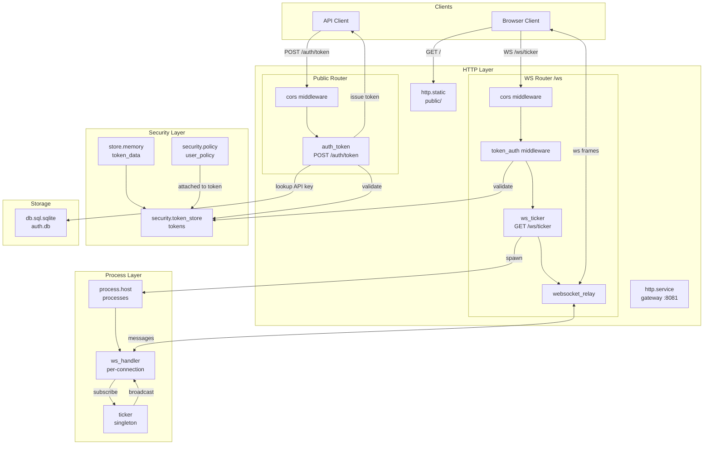

# Krypto-Ticker

Bauen Sie eine Streaming-Ticker-Demo mit API-Key-Authentifizierung und WebSocket-Auslieferung. Das Beispiel behandelt Token-basierte Sicherheit, Middleware-Konfiguration und die Verarbeitung von Verbindungen durch Prozesse.

**Klassifizierung:** Lokal ausführbares Tutorial. Es enthält Registry, Lua-Quelldateien,
Browser-Client, geordnete Startbefehle und eine Browser-Prüfung. Seine großzügigen
Policies und der In-Memory-Token-Store sind bewusst auf eine Loopback-Demo begrenzt.

## Überblick

- **API-Schlüssel-Austausch** — POST eines API-Schlüssels liefert ein HMAC-signiertes Bearer-Token
- **Token-Middleware** — Validiert einen Bearer-Token und stellt dessen Sicherheitskontext wieder her; der Endpunkt weist Anfragen ohne Actor zurück
- **WebSocket-Fan-Out** — Ein Ticker-Prozess sendet an viele Verbindungs-Handler
- **Statische Assets** — `http.static` liefert den Browser-Client aus
- **Speicher** — Bewahrt API-Keys in SQLite und Token-Daten im Arbeitsspeicher auf

## Voraussetzungen

- Wippy-Runtime `v0.3.32a`.
- Ein Browser mit WebSocket-Unterstützung.
- Ein leeres Arbeitsverzeichnis. Erstellen Sie die Projektverzeichnisse, bevor Sie
  die folgenden Dateien hinzufügen:

  ```bash
  mkdir auth-ticker
  cd auth-ticker
  mkdir -p src/public data
  ```

  In PowerShell:

  ```powershell
  New-Item -ItemType Directory -Path auth-ticker\src\public -Force
  New-Item -ItemType Directory -Path auth-ticker\data -Force
  Set-Location auth-ticker
  ```

## Projektstruktur

```
auth-ticker/
├── data/
├── wippy.lock
└── src/
    ├── _index.yaml
    ├── auth_token.lua
    ├── ws_ticker.lua
    ├── ws_handler.lua
    ├── ticker.lua
    ├── migrate.lua
    └── public/
        └── index.html
```

## Architektur


```mermaid
flowchart TB
    subgraph Clients
        Browser[Browser Client]
        API[API Client]
    end

    subgraph "HTTP Layer"
        Server[http.service<br/>gateway :8081]
        Static[http.static<br/>public/]

        subgraph "Public Router"
            CORS1[cors middleware]
            AuthEndpoint[auth_token<br/>POST /auth/token]
        end

        subgraph "WS Router /ws"
            CORS2[cors middleware]
            TokenAuth[token_auth middleware]
            WSEndpoint[ws_ticker<br/>GET /ws/ticker]
            WSRelay[websocket_relay]
        end
    end

    subgraph "Security Layer"
        TokenStore[security.token_store<br/>tokens]
        Policy[security.policy<br/>user_policy]
        MemStore[store.memory<br/>token_data]
    end

    subgraph "Storage"
        DB[db.sql.sqlite<br/>auth.db]
    end

    subgraph "Process Layer"
        Supervisor[process.host<br/>processes]
        WSHandler[ws_handler<br/>per-connection]
        Ticker[ticker<br/>singleton]
    end

    %% Client connections
    Browser -->|"GET /"| Static
    API -->|"POST /auth/token"| CORS1
    Browser -->|"WS /ws/ticker"| CORS2

    %% API flow
    CORS1 --> AuthEndpoint
    AuthEndpoint -->|validate| TokenStore
    AuthEndpoint -->|"issue token"| API

    %% WS flow
    CORS2 --> TokenAuth
    TokenAuth -->|validate| TokenStore
    TokenAuth --> WSEndpoint
    WSEndpoint -->|spawn| Supervisor
    Supervisor --> WSHandler
    WSEndpoint --> WSRelay
    WSRelay <-->|"messages"| WSHandler

    %% Token store deps
    MemStore --> TokenStore
    Policy -->|attached to token| TokenStore

    %% Auth uses DB for API keys
    AuthEndpoint -->|lookup API key| DB

    %% Process communication
    WSHandler -->|subscribe| Ticker
    Ticker -->|broadcast| WSHandler
    WSRelay <-->|"ws frames"| Browser

```

## Sicherheits-Flow

1. **API-Schlüssel-Austausch**: Client sendet API-Schlüssel per POST an `/auth/token`. Handler validiert gegen Datenbank, erstellt einen Actor mit der `user_policy` und stellt einen HMAC-signierten Token aus.

2. **Token-Authentifizierung**: WebSocket-Verbindungen durchlaufen `token_auth` Middleware, die den Bearer-Token validiert und den Sicherheitskontext (Actor + Policies) wiederherstellt.

3. **Prozess-Spawning**: Der WebSocket-Endpunkt startet einen Handler-Prozess. Da der Token die `user_policy` enthält, ist der Spawn autorisiert.

4. **Message-Routing**: Die `websocket_relay` Middleware routet WebSocket-Frames an den Handler-Prozess als Nachrichten.

## Konfiguration

Erstellen Sie `src/_index.yaml`:

```yaml
version: "1.0"
namespace: app

entries:
  # Database for API keys
  - name: db
    kind: db.sql.sqlite
    file: "./data/auth.db"
    lifecycle:
      auto_start: true

  # Token backing store
  - name: token_data
    kind: store.memory
    lifecycle:
      auto_start: true

  # Token store with HMAC signing
  - name: tokens
    kind: security.token_store
    store: app:token_data
    token_length: 32
    default_expiration: "1h"
    token_key: "local-demo-signing-key-do-not-deploy"

  # Security policy for authenticated users
  - name: user_policy
    kind: security.policy
    policy:
      actions: "*"
      resources: "*"
      effect: allow
    groups:
      - user

  # Capabilities for trusted background services
  - name: service_policy
    kind: security.policy
    policy:
      actions: "*"
      resources: "*"
      effect: allow

  # Capabilities for the public token-exchange handler
  - name: token_issuer_policy
    kind: security.policy
    policy:
      actions:
        - db.get
        - security.actor.create
        - security.policy.get
        - security.scope.create
        - security.token_store.get
        - security.token.create
      resources: "*"
      effect: allow

  # Process host
  - name: processes
    kind: process.host
    lifecycle:
      auto_start: true

  # Terminal host used by `wippy run -x app:migrate`
  - name: terminal
    kind: terminal.host
    lifecycle:
      auto_start: true

  # Database migration
  - name: migrate
    kind: process.lua
    source: file://migrate.lua
    method: main
    modules: [sql, logger, crypto]
    security:
      actor:
        id: app:migrate
      policies:
        - app:service_policy

  # Ticker broadcaster
  - name: ticker
    kind: process.lua
    source: file://ticker.lua
    method: main
    modules: [logger, time, json, crypto]
    security:
      actor:
        id: app:ticker
      policies:
        - app:service_policy

  - name: ticker-service
    kind: process.service
    process: app:ticker
    host: app:processes
    lifecycle:
      auto_start: true

  # WebSocket handler (spawned per connection)
  - name: ws_handler
    kind: process.lua
    source: file://ws_handler.lua
    method: main
    modules: [logger, json]

  # HTTP server
  - name: gateway
    kind: http.service
    addr: "127.0.0.1:8081"
    lifecycle:
      auto_start: true
      requires:
        - app:ticker-service

  # Public router (no auth)
  - name: public_router
    kind: http.router
    meta:
      server: app:gateway
    middleware:
      - cors
    options:
      cors.allow.origins: "http://127.0.0.1:8081"

  # WebSocket router (with auth)
  - name: ws_router
    kind: http.router
    meta:
      server: app:gateway
    prefix: /ws
    middleware:
      - cors
      - token_auth
    options:
      cors.allow.origins: "http://127.0.0.1:8081"
      token_auth.store: "app:tokens"
    post_middleware:
      - websocket_relay
    post_options:
      wsrelay.allowed.origins: "http://127.0.0.1:8081"

  # Static files
  - name: public_fs
    kind: fs.directory
    directory: ./src/public

  - name: static
    kind: http.static
    meta:
      server: app:gateway
    path: /
    fs: app:public_fs
    static_options:
      spa: true
      index: index.html

  # Auth token exchange
  - name: auth_token
    kind: function.lua
    source: file://auth_token.lua
    method: handler
    modules: [http, sql, crypto, security, json]
    security:
      actor:
        id: app:token-issuer
      policies:
        - app:token_issuer_policy

  - name: auth_token.endpoint
    kind: http.endpoint
    meta:
      router: app:public_router
    method: POST
    path: /auth/token
    func: app:auth_token

  # WebSocket ticker endpoint
  - name: ws_ticker
    kind: function.lua
    source: file://ws_ticker.lua
    method: handler
    modules: [http, json, security, logger]

  - name: ws_ticker.endpoint
    kind: http.endpoint
    meta:
      router: app:ws_router
    method: GET
    path: /ticker
    func: app:ws_ticker
```

Der Signaturschlüssel, die Wildcard-User-Policy, die Speicherung unverarbeiteter
API-Keys und der Memory-Token-Store eignen sich nur für diese Loopback-Demo. Verwenden
Sie in Produktion `token_key_env`, hashen Sie API-Keys vor dem Speichern, begrenzen
Sie Policy-Aktionen und -Ressourcen, schränken Sie zulässige Origins ein und verwenden
Sie einen dauerhaften Token-Store. Siehe [Umgebungssystem](system/env.md).

## Token-Austausch

`auth_token.lua` - validiert API-Schlüssel und stellt HMAC-signierte Token aus:

```lua
local http = require("http")
local sql = require("sql")
local security = require("security")

local function handler()
    local req = http.request()
    local res = http.response()

    local body, parse_err = req:body_json()
    if parse_err then
        res:set_status(http.STATUS.BAD_REQUEST)
        res:write_json({error = "invalid JSON"})
        return
    end

    local api_key = body.api_key
    if not api_key or #api_key == 0 then
        res:set_status(http.STATUS.BAD_REQUEST)
        res:write_json({error = "api_key required"})
        return
    end

    local db, db_err = sql.get("app:db")
    if db_err then
        res:set_status(http.STATUS.INTERNAL_ERROR)
        res:write_json({error = "database unavailable"})
        return
    end

    local rows, query_err = db:query(
        "SELECT user_id, role FROM api_keys WHERE api_key = ?",
        {api_key}
    )
    db:release()

    if query_err then
        res:set_status(http.STATUS.INTERNAL_ERROR)
        res:write_json({error = "lookup failed"})
        return
    end
    if #rows == 0 then
        res:set_status(http.STATUS.UNAUTHORIZED)
        res:write_json({error = "invalid API key"})
        return
    end

    local user = rows[1]

    -- Create actor with user identity
    local actor = security.new_actor("user:" .. user.user_id, {
        role = user.role,
        user_id = user.user_id
    })

    -- Attach user_policy to the scope
    local policy, _ = security.policy("app:user_policy")
    local scope = policy and security.new_scope({policy}) or security.new_scope()

    -- Issue HMAC-signed token
    local store, store_err = security.token_store("app:tokens")
    if store_err then
        res:set_status(http.STATUS.INTERNAL_ERROR)
        res:write_json({error = "token store unavailable"})
        return
    end

    local token, token_err = store:create(actor, scope, {
        expiration = "1h",
        meta = {ip = req:remote_addr()}
    })
    store:close()

    if token_err then
        res:set_status(http.STATUS.INTERNAL_ERROR)
        res:write_json({error = "token creation failed"})
        return
    end

    res:write_json({
        token = token,
        user_id = user.user_id,
        role = user.role,
        expires_in = 3600
    })
end

return { handler = handler }
```

## WebSocket-Endpunkt

`ws_ticker.lua` - startet einen Handler-Prozess für jede authentifizierte Verbindung:

```lua
local http = require("http")
local json = require("json")
local security = require("security")
local logger = require("logger")

local function handler()
    local req = http.request()
    local res = http.response()

    if req:method() ~= http.METHOD.GET then
        res:set_status(http.STATUS.METHOD_NOT_ALLOWED)
        res:write_json({error = "method not allowed"})
        return
    end

    -- Actor is set by token_auth middleware
    local actor = security.actor()
    if not actor then
        res:set_status(http.STATUS.UNAUTHORIZED)
        res:write_json({error = "authentication required"})
        return
    end

    local user_id = actor:id()

    -- Spawn handler process (authorized by user_policy in token)
    local pid, err = process.spawn("app:ws_handler", "app:processes", user_id)
    if err then
        logger:error("spawn failed", {error = tostring(err)})
        res:set_status(http.STATUS.INTERNAL_ERROR)
        res:write_json({error = "failed to create handler"})
        return
    end

    -- Configure websocket_relay to route messages to handler
    res:set_header("X-WS-Relay", json.encode({
        target_pid = tostring(pid),
        metadata = {user_id = user_id, auth_time = os.time()}
    }))
end

return { handler = handler }
```

## Verbindungs-Handler

Die Middleware `websocket_relay` sendet Lifecycle-Nachrichten an den Handler-Prozess:

- `ws.join` — Verbindung hergestellt; enthält `client_pid` für Antworten
- `ws.message` — Der Client hat eine Nachricht gesendet
- `ws.leave` — Verbindung geschlossen; enthält dieselbe `client_pid` und dieselben Metadaten wie `ws.join`

`ws_handler.lua` - behandelt diese Lebenszyklus-Nachrichten:

```lua
local logger = require("logger")
local json = require("json")

local function main(user_id)
    local inbox = process.inbox()
    local client_pid = nil
    local subscribed = false

    logger:info("handler started", {user_id = user_id})

    while true do
        local msg, ok = inbox:receive()
        if not ok then break end

        local topic = msg:topic()
        local data = msg:payload():data()

        if topic == "ws.join" then
            client_pid = data.client_pid

            -- Subscribe with our PID for crash monitoring
            local _, subscribe_err = process.send("ticker", "subscribe", {
                client_pid = client_pid,
                handler_pid = process.pid()
            })
            if subscribe_err then
                error("failed to subscribe to ticker: " .. tostring(subscribe_err))
            end
            subscribed = true

            -- Send welcome
            process.send(client_pid, "ws.send", {
                type = "text",
                data = json.encode({type = "welcome", user_id = user_id})
            })

            logger:info("client joined", {user_id = user_id, client_pid = client_pid})

        elseif topic == "ws.message" then
            -- Text WebSocket frames arrive as string payloads.
            local content = json.decode(data)
            if content and content.type == "ping" then
                process.send(client_pid, "ws.send", {
                    type = "text",
                    data = json.encode({type = "pong"})
                })
            end

        elseif topic == "ws.leave" then
            -- Relay sends this automatically on disconnect
            logger:info("client left", {user_id = user_id, client_pid = data.client_pid})
            if subscribed then
                process.send("ticker", "unsubscribe", {handler_pid = process.pid()})
            end
            break
        end
    end

    return 0
end

return { main = main }
```

## Broadcasting

`ticker.lua` verwaltet Subscriptions und sendet lokal simulierte Preisaktualisierungen;
das Tutorial ruft keinen externen Marktdatenservice auf:

```lua
local logger = require("logger")
local time = require("time")
local json = require("json")
local crypto = require("crypto")

-- handler_pid -> client_pid mapping
local subscriptions = {}

local prices = {
    ["BTC-USD"] = 42000.00,
    ["ETH-USD"] = 2500.00,
    ["SOL-USD"] = 95.00
}

local function broadcast(message)
    local data = json.encode(message)
    for _, client_pid in pairs(subscriptions) do
        process.send(client_pid, "ws.send", {type = "text", data = data})
    end
end

local function update_prices()
    for symbol, price in pairs(prices) do
        local bytes, random_err = crypto.random.bytes(2)
        if random_err then
            error("failed to generate price movement: " .. tostring(random_err))
        end
        local rand = (bytes:byte(1) * 256 + bytes:byte(2)) / 65535.0
        local factor = (rand - 0.5) * 0.002
        prices[symbol] = price * (1 + factor)
        prices[symbol] = tonumber(string.format("%.2f", prices[symbol]))
    end
end

local function get_updates()
    local updates = {}
    for symbol, price in pairs(prices) do
        table.insert(updates, {symbol = symbol, price = price, timestamp = os.time()})
    end
    return updates
end

local function main()
    local inbox = process.inbox()
    local events = process.events()

    local ticker, ticker_err = time.ticker("1s")
    if ticker_err then
        logger:error("failed to create ticker", {error = tostring(ticker_err)})
        error("failed to create ticker: " .. tostring(ticker_err))
    end
    local tick_ch = ticker:response()

    local _, register_err = process.registry.register("ticker")
    if register_err then
        error("failed to register ticker: " .. tostring(register_err))
    end
    logger:info("ticker started", {pid = process.pid()})

    while true do
        local r = channel.select {
            inbox:case_receive(),
            events:case_receive(),
            tick_ch:case_receive()
        }

        if r.channel == tick_ch then
            update_prices()
            if next(subscriptions) then
                broadcast({type = "ticker", data = get_updates()})
            end

        elseif r.channel == events then
            local event = r.value
            if event.kind == process.event.EXIT then
                -- Handler exited, remove subscription
                if subscriptions[event.from] then
                    logger:info("handler exited", {handler_pid = event.from})
                    subscriptions[event.from] = nil
                end
            end

        else
            local msg = r.value
            local topic = msg:topic()
            local data = msg:payload():data()

            if topic == "subscribe" then
                local handler_pid = data.handler_pid
                local client_pid = data.client_pid

                subscriptions[handler_pid] = client_pid
                process.monitor(handler_pid)

                logger:info("subscribed", {handler_pid = handler_pid, client_pid = client_pid})

                process.send(client_pid, "ws.send", {
                    type = "text",
                    data = json.encode({type = "ticker", data = get_updates()})
                })

            elseif topic == "unsubscribe" then
                subscriptions[data.handler_pid] = nil
                logger:info("unsubscribed", {handler_pid = data.handler_pid})
            end
        end
    end
end

return { main = main }
```

## Datenbank-Migration

`migrate.lua` erstellt die API-Key-Tabelle und erzeugt einen Demo-Key:

```lua
local sql = require("sql")
local logger = require("logger")
local crypto = require("crypto")

local function main()
    local db, err = sql.get("app:db")
    if err then
        logger:error("failed to connect", {error = tostring(err)})
        error("failed to connect: " .. tostring(err))
    end

    local _, exec_err = db:execute([[
        CREATE TABLE IF NOT EXISTS api_keys (
            id INTEGER PRIMARY KEY AUTOINCREMENT,
            api_key TEXT UNIQUE NOT NULL,
            user_id TEXT NOT NULL,
            role TEXT NOT NULL DEFAULT 'user',
            created_at INTEGER NOT NULL
        )
    ]])

    if exec_err then
        db:release()
        logger:error("migration failed", {error = tostring(exec_err)})
        error("migration failed: " .. tostring(exec_err))
    end

    -- Create one random local-demo key. It is printed only on first creation.
    local rows, query_err = db:query(
        "SELECT api_key FROM api_keys WHERE user_id = ?",
        {"demo"}
    )
    if query_err then
        db:release()
        error("failed to query demo API key: " .. tostring(query_err))
    end

    if #rows == 0 then
        local demo_key, key_err = crypto.random.string(32)
        if key_err then
            db:release()
            error("failed to generate demo API key: " .. tostring(key_err))
        end

        local _, insert_err = db:execute(
            "INSERT INTO api_keys (api_key, user_id, role, created_at) VALUES (?, ?, ?, ?)",
            {demo_key, "demo", "user", os.time()}
        )
        if insert_err then
            db:release()
            error("failed to store demo API key: " .. tostring(insert_err))
        end
        logger:info("demo API key created", {api_key = demo_key})
    else
        logger:info("demo API key already exists; use the value saved from its first creation")
    end

    db:release()
    return 0
end

return { main = main }
```

Der unverarbeitete Demo-Key erscheint nur bei seiner ersten Erzeugung im Log. Speichern
Sie ihn für den Browser-Schritt. Wenn Sie ihn verlieren, beenden Sie die Anwendung,
entfernen Sie `data/auth.db` und führen Sie die Migration erneut aus. Fügen Sie keine
Produktionszugangsdaten in diese Demo-Datenbank ein.

## Browser-Client

Erstellen Sie `src/public/index.html`. Der Browser tauscht den API-Key gegen einen
kurzlebigen Token, hält diesen nur im Arbeitsspeicher und sendet ihn über den
Query-Parameter `x-auth-token` der Middleware, da die WebSocket-API des Browsers
keinen `Authorization`-Header setzen kann.

```html
<!doctype html>
<html lang="en">
<head>
  <meta charset="utf-8">
  <meta name="viewport" content="width=device-width, initial-scale=1">
  <title>Wippy Crypto Ticker</title>
</head>
<body>
  <main>
    <h1>Crypto Ticker</h1>
    <form id="connect-form">
      <label for="api-key">Demo API key</label>
      <input id="api-key" name="api-key" autocomplete="off" required>
      <button type="submit">Connect</button>
    </form>
    <p id="status">Disconnected</p>
    <ul id="prices"></ul>
  </main>

  <script>
    const form = document.querySelector('#connect-form');
    const input = document.querySelector('#api-key');
    const status = document.querySelector('#status');
    const prices = document.querySelector('#prices');
    let socket;

    function setStatus(message) {
      status.textContent = message;
    }

    function renderPrices(items) {
      prices.replaceChildren(...items.map((item) => {
        const row = document.createElement('li');
        row.textContent = `${item.symbol}: $${Number(item.price).toFixed(2)}`;
        return row;
      }));
    }

    form.addEventListener('submit', async (event) => {
      event.preventDefault();
      if (socket) socket.close();
      setStatus('Authenticating...');

      try {
        const response = await fetch('/auth/token', {
          method: 'POST',
          headers: {'Content-Type': 'application/json'},
          body: JSON.stringify({api_key: input.value}),
        });
        const result = await response.json();
        if (!response.ok) throw new Error(result.error || `HTTP ${response.status}`);

        const scheme = location.protocol === 'https:' ? 'wss' : 'ws';
        const url = `${scheme}://${location.host}/ws/ticker?x-auth-token=${encodeURIComponent(result.token)}`;
        socket = new WebSocket(url);

        socket.addEventListener('open', () => setStatus(`Connected as ${result.user_id}`));
        socket.addEventListener('close', () => setStatus('Disconnected'));
        socket.addEventListener('error', () => setStatus('WebSocket error'));
        socket.addEventListener('message', (message) => {
          const event = JSON.parse(message.data);
          if (event.type === 'ticker') renderPrices(event.data);
        });
      } catch (error) {
        setStatus(error.message);
      }
    });
  </script>
</body>
</html>
```

Bearer-Tokens in Query-Strings können in Access-Logs und im Browser-Verlauf erscheinen.
Diese Demo verwendet einen einstündigen Token auf Loopback; Browser-Authentifizierung
in Produktion sollte ein sicheres HttpOnly-Cookie oder ein eigens vorgesehenes,
einmalig verwendbares WebSocket-Ticket nutzen.

## Ausführen

Initialisieren Sie die Lock-Datei, führen Sie die Migration vollständig aus und starten
Sie anschließend die langlebigen Services. Durch die Migration als separaten Befehl
kann der Token-Endpunkt nicht mit dem Erstellen der Tabelle konkurrieren.

```bash
wippy init
wippy run -x app:migrate
wippy run
```

Öffnen Sie `http://127.0.0.1:8081` und geben Sie den Demo-API-Key aus dem Migrations-Log
ein. Die Seite sollte `Connected as demo` sowie BTC-, ETH- und SOL-Preise anzeigen,
die einmal pro Sekunde aktualisiert werden.

Sie können den Austausch auch vor dem Öffnen des Browsers prüfen:

```bash
curl -X POST http://127.0.0.1:8081/auth/token \
  -H "Content-Type: application/json" \
  -d '{"api_key":"<demo-key-from-migration>"}'
```

In PowerShell:

```powershell
Invoke-RestMethod -Method Post `
  -Uri http://127.0.0.1:8081/auth/token `
  -ContentType 'application/json' `
  -Body '{"api_key":"<demo-key-from-migration>"}'
```

Eine erfolgreiche Antwort enthält `token`, `user_id: "demo"`, `role: "user"` und
`expires_in: 3600`. Ein ungültiger Key gibt HTTP 401 zurück.

## Fehlerbehebung und Bereinigung

- `no such table: api_keys` bedeutet, dass die Migration übersprungen wurde oder
  fehlgeschlagen ist. Beenden Sie die Runtime und führen Sie erneut
  `wippy run -x app:migrate` aus, bevor Sie sie wieder starten.
- HTTP 401 von `/auth/token` bedeutet, dass der API-Key nicht zur Zeile in
  `data/auth.db` passt. Setzen Sie die Datenbank zurück, wenn der einmal ausgegebene
  Log-Wert verloren ging.
- HTTP 401 oder ein sofortiges Schließen des WebSockets bedeutet meist, dass der
  Query-Parameter entfernt oder der In-Memory-Token-Store durch einen Runtime-Neustart
  zurückgesetzt wurde. Tauschen Sie den API-Key nach jedem Neustart erneut aus.
- Eine Origin-Ablehnung bedeutet, dass die Browser-URL nicht exakt
  `http://127.0.0.1:8081` entspricht; verwenden Sie diese URL oder aktualisieren Sie
  beide Origin-Optionen gemeinsam.
- Beenden Sie die Runtime mit Strg+C. Löschen Sie `data/auth.db`, um den Demo-API-Key zu entfernen.

## Nächste Schritte

- [WebSocket-Relay](http/websocket-relay.md) — Middleware-Konfiguration
- [Sicherheitsmodul](lua/security/security.md) — Actors, Policies und Token-Stores
- [Prozessverwaltung](lua/core/process.md) — Starten von Prozessen und Messaging
