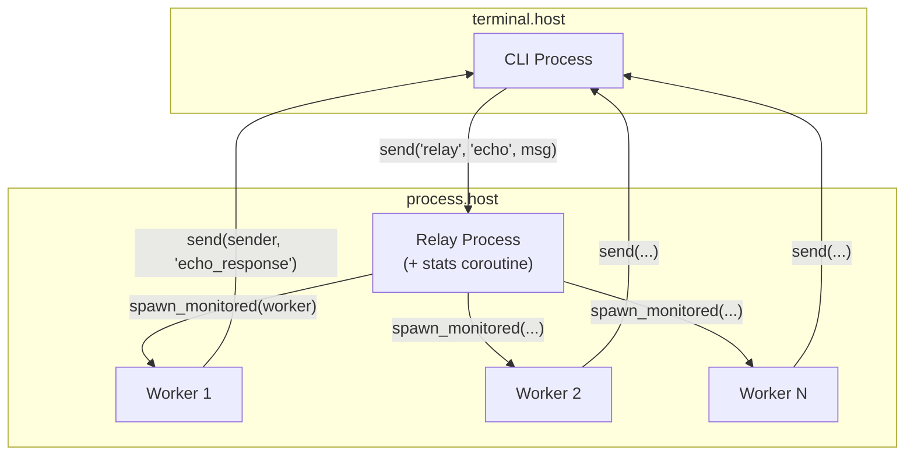

# Echo-Service

Bauen Sie einen CLI-Echo-Service, der mehrere Wippy-Prozesse, Channels, Coroutinen, Message-Passing und Prozessüberwachung verwendet.

**Klassifizierung:** Ausführbares Tutorial. Es enthält die vollständige Registry und
alle Lua-Quelldateien für eine lokale CLI-Anwendung auf einem einzelnen Knoten sowie
Schritte zum Starten und Überprüfen.

## Überblick

Dieses Tutorial erstellt einen CLI-Client, der Nachrichten an einen Relay-Service sendet, der Worker für jede Nachricht startet. Es demonstriert:

- **Prozesse starten** — Unterprozesse dynamisch erstellen
- **Message-Passing** — Mit Send- und Receive-Operationen zwischen Prozessen kommunizieren
- **Channels und Select** — Auf mehrere Ereignisquellen warten
- **Coroutinen** — Nebenläufige Arbeit innerhalb eines Prozesses ausführen
- **Prozessregistrierung** — Prozesse nach Namen finden
- **Monitoring** — Lebenszyklen von Unterprozessen verfolgen

## Voraussetzungen

- Die Wippy-Runtime `v0.3.32a` ist als `wippy` verfügbar. Prüfen Sie dies mit
  `wippy version --short`.
- Ein interaktives Terminal.
- Ein leeres Arbeitsverzeichnis. Erstellen Sie das Projekt und das Quellverzeichnis,
  bevor Sie die folgenden Dateien hinzufügen:

  ```bash
  mkdir echo-service
  cd echo-service
  mkdir src
  ```

## Architektur


```mermaid
flowchart TB
    subgraph terminal["terminal.host"]
        CLI["CLI Process"]
    end

    subgraph processes["process.host"]
        Relay["Relay Process<br/>(+ stats coroutine)"]
        W1["Worker 1"]
        W2["Worker 2"]
        W3["Worker N"]
    end

    CLI -->|"send('relay', 'echo', msg)"| Relay
    Relay -->|"spawn_monitored(worker)"| W1
    Relay -->|"spawn_monitored(...)"| W2
    Relay -->|"spawn_monitored(...)"| W3
    W1 -->|"send(sender, 'echo_response')"| CLI
    W2 -->|"send(...)"| CLI
    W3 -->|"send(...)"| CLI
```

## Projektstruktur

```
echo-service/
├── wippy.lock
└── src/
    ├── _index.yaml
    ├── cli.lua
    ├── relay.lua
    └── worker.lua
```

## Entry-Definitionen

Erstellen Sie `src/_index.yaml`:

```yaml
version: "1.0"
namespace: app

entries:
  # Capabilities used by the CLI, relay, and workers in strict mode
  - name: process-policy
    kind: security.policy
    policy:
      actions:
        - process.host
        - process.registry.register
        - process.send
        - process.spawn
        - process.spawn.monitored
      resources: "*"
      effect: allow

  - name: terminal
    kind: terminal.host
    lifecycle:
      auto_start: true

  - name: processes
    kind: process.host
    lifecycle:
      auto_start: true

  - name: cli
    kind: process.lua
    source: file://cli.lua
    method: main
    modules:
      - io
      - time
    security:
      actor:
        id: app:cli
      policies:
        - app:process-policy

  - name: relay
    kind: process.lua
    source: file://relay.lua
    method: main
    modules:
      - logger
      - time
    security:
      actor:
        id: app:relay
      policies:
        - app:process-policy

  - name: relay-service
    kind: process.service
    process: app:relay
    host: app:processes
    lifecycle:
      auto_start: true

  - name: worker
    kind: process.lua
    source: file://worker.lua
    method: main
    modules:
      - time
    security:
      actor:
        id: app:worker
      policies:
        - app:process-policy
```

## Der Relay-Prozess

Der Relay registriert sich, behandelt Nachrichten, startet Worker und führt eine Stats-Coroutine aus.

Erstellen Sie `src/relay.lua`:

```lua
local logger = require("logger")
local time = require("time")

local stats = {
    messages = 0,
    workers_spawned = 0
}

local function stats_reporter()
    while true do
        time.sleep("5s")
        logger:info("stats", {
            messages = stats.messages,
            workers_spawned = stats.workers_spawned
        })
    end
end

local function main()
    local inbox = process.inbox()
    local events = process.events()

    local _, register_err = process.registry.register("relay")
    if register_err then
        error("cannot register relay: " .. tostring(register_err))
    end
    logger:info("relay started", {pid = process.pid()})

    coroutine.spawn(stats_reporter)

    while true do
        local r = channel.select {
            inbox:case_receive(),
            events:case_receive()
        }

        if r.channel == events then
            local event = r.value
            if event.kind == process.event.EXIT then
                logger:info("worker exited", {
                    from = event.from,
                    result = event.result
                })
            end
        else
            local msg = r.value
            if msg:topic() == "echo" then
                local echo = msg:payload():data()
                stats.messages = stats.messages + 1

                local worker_pid, err = process.spawn_monitored(
                    "app:worker",
                    "app:processes",
                    echo.sender,
                    echo.data
                )

                if err then
                    logger:error("spawn failed", {error = tostring(err)})
                else
                    stats.workers_spawned = stats.workers_spawned + 1
                end
            end
        end
    end
end

return { main = main }
```

### Schlüsselmuster {id="relay-key-patterns"}

**Coroutine-Spawning**

```lua
coroutine.spawn(stats_reporter)
```

Dadurch wird eine Coroutine gestartet, die Speicher mit der Hauptfunktion teilt. Coroutinen yielden bei I/O-Operationen wie `time.sleep`.

**Channel-Select**

```lua
local r = channel.select {
    inbox:case_receive(),
    events:case_receive()
}
```

Dies wartet auf mehrere Channels. `r.channel` identifiziert den ausgewählten Channel, und `r.value` enthält dessen Daten.

**Payload-Extraktion**

```lua
local echo = msg:payload():data()
```

Nachrichten haben `msg:topic()` für den Topic-String und `msg:payload():data()` für die Payload.

**Spawn mit Monitoring**

```lua
local worker_pid, err = process.spawn_monitored("app:worker", "app:processes", ...)
```

Dadurch wird der Worker gestartet und gleichzeitig überwacht. Wenn er beendet wird, empfängt das Relay ein `EXIT`-Event.

## Der Worker-Prozess

Worker erhalten Argumente direkt und senden Antworten an den Sender.

Erstellen Sie `src/worker.lua`:

```lua
local function main(sender_pid, data)
    local response = {
        data = string.upper(data),
        worker = process.pid()
    }

    local _, send_err = process.send(sender_pid, "echo_response", response)
    if send_err then
        error("cannot send echo response: " .. tostring(send_err))
    end

    return 0
end

return { main = main }
```

## Der CLI-Prozess

Das CLI sendet Nachrichten nach registriertem Namen und wartet auf Antworten mit Timeout.

Erstellen Sie `src/cli.lua`:

```lua
local io = require("io")
local time = require("time")

local reset = "\027[0m"
local function dim(s) return "\027[2m" .. s .. reset end
local function green(s) return "\027[32m" .. s .. reset end
local function yellow(s) return "\027[33m" .. s .. reset end
local function cyan(s) return "\027[36m" .. s .. reset end

local function main()
    local inbox = process.inbox()

    -- Wait for relay to register its name
    local deadline = time.after("5s")
    while not process.registry.lookup("relay") do
        local tick = time.after("50ms")
        local r = channel.select { deadline:case_receive(), tick:case_receive() }
        if r.channel == deadline then
            io.print("relay not ready")
            return 1
        end
    end

    io.print(cyan("Echo Client"))
    io.print(dim("Type messages to echo. Ctrl+C to exit.\n"))

    while true do
        local _, write_err = io.write(yellow("> "))
        if write_err then
            io.eprint("cannot write prompt:", write_err)
            return 1
        end

        local _, flush_err = io.flush()
        if flush_err then
            io.eprint("cannot flush prompt:", flush_err)
            return 1
        end

        local input, read_err = io.readline()
        if read_err then
            io.eprint("cannot read input:", read_err)
            return 1
        end

        if not input or #input == 0 then
            break
        end

        local msg = {
            sender = process.pid(),
            data = input
        }
        local _, err = process.send("relay", "echo", msg)
        if err then
            io.print(dim("  error: " .. tostring(err)))
        else
            local timeout = time.after("2s")
            local r = channel.select {
                inbox:case_receive(),
                timeout:case_receive()
            }

            if r.channel == timeout then
                io.print(dim("  timeout"))
            else
                local msg = r.value
                if msg:topic() == "echo_response" then
                    local resp = msg:payload():data()
                    io.print(green("  " .. resp.data))
                    io.print(dim("  from worker: " .. resp.worker))
                end
            end
        end
    end

    io.print("\nGoodbye!")
    return 0
end

return { main = main }
```

### Schlüsselmuster {id="cli-key-patterns"}

**Nach Namen senden**

```lua
process.send("relay", "echo", msg)
```

`process.send` akzeptiert einen registrierten Namen als Ziel und gibt einen Fehler zurück, wenn dieser Name nicht aufgelöst werden kann.

**Timeout-Muster**

```lua
local timeout = time.after("2s")
local r = channel.select {
    inbox:case_receive(),
    timeout:case_receive()
}
if r.channel == timeout then
    -- timed out
end
```

## Ausführen

```bash
wippy init
wippy run -x app:cli
```

Beispielausgabe:

```
Echo Client
Type messages to echo. Ctrl+C to exit.

> hello world
  HELLO WORLD
  from worker: {app:processes|0x00004}
```

Die Worker-PID wird zur Laufzeit erzeugt und fällt daher anders aus. Geben Sie mehrere
Zeilen ein und prüfen Sie, dass jede Antwort in Großbuchstaben erscheint. Senden Sie
eine leere Zeile, um das Programm sauber zu beenden.

## Fehlerbehebung und Bereinigung

- `relay not ready` bedeutet, dass sich das automatisch gestartete Relay nicht
  innerhalb von fünf Sekunden registriert hat. Prüfen Sie das Runtime-Log auf einen
  Start-, Policy- oder Registry-Fehler des Relays.
- `not allowed to spawn` oder `not allowed to send` bedeutet, dass den Prozesseinträgen
  der oben gezeigte Sicherheitskontext `app:process-policy` fehlt.
- `no terminal host found` bedeutet, dass der Eintrag `terminal.host` fehlt. Wenn
  das Projekt mehrere Terminal Hosts hat, ergänzen Sie den Run-Befehl um `--host app:terminal`.
- Ein Timeout nach dem Senden bedeutet, dass der Worker keine Antwort zurückgegeben
  hat. Prüfen Sie das Relay-Log auf einen Spawn-Fehler und stellen Sie sicher, dass
  `app:worker` und `app:processes` den Eintragsnamen entsprechen.
- Senden Sie eine leere Zeile, um die CLI zu verlassen. Drücken Sie Strg+C, wenn die
  Runtime weiterläuft; löschen Sie anschließend `echo-service/`, wenn es nur eine
  vorübergehende Übung war.

## Nächste Schritte

- [Prozessverwaltung](../lua/core/process.md) — Referenz der Prozess-API
- [Channels](../lua/core/channel.md) — Referenz der Channel-API
- [Zeit und Dauer](../lua/core/time.md) — Referenz der Zeit-API
