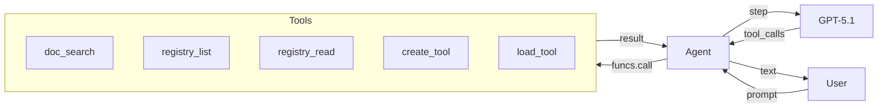
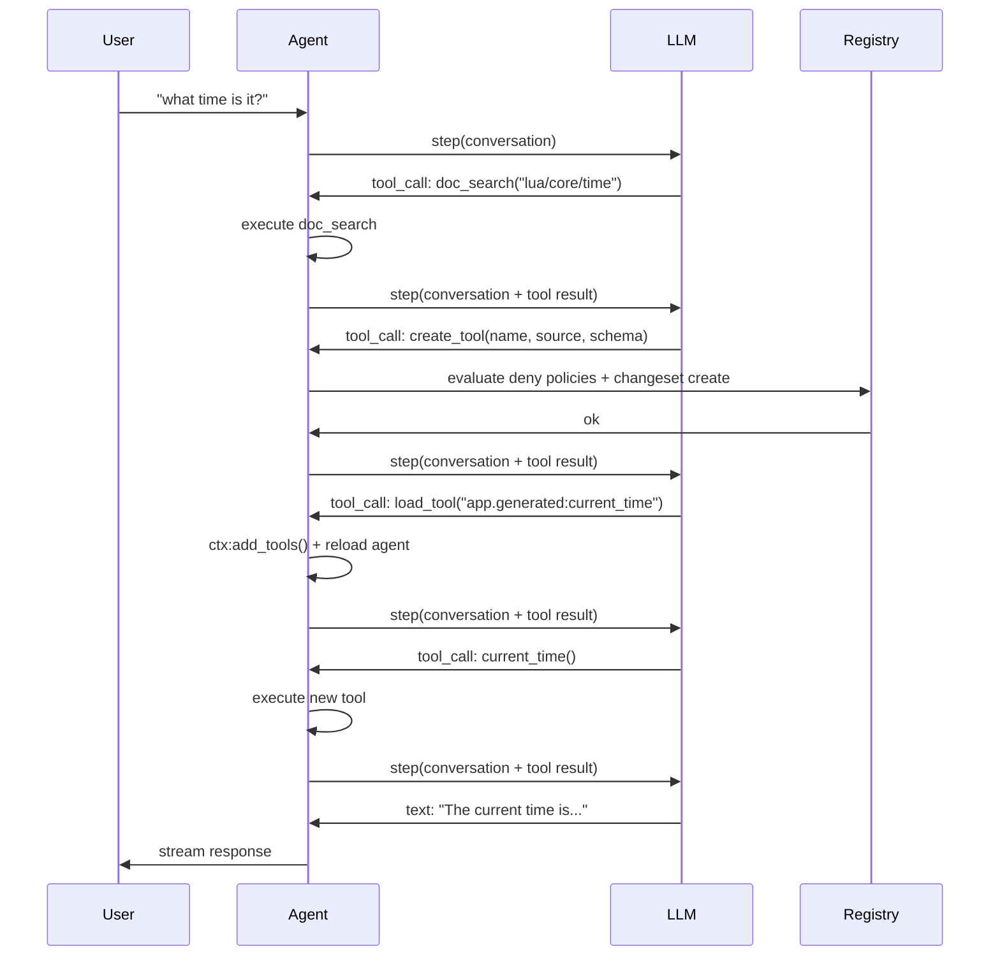
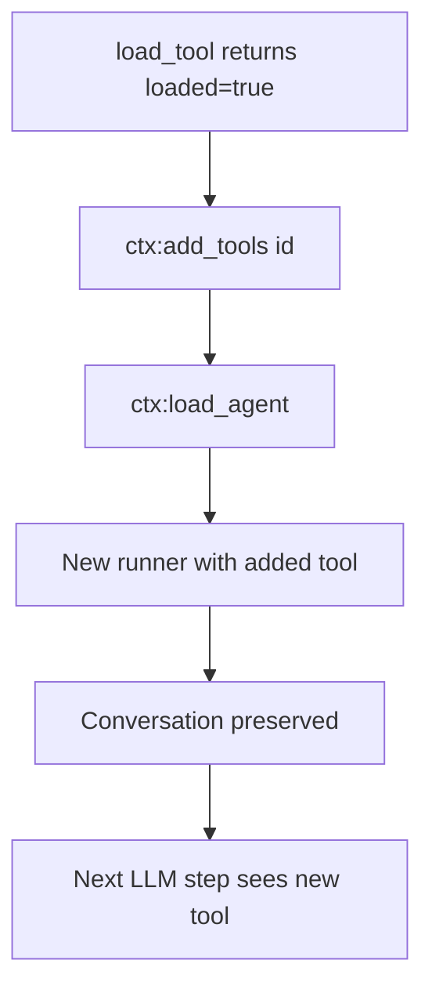
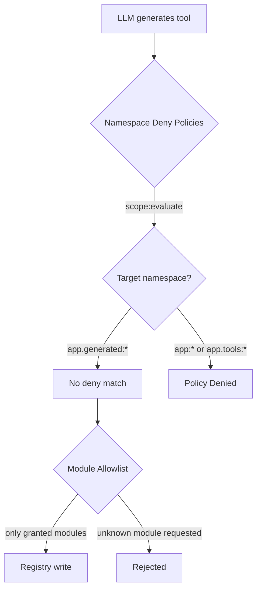

# Micro AGI

Erstelle einen sich selbst modifizierenden Agenten, der seine eigenen Tools zur Laufzeit erstellt — Dokumentation lesen, Lua schreiben, Einträge in der Registry registrieren und sie in die aktive Sitzung laden.

## Was wir bauen

Ein Terminal-Agent, der:
- Fragen mit einem LLM und Streaming beantwortet
- Wippy-Dokumentation durchsucht, um APIs zu lernen
- Die Registry inspiziert, um vorhandene Funktionen zu entdecken
- Bei fehlenden Funktionen neue Tools spontan erstellt
- Sein eigenes Kontextfenster über Komprimierung verwaltet



## Architektur

Der Agent läuft als Wippy-Prozess mit Zugriff auf die Registry. Wenn das LLM entscheidet, dass es eine Funktion benötigt, die es nicht hat, verwendet es die Selbstmodifikations-Schleife:



Die zentrale Erkenntnis: Tools sind Registry-Einträge. Ein Tool zu erstellen bedeutet einfach, einen `function.lua`-Eintrag mit Inline-Lua-Quellcode in `data.source` zu schreiben. Die Agent-Laufzeit kompiliert und lädt ihn wie jeden anderen Eintrag.

## Projektstruktur

```
micro-agi/
├── .wippy.yaml
├── wippy.yaml
└── src/
    ├── _index.yaml
    ├── README.md
    ├── agent.lua
    └── tools/
        ├── _index.yaml
        ├── doc_search.lua
        ├── registry_list.lua
        ├── registry_read.lua
        ├── create_tool.lua
        └── load_tool.lua
```

## Infrastruktur

Erstelle `.wippy.yaml`:

```yaml
version: "1.0"

logger:
  encoding: console
```

## Eintragsdefinitionen

Erstelle `src/_index.yaml` mit Infrastruktur, Sicherheitsrichtlinien, Modellen, Agent und Prozess:

```yaml
version: "1.0"
namespace: app

entries:
  - name: definition
    kind: ns.definition
    readme: file://README.md
    meta:
      title: Micro AGI
      description: Self-modifying development agent that builds its own tools at runtime
      depends_on: [wippy/llm, wippy/agent]

  - name: os_env
    kind: env.storage.os

  - name: processes
    kind: process.host
    lifecycle:
      auto_start: true

  - name: __dep.llm
    kind: ns.dependency
    component: wippy/llm
    version: "*"
    parameters:
      - name: env_storage
        value: app:os_env
      - name: process_host
        value: app:processes

  - name: __dep.agent
    kind: ns.dependency
    component: wippy/agent
    version: "*"
    parameters:
      - name: process_host
        value: app:processes
```

### Sicherheitsrichtlinien

Zwei `security.policy`-Einträge schränken ein, in welche Namespaces der Agent schreiben darf:

```yaml
  - name: deny_core_ns
    kind: security.policy
    policy:
      actions: "*"
      resources: "app:*"
      effect: deny
    groups:
      - agent_security

  - name: deny_tools_ns
    kind: security.policy
    policy:
      actions: "*"
      resources: "app.tools:*"
      effect: deny
    groups:
      - agent_security
```

Diese Richtlinien werden als benannter Scope (`app:agent_security`) durch `create_tool` geladen und vor jedem Registry-Schreibvorgang ausgewertet. Der Agent kann in `app.generated:*` schreiben (keine Deny-Richtlinie passt), aber nicht in `app:*` (Kerneinträge, Modelle, Agentendefinition) oder `app.tools:*` (eingebaute Tools).

Siehe [Sicherheitsmodell](system/security.md) für Details zur Richtlinien-Auswertung.

### Modelle

Zwei Modelle dienen unterschiedlichen Zwecken:

```yaml
  - name: gpt-5.1
    kind: registry.entry
    meta:
      name: gpt-5.1
      type: llm.model
      title: GPT-5.1
      comment: Reasoning model
      capabilities: [generate, tool_use, structured_output, vision, thinking]
      class: [reasoning]
      priority: 210
    max_tokens: 128000
    output_tokens: 32768
    pricing:
      input: 2.5
      output: 10
    providers:
      - id: wippy.llm.openai:provider
        options:
          reasoning_model_request: true
        provider_model: gpt-5.1
    thinking_effort: 10

  - name: gpt-4.1-nano
    kind: registry.entry
    meta:
      name: gpt-4.1-nano
      type: llm.model
      title: GPT-4.1 Nano
      comment: Compression model
      capabilities: [generate, tool_use, structured_output]
      class: [fast]
      priority: 100
    max_tokens: 1047576
    output_tokens: 32768
    pricing:
      input: 0.1
      output: 0.4
    providers:
      - id: wippy.llm.openai:provider
        provider_model: gpt-4.1-nano
```

GPT-5.1 übernimmt Reasoning und Tool-Nutzung. GPT-4.1 Nano übernimmt die Kontextkomprimierung zu 25-fach niedrigeren Kosten.

### Agentendefinition

```yaml
  - name: dev_assistant
    kind: registry.entry
    meta:
      type: agent.gen1
      name: dev_assistant
      title: Dev Assistant
      comment: Wippy development assistant
    prompt: |
      Self-modifying Wippy development agent. You run inside Wippy runtime
      with access to docs, registry, and dynamic tool creation.

      Rules:
      - NEVER fabricate, guess, or hallucinate facts. If you need real data,
        use or build a tool to get it. Only state what a tool actually returned.
      - Maximum 2-3 sentences per response. No bullet lists. No disclaimers.
      - Never say "I can't" or "I don't have". Build the tool and do it.
      - Act first, explain only if asked.

      To gain new capabilities: doc_search the API, create_tool with Lua source,
      load_tool, call it. All in one turn.
    model: gpt-5.1
    max_tokens: 2048
    tools:
      - "app.tools:*"
```

Der Prompt ist absichtlich knapp gehalten. Wichtige Regeln:
- **Keine Halluzinationen** — der Agent muss Tools für echte Daten verwenden
- **Selbstmodifikation** — Tools bauen statt abzulehnen
- **Aktion vor Erklärung** — zuerst handeln, nur auf Nachfrage erklären

### Prozess

```yaml
  - name: agent
    kind: process.lua
    meta:
      command:
        name: agent
        short: Start dev assistant
    source: file://agent.lua
    method: main
    modules: [io, json, process, funcs, registry, time, security]
    imports:
      prompt: wippy.llm:prompt
      agent_context: wippy.agent:context
      compress: wippy.llm.util:compress
```

Der Prozess läuft als Terminalbefehl. Die Sicherheitsdurchsetzung erfolgt innerhalb von `create_tool`, das die Richtliniengruppe `agent_security` lädt und vor dem Schreiben auswertet.

Imports:
- `prompt` — Konversations-Builder
- `agent_context` — Agent-Loading und dynamische Tool-Verwaltung
- `compress` — LLM-basierte Textkomprimierung für Kontextverwaltung

## Tools

Erstelle `src/tools/_index.yaml` mit fünf Tools:

### doc_search

Lädt Wippy-Dokumentation über die `wippy.ai/llm`-API. Unterstützt zwei Modi: eine Seite per Pfad abrufen oder per Query suchen.

```lua
local http_client = require("http_client")
local json = require("json")

local BASE_URL = "https://wippy.ai/llm"
local MAX_CHARS = 8000

local function fetch_page(path)
    local url = BASE_URL .. "/path/en/" .. path
    local resp, err = http_client.get(url, {
        headers = { ["User-Agent"] = "wippy-agent/1.0" },
    })
    if err then
        return nil, tostring(err)
    end
    if resp.status_code ~= 200 then
        return nil, "HTTP " .. resp.status_code
    end

    local body = resp.body or ""
    if #body > MAX_CHARS then
        body = body:sub(1, MAX_CHARS) .. "\n... (truncated)"
    end
    return body, nil
end

local function search_docs(query)
    local url = BASE_URL .. "/search?q=" .. query
    local resp, err = http_client.get(url, {
        headers = { ["User-Agent"] = "wippy-agent/1.0" },
    })
    if err then
        return { error = tostring(err) }
    end
    if resp.status_code ~= 200 then
        return { error = "HTTP " .. resp.status_code }
    end

    local body = resp.body or ""
    if #body > MAX_CHARS then
        body = body:sub(1, MAX_CHARS) .. "\n... (truncated)"
    end

    return { results = body }
end

local function handler(input)
    if input.path then
        local content, err = fetch_page(input.path)
        if err then
            return { error = err }
        end
        return { path = input.path, content = content }
    end

    if input.query then
        return search_docs(input.query)
    end

    return { error = "provide either 'path' or 'query'" }
end

return { handler = handler }
```

### create_tool

Der Kern der Selbstmodifikation. Wertet Namespace-Deny-Richtlinien aus und erstellt einen `function.lua`-Eintrag in der Registry mit Inline-Lua-Quellcode.

Das Feld `modules` am erzeugten Eintrag steuert, worauf das Tool zugreifen kann. Nicht aufgeführte Module existieren für diesen Eintrag schlicht nicht — es gibt nichts zu blockieren oder zu scannen.

```lua
local registry = require("registry")
local json = require("json")
local security = require("security")

local NAMESPACE = "app.generated"
local MAX_SOURCE_LEN = 16000
local MAX_NAME_LEN = 64

local ALLOWED_MODULES = {
    time = true, json = true, http_client = true, expr = true,
    text = true, base64 = true, yaml = true, crypto = true,
    hash = true, uuid = true, url = true,
}
```

**Richtlinien-Auswertung** — `create_tool` lädt den benannten Scope `agent_security` und wertet die Deny-Richtlinien gegen die Ziel-Eintrags-ID aus. Schreibvorgänge auf `app:*` oder `app.tools:*` werden verweigert; Schreibvorgänge auf `app.generated:*` passieren (keine passende Deny-Richtlinie):

```lua
local actor = security.new_actor("service:agent", { role = "agent" })
local scope, scope_err = security.named_scope("app:agent_security")
if scope_err then
    return { error = "failed to load security scope: " .. tostring(scope_err) }
end

local result = scope:evaluate(actor, action, id)
if result == "deny" then
    return { error = "policy denied: " .. action .. " on " .. id }
end
```

**Registry-Schreibvorgang** — der Eintrag wird mit Quellcode in `data.source` und nur den erlaubten Modulen geschrieben:

```lua
local entry = {
    id = id,
    kind = "function.lua",
    meta = {
        type = "tool",
        title = input.name,
        comment = input.description,
        input_schema = schema,
        llm_alias = input.name,
        llm_description = input.description,
    },
    data = {
        source = input.source,
        modules = modules,
        method = "handler",
    },
}

local snap = registry.snapshot()
local changes = snap:changes()
if existing then
    changes:update(entry)
else
    changes:create(entry)
end
changes:apply()
```

Keine Dateien auf der Festplatte. Das Tool lebt vollständig in der Registry.

### load_tool

Validiert, dass der Eintrag ein Tool ist, und signalisiert der Agentenschleife, neu zu laden:

```lua
local function handler(input)
    local entry, err = registry.get(input.id)
    if err then
        return { error = tostring(err) }
    end
    if not entry then
        return { error = "not found: " .. input.id }
    end
    if not entry.meta or entry.meta.type ~= "tool" then
        return { error = "not a tool (meta.type != 'tool'): " .. input.id }
    end

    return {
        loaded = true,
        id = entry.id,
        alias = entry.meta.llm_alias or input.id,
        description = entry.meta.llm_description or "",
    }
end
```

Die Agentenschleife erkennt `loaded = true` im Ergebnis und ruft `ctx:add_tools(id)` gefolgt von `ctx:load_agent()` auf, um den Agenten mit dem neuen Tool neu zu kompilieren.

## Agentenschleife

Die Agentenschleife in `src/agent.lua` behandelt Streaming, Tool-Ausführung, dynamisches Laden und Kontextkomprimierung.

### Streaming

Verwendet dasselbe Coroutine + Channel-Muster aus dem [LLM-Agent-Tutorial](tutorials/llm-agent.md):

```lua
coroutine.spawn(function()
    local response, err = session.runner:step(session.conversation, {
        stream_target = {
            reply_to = process.pid(),
            topic = STREAM_TOPIC,
        },
    })
    done_ch:send({ response = response, err = err })
end)
```

### Tool-Ausführung

Tools werden zur Sicherheit über `funcs.call()` mit `pcall` aufgerufen:

```lua
local ok, result = pcall(funcs.call, tc.registry_id, args)
```

### Dynamisches Tool-Laden

Wenn `load_tool` `loaded = true` zurückgibt, lädt der Agent sich selbst neu:



```lua
local function handle_tool_loading(tool_calls, results)
    local reload_needed = false
    for _, tc in ipairs(tool_calls) do
        if tc.name == "load_tool" then
            local result = results[tc.id]
            if result and result.loaded then
                session.ctx:add_tools(result.id)
                reload_needed = true
            end
        end
    end
    if reload_needed then
        reload_agent()
    end
end
```

Die Konversation bleibt über Reloads hinweg erhalten, weil sie im Prompt-Builder lebt, nicht im Runner.

### Kontextkomprimierung

Wenn die Prompt-Tokens 96K überschreiten (75% des 128K-Kontextfensters), wird die Konversation mit GPT-4.1 Nano komprimiert:

```lua
if response.tokens and response.tokens.prompt_tokens
    and response.tokens.prompt_tokens > PROMPT_TOKEN_LIMIT then
    try_compress()
end
```

Die Komprimierung extrahiert Nachrichteninhalte, ruft `compress.to_size()` mit Ziel von 4000 Zeichen auf und ersetzt die Konversation durch eine Zusammenfassung:

```lua
local summary = compress.to_size(COMPRESS_MODEL, full_text, COMPRESS_TARGET)
session.conversation = prompt.new()
session.conversation:add_system("Conversation summary:\n\n" .. summary)
```

## Sicherheitsmodell

Der Agent wird durch Namespace-Deny-Richtlinien und Zugriffskontrolle auf Modulebene abgesichert.



### Namespace-Deny-Richtlinien

| Richtlinie | Ressourcen | Effekt |
|--------|-----------|--------|
| `deny_core_ns` | `app:*` | deny |
| `deny_tools_ns` | `app.tools:*` | deny |

`create_tool` lädt die Richtliniengruppe `agent_security` und wertet sie gegen die Ziel-Eintrags-ID aus. Da Deny-Richtlinien nur auf `app:*` und `app.tools:*` zutreffen, gehen Schreibvorgänge auf `app.generated:*` durch (das Ergebnis ist `undefined`, was „nicht verweigert" bedeutet).

Dies verhindert, dass der Agent:
- Den eigenen Prompt oder die Agentendefinition ändert (`app:dev_assistant`)
- Seine eingebauten Tools überschreibt (`app.tools:*`)
- Infrastruktureinträge ändert (`app:processes` etc.)

### Zugriffskontrolle für Module

Generierte Tools deklarieren ihre `modules` in `data.modules`. Nur Module aus der Menge `ALLOWED_MODULES` sind erlaubt. Die Wippy-Laufzeit setzt dies auf Modulebene durch — wenn ein Modul nicht am Eintrag gelistet ist, gibt `require()` einen Fehler zurück. Es gibt kein Source-Code-Scanning, weil es nichts zu scannen gibt: nicht gewährte Module existieren im Ausführungskontext nicht.

## Ausführen

Direkt aus dem Hub ausführen:

```bash
wippy run wippy/micro-agi agent
```

Oder klonen und lokal ausführen:

```bash
cd micro-agi
wippy init && wippy update
wippy run agent
```

```
dev assistant (quit to exit)

> what time is it?
  [doc_search] ok
  [create_tool] ok
  [load_tool] ok
  [+] app.generated:current_time_utc
  [current_time_utc] ok
The current UTC time is 2026-02-13T03:13:41Z.

> fetch https://httpbin.org/get and show my ip
  [create_tool] ok
  [load_tool] ok
  [+] app.generated:http_get
  [http_get] ok
Your IP is 203.0.113.42.
```

## Nächste Schritte

- [LLM-Agent](tutorials/llm-agent.md) — Einen einfachen Agenten von Grund auf bauen
- [Agent-Modul](framework/agents.md) — Referenz für das Agent-Framework
- [Registry](concepts/registry.md) — So funktioniert die Registry
- [Sicherheitsmodell](system/security.md) — Deklarative Sicherheitsrichtlinien
- [Entry-Typen](guides/entry-kinds.md) — Verfügbare Entry-Typen
