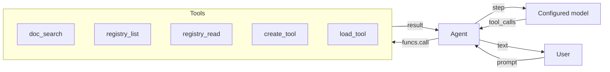
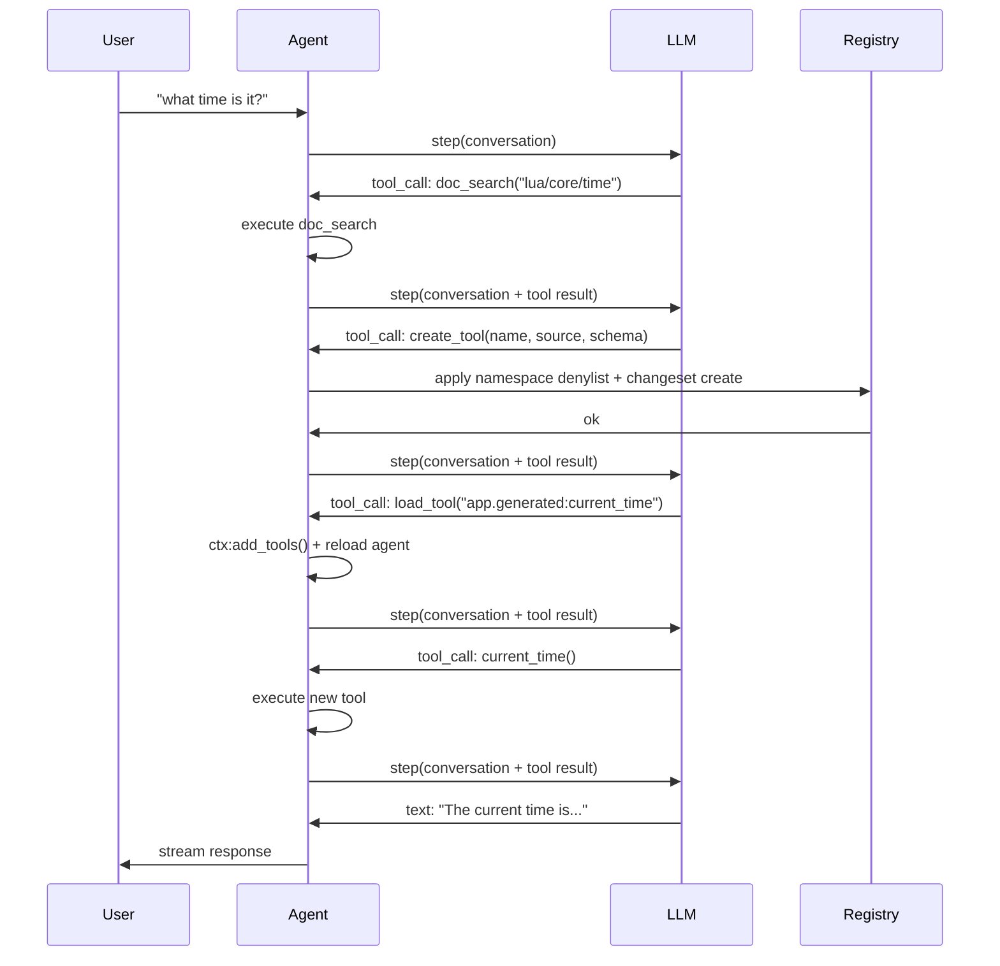
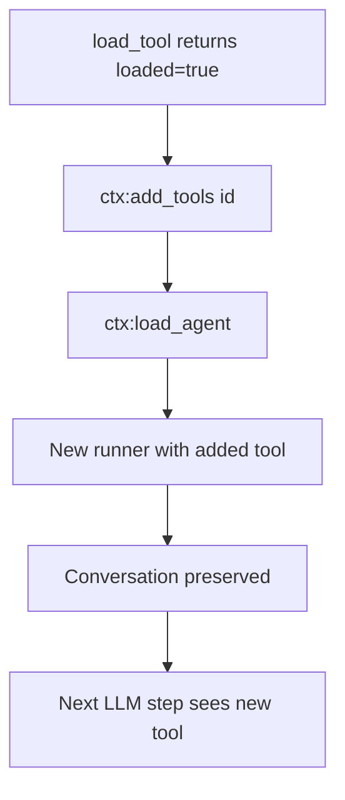
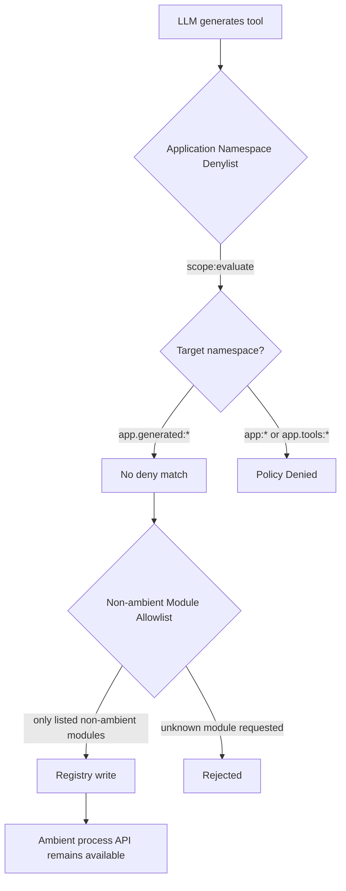

# Micro AGI

Untersuchen Sie einen Agenten, der Dokumentation liest, Lua-Tools erzeugt, sie zur Laufzeit registriert und in seine aktive Sitzung lädt.

**Klassifizierung: Rundgang durch eine Referenzimplementierung.** Die Snippets erklären
das veröffentlichte Modul `wippy/micro-agi`, bilden jedoch bewusst keinen vollständigen
Quellbaum. Führen Sie das Hub-Modul aus, um die Implementierung zu erproben; verwenden
Sie das LLM-Agent-Tutorial, wenn Sie einen eigenständigen Build benötigen.

## Was das Paket demonstriert

Ein Terminal-Agent, der:

- Antworten von einem LLM streamt.
- Wippy-Dokumentation nach APIs durchsucht.
- Die Registry auf vorhandene Fähigkeiten prüft.
- Tools erstellt und lädt, wenn eine Fähigkeit fehlt.
- Den Gesprächsverlauf komprimiert, wenn er sich dem Kontextlimit nähert.


```mermaid
flowchart LR
    User -->|prompt| Agent
    Agent -->|step| LLM[Configured model]
    LLM -->|tool_calls| Agent
    Agent -->|funcs.call| Tools
    Tools -->|result| Agent
    Agent -->|text| User

    subgraph Tools
        doc_search
        registry_list
        registry_read
        create_tool
        load_tool
    end
```

## Architektur

Der Agent läuft als Wippy-Prozess mit Zugriff auf die Registry. Wenn das LLM entscheidet, dass es eine Funktion benötigt, die es nicht hat, verwendet es die Selbstmodifikations-Schleife:


```mermaid
sequenceDiagram
    participant U as User
    participant A as Agent
    participant L as LLM
    participant R as Registry

    U->>A: "what time is it?"
    A->>L: step(conversation)
    L->>A: tool_call: doc_search("lua/core/time")
    A->>A: execute doc_search
    A->>L: step(conversation + tool result)
    L->>A: tool_call: create_tool(name, source, schema)
    A->>R: apply namespace denylist + changeset create
    R->>A: ok
    A->>L: step(conversation + tool result)
    L->>A: tool_call: load_tool("app.generated:current_time")
    A->>A: ctx:add_tools() + reload agent
    A->>L: step(conversation + tool result)
    L->>A: tool_call: current_time()
    A->>A: execute new tool
    A->>L: step(conversation + tool result)
    L->>A: text: "The current time is..."
    A->>U: stream response
```

Tools sind Registry-Einträge. Um eines zu erstellen, schreibt der Agent einen
`function.lua`-Eintrag mit Inline-Lua-Quelle in `data.source`; anschließend kompiliert
und lädt die Runtime diesen Eintrag.

## Struktur des veröffentlichten Pakets

Das Paket besitzt alle folgenden Dateien. Diese Seite gibt `doc_search.lua` und die
für die Architektur wichtigen Verträge wieder, kürzt jedoch Registry-Helfer,
Changeset-Verarbeitung, Dynamic-Loader-Helfer und Agentenschleife. Insbesondere sind
die Abschnitte `create_tool`, `load_tool` und `agent.lua` Auszüge und keine Dateien,
die wortwörtlich kopiert werden können. Die vollständigen Registry-Definitionen für
`registry_list` und `registry_read` verbleiben ebenfalls im veröffentlichten Modul.

```
micro-agi/
├── .wippy.yaml
├── wippy.yaml
└── src/
    ├── _index.yaml
    ├── README.md
    ├── agent.lua
    └── tools/
        ├── _index.yaml
        ├── doc_search.lua
        ├── registry_list.lua
        ├── registry_read.lua
        ├── create_tool.lua
        └── load_tool.lua
```

## Infrastruktur

Das Paket verwendet diese `.wippy.yaml`-Konfiguration:

```yaml
version: "1.0"

logger:
  encoding: console
```

## Eintragsdefinitionen

Erstellen Sie `src/_index.yaml` mit Infrastruktur, Sicherheitsrichtlinien, Modellen, Agent und Prozess:

```yaml
version: "1.0"
namespace: app

entries:
  - name: definition
    kind: ns.definition
    readme: file://README.md
    meta:
      title: Micro AGI
      description: Self-modifying development agent that builds its own tools at runtime
      depends_on: [wippy/llm, wippy/agent]

  - name: os_env
    kind: env.storage.os

  - name: processes
    kind: process.host
    lifecycle:
      auto_start: true

  - name: __dep.llm
    kind: ns.dependency
    component: wippy/llm
    version: "*"
    parameters:
      - name: env_storage
        value: app:os_env
      - name: process_host
        value: app:processes

  - name: __dep.agent
    kind: ns.dependency
    component: wippy/agent
    version: "*"
    parameters:
      - name: process_host
        value: app:processes
```

### Sicherheitsrichtlinien

Zwei `security.policy`-Einträge schränken ein, in welche Namespaces der Agent schreiben darf:

```yaml
  - name: deny_core_ns
    kind: security.policy
    policy:
      actions: "*"
      resources: "app:*"
      effect: deny
    groups:
      - agent_security

  - name: deny_tools_ns
    kind: security.policy
    policy:
      actions: "*"
      resources: "app.tools:*"
      effect: deny
    groups:
      - agent_security
```

Diese Policies werden von `create_tool` als benannter Scope (`app:agent_security`)
geladen. Der Helfer weist ein explizites `deny` für `app:*` (Kerneinträge, Modelle
und Agentendefinition) oder `app.tools:*` (eingebaute Tools) zurück, behandelt das
nicht gematchte Ergebnis `undefined` für `app.generated:*` in seinem eigenen Filter
jedoch als zulässig. Dies ist keine Wippy-Runtime-Autorisierung: Geschützte Operationen
benötigen ein explizites `allow` aus dem Ausführungskontext. Dazu gehören die unten
gezeigten Operationen des Sicherheitsmoduls und `registry.apply` innerhalb von `changes:apply()`.

Siehe [Sicherheitsmodell](system/security.md) für Einzelheiten zur Policy-Auswertung.

### Modelle

Zwei Modelle dienen unterschiedlichen Zwecken:

```yaml
  - name: gpt-5.1
    kind: registry.entry
    meta:
      name: gpt-5.1
      type: llm.model
      title: GPT-5.1
      comment: Reasoning model
      capabilities: [generate, tool_use, structured_output, vision, thinking]
      class: [reasoning]
      priority: 210
    max_tokens: 400000
    output_tokens: 128000
    pricing:
      input: 1.25
      output: 10
    providers:
      - id: wippy.llm.openai:provider
        options:
          reasoning_model_request: true
        provider_model: gpt-5.1

  - name: gpt-4.1-nano
    kind: registry.entry
    meta:
      name: gpt-4.1-nano
      type: llm.model
      title: GPT-4.1 Nano
      comment: Compression model
      capabilities: [generate, tool_use, structured_output]
      class: [fast]
      priority: 100
    max_tokens: 1047576
    output_tokens: 32768
    pricing:
      input: 0.1
      output: 0.4
    providers:
      - id: wippy.llm.openai:provider
        provider_model: gpt-4.1-nano
```

GPT-5.1 übernimmt Reasoning und Tool-Nutzung. GPT-4.1 Nano übernimmt die Kontextkomprimierung.

### Agentendefinition

```yaml
  - name: dev_assistant
    kind: registry.entry
    meta:
      type: agent.gen1
      name: dev_assistant
      title: Dev Assistant
      comment: Wippy development assistant
    prompt: |
      Self-modifying Wippy development agent. You run inside Wippy runtime
      with access to docs, registry, and dynamic tool creation.

      Rules:
      - NEVER fabricate, guess, or hallucinate facts. If you need real data,
        use or build a tool to get it. Only state what a tool actually returned.
      - Maximum 2-3 sentences per response. No bullet lists. No disclaimers.
      - Never say "I can't" or "I don't have". Build the tool and do it.
      - Act first, explain only if asked.

      To gain new capabilities: doc_search the API, create_tool with Lua source,
      load_tool, call it. All in one turn.
    model: gpt-5.1
    thinking_effort: 10
    max_tokens: 2048
    tools:
      - "app.tools:*"
```

Der Prompt ist absichtlich knapp gehalten. Wichtige Regeln:
- **Keine Halluzinationen** — der Agent muss Tools für echte Daten verwenden
- **Selbstmodifikation** — Tools bauen statt abzulehnen
- **Aktion vor Erklärung** — zuerst handeln, nur auf Nachfrage erklären

### Prozess

```yaml
  - name: agent
    kind: process.lua
    meta:
      command:
        name: agent
        short: Start dev assistant
    source: file://agent.lua
    method: main
    modules: [io, json, funcs, registry, time, security]
    imports:
      prompt: wippy.llm:prompt
      agent_context: wippy.agent:context
      compress: wippy.llm.util:compress
```

Der Prozess läuft als Terminalbefehl. `create_tool` wendet vor dem Schreiben die
Denylist des Pakets an; dieser Filter stellt jedoch nicht den Runtime-Sicherheitskontext
des Befehls bereit.

Imports:
- `prompt` — Konversations-Builder
- `agent_context` — Agent-Loading und dynamische Tool-Verwaltung
- `compress` — LLM-basierte Textkomprimierung für Kontextverwaltung

## Tools

Erstellen Sie `src/tools/_index.yaml` mit fünf Tools:

### doc_search

Lädt Wippy-Dokumentation über die `wippy.ai/llm`-API. Unterstützt zwei Modi: eine Seite per Pfad abrufen oder per Query suchen.

```lua
local http_client = require("http_client")
local json = require("json")

local BASE_URL = "https://wippy.ai/llm"
local MAX_CHARS = 8000

local function fetch_page(path)
    local url = BASE_URL .. "/path/en/" .. path
    local resp, err = http_client.get(url, {
        headers = { ["User-Agent"] = "wippy-agent/1.0" },
    })
    if err then
        return nil, tostring(err)
    end
    if resp.status_code ~= 200 then
        return nil, "HTTP " .. resp.status_code
    end

    local body = resp.body or ""
    if #body > MAX_CHARS then
        body = body:sub(1, MAX_CHARS) .. "\n... (truncated)"
    end
    return body, nil
end

local function search_docs(query)
    local url = BASE_URL .. "/search?q=" .. http_client.encode_uri(query)
    local resp, err = http_client.get(url, {
        headers = { ["User-Agent"] = "wippy-agent/1.0" },
    })
    if err then
        return { error = tostring(err) }
    end
    if resp.status_code ~= 200 then
        return { error = "HTTP " .. resp.status_code }
    end

    local body = resp.body or ""
    if #body > MAX_CHARS then
        body = body:sub(1, MAX_CHARS) .. "\n... (truncated)"
    end

    return { results = body }
end

local function handler(input)
    if input.path then
        local content, err = fetch_page(input.path)
        if err then
            return { error = err }
        end
        return { path = input.path, content = content }
    end

    if input.query then
        return search_docs(input.query)
    end

    return { error = "provide either 'path' or 'query'" }
end

return { handler = handler }
```

### create_tool

Der Kern der Selbstmodifikation. Wertet Namespace-Deny-Richtlinien aus und erstellt einen `function.lua`-Eintrag in der Registry mit Inline-Lua-Quellcode.

Das Feld `modules` des erzeugten Eintrags steuert, welche nicht-ambienten Runtime-Module
das Tool laden kann. Das Modul `process` ist für jeden ausführbaren Lua-Eintrag ambient;
sein Weglassen ist daher keine Sicherheitsgrenze. Prozessoperationen hängen weiterhin
von Runtime-Sicherheits-Policies ab.

```lua
local registry = require("registry")
local json = require("json")
local security = require("security")

local NAMESPACE = "app.generated"
local MAX_SOURCE_LEN = 16000
local MAX_NAME_LEN = 64

local ALLOWED_MODULES = {
    time = true, json = true, http_client = true, expr = true,
    text = true, base64 = true, yaml = true, crypto = true,
    hash = true, uuid = true,
}
```

**Denylist-Auswertung** — `create_tool` lädt den benannten Scope `agent_security`.
Schreibzugriffe auf `app:*` oder `app.tools:*` werden abgewiesen, wenn der Scope
`deny` zurückgibt; ein nicht gematchtes Ziel `app.generated:*` ergibt `undefined`
und besteht diesen Anwendungsfilter:

```lua
local actor = security.new_actor("service:agent", { role = "agent" })
local scope, scope_err = security.named_scope("app:agent_security")
if scope_err then
    return { error = "failed to load security scope: " .. tostring(scope_err) }
end

local result = scope:evaluate(actor, action, id)
if result == "deny" then
    return { error = "policy denied: " .. action .. " on " .. id }
end
```

Diese Prüfung autorisiert die Registry-Änderung nicht. Der aktuelle Befehl benötigt
weiterhin einen Runtime-Actor und Scope, die die Aufrufe des Sicherheitsmoduls und
`registry.apply` explizit erlauben.

**Registry-Schreibvorgang** — der Eintrag wird mit Quellcode in `data.source` und nur den erlaubten Modulen geschrieben:

```lua
local entry = {
    id = id,
    kind = "function.lua",
    meta = {
        type = "tool",
        title = input.name,
        comment = input.description,
        input_schema = schema,
        llm_alias = input.name,
        llm_description = input.description,
    },
    data = {
        source = input.source,
        modules = modules,
        method = "handler",
    },
}

local snap = registry.snapshot()
local changes = snap:changes()
if existing then
    changes:update(entry)
else
    changes:create(entry)
end
local _, apply_err = changes:apply()
if apply_err then
    return { error = "failed to apply registry change: " .. tostring(apply_err) }
end
```

Das erzeugte Tool wird in der Registry gespeichert und nicht in eine Quelldatei geschrieben.

### load_tool

Validiert, dass der Eintrag ein Tool ist, und signalisiert der Agentenschleife, neu zu laden:

```lua
local function handler(input)
    local entry, err = registry.get(input.id)
    if err then
        return { error = tostring(err) }
    end
    if not entry then
        return { error = "not found: " .. input.id }
    end
    if not entry.meta or entry.meta.type ~= "tool" then
        return { error = "not a tool (meta.type != 'tool'): " .. input.id }
    end

    return {
        loaded = true,
        id = entry.id,
        alias = entry.meta.llm_alias or input.id,
        description = entry.meta.llm_description or "",
    }
end
```

Die Agentenschleife erkennt `loaded = true` im Ergebnis und ruft `ctx:add_tools(id)` gefolgt von `ctx:load_agent()` auf, um den Agenten mit dem neuen Tool neu zu kompilieren.

## Agentenschleife

Die Agentenschleife in `src/agent.lua` behandelt Streaming, Tool-Ausführung, dynamisches Laden und Kontextkomprimierung.

### Streaming

Verwendet dasselbe Coroutine- und Channel-Muster wie das [LLM-Agent-Tutorial](tutorials/llm-agent.md):

```lua
coroutine.spawn(function()
    local response, err = session.runner:step(session.conversation, {
        stream_target = {
            reply_to = process.pid(),
            topic = STREAM_TOPIC,
        },
    })
    done_ch:send({ response = response, err = err })
end)
```

### Tool-Ausführung

Tools werden über `funcs.call()` aufgerufen. `pcall` fängt ausgelöste Lua-Fehler ab,
während der normale zweite Rückgabewert von `funcs.call()` Aufruffehler enthält:

```lua
local ok, result, call_err = pcall(funcs.call, tc.registry_id, args)
if not ok then
    results[tc.id] = { error = tostring(result) }
elseif call_err then
    results[tc.id] = { error = tostring(call_err) }
else
    results[tc.id] = result
end
```

### Dynamisches Tool-Laden

Wenn `load_tool` `loaded = true` zurückgibt, lädt der Agent sich selbst neu:


```mermaid
flowchart TD
    A[load_tool returns loaded=true] --> B[ctx:add_tools id]
    B --> C[ctx:load_agent]
    C --> D[New runner with added tool]
    D --> E[Conversation preserved]
    E --> F[Next LLM step sees new tool]
```

```lua
local function handle_tool_loading(tool_calls, results)
    local reload_needed = false
    for _, tc in ipairs(tool_calls) do
        if tc.name == "load_tool" then
            local result = results[tc.id]
            if result and result.loaded then
                session.ctx:add_tools(result.id)
                reload_needed = true
            end
        end
    end
    if reload_needed then
        reload_agent()
    end
end
```

Die Konversation bleibt über Reloads hinweg erhalten, weil sie im Prompt-Builder lebt, nicht im Runner.

### Kontextkomprimierung

Wenn die Prompt-Tokens 300K überschreiten (75 % des 400K-Kontextfensters), wird die Konversation mit GPT-4.1 Nano komprimiert:

```lua
if response.tokens and response.tokens.prompt_tokens
    and response.tokens.prompt_tokens > PROMPT_TOKEN_LIMIT then
    try_compress()
end
```

Die Komprimierung extrahiert Nachrichteninhalte, ruft `compress.to_size()` mit Ziel von 4000 Zeichen auf und ersetzt die Konversation durch eine Zusammenfassung:

```lua
local summary, compress_err = compress.to_size(COMPRESS_MODEL, full_text, COMPRESS_TARGET)
if compress_err then
    return nil, compress_err
end
session.conversation = prompt.new()
session.conversation:add_system("Conversation summary:\n\n" .. summary)
```

## Sicherheitsmodell

Eine Anwendungs-Denylist und Zugriffskontrollen auf Modulebene begrenzen erzeugte
Tools, ersetzen jedoch keine Runtime-Autorisierung.


```mermaid
flowchart TD
    LLM[LLM generates tool] --> P{Application Namespace Denylist}
    P -->|scope:evaluate| Check{Target namespace?}
    Check -->|app.generated:*| OK[No deny match]
    Check -->|app:* or app.tools:*| Deny[Policy Denied]

    OK --> M{Non-ambient Module Allowlist}
    M -->|only listed non-ambient modules| R[Registry write]
    M -->|unknown module requested| Err[Rejected]
    R --> A[Ambient process API remains available]
```

### Namespace-Deny-Richtlinien

| Richtlinie | Ressourcen | Effekt |
|--------|-----------|--------|
| `deny_core_ns` | `app:*` | deny |
| `deny_tools_ns` | `app.tools:*` | deny |

`create_tool` lädt die Policy-Gruppe `agent_security` und wertet die Ziel-Eintrags-ID
aus. Das Ergebnis `undefined` wird in diesem Anwendungsfilter bewusst als „nicht
verweigert“ behandelt. Wippys geschützte Autorisierung verhält sich anders: Eine
Operation ist nur bei einem expliziten `allow` zulässig. Der Kontext, der diesen Code
ausführt, muss weiterhin die erforderlichen Runtime-Berechtigungen besitzen.

Dies verhindert, dass der Agent:

- Den eigenen Prompt oder die Agentendefinition ändert (`app:dev_assistant`)
- Seine eingebauten Tools überschreibt (`app.tools:*`)
- Infrastruktureinträge ändert (`app:processes` usw.)

### Zugriffskontrolle für Module

Generierte Tools deklarieren nicht-ambient bereitgestellte Fähigkeiten in `data.modules`,
und `create_tool` akzeptiert nur Namen aus `ALLOWED_MODULES`. Ein nicht deklariertes,
nicht-ambientes Modul kann nicht geladen werden. Die Runtime injiziert jedoch `process`
in jeden ausführbaren Lua-Eintrag, auch in ein generiertes Tool. Prozessoperationen
müssen deshalb durch Sicherheits-Policies beschränkt werden und nicht dadurch, dass
`process` aus `data.modules` weggelassen wird.

Dieses Tutorial definiert keine Policies für `process.spawn` oder `process.exec`.
Seine generierten Tools bilden daher keine vollständige Sandbox. Fügen Sie Runtime-Policies
für ambiente Prozessoperationen hinzu, bevor Sie nicht vertrauenswürdige Tool-Quellen zulassen.

## Ausführen und aktuelle Einschränkung des Pakets

Das veröffentlichte Artefakt ist das Hub-Modul. Beginnen Sie in einem neuen, leeren
Verzeichnis ohne `wippy.lock`; der Hub-Bootstrap weist eine fremde oder aus mehreren
Roots bestehende Lock-Datei zurück. Der erste Lauf erzeugt die Deployment-Lock-Datei,
spätere Läufe aus demselben Verzeichnis verwenden die passende Lock-Datei erneut.

```bash
mkdir micro-agi-deploy
cd micro-agi-deploy
wippy run wippy/micro-agi agent
```

Der Befehl lädt die gewählte Modulversion herunter, löst ihre deklarierten
Abhängigkeiten auf und ruft ihren Befehl `agent` auf.

Er benötigt weiterhin die vom Modul erwarteten Provider-Zugangsdaten und die
Modellkonfiguration sowie Registry- und Netzwerkzugriff für Hub-Download und
Dokumentationssuche. Diese Seite enthält weder einen lokalen Clone noch eine Lock-Datei
und erhebt deshalb keinen Anspruch auf einen reproduzierbaren Source-Build.

In der geprüften Version deklariert `wippy/micro-agi` v0.3.1 keinen
`meta.command.security`-Kontext für `agent`. Im standardmäßigen Strict Mode erhalten
die geschützten Tool-Pfade — darunter `funcs.call`, Registry-Lese- und -Schreibzugriffe
sowie die HTTP-Anfrage für die Dokumentationssuche — nicht die expliziten Zulassungen,
die sie benötigen. Die oben beschriebenen Tool- und Selbstmodifikationsabläufe sind
daher Referenzdesigns und funktionieren nicht standardmäßig im Strict Mode. Deaktivieren
Sie Strict Mode nicht, um einen nicht vertrauenswürdigen Codegenerator zum Laufen zu
bringen; das Paket sollte zuerst einen Least-Privilege-Command-Scope für seine
erforderlichen Aktionen erhalten.

## Nächste Schritte

- [LLM-Agent](tutorials/llm-agent.md) — Einen grundlegenden Agenten von Grund auf bauen
- [Agent-Modul](framework/agents.md) — Referenz des Agent-Frameworks
- [Registry](concepts/registry.md) — Registry-Konzepte
- [Sicherheitsmodell](system/security.md) — Deklarative Sicherheits-Policies
- [Eintragsarten](guides/entry-kinds.md) — Verfügbare Eintragsarten
