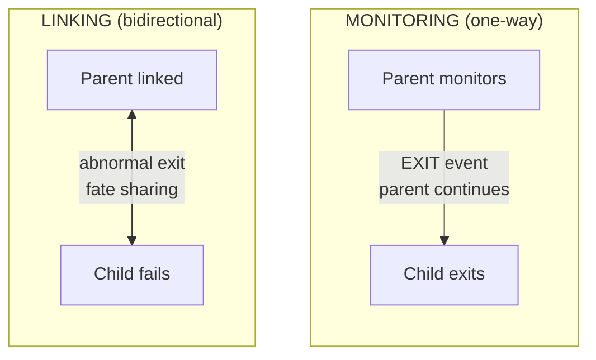

# Rezepte zur Prozess-Supervision

Verwenden Sie Monitoring und Linking, um Prozess-Exits zu beobachten, Fehler weiterzugeben, Abbrüche zu behandeln und Worker neu zu starten.

**Klassifizierung:** Teilrezept. Die Lifecycle-Snippets sind voneinander unabhängig,
und der Worker-Pool-Abschnitt enthält seine Kerneinträge, jedoch nicht den separaten
Kontrollprozess, der zum Auslösen und Prüfen eines Neustarts erforderlich ist.

## Kontext und Abhängigkeiten

Die Snippets richten sich an die Wippy-Runtime `v0.3.32a` und setzen einen ausführbaren
Lua-Eintrag, einen laufenden `process.host` namens `app:processes` sowie projektdefinierte
Worker-Einträge wie `app.workers:task_worker` voraus. Die APIs `process` und `channel`
sind Umgebungs-Globals. Jedes Snippet mit `time.*` benötigt das Modul `time` in seinem
Eintrag sowie `local time = require("time")` im Quellcode.

Starten, Host-Auswahl, Monitoring, Linking, Senden, Abbrechen und Beenden von Prozessen
sind geschützte Operationen. Weisen Sie jedem ausführbaren Eintrag, der sie verwendet,
einen Actor und eng begrenzte Allow-Policies zu. Die unten gezeigte Worker-Pool-Konfiguration
enthält die für dieses Rezept benötigten Policies; die isolierten Snippets tun dies nicht.

## Überwachung vs. Verknüpfung

**Überwachung** bietet einseitige Beobachtung:

- Ein Elternprozess überwacht einen Kindprozess.
- Wenn der Kindprozess endet, empfängt der Elternprozess ein `EXIT`-Event.
- Der Elternprozess läuft weiter.

**Verknüpfung** erzeugt bidirektionales Schicksal:

- Ein Eltern- und ein Kindprozess sind verknüpft.
- Wenn einer der Prozesse abnormal endet, wird auch der andere beendet.
- Mit `trap_links=true` werden Fehler zu Events, die der Prozess behandeln kann.



## Prozessüberwachung

### Spawn mit Überwachung

`process.spawn_monitored()` verwenden, um in einem Aufruf zu spawnen und zu überwachen:

```lua
local function main()
    local events_ch = process.events()

    -- Spawn worker and start monitoring
    local worker_pid, err = process.spawn_monitored(
        "app.workers:task_worker",
        "app:processes"
    )
    if err then
        return nil, "spawn failed: " .. tostring(err)
    end

    -- Wait for worker to complete
    local event = events_ch:receive()

    if event.kind == process.event.EXIT then
        print("Worker exited:", event.from)
        if event.result then
            print("Result:", event.result.value)
        end
        if event.result and event.result.error then
            print("Error:", event.result.error)
        end
    end
end
```

### Bestehenden Prozess überwachen

`process.monitor()` aufrufen, um einen bereits laufenden Prozess zu überwachen:

```lua
local function main()
    local time = require("time")
    local events_ch = process.events()

    -- Spawn without monitoring
    local worker_pid, err = process.spawn(
        "app.workers:long_worker",
        "app:processes"
    )
    if err then
        return nil, "spawn failed: " .. tostring(err)
    end

    -- Start monitoring later
    local ok, monitor_err = process.monitor(worker_pid)
    if monitor_err then
        return nil, "monitor failed: " .. tostring(monitor_err)
    end

    -- Cancel the worker
    time.sleep("5ms")
    local _, cancel_err = process.cancel(worker_pid)
    if cancel_err then
        return nil, "cancel failed: " .. tostring(cancel_err)
    end

    -- Receive EXIT event
    local event = events_ch:receive()
    if event.kind == process.event.EXIT then
        print("Worker terminated:", event.from)
    end
end
```

### Überwachung beenden

`process.unmonitor()` verwenden, um keine EXIT-Events mehr zu empfangen:

```lua
local function main()
    local time = require("time")
    local events_ch = process.events()

    -- Spawn and monitor
    local worker_pid, err = process.spawn_monitored(
        "app.workers:long_worker",
        "app:processes"
    )
    if err then
        return nil, "spawn failed: " .. tostring(err)
    end

    time.sleep("5ms")

    -- Stop monitoring
    local ok, unmon_err = process.unmonitor(worker_pid)
    if unmon_err then
        return nil, "unmonitor failed: " .. tostring(unmon_err)
    end

    -- Cancel worker
    local _, cancel_err = process.cancel(worker_pid)
    if cancel_err then
        return nil, "cancel failed: " .. tostring(cancel_err)
    end

    -- No EXIT event will be received (we unmonitored)
    local timeout = time.after("200ms")
    local result = channel.select {
        events_ch:case_receive(),
        timeout:case_receive(),
    }

    if result.channel == events_ch then
        return nil, "should not receive event after unmonitor"
    end
end
```

## Prozessverknüpfung

### Explizite Verknüpfung

`process.link()` verwenden, um eine bidirektionale Verknüpfung herzustellen:

```lua
-- Worker that links to a target process
local function worker_main()
    local time = require("time")
    local events_ch = process.events()
    local inbox_ch = process.inbox()

    -- Enable trap_links to receive LINK_DOWN events
    local _, options_err = process.set_options({ trap_links = true })
    if options_err then
        return nil, "set_options failed: " .. tostring(options_err)
    end

    -- Receive target PID from sender
    local msg = inbox_ch:receive()
    local target_pid = msg:payload():data()
    local sender = msg:from()

    -- Create bidirectional link
    local ok, err = process.link(target_pid)
    if err then
        return nil, "link failed: " .. tostring(err)
    end

    -- Notify sender we're linked
    local _, send_err = process.send(sender, "linked", process.pid())
    if send_err then
        return nil, "confirmation failed: " .. tostring(send_err)
    end

    -- Wait for LINK_DOWN when target exits with an error
    local timeout = time.after("3s")
    local result = channel.select {
        events_ch:case_receive(),
        timeout:case_receive(),
    }

    if result.channel == events_ch then
        local event = result.value
        if event.kind == process.event.LINK_DOWN then
            return "LINK_DOWN_RECEIVED"
        end
    end

    return nil, "no LINK_DOWN received"
end
```

### Spawn mit Verknüpfung

`process.spawn_linked()` verwenden, um in einem Aufruf zu spawnen und zu verknüpfen:

```lua
local function parent_main()
    -- Enable trap_links to handle child death
    local _, options_err = process.set_options({ trap_links = true })
    if options_err then
        return nil, "set_options failed: " .. tostring(options_err)
    end

    local events_ch = process.events()

    -- Spawn and link to child
    local child_pid, err = process.spawn_linked(
        "app.workers:child_worker",
        "app:processes"
    )
    if err then
        return nil, "spawn_linked failed: " .. tostring(err)
    end

    -- If the child exits with an error, we receive LINK_DOWN
    local event = events_ch:receive()
    if event.kind == process.event.LINK_DOWN then
        print("Child died:", event.from)
    end
end
```

Für den Empfang von `LINK_DOWN` muss das Ziel beziehungsweise der Kindprozess in
diesen Beispielen abnormal enden; im Beispiel mit explizitem Linking muss der Fehler
außerdem innerhalb des Drei-Sekunden-Fensters auftreten. Ein normaler Abschluss löst
dieses Event nicht aus.

## Trap Links

Standardmäßig schlägt der aktuelle Prozess ebenfalls fehl, wenn ein verknüpfter Prozess fehlschlägt. Setzen Sie `trap_links=true`, um stattdessen LINK_DOWN-Events zu empfangen.

### Standardverhalten (trap_links=false)

Ohne `trap_links` beendet ein Fehlschlag des verknüpften Prozesses den aktuellen Prozess:

```lua
local function worker_main()
    local events_ch = process.events()

    -- trap_links is false by default
    local opts = process.get_options()
    print("trap_links:", opts.trap_links)  -- false

    -- Spawn linked worker that will fail
    local child_pid, err = process.spawn_linked(
        "app.workers:error_worker",
        "app:processes"
    )
    if err then
        return nil, "spawn_linked failed: " .. tostring(err)
    end

    -- When child errors, THIS process terminates
    -- We never reach this point
    local event = events_ch:receive()
end
```

### Mit trap_links=true

`trap_links` aktivieren, um LINK_DOWN-Events zu empfangen und zu überleben:

```lua
local function worker_main()
    -- Enable trap_links
    local _, options_err = process.set_options({ trap_links = true })
    if options_err then
        return nil, "set_options failed: " .. tostring(options_err)
    end

    local events_ch = process.events()

    -- Spawn linked worker that will fail
    local child_pid, err = process.spawn_linked(
        "app.workers:error_worker",
        "app:processes"
    )
    if err then
        return nil, "spawn_linked failed: " .. tostring(err)
    end

    -- Wait for LINK_DOWN event
    local event = events_ch:receive()

    if event.kind == process.event.LINK_DOWN then
        print("Child failed, handling gracefully")
        return "LINK_DOWN_RECEIVED"
    end
end
```

## Abbruch

### Abbruchsignal senden

Verwenden Sie `process.cancel()`, um einen Prozess um einen geordneten Abbruch zu bitten:

```lua
local function main()
    local time = require("time")
    local events_ch = process.events()

    -- Spawn and monitor worker
    local worker_pid, err = process.spawn_monitored(
        "app.workers:long_worker",
        "app:processes"
    )
    if err then
        return nil, "spawn failed: " .. tostring(err)
    end

    time.sleep("5ms")

    -- Cancel the worker
    local ok, cancel_err = process.cancel(worker_pid)
    if cancel_err then
        return nil, "cancel failed: " .. tostring(cancel_err)
    end

    -- Wait for EXIT event
    local event = events_ch:receive()
    if event.kind == process.event.EXIT then
        print("Worker cancelled:", event.from)
    end
end
```

### Abbruch verarbeiten

Der Worker empfängt das `CANCEL`-Event über `process.events()`:

`cleanup()` und `handle_message()` sind unten Callback-Funktionen der Anwendung, die dieses Rezept nicht definiert.

```lua
local function worker_main()
    local events_ch = process.events()
    local inbox_ch = process.inbox()

    while true do
        local result = channel.select {
            inbox_ch:case_receive(),
            events_ch:case_receive(),
        }

        if result.channel == events_ch then
            local event = result.value
            if event.kind == process.event.CANCEL then
                -- Cleanup resources
                cleanup()
                return "cancelled gracefully"
            end
        else
            -- Process inbox message
            handle_message(result.value)
        end
    end
end
```

## Supervisions-Topologien

### Stern-Topologie

Ein Elternprozess kann mehrere Kindprozesse koordinieren, die sich mit ihm verknüpfen:

```lua
-- Parent worker spawns children that link TO parent
local function star_parent_main()
    local time = require("time")
    local events_ch = process.events()
    local child_count = 10

    -- Enable trap_links to see children die
    local _, options_err = process.set_options({ trap_links = true })
    if options_err then
        error("set_options failed: " .. tostring(options_err))
    end

    local children = {}

    -- Spawn children
    for i = 1, child_count do
        local child_pid, err = process.spawn(
            "app.workers:linker_child",
            "app:processes"
        )
        if err then
            error("spawn child failed: " .. tostring(err))
        end

        -- Send parent PID to child
        local _, send_err = process.send(child_pid, "inbox", process.pid())
        if send_err then
            error("send parent PID failed: " .. tostring(send_err))
        end
        children[child_pid] = true
    end

    -- Wait for all children to confirm link
    for i = 1, child_count do
        local msg = process.inbox():receive()
        if msg:topic() ~= "linked" then
            error("expected linked confirmation")
        end
    end

    -- Trigger failure - all children should receive LINK_DOWN
    error("PARENT_STAR_FAILURE")
end
```

Kind-Worker, der sich mit dem Elternteil verknüpft:

```lua
local function linker_child_main()
    -- Enable trap_links to receive LINK_DOWN events
    local _, options_err = process.set_options({ trap_links = true })
    if options_err then
        return nil, "set_options failed: " .. tostring(options_err)
    end

    local events_ch = process.events()
    local inbox_ch = process.inbox()

    -- Receive parent PID
    local msg = inbox_ch:receive()
    local parent_pid = msg:payload():data()

    -- Link to parent
    local _, link_err = process.link(parent_pid)
    if link_err then
        return nil, "link failed: " .. tostring(link_err)
    end

    -- Confirm link
    local _, send_err = process.send(parent_pid, "linked", process.pid())
    if send_err then
        return nil, "confirmation failed: " .. tostring(send_err)
    end

    -- Wait for LINK_DOWN when parent dies
    local event = events_ch:receive()
    if event.kind == process.event.LINK_DOWN then
        return "parent_died"
    end
end
```

### Ketten-Topologie

In einer linearen Kette verknüpft sich jeder Knoten mit seinem Elternprozess:

```lua
-- Chain root: A -> B -> C -> D -> E
local function chain_root_main()
    local time = require("time")

    -- Spawn first child
    local child_pid, err = process.spawn_linked(
        "app.workers:chain_node",
        "app:processes",
        4  -- depth remaining
    )
    if err then
        error("spawn failed: " .. tostring(err))
    end

    -- Wait for chain to build
    time.sleep("100ms")

    -- Trigger cascade - all linked processes die
    error("CHAIN_ROOT_FAILURE")
end
```

Kettenknoten spawnt nächsten Knoten und verknüpft sich:

```lua
local function chain_node_main(depth)
    if depth > 0 then
        -- Spawn next in chain
        local child_pid, err = process.spawn_linked(
            "app.workers:chain_node",
            "app:processes",
            depth - 1
        )
        if err then
            error("spawn failed: " .. tostring(err))
        end
    end

    -- Block until parent death kills us via LINK_DOWN (default trap_links=false)
    process.inbox():receive()
end
```

## Worker-Pool mit Supervision

### Konfiguration

```yaml
# src/_index.yaml
version: "1.0"
namespace: app

entries:
  - name: supervision-policy
    kind: security.policy
    policy:
      actions:
        - process.host
        - process.send
        - process.spawn
        - process.spawn.linked
      resources: "*"
      effect: allow

  - name: processes
    kind: process.host
    host:
      workers: 16
    lifecycle:
      auto_start: true
```

```yaml
# src/supervisor/_index.yaml
version: "1.0"
namespace: app.supervisor

entries:
  - name: pool
    kind: process.lua
    source: file://pool.lua
    method: main
    modules:
      - time
    security:
      actor:
        id: app.supervisor:pool
      policies:
        - app:supervision-policy

  - name: pool-service
    kind: process.service
    process: app.supervisor:pool
    host: app:processes
    input:
      - 4
    lifecycle:
      auto_start: true
```

### Supervisor-Implementierung

```lua
-- src/supervisor/pool.lua
local function main(worker_count)
    local time = require("time")
    worker_count = worker_count or 4

    -- Enable trap_links to handle worker deaths
    local _, options_err = process.set_options({ trap_links = true })
    if options_err then
        error("set_options failed: " .. tostring(options_err))
    end

    local events_ch = process.events()
    local workers = {}

    local function start_worker(id)
        local pid, err = process.spawn_linked(
            "app.workers:task_worker",
            "app:processes",
            id
        )
        if err then
            print("Failed to start worker " .. id .. ": " .. tostring(err))
            return nil
        end

        workers[pid] = {id = id, started_at = os.time()}
        print("Worker " .. id .. " started: " .. pid)
        return pid
    end

    -- Start initial pool
    for i = 1, worker_count do
        start_worker(i)
    end

    print("Supervisor started with " .. worker_count .. " workers")

    -- Supervision loop
    while true do
        local timeout = time.after("60s")
        local result = channel.select {
            events_ch:case_receive(),
            timeout:case_receive(),
        }

        if result.channel == timeout then
            -- Periodic health check
            local count = 0
            for _ in pairs(workers) do count = count + 1 end
            print("Health check: " .. count .. " active workers")

        elseif result.channel == events_ch then
            local event = result.value

            if event.kind == process.event.LINK_DOWN then
                local dead_worker = workers[event.from]
                if dead_worker then
                    workers[event.from] = nil
                    local uptime = os.time() - dead_worker.started_at
                    print("Worker " .. dead_worker.id .. " died after " .. uptime .. "s, restarting")

                    -- Brief delay before restart
                    time.sleep("100ms")
                    start_worker(dead_worker.id)
                end
            end
        end
    end
end

return { main = main }
```

## Prozesskonfiguration

### Worker-Definition

```yaml
# src/workers/_index.yaml
version: "1.0"
namespace: app.workers

entries:
  - name: task_worker
    kind: process.lua
    source: file://task_worker.lua
    method: main
    modules:
      - time
    security:
      actor:
        id: app.workers:task_worker
      policies:
        - app:supervision-policy
```

### Worker-Implementierung

```lua
-- src/workers/task_worker.lua
local function main(worker_id)
    local time = require("time")
    local events_ch = process.events()
    local inbox_ch = process.inbox()

    print("Task worker " .. worker_id .. " started")

    while true do
        local timeout = time.after("5s")
        local result = channel.select {
            inbox_ch:case_receive(),
            events_ch:case_receive(),
            timeout:case_receive(),
        }

        if result.channel == events_ch then
            local event = result.value
            if event.kind == process.event.CANCEL then
                print("Worker " .. worker_id .. " cancelled")
                return "cancelled"
            elseif event.kind == process.event.LINK_DOWN then
                print("Worker " .. worker_id .. " linked process died")
                return nil, "linked_process_died"
            end

        elseif result.channel == inbox_ch then
            local msg = result.value
            local topic = msg:topic()
            local payload = msg:payload():data()

            if topic == "work" then
                print("Worker " .. worker_id .. " processing: " .. payload)
                time.sleep("100ms")
                local _, send_err = process.send(msg:from(), "result", "completed: " .. payload)
                if send_err then
                    return nil, "send result failed: " .. tostring(send_err)
                end
            end

        elseif result.channel == timeout then
            -- Idle timeout
            print("Worker " .. worker_id .. " idle")
        end
    end
end

return { main = main }
```

## Process-Host-Einstellungen

Der Eintrag `app:processes`, der unter [Konfiguration](#konfiguration) definiert ist,
verwendet die folgende Host-Einstellung:

```yaml
# Within the app:processes entry in src/_index.yaml
host:
  workers: 16  # Worker goroutines (default: NumCPU)
```

Die Einstellung `workers`:

- Steuert die Parallelität für CPU-gebundene Arbeit.
- Wird typischerweise auf die Anzahl der CPU-Kerne gesetzt.
- Gilt für den Scheduler-Pool, den alle Prozesse auf dem Host gemeinsam verwenden.

## Ereignistypen

| Ereignis | Ausgelöst durch | Erforderliche Einrichtung |
|----------|-----------------|--------------------------|
| `EXIT` | Überwachter Prozess beendet sich | `spawn_monitored()` oder `monitor()` |
| `LINK_DOWN` | Verknüpfter Prozess schlägt fehl | `spawn_linked()` oder `link()` mit `trap_links=true` |
| `CANCEL` | `process.cancel()` aufgerufen | Das Ziel konsumiert `process.events()` |

## Das Supervisor-Pool-Rezept verwenden

Der dargestellte Pool startet und überwacht Worker, ist aber kein vollständiges
ausführbares Tutorial: Ein Kontrollprozess, dessen Berechtigung zum Beenden sowie
eine deterministische Prüfung des Neustarts fehlen absichtlich. Nachdem Sie das
Rezept in eine Anwendung übernommen haben, initialisieren und starten Sie diese wie üblich:

```bash
wippy init
wippy run
```

Der Supervisor startet automatisch und startet vier Worker. Um das Neustartverhalten
zu prüfen, fügen Sie einen vertrauenswürdigen Kontrolleintrag hinzu, der die PID eines
Workers ermittelt, die Berechtigung `process.terminate` für diese PID besitzt, ihn
beendet und prüft, dass der Supervisor einen Ersatz startet.

Bei einem abnormalen Worker-Exit empfängt der Pool `LINK_DOWN`, wartet 100 ms und
startet den Worker unter derselben ID erneut. Mit `process.cancel()` kann der Worker
geordnet beendet werden; dadurch entsteht kein `LINK_DOWN` und folglich kein Neustart.
Beenden Sie die Anwendung nach der Prüfung mit Strg+C.

## Nächste Schritte

- [Prozesse](tutorials/processes.md) — Prozessgrundlagen
- [Channels](tutorials/channels.md) — Muster für Message-Passing
- [Prozessmodul](lua/core/process.md) — Referenz der Prozess-API
