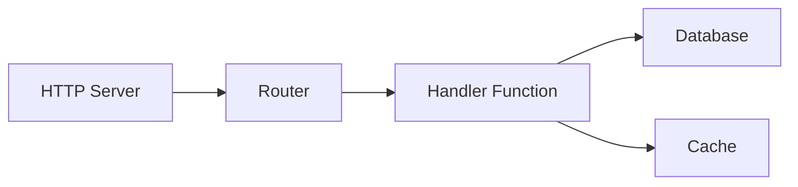
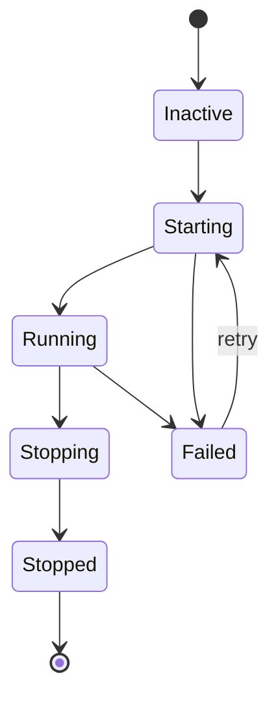

# Supervision

The supervisor manages service lifecycles, handling startup ordering, automatic restarts, and graceful shutdown. Services with `auto_start: true` are started when the application boots.

## Lifecycle Configuration

Services register with the supervisor using a `lifecycle` block. For processes, use `process.service` to wrap a process definition:

```yaml
# Process definition (the code)
- name: worker_process
  kind: process.lua
  source: file://worker.lua
  method: main

# Supervised service (wraps the process with lifecycle management)
- name: worker
  kind: process.service
  process: app:worker_process
  host: app:processes
  lifecycle:
    auto_start: true
    start_timeout: 30s
    stop_timeout: 10s
    stable_threshold: 5s
    depends_on:
      - app:database
    restart:
      initial_delay: 2s
      max_delay: 60s
      max_attempts: 10
```

| Field | Default | Description |
|-------|---------|-------------|
| `auto_start` | `false` | Start automatically when supervisor starts |
| `start_timeout` | `10s` | Maximum time allowed for startup |
| `stop_timeout` | `10s` | Maximum time for graceful shutdown |
| `stable_threshold` | `5s` | Runtime before service is considered stable |
| `depends_on` | `[]` | Services that must be running first |

## Dependency Resolution

The supervisor resolves dependencies from two sources:

1. **Explicit dependencies** declared in `depends_on`
2. **Registry-extracted dependencies** from entry references (e.g., `database: app:db` in your config)



Dependencies start before dependents. If Service C depends on A and B, both A and B must reach `Running` state before C starts.

<tip>
You don't need to declare infrastructure entries like databases in <code>depends_on</code>. The supervisor automatically extracts dependencies from registry references in your entry configuration.
</tip>

## Restart Policy

When a service fails, the supervisor retries with exponential backoff:

```yaml
lifecycle:
  restart:
    initial_delay: 1s      # First retry wait
    max_delay: 90s         # Maximum delay cap
    backoff_factor: 2.0    # Delay multiplier per attempt
    jitter: 0.1            # ±10% randomization
    max_attempts: 0        # 0 = infinite retries
```

| Attempt | Base Delay | With Jitter (±10%) |
|---------|------------|-------------------|
| 1 | 1s | 0.9s - 1.1s |
| 2 | 2s | 1.8s - 2.2s |
| 3 | 4s | 3.6s - 4.4s |
| 4 | 8s | 7.2s - 8.8s |
| ... | ... | ... |
| N | 90s | 81s - 99s (capped) |

When a service runs longer than `stable_threshold`, the retry counter resets. This prevents transient failures from permanently escalating delays.

### Terminal Errors

These errors stop retry attempts:

- Context cancellation
- Explicit termination request
- Errors marked as non-retryable

## Security Context

Services can run with a specific security identity:

```yaml
# Process definition
- name: admin_worker_process
  kind: process.lua
  source: file://admin_worker.lua
  method: main

# Supervised service with security context
- name: admin_worker
  kind: process.service
  process: app:admin_worker_process
  host: app:processes
  lifecycle:
    auto_start: true
    security:
      actor:
        id: "service:admin-worker"
        meta:
          role: admin
      groups:
        - app:admin_policies
      policies:
        - app:data_access
```

The security context sets:

| Field | Description |
|-------|-------------|
| `actor.id` | Identity string for this service |
| `actor.meta` | Key-value metadata (role, permissions, etc.) |
| `groups` | Policy groups to apply |
| `policies` | Individual policies to apply |

Code running in the service inherits this security context. The `security` module can then check permissions:

```lua
local security = require("security")

if security.can("delete", "users") then
    -- allowed
end
```

<note>
When no security context is configured, the service runs without an actor. In strict mode (default), security checks fail. Configure a security context for services that need authorization.
</note>

## Service States



The supervisor transitions services through these states:

| State | Description |
|-------|-------------|
| `Inactive` | Registered but not started |
| `Starting` | Startup in progress |
| `Running` | Operating normally |
| `Stopping` | Graceful shutdown in progress |
| `Stopped` | Cleanly terminated |
| `Failed` | Error occurred, may retry |

## Startup and Shutdown Order

**Startup**: Dependencies first, then dependents. Services at the same dependency level can start in parallel.

**Shutdown**: Dependents first, then dependencies. This ensures dependent services finish before their dependencies stop.

```
Startup:  database → cache → handler → http_server
Shutdown: http_server → handler → cache → database
```

## See Also

- [Process Model](concept-process-model.md) - Process lifecycle
- [Configuration](guide-configuration.md) - YAML configuration format
- [Security Module](lua-security.md) - Permission checks in Lua
