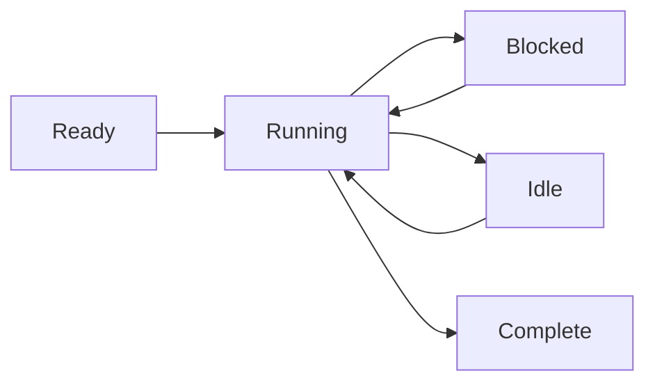

# Process Model

Wippy executes code in isolated processes—lightweight state machines that communicate through message passing. This actor-model approach eliminates shared-state bugs and makes concurrent programming predictable.

## State Machine Execution

Every process follows the same pattern: initialize, step through execution yielding on blocking operations, and close when complete. The scheduler multiplexes thousands of processes across a worker pool, running other processes while one waits for I/O.

Processes support multiple concurrent yields—you can start several async operations and wait for any or all to complete. This enables efficient parallel I/O without spawning additional processes.



Processes aren't limited to Lua. The runtime supports any state machine implementation—Go-based processes and WebAssembly modules are planned.

<warning>
Processes are lightweight but not free. Each process starts with approximately 13KB baseline overhead. Dynamic allocations and heap growth add to this during execution.
</warning>

## Process Hosts

Wippy runs multiple process hosts within a single runtime, each with different capabilities and security boundaries. System processes running privileged functions can live in one host, isolated from hosts running user sessions. Hosts can restrict what processes are allowed to do—in Erlang you'd need separate nodes for this level of isolation.

Some hosts are specialized. The Terminal host, for example, runs a single process but grants it access to IO operations that other hosts deny. This lets you mix trust levels in one deployment—system services with full access alongside sandboxed user code.

## Security Model

Every process executes under an actor identity and security policy. Typically this is the user who initiated the call, but system processes run under a system actor with different privileges.

Access control works at multiple levels. Individual processes have their own access levels. Message sending between hosts can be forbidden based on security policy—a sandboxed user process might not be allowed to send messages to system hosts at all. The policy attached to the current actor determines what operations are permitted.

## Spawning Processes

Create background processes with `process.spawn()`:

```lua
local pid = process.spawn("app.workers:handler", "app:processes", arg1, arg2)
```

The first argument is the registry entry, the second is the process host, and remaining arguments pass to the process.

Spawn variants control lifecycle relationships:

| Function | Behavior |
|----------|----------|
| `spawn` | Fire and forget |
| `spawn_monitored` | Receive EXIT events when child exits |
| `spawn_linked` | Bidirectional—either crash notifies the other |

## Message Passing

Processes communicate through messages, never shared memory:

```lua
process.send(target_pid, "topic", payload)
```

Messages from the same sender arrive in order. Messages from different senders may interleave. Delivery is fire-and-forget—use request-response patterns when you need confirmation.

<note>
Processes can register in a local name registry and be addressed by name instead of PID (e.g., `session_manager`). Global registry for cross-node addressing is planned.
</note>

## Supervision

Any process can supervise others by monitoring them. A process spawns children with monitoring, watches for EXIT events, and restarts them on failure. This follows Erlang's "let it crash" philosophy: processes crash on unexpected conditions, and the monitoring process handles recovery.

```lua
local worker = process.spawn_monitored("app.workers:handler", "app:processes")
local event = process.events():receive()

if event.kind == process.event.EXIT and event.result.error then
    worker = process.spawn_monitored("app.workers:handler", "app:processes")
end
```

At the root level, the runtime provides services that start and supervise long-running processes—similar to systemd in Linux. Define a `process.service` entry to have the runtime manage a process:

```yaml
- name: worker.service
  kind: process.service
  process: app.workers:handler
  host: app:processes
  lifecycle:
    auto_start: true
    restart:
      max_attempts: 5
      delay: 1s
```

The service starts automatically, restarts on crash with backoff, and integrates with the runtime's lifecycle management.

## Process Upgrading

Running processes can upgrade their code without losing identity. Call `process.upgrade()` to swap to a new definition while preserving PID, mailbox, and supervision relationships:

```lua
process.upgrade("app.workers:v2", current_state)
```

The first argument is the new registry entry (or nil to reload the current definition). Additional arguments pass to the new version, letting you carry state across the upgrade. The process resumes execution with the new code immediately.

This enables hot code reload during development and zero-downtime updates in production. The runtime caches compiled protos, so upgrades don't pay compilation cost repeatedly. If an upgrade fails for any reason, the process crashes and normal supervision semantics apply—a monitoring parent can restart it with the previous version or escalate the failure.

## Scheduling

The actor scheduler uses work-stealing across CPU cores. Each worker has a local queue for cache locality, with a global queue for distribution. Processes yield on blocking operations, allowing thousands to run concurrently on a handful of threads.
