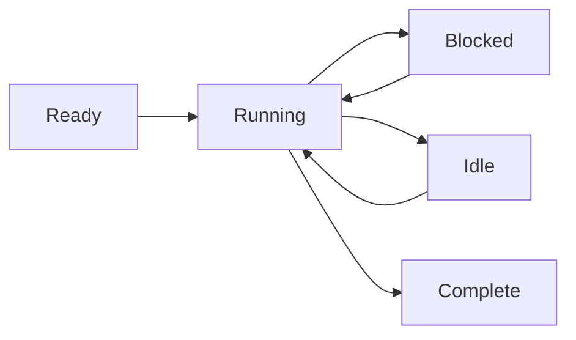

# Process Model

Wippy executes code in isolated processes: lightweight state machines that communicate through messages rather than shared memory. This actor model gives each process its own state and lifecycle.

This page explains the lifecycle and isolation model. Use the [Process
Management reference](lua/core/process.md) for spawn, messaging, monitoring,
registry, and upgrade APIs. See [Process Host and
Services](system/process-host.md) for runtime-managed service fields.

## State Machine Execution

Each process initializes, advances through execution, yields on blocking operations, and closes when complete. The scheduler multiplexes processes across a worker pool and runs other work while a process waits for I/O.

Processes support multiple concurrent yields, allowing code to start several asynchronous operations and wait for any or all of them without spawning additional processes.


```mermaid
flowchart LR
    Ready --> Running
    Running --> Blocked
    Running --> Idle
    Blocked --> Running
    Idle --> Running
    Running --> Complete
```

Processes are not limited to Lua. The runtime also supports WebAssembly modules through the `process.wasm` kind, and its process architecture can support other state-machine implementations.

<warning>
Processes are lightweight but not free. Each process carries a small baseline cost for its state, inbox, and scheduler bookkeeping, and dynamic allocations grow that footprint during execution.
</warning>

## Process Hosts

Wippy can run multiple process hosts within one runtime, each with its own capabilities and security boundaries. Privileged system processes can run in a host separate from hosts that execute user sessions.

Some hosts are specialized. The Terminal host, for example, runs a single process and grants it access to I/O operations that other hosts deny. Separate hosts allow one deployment to run processes with different trust levels.

## Security Model

Each process executes under an actor identity and security policy. This is typically the user who initiated the call, while system processes use a system actor with different privileges.

Access control applies at multiple levels. Security policy can restrict individual process operations and message delivery between hosts. The policy attached to the current actor determines which operations are permitted.

For the security implications of process isolation, see the [Security Model](concepts/security-model.md).

## Spawning Processes

Create background processes with `process.spawn()`:

```lua
local pid = process.spawn("app.workers:handler", "app:processes", arg1, arg2)
```

The first argument is the registry entry, the second is the process host, and remaining arguments pass to the process.

Spawn variants control lifecycle relationships:

| Function | Behavior |
|----------|----------|
| `spawn` | Start an independent process |
| `spawn_monitored` | Receive EXIT events when child exits |
| `spawn_linked` | Bidirectional—either crash notifies the other |

## Message Passing

Processes communicate through messages rather than shared memory:

```lua
process.send(target_pid, "topic", payload)
```

Messages from the same sender arrive in order. Messages from different senders may interleave. Delivery is fire-and-forget—use request-response patterns when you need confirmation.

<note>
Processes can register in a local name registry and be addressed by name instead of PID (e.g., `session_manager`). Names can also be registered cluster-wide for cross-node addressing via `process.registry` using EVENTUAL (gossip-based), CONSISTENT, or STRONG (both Raft-backed) scopes.
</note>

## Supervision

Any process can supervise other processes by monitoring them. A supervisor starts monitored children, watches for EXIT events, and decides whether to restart them after failure.

```lua
local worker = process.spawn_monitored("app.workers:handler", "app:processes")
local event = process.events():receive()

if event.kind == process.event.EXIT and event.result.error then
    worker = process.spawn_monitored("app.workers:handler", "app:processes")
end
```

At the runtime level, services can start and supervise long-running processes. Define a `process.service` entry to have the runtime manage a process:

```yaml
- name: worker.service
  kind: process.service
  process: app.workers:handler
  host: app:processes
  lifecycle:
    auto_start: true
    restart:
      max_attempts: 5
      initial_delay: 1s
      max_delay: 30s
      backoff_factor: 2.0
```

The service starts automatically, restarts on crash with backoff, and integrates with the runtime's lifecycle management.

## Process Upgrading

Running processes can upgrade their code without losing identity. Call `process.upgrade()` to swap to a new definition while preserving PID, mailbox, and supervision relationships:

```lua
process.upgrade("app.workers:v2", current_state)
```

The first argument is the new registry entry (or nil to reload the current definition). Additional arguments pass to the new version, letting you carry state across the upgrade. The process resumes execution with the new code immediately.

The runtime caches compiled prototypes to avoid repeated compilation. If an upgrade fails, the process crashes and normal supervision behavior applies; a monitoring parent can restart it or escalate the failure.

## Scheduling

The actor scheduler uses work-stealing across CPU cores. Each worker has a local queue for cache locality, plus a global queue for distributing work. Processes yield on blocking operations so other processes can run on the worker pool.
