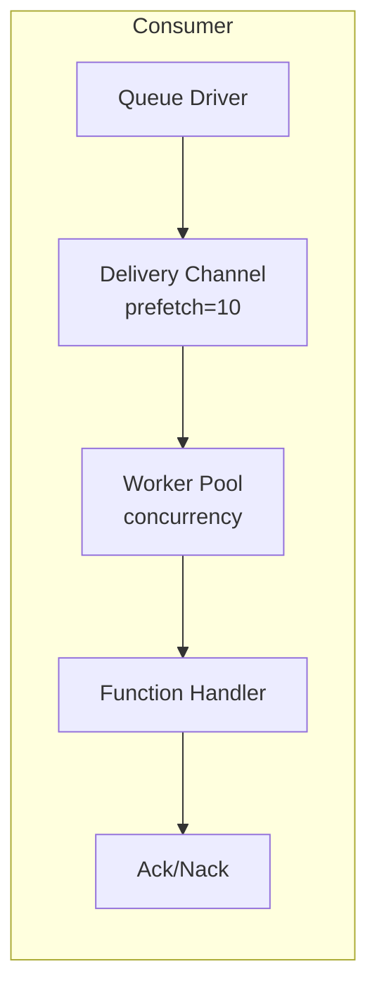

# Queue Consumers

Queue consumers deliver messages from a queue to function handlers through a configurable worker pool.

## Overview



## Configuration

| Option | Default | Max | Description |
|--------|---------|-----|-------------|
| `queue` | Required | - | Queue registry ID |
| `func` | Required | - | Handler function registry ID |
| `concurrency` | 1 | 1000 | Worker count |
| `prefetch` | 10 | 10000 | Shared delivery-buffer size; AMQP also applies it as the channel QoS prefetch count |
| `auto_ack` | false | - | Backend-specific auto-ack option; for AMQP, `true` asks the broker to acknowledge on delivery |
| `driver_options` | `{}` | - | Driver-specific consumer options |

## Entry Definition

```yaml
- name: order_consumer
  kind: queue.consumer
  queue: app:orders
  func: app:process_order
  concurrency: 5
  prefetch: 20
  lifecycle:
    auto_start: true
    requires:
      - app:orders
```

## Handler Function

The handler function receives the body after the queue's codec decodes it. Use `queue.message()` to access the current delivery and its metadata:

```lua
-- process_order.lua
local queue = require("queue")
local logger = require("logger")

local function main(order)
    local msg, msg_err = queue.message()
    if msg_err then
        return nil, msg_err
    end

    logger:info("processing order", {
        message_id = msg:id(),
        order_id = order.id
    })

    return {processed = true, order_id = order.id}
end

return {main = main}
```

```yaml
- name: process_order
  kind: function.lua
  source: file://process_order.lua
  method: main
  modules:
    - queue
    - logger
```

## Acknowledgment

Unless the handler explicitly settles the delivery, the consumer uses the function invocation result:

| Handler outcome | Action | Effect |
|-----------------|--------|--------|
| Completes without an invocation error | Ack | Message removed from queue |
| Returns or raises an invocation error | Nack | Redelivery is driver-dependent |

Ordinary return values, including `false`, do not select acknowledgment behavior. Call `msg:ack()` or `msg:nack()` to settle explicitly. Settlement is single-shot: the first settlement wins. With AMQP `auto_ack: true`, the broker acknowledges on delivery, so a later handler failure cannot cause broker redelivery.

## Worker Pool

- Workers run as concurrent goroutines.
- Each worker processes one message at a time.
- Workers pull from a shared delivery channel. The next idle worker receives the next message, without guaranteed ordering or rotation across workers.
- The prefetch buffer allows the driver to deliver messages ahead of processing.

### Example

```
concurrency: 3
prefetch: 10

Flow:
1. Driver delivers up to 10 messages to buffer
2. 3 workers pull from buffer concurrently
3. As workers finish, buffer refills
4. Backpressure when all workers busy and buffer full
```

## Graceful Shutdown

During shutdown, the consumer:

1. Stops accepting new deliveries
2. Cancels worker contexts
3. Waits for in-flight handlers, up to the stop timeout
4. Returns a timeout error if workers do not finish

## Queue Declaration

```yaml
# Queue driver (memory for dev/test)
- name: queue_driver
  kind: queue.driver.memory
  lifecycle:
    auto_start: true

# Queue definition
- name: orders
  kind: queue.queue
  driver: app:queue_driver
  queue_name: orders        # Override name (default: entry name)
  codec: json/plain         # Payload codec (optional; json/plain is the default)
  dead_letter:              # Accepted configuration; not enforced by built-in drivers
    queue: app:dlq
    max_attempts: 5
  driver_options:
    memory:
      max_length: 10000     # Memory driver: bounded queue size
```

| Field | Description |
|-------|-------------|
| `queue_name` | Override queue name (default: entry ID name) |
| `codec` | Payload codec name |
| `dead_letter.queue` | Registry ID accepted for a dead-letter queue; not enforced by built-in drivers |
| `dead_letter.max_attempts` | Attempt count accepted in configuration; not enforced by built-in drivers |
| `driver_options` | Driver-specific settings keyed by driver name |

<note>
No built-in driver currently counts attempts or routes messages from the `dead_letter` block. The runtime does not translate that block into AMQP queue arguments, and ordinary AMQP consumer failures request requeue. Broker-side dead-lettering must therefore be configured and triggered outside this block. The memory driver does not route to a DLQ.
</note>

## Memory Driver

The built-in in-memory driver is intended for development and testing:

- Its kind is `queue.driver.memory`.
- Messages are stored in memory.
- Nack attempts to re-enqueue a cloned message at the end of the queue; that attempt can fail when the bounded queue is full.
- Messages do not persist across restarts.

## See Also

- [Message Queue](lua/storage/queue.md) — Queue module reference
- [Queue Configuration](system/queue.md) — Queue drivers and entry definitions
- [Supervision](guides/supervision.md) — Consumer lifecycle
- [Process Management](lua/core/process.md) — Process spawning and communication
