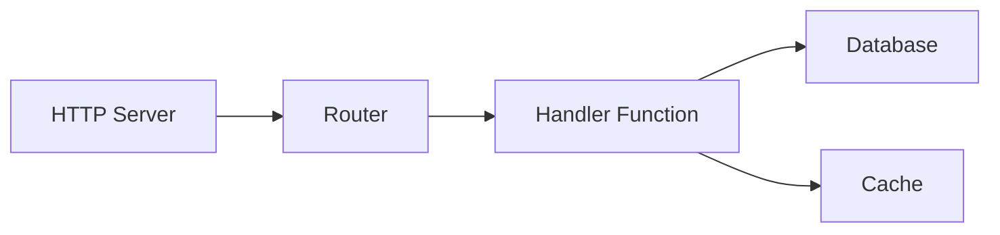
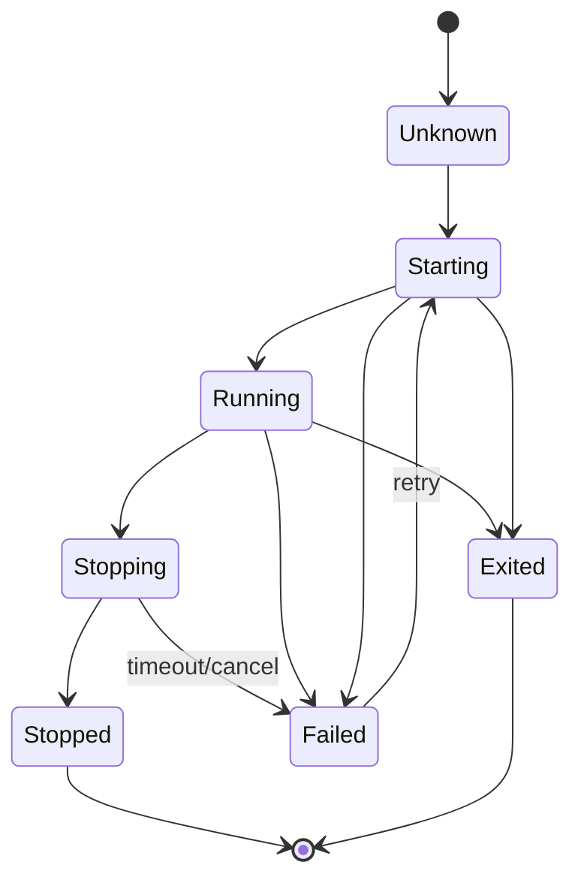

# Supervision

The supervisor manages service startup, dependency order, restarts, and graceful shutdown. Services with `auto_start: true` start when the application boots.

## Lifecycle Configuration

Services register with the supervisor using a `lifecycle` block. For processes, use `process.service` to wrap a process definition:

```yaml
# Process definition (the code)
- name: worker_process
  kind: process.lua
  source: file://worker.lua
  method: main

# Supervised service (wraps the process with lifecycle management)
- name: worker
  kind: process.service
  process: app:worker_process
  host: app:processes
  lifecycle:
    auto_start: true
    startup: required
    start_timeout: 30s
    stop_timeout: 10s
    stable_threshold: 5s
    requires:
      - app:database
    restart:
      initial_delay: 2s
      max_delay: 60s
      max_attempts: 10
```

`host` must reference a configured process host. The `requires` entry must resolve either to another supervised service or, through registry dependency extraction, to a supervised service that owns the referenced resource.

| Field | Default | Description |
|-------|---------|-------------|
| `auto_start` | `false` | Start automatically when supervisor starts |
| `startup` | `required` | Startup policy for an auto-start root: `required` blocks boot on failure; `optional` may fail and keep retrying without blocking independent branches |
| `start_timeout` | `10s` | Maximum time allowed for startup |
| `stop_timeout` | `10s` | Maximum time for graceful shutdown |
| `stable_threshold` | `5s` | Runtime after which a later failure resets the retry counter |
| `requires` | `[]` | Services that must be running first (legacy alias: `depends_on`) |
| `startup` | `required` | `required` reports a failed or blocked auto-start as a transaction error; `optional` lets the service keep retrying in the background without failing the batch |

## Dependency Resolution

The supervisor resolves dependencies from two sources:

1. **Explicit dependencies** declared in `requires` (or the legacy `depends_on`)
2. **Registry-extracted dependencies** from entry references (e.g., `database: app:db` in your config)



Dependencies start before their dependents. If Service C depends on A and B, both dependencies must reach the `Running` state before C starts.

<tip>
You do not need to repeat an infrastructure reference in <code>requires</code> when registry dependency extraction can trace that reference to a supervised service. Use <code>requires</code> for lifecycle dependencies that are not already expressed by entry references.
</tip>

## Restart Policy

When a service fails, the supervisor retries according to its `restart` block:

```yaml
lifecycle:
  restart:
    initial_delay: 1s      # First retry wait
    max_delay: 90s         # Accepted backoff cap; see current behavior below
    backoff_factor: 2.0    # Accepted multiplier; see current behavior below
    jitter: 0.1            # ±10% randomization
    max_attempts: 0        # 0 = infinite retries
```

In runtime v0.3.32a, the supervisor constructs a new backoff calculator for each retry and takes only its first interval. Each retry therefore waits `initial_delay` with the configured jitter (0.9s–1.1s for the values above). `backoff_factor` and `max_delay` are accepted configuration fields but do not change this schedule in the pinned runtime.

`max_attempts` counts the initial failed start. A value of `1` permits no retry, and `10` permits at most nine follow-up starts. A value of `0` allows unlimited attempts.

When a service runs longer than `stable_threshold`, its retry counter resets, so later failures start from the initial retry delay.

### Terminal Errors

These errors stop retry attempts:

- Context cancellation
- Explicit termination request
- Errors marked as non-retryable

## Security Context

Services can run with a specific security identity:

```yaml
# Process definition
- name: admin_worker_process
  kind: process.lua
  source: file://admin_worker.lua
  method: main

# Supervised service with security context
- name: admin_worker
  kind: process.service
  process: app:admin_worker_process
  host: app:processes
  lifecycle:
    auto_start: true
    security:
      actor:
        id: "service:admin-worker"
        meta:
          role: admin
      groups:
        - app:admin_policies
      policies:
        - app:data_access
```

The security context defines:

| Field | Description |
|-------|-------------|
| `actor.id` | Identity string for this service |
| `actor.meta` | Key-value metadata (role, permissions, etc.) |
| `groups` | Policy groups to apply |
| `policies` | Individual policies to apply |

Code running in the service inherits this security context. The `security` module can use it for permission checks:

```lua
local security = require("security")

if security.can("delete", "users") then
    -- allowed
end
```

<note>
When no security block is configured, the supervisor adds no service-specific actor or policy scope; any security values already present in the parent context remain inherited. In strict mode (default), a check with an incomplete resulting security context is denied. Configure a complete service security context for services that need authorization.
</note>

## Re-registration and Replacement

A registry change can re-register an ID that already has a running controller. If the registration carries the same service instance, nothing is disturbed. If it carries a **different** instance — the manager rebuilt the service because its configuration changed — the supervisor retires the existing controller and adopts the replacement.

Retirement covers more than the one service. A running dependent captured the superseded instance, so it cannot keep running against a service that is being replaced underneath it; the retirement closure is the replaced service plus every running service that depends on it, stopped in dependency order (dependents first). Services already stopped are not stopped a second time — a manager that stops its own instance before re-registering does not see a redundant `Stop`.

The handover is transactional:

1. The plan is computed without touching anything, so a planning failure leaves the running set intact.
2. The stop batch runs. **If any stop fails, the handover is rejected**: the services the batch already stopped are brought back up and the error is reported. A service that could not be brought back is named in that error. The supervisor ends up owning the same running set it had before the commit, never a half-retired one.
3. Only after the batch succeeds are the retired controllers dropped and canceled, freeing the superseded service instances.
4. The replacement is created and started through the same dependency-aware sequencer as any other start, and the dependents that were stopped for the handover come back up against the adopted instance.

A service that was running before the replacement is restarted afterwards even when the new registration sets `auto_start: false` — replacing an active service is an update, not an implicit stop. Restarting a stopped dependent is governed by its own restart policy and does not gate the commit.

## Service States



The supervisor transitions services through these states:

| State | Description |
|-------|-------------|
| `Unknown` | Registered but not started |
| `Starting` | Startup in progress |
| `Running` | Operating normally |
| `Stopping` | Graceful shutdown in progress |
| `Stopped` | Stop operation completed; service-reported stop details may still contain an error |
| `Exited` | Terminated by explicit request or a non-retryable/terminal error |
| `Failed` | Error occurred, may retry |

## Startup and Shutdown Order

**Startup:** Dependencies start before dependents. Services at the same dependency level can start in parallel.

**Shutdown:** Dependents stop before dependencies, allowing dependent services to finish first.

```
Startup:  database → cache → handler → http_server
Shutdown: http_server → handler → cache → database
```

On SIGINT or SIGTERM the runtime begins a graceful shutdown and the whole sequence runs under a single budget, `shutdown.timeout` in the runtime config (default 30s). That budget is a fresh deadline that does not inherit the interrupted context, so a Ctrl-C does not cut component shutdown short; per-service `stop_timeout` still bounds each individual stop within it. A second signal skips the sequence and exits immediately.

```yaml
# .wippy.yaml
shutdown:
  timeout: 60s
```

## See Also

- [Process Model](concepts/process-model.md) — Process lifecycle
- [Configuration](guides/configuration.md) — YAML configuration format
- [Security Module](lua/security/security.md) — Permission checks in Lua
