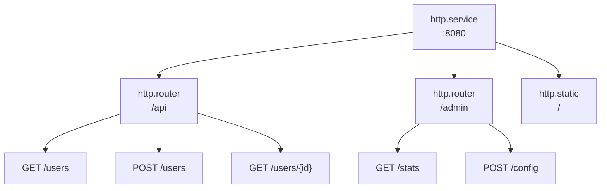

# Routing

Routers group endpoints under URL prefixes and apply shared middleware. Endpoints define HTTP handlers.

## Architecture



Entries reference parents via metadata:
- Routers: `meta.server: app:gateway`
- Endpoints: `meta.router: app:api`

## Router Configuration

```yaml
- name: api
  kind: http.router
  meta:
    server: gateway
  prefix: /api/v1
  middleware:
    - cors
    - compress
  options:
    cors.allow.origins: "*"
  post_middleware:
    - endpoint_firewall
```

| Field | Type | Description |
|-------|------|-------------|
| `meta.server` | Registry ID | Parent HTTP server |
| `prefix` | string | URL prefix for all routes |
| `middleware` | []string | Pre-match middleware |
| `options` | map | Middleware options |
| `post_middleware` | []string | Post-match middleware |
| `post_options` | map | Post-match middleware options |

## Endpoint Configuration

```yaml
- name: get_user
  kind: http.endpoint
  meta:
    router: api
  method: GET
  path: /users/{id}
  func: app.users:get_user
```

| Field | Type | Description |
|-------|------|-------------|
| `meta.router` | Registry ID | Parent router |
| `method` | string | HTTP method (GET, POST, PUT, DELETE, PATCH, HEAD) |
| `path` | string | URL path pattern (starts with `/`) |
| `func` | Registry ID | Handler function |

## Path Parameters

Use `{param}` syntax for URL parameters:

```yaml
- name: get_post
  kind: http.endpoint
  meta:
    router: api
  method: GET
  path: /users/{user_id}/posts/{post_id}
  func: get_user_post
```

Access in handler:

```lua
local http = require("http")

local function handler()
    local req = http.request()
    local user_id = req:param("user_id")
    local post_id = req:param("post_id")

    -- ...
end
```

### Wildcard Paths

Capture remaining path segments with `{param...}`:

```yaml
- name: serve_files
  kind: http.endpoint
  meta:
    router: api
  method: GET
  path: /files/{filepath...}
  func: serve_file
```

```lua
-- Request: GET /api/v1/files/docs/guides/readme.md
local file_path = req:param("filepath")  -- "docs/guides/readme.md"
```

The wildcard must be the last segment in the path.

## Handler Functions

Endpoint handlers use the `http` module to access request and response objects. See [HTTP Module](lua/http/http.md) for the complete API.

```lua
local http = require("http")
local json = require("json")

local function handler()
    local req = http.request()
    local res = http.response()

    local user_id = req:param("id")
    local user = get_user(user_id)

    res:status(200)
    res:write(json.encode(user))
end

return { handler = handler }
```

## Middleware Options

Middleware options use dot notation with the middleware name as prefix:

```yaml
middleware:
  - cors
  - ratelimit
  - token_auth
options:
  cors.allow.origins: "https://app.example.com"
  cors.allow.methods: "GET,POST,PUT,DELETE"
  ratelimit.requests: "100"
  ratelimit.window: "1m"
  token_auth.store: "app:tokens"
  token_auth.header.name: "Authorization"
```

Post-match middleware uses `post_options`:

```yaml
post_middleware:
  - endpoint_firewall
post_options:
  endpoint_firewall.default_policy: "deny"
```

## Pre-Match vs Post-Match Middleware

**Pre-match** (`middleware`) runs before route matching:
- CORS (handles OPTIONS preflight)
- Compression
- Rate limiting
- Real IP detection
- Token authentication (context enrichment)

**Post-match** (`post_middleware`) runs after route is matched:
- Endpoint firewall (needs route info for authorization)
- Resource firewall
- WebSocket relay

```yaml
middleware:        # Pre-match: all requests to this router
  - cors
  - compress
  - token_auth     # Enriches context with actor/scope

post_middleware:   # Post-match: matched routes only
  - endpoint_firewall  # Uses actor from token_auth
```

<tip>
Token authentication can be pre-match because it only enriches context—it doesn't block requests. Authorization happens in post-match middleware like <code>endpoint_firewall</code> which uses the actor set by <code>token_auth</code>.
</tip>

## Complete Example

```yaml
version: "1.0"
namespace: app

entries:
  # Server
  - name: gateway
    kind: http.service
    addr: ":8080"
    lifecycle:
      auto_start: true

  # API Router
  - name: api
    kind: http.router
    meta:
      server: gateway
    prefix: /api/v1
    middleware:
      - cors
      - compress
      - ratelimit
    options:
      cors.allow.origins: "https://app.example.com"
      ratelimit.requests: "100"
      ratelimit.window: "1m"

  # Handler function
  - name: get_users
    kind: function.lua
    source: file://handlers/users.lua
    method: list
    modules:
      - http
      - json
      - sql

  # Endpoints
  - name: list_users
    kind: http.endpoint
    meta:
      router: api
    method: GET
    path: /users
    func: get_users

  - name: get_user
    kind: http.endpoint
    meta:
      router: api
    method: GET
    path: /users/{id}
    func: app:get_user_by_id

  - name: create_user
    kind: http.endpoint
    meta:
      router: api
    method: POST
    path: /users
    func: app:create_user
```

## Protected Routes

Common pattern with authentication:

```yaml
entries:
  # Public routes (no auth)
  - name: public
    kind: http.router
    meta:
      server: gateway
    prefix: /api/public
    middleware:
      - cors

  # Protected routes
  - name: protected
    kind: http.router
    meta:
      server: gateway
    prefix: /api
    middleware:
      - cors
      - token_auth
    options:
      token_store: app:tokens
    post_middleware:
      - endpoint_firewall
```

## See Also

- [Server](http/server.md) - HTTP server configuration
- [Static Files](http/static.md) - Static file serving
- [Middleware](http/middleware.md) - Available middleware
- [HTTP Module](lua/http/http.md) - Lua HTTP API
