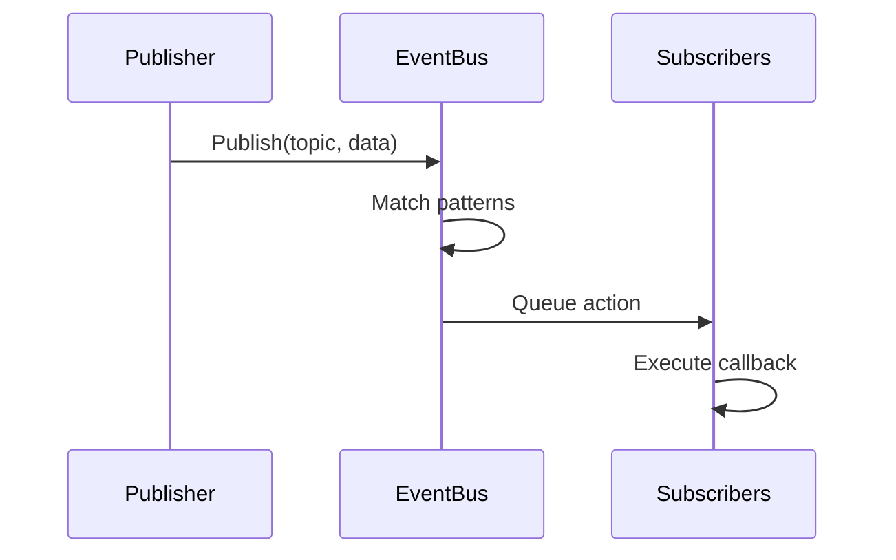
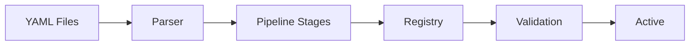
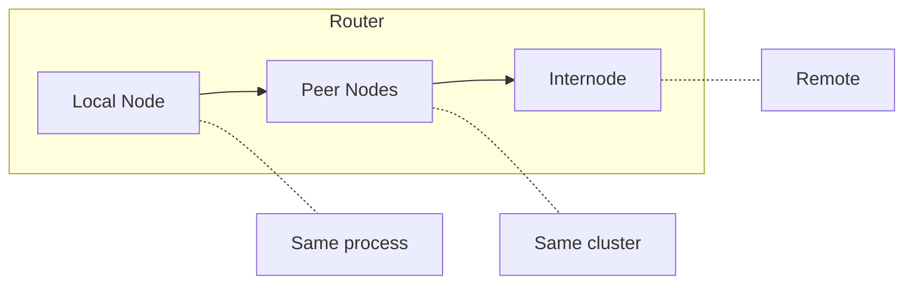

# Architecture

<note>
This page is a work in progress. Content may be incomplete or change.
</note>

Wippy is a layered system built on Go. Components initialize in dependency order, communicate through an event bus, and execute Lua processes via a work-stealing scheduler.

## Layers

| Layer | Components |
|-------|------------|
| Application | Lua processes, functions, workflows |
| Runtime | Lua engine (gopher-lua), 50+ modules |
| Services | HTTP, Queue, Storage, Temporal |
| System | Topology, Factory, Functions, Contracts |
| Core | Scheduler, Registry, Dispatcher, EventBus, Relay |
| Infrastructure | AppContext, Logger, Transcoder |

Each layer depends only on layers below it. The Core layer provides fundamental primitives, while Services build higher-level abstractions on top.

## Boot Sequence

Application startup proceeds through four phases.

### Phase 1: Infrastructure

Creates core infrastructure before any components load:

| Component | Purpose |
|-----------|---------|
| AppContext | Sealed dictionary for component references |
| EventBus | Pub/sub for inter-component communication |
| Transcoder | Payload serialization (JSON, YAML, Lua) |
| Logger | Structured logging with event streaming |
| Relay | Message routing (Node, Router, Mailbox) |

### Phase 2: Component Loading

The Loader resolves dependencies via topological sort and loads components level by level. Components at the same level load in parallel.

| Level | Components | Dependencies |
|-------|------------|--------------|
| 0 | PIDGen | none |
| 1 | Dispatcher | PIDGen |
| 2 | Registry | Dispatcher |
| 3 | Finder, Supervisor | Registry |
| 4 | Topology | Supervisor |
| 5 | Lifecycle | Topology |
| 6 | Factory | Lifecycle |
| 7 | Functions | Factory |

Each component attaches itself to context during Load, making services available to dependent components.

### Phase 3: Activation

After all components load:

1. **Freeze Dispatcher** - Locks command handler registry for lock-free lookups
2. **Seal AppContext** - No more writes allowed, enables lock-free reads
3. **Start Components** - Calls `Start()` on each component with `Starter` interface

### Phase 4: Entry Loading

Registry entries (from YAML files) are loaded and validated:

1. Entries parsed from project files
2. Pipeline stages transform entries (override, link, bytecode)
3. Services marked `auto_start: true` begin running
4. Supervisor monitors registered services

## Components

Components are Go services that participate in application lifecycle.

### Lifecycle Phases

| Phase | Method | Purpose |
|-------|--------|---------|
| Load | `Load(ctx) (ctx, error)` | Initialize and attach to context |
| Start | `Start(ctx) error` | Begin active operation |
| Stop | `Stop(ctx) error` | Graceful shutdown |

Components declare dependencies. The loader builds a directed acyclic graph and executes in topological order. Shutdown occurs in reverse order.

### Standard Components

| Component | Dependencies | Purpose |
|-----------|--------------|---------|
| PIDGen | none | Process ID generation |
| Dispatcher | PIDGen | Command handler dispatch |
| Registry | Dispatcher | Entry storage and versioning |
| Finder | Registry | Entry lookup and search |
| Supervisor | Registry | Service restart policies |
| Topology | Supervisor | Process parent/child tree |
| Lifecycle | Topology | Service lifecycle management |
| Factory | Lifecycle | Process spawning |
| Functions | Factory | Stateless function calls |

## Event Bus

Asynchronous pub/sub for inter-component communication.

### Design

- Single dispatcher goroutine processes all events
- Queue-based action delivery prevents blocking publishers
- Pattern matching supports exact topics and wildcards (`*`)
- Context-based lifecycle ties subscriptions to cancellation

### Event Flow

### Common Topics

| Topic | Publisher | Purpose |
|-------|-----------|---------|
| `registry.entry.*` | Registry | Entry changes |
| `process.started` | Topology | Process lifecycle |
| `process.stopped` | Topology | Process lifecycle |
| `supervisor.state.*` | Supervisor | Service state changes |

## Registry

Versioned storage for entry definitions.

### Features

- **Versioned State** - Each mutation creates new version
- **History** - SQLite-backed history for audit trail
- **Observation** - Watch specific entries for changes
- **Event-driven** - Publishes events on mutations

### Entry Lifecycle

Pipeline stages transform entries:

| Stage | Purpose |
|-------|---------|
| Override | Apply config overrides |
| Disable | Remove entries by pattern |
| Link | Resolve requirements and dependencies |
| Bytecode | Compile Lua to bytecode |
| EmbedFS | Collect filesystem entries |

## Relay

Message routing between processes across nodes.

### Three-Tier Routing

1. **Local** - Direct delivery within same node
2. **Peer** - Forward to peer nodes in cluster
3. **Internode** - Route to remote nodes via network

### Mailbox

Each node has a mailbox with worker pool:

- FNV-1a hashing assigns senders to workers
- Preserves per-sender message ordering
- Workers process messages concurrently
- Back-pressure when queue fills

## AppContext

Sealed dictionary for component references.

| Property | Behavior |
|----------|----------|
| Before seal | RWMutex-protected writes |
| After seal | Lock-free reads, panics on write |
| Duplicate keys | Panic |
| Type safety | Typed getter functions |

Components attach services during Load phase. After boot completes, AppContext is sealed for optimal read performance.

## Shutdown

Graceful shutdown proceeds in reverse dependency order:

1. SIGINT/SIGTERM triggers shutdown
2. Supervisor stops managed services
3. Components with `Stopper` interface receive `Stop()`
4. Infrastructure cleanup

Second signal forces immediate exit.

## See Also

- [Scheduler](internals/scheduler.md) - Process execution
- [Event Bus](internals/events.md) - Pub/sub system
- [Registry](internals/registry.md) - State management
- [Command Dispatch](internals/dispatch.md) - Yield handling
