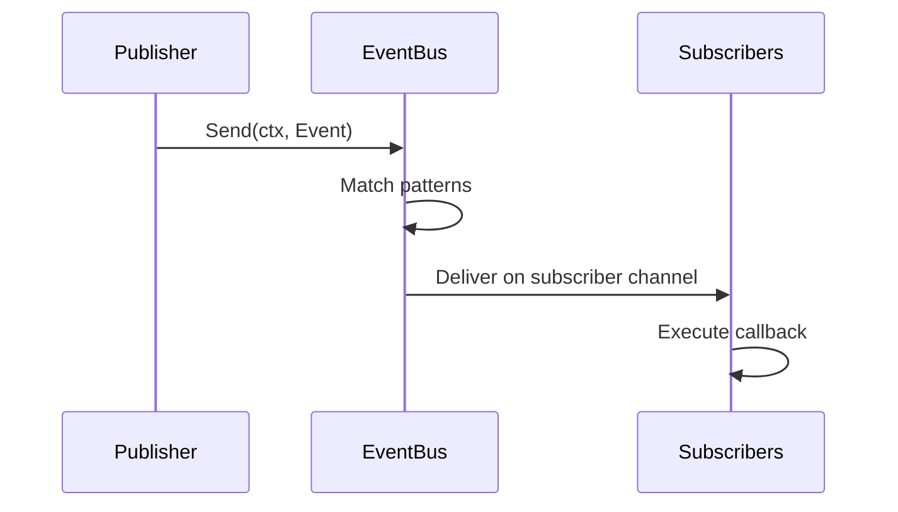
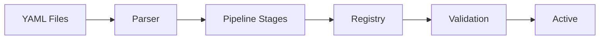
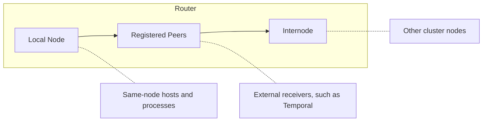

# Architecture

Wippy is a layered system built on Go. Components initialize in dependency order, communicate through an event bus, and execute Lua processes via a work-stealing scheduler.

This is an implementation reference. The diagrams and Go types describe runtime internals rather than application registry entries or extension APIs.

## Layers

| Layer | Components |
|-------|------------|
| Application | Lua processes, functions, workflows |
| Runtime | Lua engine (wippyai/go-lua) and runtime modules |
| Services | HTTP, Queue, Storage, Temporal |
| System | Topology, Factory, Functions, Contracts |
| Core | Scheduler, Registry, Dispatcher, EventBus, Relay |
| Infrastructure | AppContext, Logger, Transcoder |

Each layer depends only on layers below it. The Core layer provides fundamental primitives, while Services build higher-level abstractions on top.

## Boot Sequence

Application startup proceeds through four phases.

### Phase 1: Infrastructure

Creates core infrastructure before any components load:

| Component | Purpose |
|-----------|---------|
| AppContext | Sealed dictionary for component references |
| EventBus | Pub/sub for inter-component communication |
| Transcoder | Payload serialization (JSON, YAML, Lua) |
| Logger | Structured logging with event streaming |
| Relay | Message routing (Node, Router, Mailbox) |

### Phase 2: Component Loading

The Loader resolves dependencies via topological sort and loads components
sequentially, level by level. Components within a level are also loaded one at
a time.

Dependency edges determine the levels; package groups such as Core and System
do not impose a separate global order. Components with no dependency edge may
therefore load in the same level regardless of package group.

Each component attaches itself to context during Load, making services available to dependent components.

### Phase 3: Activation

After all components load:

1. **Start runtime services** - Calls `StartRuntimeServices(ctx)`
2. **Freeze Dispatcher** - Locks command handler registry for lock-free lookups
3. **Seal AppContext** - No more writes allowed, enables lock-free reads
4. **Start Components** - Calls `Start()` on each component with `Starter` interface

### Phase 4: Entry Loading

Registry entries from `_index.json`, `_index.yaml`, and `_index.yml` project
manifests are loaded and validated:

1. Entries parsed from project files
2. Pipeline stages transform entries (override, link, bytecode)
3. Services marked `auto_start: true` begin running
4. Supervisor monitors registered services

## Components

Components are Go services that participate in application lifecycle.

### Lifecycle Phases

| Phase | Method | Purpose |
|-------|--------|---------|
| Load | `Load(ctx) (ctx, error)` | Initialize and attach to context |
| Start | `Start(ctx) error` | Begin active operation |
| Stop | `Stop(ctx) error` | Graceful shutdown |

Components declare dependencies. The loader builds a directed acyclic graph and executes in topological order. Shutdown occurs in reverse order.

### Standard Components

| Component | Dependencies | Purpose |
|-----------|--------------|---------|
| PIDGen | none | Process ID generation |
| Dispatcher | none | Command handler dispatch |
| Registry | Artifact | Entry storage and versioning |
| Finder | Registry | Entry lookup and search |
| Supervisor | Registry | Service restart policies |
| Topology | none | Process parent/child tree |
| Lifecycle | Topology | Service lifecycle management |
| Factory | none | Process spawning |
| Functions | Registry | Pooled function execution |

## Event Bus

Asynchronous pub/sub for inter-component communication.

### Design

- Single dispatcher goroutine processes all events
- Publishers enqueue actions without waiting for subscriber delivery
- Pattern matching supports exact values, `*`, `**`, and segment alternation
- Context-based lifecycle ties subscriptions to cancellation

### Event Flow

```mermaid
sequenceDiagram
    participant P as Publisher
    participant B as EventBus
    participant S as Subscribers

    P->>B: Send(ctx, Event)
    B->>B: Match patterns
    B->>S: Deliver on subscriber channel
    S->>S: Execute callback
```

### Common Topics

Events carry separate `System` and `Kind` fields. Built-in systems publish:

| System | Kind | Purpose |
|--------|------|---------|
| `registry` | `entry.create`, `entry.update`, `entry.delete`, `entry.accept`, `entry.reject` | Entry mutations |
| `registry` | `registry.begin`, `registry.commit`, `registry.discard` | Transaction boundaries |
| `process` | `factory.register`, `factory.delete`, `factory.accept`, `factory.reject` | Factory registration for process kinds |
| `supervisor` | `service.register`, `service.remove`, `service.update`, `service.start`, `service.stop` | Service lifecycle |

## Registry

Versioned storage for entry definitions.

### Features

- **Versioned State** - Each mutation creates new version
- **History** - In-memory history by default; optional SQLite-backed history for a durable audit trail (history_type: sqlite)
- **Observation** - Watch specific entries for changes
- **Event-driven** - Publishes events on mutations

### Entry Lifecycle

```mermaid
flowchart LR
    YAML[YAML Files] --> Parser
    Parser --> Stages[Pipeline Stages]
    Stages --> Registry
    Registry --> Validation
    Validation --> Active
```

Pipeline stages transform entries:

| Stage | Purpose |
|-------|---------|
| Override | Apply config overrides |
| Disable | Remove entries by pattern |
| Link | Resolve requirements and dependencies |
| Bytecode | Compile Lua to bytecode |
| EmbedFS | Collect filesystem entries |

## Relay

Message routing between processes across nodes.

### Three-Tier Routing

```mermaid
flowchart LR
    subgraph Router
        Local[Local Node] --> Peer[Registered Peers]
        Peer --> Inter[Internode]
    end

    Local -.- L[Same-node hosts and processes]
    Peer -.- P[External receivers, such as Temporal]
    Inter -.- I[Other cluster nodes]
```

1. **Local** - Deliver directly between hosts and processes on the same node
2. **Peer** - Forward to a registered external receiver, such as Temporal
3. **Internode** - Fall back to network routing for another cluster node

### Mailbox

Each node has a mailbox with worker pool:

- FNV-1a hashing assigns senders to workers
- Preserves per-sender message ordering
- Workers process messages concurrently
- Back-pressure when queue fills

## AppContext

Sealed dictionary for component references.

| Property | Behavior |
|----------|----------|
| Before seal | Single-threaded writes during boot |
| After seal | Lock-free reads, panics on write |
| Duplicate keys | Panic |
| Type safety | Typed getter functions |

Components attach services during the Load phase. After boot completes, AppContext is sealed, allowing lock-free reads and preventing further writes.

## Shutdown

Graceful shutdown proceeds in reverse dependency order:

1. SIGINT/SIGTERM triggers shutdown
2. Supervisor stops managed services
3. Components with `Stopper` interface receive `Stop()`
4. Infrastructure cleanup

Second signal forces immediate exit.

## See Also

- [Scheduler](./scheduler.md) - Process execution
- [Event Bus](./events.md) - Pub/sub system
- [Registry](./registry.md) - State management
- [Command Dispatch](./dispatch.md) - Yield handling
