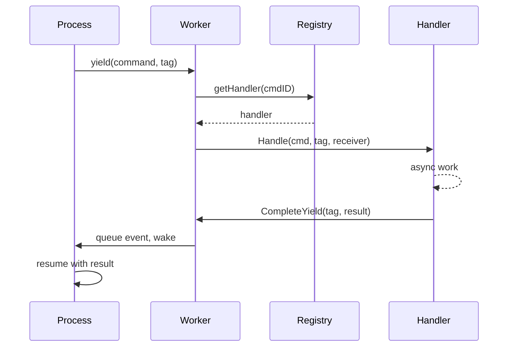

# Command Dispatch

Command dispatch routes process yields to handlers and returns correlated results through process event queues.

This is an extension and implementation reference. The custom command and dispatcher fragments assume an existing Go package, boot graph, command API, and service-specific error handling.

## Flow


```mermaid
sequenceDiagram
    participant P as Process
    participant W as Worker
    participant R as Registry
    participant H as Handler

    P->>W: yield(command, tag)
    W->>R: getHandler(cmdID)
    R-->>W: handler
    W->>H: Handle(cmd, tag, receiver)
    H-->>H: async work
    H->>W: CompleteYield(tag, result)
    W->>P: queue event, wake
    P->>P: resume with result
```

## Command Registry

The registry stores handlers in a hybrid structure:

```go
type Registry struct {
    handlers [256]Handler         // System commands: O(1) index
    extended map[CommandID]Handler // Extended commands: map lookup
    frozen   atomic.Bool          // Lock-free after boot
}
```

System commands (0-255) use array indexing. Extended commands use map lookup. After `Freeze()`, all lookups are lock-free.

### Command ID Ranges

| Range | Module | Examples |
|-------|--------|----------|
| 1-9 | process | Send, Spawn, Terminate, Cancel, Monitor, Unmonitor, Link, Unlink, Exec |
| 10, 14, 16, 18-23 | clock | Sleep, ticker, and timer operations |
| 30-34 | socket | Connect, Listen, Accept, Bind, Resolve |
| 50-57 | stream | Read, Write, Close, Seek, Flush, Stat, Scanner operations |
| 60-61 | http | Request, RequestBatch |
| 70-78 | tty | Terminal I/O |
| 80-85 | websocket | Connect, Send, Receive, Close, Ping, Subscribe |
| 90-91 | event | Subscribe, Send |
| 100-111 | sql | Query, Execute, Prepare, statement and transaction operations |
| 120-126 | store | Get, Set, Delete, Has, Entry, List, Put |
| 130-132 | security | ValidateToken, CreateToken, RevokeToken |
| 140-142 | function | Call, AsyncStart, AsyncCancel |
| 150 | exec | ProcessWait |
| 160-169 | cloudstorage | Object and multipart operations |
| 170-171 | eval | Compile, Run |
| 172 | cdc | Subscribe |
| 173-174 | cloudstorage | AbortMultipartUpload, OpenReader |
| 180-183 | workflow | SideEffect, Exec, Version, UpsertAttrs |
| 190-193 | contract | Open, Call, AsyncCall, AsyncCancel |
| 200-211 | pg (process group) | Join, Leave, GetMembers, GetLocalMembers, WhichGroups, Broadcast, BroadcastLocal, WhichLocalGroups, Monitor, Events, JoinGroups, LeaveGroups |
| 256+ | custom | User-defined services |

Packages reserve command-ID ownership from `init()` with
`MustRegisterCommands()`; ownership collisions panic while packages initialize.
During component loading, each service binds its handlers through
`Registrar.Register`. The dispatcher is frozen only after those handlers have
been installed.

## Defining Commands

Commands are data structures with a unique `CommandID`:

```go
const MyCommand dispatcher.CommandID = 256

type MyCmd struct {
    Input  string
    Option int
}

func (c *MyCmd) CmdID() dispatcher.CommandID { return MyCommand }
```

Reserve the command ID at package initialization:

```go
func init() {
    dispatcher.MustRegisterCommands("myservice", MyCommand)
}
```

## Dispatchers

A dispatcher groups related handlers. It implements `RegisterAll` to register handlers and lifecycle methods for setup/teardown:

```go
type Handler interface {
    Handle(ctx context.Context, cmd Command, tag uint64, receiver ResultReceiver) error
}

type ResultReceiver interface {
    CompleteYield(tag uint64, data any, err error)
}
```

```go
type Dispatcher struct {
    // service state
}

func (d *Dispatcher) RegisterAll(register func(id dispatcher.CommandID, h dispatcher.Handler)) {
    register(myapi.MyCommand, dispatcher.HandlerFunc(d.handleMyCommand))
}

func (d *Dispatcher) handleMyCommand(ctx context.Context, cmd Command, tag uint64, receiver ResultReceiver) error {
    c := cmd.(*myapi.MyCmd)
    go func() {
        result := doWork(c)
        if ctx.Err() == nil {
            receiver.CompleteYield(tag, result, nil)
        }
    }()
    return nil
}
```

Register as a boot component:

```go
func MyDispatcher() boot.Component {
    return boot.New(boot.P{
        Name:      "dispatcher.myservice",
        DependsOn: []boot.Name{DispatcherName},
        Load: func(ctx context.Context) (context.Context, error) {
            reg := dispatcher.GetRegistrar(ctx)
            svc := myservice.NewDispatcher()
            svc.RegisterAll(reg.Register)
            return ctx, nil
        },
    })
}
```

## Yields and Correlation

When a process needs async work, it yields a command with a correlation tag:

```go
type Yield struct {
    Cmd Command
    Tag uint64    // Process-local counter for correlation
}
```

The worker extracts yields from `StepOutput` after each step and dispatches them to handlers. Each tag uniquely identifies the request so results can be matched back.

## See Also

- [Scheduler](internals/scheduler.md) - Process execution
- [Modules](internals/modules.md) - Lua module integration
- [Process Model](concepts/process-model.md) - High-level concepts
