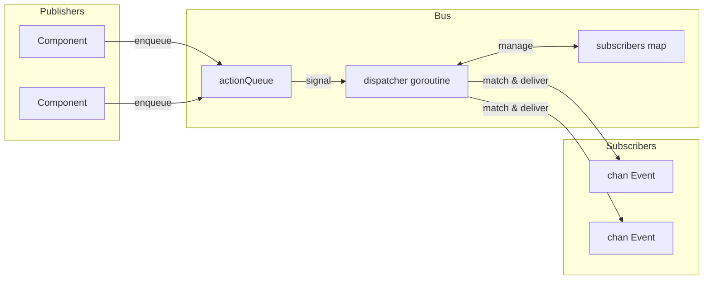

# Event Bus

The event bus is a pub/sub system using a single dispatcher goroutine. Publishers enqueue actions, the dispatcher processes them sequentially, and subscribers receive matching events on channels.

## Event Structure

```go
type Event struct {
    System string  // Component/module (e.g., "registry", "process")
    Kind   string  // Event type (e.g., "create", "update", "exit")
    Path   string  // Entity identifier
    Data   any     // Payload
}
```

## Bus Architecture



The bus stores state in a simple structure:

```go
type Bus struct {
    subscribers       map[SubscriberID]sub
    subscriberCounter uint64

    actionQueue []action
    spareQueue  []action
    actionMu    sync.Mutex
    actionReady chan struct{}  // buffered=1

    closed atomic.Bool
}
```

All mutations go through the dispatcher goroutine, eliminating race conditions without complex locking.

## Actions

Four action types flow through the queue:

| Action | Behavior |
|--------|----------|
| Subscribe | Adds subscriber to map, responds on done channel |
| Unsubscribe | Removes subscriber, responds on done channel |
| Send | Delivers event to matching subscribers |
| Stop | Clears subscribers, drains queue, exits loop |

Subscribe and Unsubscribe block until the dispatcher confirms. Send is fire-and-forget.

## Queue Swapping

The dispatcher uses slice swapping to avoid allocations in steady state:

```go
func (b *Bus) processActions() bool {
    b.actionMu.Lock()
    actions := b.actionQueue
    b.actionQueue = b.spareQueue[:0]
    b.spareQueue = nil
    b.actionMu.Unlock()

    for i := range actions {
        // process action
    }

    clear(actions)
    b.actionMu.Lock()
    b.spareQueue = actions[:0]
    b.actionMu.Unlock()
    return true
}
```

Two slices alternate: one for processing, one for new arrivals. The `actionReady` channel is buffered to 1, so signaling never blocks and multiple enqueues coalesce into one wakeup.

## Pattern Matching

Subscriptions compile patterns once at subscribe time:

```go
type sub struct {
    subID   SubscriberID
    ctx     context.Context
    system  *wildcard.Wildcard
    kind    *wildcard.Wildcard
    eventCh chan<- Event
}
```

The wildcard package supports three pattern types:

| Pattern | Matches |
|---------|---------|
| `registry` | Exact match only |
| `*` | Any single segment |
| `**` | Zero or more segments |
| `(a\|b)` | Alternation within segment |

Patterns split on `.` so `registry.*` matches `registry.create` but not `registry.entry.create`. The pattern `registry.**` matches all three of `registry`, `registry.create`, and `registry.entry.create`.

## Event Delivery

During Send processing, the dispatcher iterates subscribers:

```go
for id, s := range b.subscribers {
    if s.system != nil && !s.system.Match(a.event.System) {
        continue
    }
    if s.kind != nil && !s.kind.Match(a.event.Kind) {
        continue
    }

    select {
    case <-a.ctx.Done():
        goto cleanup
    case <-s.ctx.Done():
        expiredSubs = append(expiredSubs, id)
    case s.eventCh <- a.event:
    }
}
```

If a subscriber's context is canceled, it's marked for removal during that delivery pass. The event context can also cancel delivery mid-iteration.

## Lua Process Bridge

The events dispatcher bridges Go events to Lua processes. It subscribes once to all events (`"**"`) and routes internally based on process subscriptions:

```go
type Dispatcher struct {
    bus    event.Bus
    node   relay.Node
    subID  SubscriberID
    eventC chan event.Event

    mu   sync.RWMutex
    subs map[string]*subscription  // topic -> subscription
}
```

When a Lua process subscribes via `events.subscribe()`, the dispatcher stores the pattern and target PID. Matching events are packaged and sent via relay:

```go
func (d *Dispatcher) routeEvent(evt event.Event) {
    d.mu.RLock()
    defer d.mu.RUnlock()

    for _, sub := range d.subs {
        if !matchPattern(sub.system, evt.System) {
            continue
        }
        if sub.kind != "" && !matchPattern(sub.kind, evt.Kind) {
            continue
        }

        data := map[string]any{
            "system": evt.System,
            "kind":   evt.Kind,
            "path":   evt.Path,
        }
        if evt.Data != nil {
            data["data"] = evt.Data
        }

        pkg := relay.NewPackage(pid.PID{}, sub.pid, sub.topic, payload.New(data))
        d.node.Send(pkg)
    }
}
```

## Helper Types

### Subscriber

Wraps channel subscription with a callback:

```go
handler, err := eventbus.NewSubscriber(ctx, bus, "registry", "*.created",
    func(evt Event) {
        // handle
    })
defer handler.Close()
```

Spawns two goroutines: one reads events and calls the handler, another waits for context cancellation to unsubscribe.

### EventRouter

Manages multiple handlers with centralized lifecycle:

```go
router, err := eventbus.StartRouter(ctx, bus,
    WithHandlers(handler1, handler2),
    WithLogger(log))
defer router.Stop()
```

Each handler implements `Pattern()` and `Handle()`. The router creates a Subscriber for each and closes all on Stop.

### Awaiter

Synchronous wait for a specific event:

```go
awaiter := eventbus.NewAwaiter(bus, "registry", "accept")
waiter, _ := awaiter.Prepare(ctx, "service-id")
defer waiter.Close()

bus.Send(ctx, triggeringEvent)

result := waiter.Wait()  // blocks until match or timeout
```

The Prepare-then-Wait pattern avoids race conditions: subscribe before triggering the event that produces the response.

## Shutdown

1. `Stop()` atomically sets closed flag and enqueues Stop action
2. Dispatcher clears subscriber map
3. Remaining queued actions are drained:
   - Subscribe requests get "bus is closed" error
   - Unsubscribe requests complete immediately
   - Send events are dropped
4. WaitGroup completes

## See Also

- [Registry](internals/registry.md) - Primary event producer
- [Command Dispatch](internals/dispatch.md) - Process-to-handler routing
