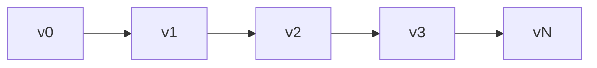
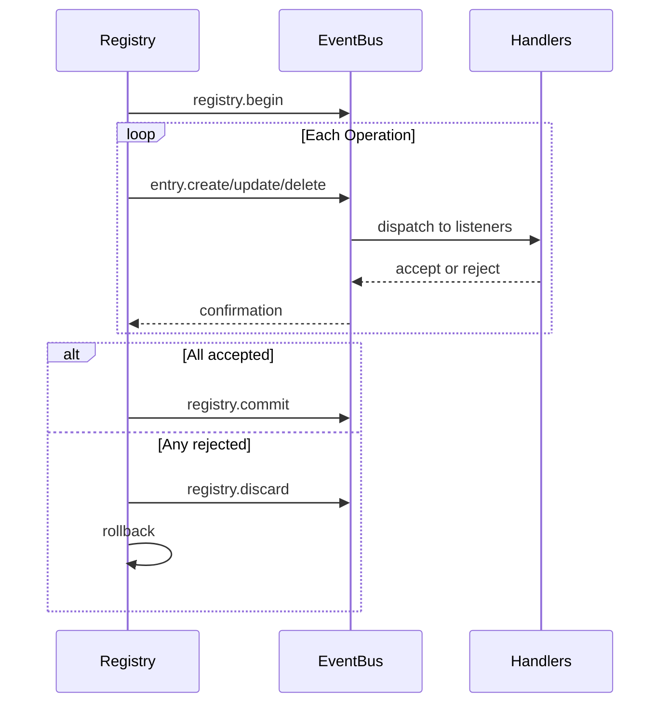

# Registry Internals

The registry is a versioned, event-driven state store. It maintains complete version history, supports transactions, and propagates changes through the event bus.

## Entry Storage

Entries are stored as an ordered slice with a hash map index for O(1) lookups:

```go
type Entry struct {
    ID   ID              // namespace:name
    Kind Kind            // Entry type
    Meta attrs.Bag       // Metadata
    Data payload.Payload // Content
}
```

Entry IDs use Go's `unique` package for interning—identical IDs share memory.

## Version Chain

Each version points to its parent. Path computation uses a graph algorithm to find the shortest route between any two versions:



## ChangeSets

A changeset is an ordered list of operations transforming one state to another:

| Operation | OriginalEntry | Purpose |
|-----------|---------------|---------|
| Create | nil | Add new entry |
| Update | old value | Modify existing |
| Delete | deleted value | Remove entry |

`OriginalEntry` enables reversal—updates store the previous value, deletes store what was removed.

### Building Deltas

`BuildDelta(oldState, newState)` generates minimal operations:

1. Compare states, identify changes
2. Sort deletes in reverse dependency order (dependents first)
3. Sort creates/updates in forward dependency order (dependencies first)

### Squashing

Multiple changesets merge by tracking final state per entry:

```
Create + Update = Create (with updated value)
Create + Delete = ∅ (cancel out)
Update + Delete = Delete
Delete + Create = Update
```

## Transactions



Handlers have 30 seconds to accept or reject each operation. On rejection, the registry rolls back by computing and applying the inverse delta.

### Non-propagating Entries

Some kinds skip the event bus entirely:
- `registry.entry` - Application configs
- `ns.requirement` - Namespace requirements
- `ns.dependency` - Module dependencies

## Dependency Resolution

Entries can declare dependencies on other entries. The resolver extracts dependencies via registered patterns:

```go
resolver.RegisterPattern(PathConfig{
    Path: "meta.server",
    AllowWildcard: true,
})
```

Dependencies are extracted from entry Meta and Data fields, then used for topological sorting during state transitions.

## Version History

History backends:

| Implementation | Use Case |
|----------------|----------|
| SQLite | Production persistence |
| Memory | Testing |
| Nil | No history |

SQLite uses WAL mode with tables for versions, changesets (MessagePack encoded), and metadata.

### Navigation

Path computation finds the shortest route between versions:

```go
Path(v0, v3) = [v1, v2, v3]  // Apply changesets forward
Path(v3, v1) = [v2, v1]      // Apply reversed changesets
```

`LoadState()` replays history from a baseline without creating new versions—used during boot.

## Finder

Query engine with LRU caching for searching entries:

| Operator | Prefix | Example |
|----------|--------|---------|
| Glob | (none) | `.kind=function.*` |
| Regex | `~` | `~meta.path=/api/.*` |
| Contains | `*` | `*meta.tags=backend` |
| Prefix | `^` | `^meta.name=user` |
| Suffix | `$` | `$meta.path=Handler` |

Cache invalidates on version change.

## See Also

- [Registry](concepts/registry.md) - High-level concepts
- [Events](internals/events.md) - Event bus details
