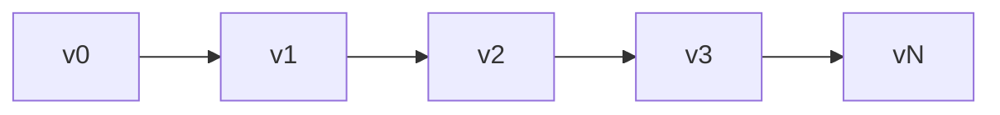
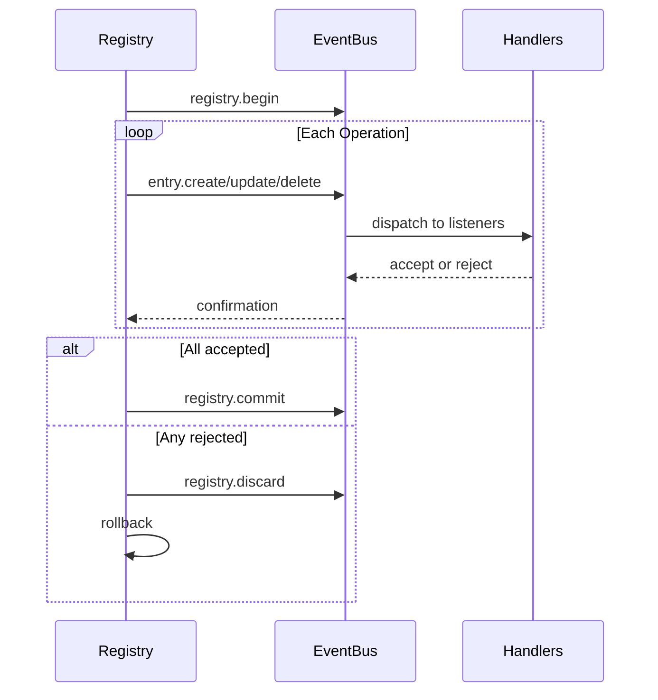

# Registry Internals

The registry is a versioned, event-driven state store. It maintains complete version history, supports transactions, and propagates changes through the event bus.

## Entry Storage

Entries are stored as an ordered slice with a hash map index for O(1) lookups:

```go
type Entry struct {
    ID       ID              // namespace:name
    Kind     Kind            // Entry type
    Meta     attrs.Bag       // Author metadata
    Data     payload.Payload // Content
    Registry EntryMetadata   // Registry-owned provenance
}

type EntryMetadata struct {
    Owner string // Deployment source that supplied the entry
    Root  bool   // Dependency declaration selected by the deployment
}
```

Entry IDs use Go's `unique` package for interning—identical IDs share memory.

`Registry` is owned by the registry, not the entry author. `Owner` is assigned from the deployment source; `Root` is set from the `dependency_root` write-side field on an `ns.dependency` entry. The ordinary entry APIs return only `ID`, `Kind`, `Meta` and `Data`; provenance is read through the snapshot state API.

## Snapshot

`Registry.Snapshot()` returns one atomic view: the version, the entries at that version, and the registry-owned state metadata for that same version.

```go
type Snapshot struct {
    Registry StateMetadata
    Version  Version
    Entries  State
}

type StateMetadata struct {
    Resolution *DependencyResolution
}
```

Reading version, entries and resolution as one value prevents a caller from pairing entries with a resolution from a different version. The selected module graph is stored once per snapshot rather than repeated on every entry.

## Overlays

`OverlayWriter` is an optional registry capability for process-local entries:

```go
type OverlayWriter interface {
    ApplyOverlay(context.Context, string, uint64, ChangeSet) (uint64, error)
    GetOverlay(string) (State, uint64, error)
}
```

Overlay entries are grouped under a logical owner string. They join effective state and pass through the same topology sort and handler transitions as durable entries, so services start and stop for them normally, but they never produce a history version. They are empty after a cold boot and must be reconciled by their owning control service.

Writes are optimistically concurrent: `GetOverlay` returns the owner's current generation, and `ApplyOverlay` commits only if that generation is still current, otherwise it returns a retryable `Conflict`. Each successful apply issues a new process-unique generation, and a tombstone is retained for owners that mutated so an ABA sequence cannot be mistaken for an unchanged overlay.

The composition rules validated on every apply:

- An entry may be created only if no durable entry and no overlay entry holds its ID.
- Only the owning identity may update or delete its overlay entries.
- Overlay entries may not carry registry-owned metadata, and may not use kinds claimed by registry directives.
- A delete may not remove an entry that a surviving entry depends on.
- Dependency edges may not cross owner boundaries, and durable entries may not depend on overlay entries.

## Version Chain

Each version points to its parent. Path computation uses a graph algorithm to find the shortest route between any two versions:


```mermaid
flowchart LR
    v0[v0] --> v1[v1] --> v2[v2] --> v3[v3] --> vN[vN]
```

## ChangeSets

A changeset is an ordered list of operations transforming one state to another:

| Operation | OriginalEntry | Purpose |
|-----------|---------------|---------|
| Create | nil | Add new entry |
| Update | old value | Modify existing |
| Delete | deleted value | Remove entry |

`OriginalEntry` enables reversal—updates store the previous value, deletes store what was removed.

### Building Deltas

`BuildDelta(oldState, newState)` generates minimal operations:

1. Compare states, identify changes
2. Sort deletes in reverse dependency order (dependents first)
3. Sort creates/updates in forward dependency order (dependencies first)

### Squashing

Multiple changesets merge by tracking final state per entry:

```
Create + Update = Create (with updated value)
Create + Delete = ∅ (cancel out)
Update + Delete = Delete
Delete + Create = Update
```

## Transactions


```mermaid
sequenceDiagram
    participant R as Registry
    participant B as EventBus
    participant H as Handlers

    R->>B: registry.begin
    loop Each Operation
        R->>B: entry.create/update/delete
        B->>H: dispatch to listeners
        H-->>B: accept or reject
        B-->>R: confirmation
    end
    alt All accepted
        R->>B: registry.commit
    else Any rejected
        R->>B: registry.discard
        R->>R: rollback
    end
```

Handlers have 30 seconds to accept or reject each operation. On rejection, the registry rolls back by computing and applying the inverse delta.

### Non-propagating Entries

Some kinds skip the event bus entirely:
- `registry.entry` - Application configs
- `ns.requirement` - Namespace requirements
- `ns.dependency` - Module dependencies
- `ns.definition` - Module metadata (readme, wiki, license, authors)

This is the default set; `registry.dispatch_internal_kinds` in the runtime config replaces it.

## Dependency Resolution

Entries can declare dependencies on other entries. The resolver extracts dependencies via registered patterns:

```go
resolver.RegisterPattern(registry.DependencyPattern{
    Path:          "meta.server",
    AllowWildcard: true,
})
```

Dependencies are extracted from entry Meta and Data fields, then used for topological sorting during state transitions.

### Dependency Access Policy

External dependency access is a request-scoped context value, not a global flag:

| Policy | Effect |
|--------|--------|
| `DependencyAccessUnspecified` | Callers choose; the caller's own default applies |
| `DependencyAccessOnline` | External resolution and artifact download are permitted |
| `DependencyAccessVerifiedOffline` | External access is forbidden; resolution uses locked manifests and locally present artifacts |

`LoadState()` defaults to verified-offline when the context specifies nothing, so boot replays a stored graph without reaching the network. Restoring a deployment baseline switches the context to online because it must fetch the modules that baseline names. Under verified-offline a manifest provider serving only locked modules replaces the hub provider, and a missing artifact fails as missing evidence rather than triggering a download.

## Version History

History backends:

| Implementation | Use Case |
|----------------|----------|
| SQLite | Production persistence |
| PostgreSQL | Production persistence, shared across nodes |
| Memory | Default when `history_type` is unset; testing |
| Nil | No history |

SQLite uses WAL mode with tables for versions, changesets (MessagePack encoded), and metadata. PostgreSQL is selected with `registry.history_type: postgres` plus `history_dsn`/`history_schema` (see [Configuration](guides/configuration.md#registry)).

History also persists the exact dependency resolution for each version: when an `ns.dependency` change is applied, the resolved module graph is stored content-addressed alongside the changeset. Boot and rollback replay the stored graph instead of re-solving, so a version always reconciles with the versions it was resolved with. The history schema migrates automatically on first boot after an upgrade; a pre-existing version is resolved once on first visit and checkpointed.

### Navigation

Path computation finds the shortest route between versions:

```go
Path(v0, v3) = [v1, v2, v3]  // Apply changesets forward
Path(v3, v1) = [v2, v1]      // Apply reversed changesets
```

`LoadState()` replays history from a baseline without creating new versions—used during boot.

## Finder

Query engine with LRU caching for searching entries:

| Operator | Prefix | Example |
|----------|--------|---------|
| Glob | (none) | `.kind=function.*` |
| Regex | `~` | `~meta.path=/api/.*` |
| Contains | `*` | `*meta.tags=backend` |
| Prefix | `^` | `^meta.name=user` |
| Suffix | `$` | `$meta.path=Handler` |

Cache invalidates on version change.

## See Also

- [Registry](concepts/registry.md) - High-level concepts
- [Events](internals/events.md) - Event bus details
