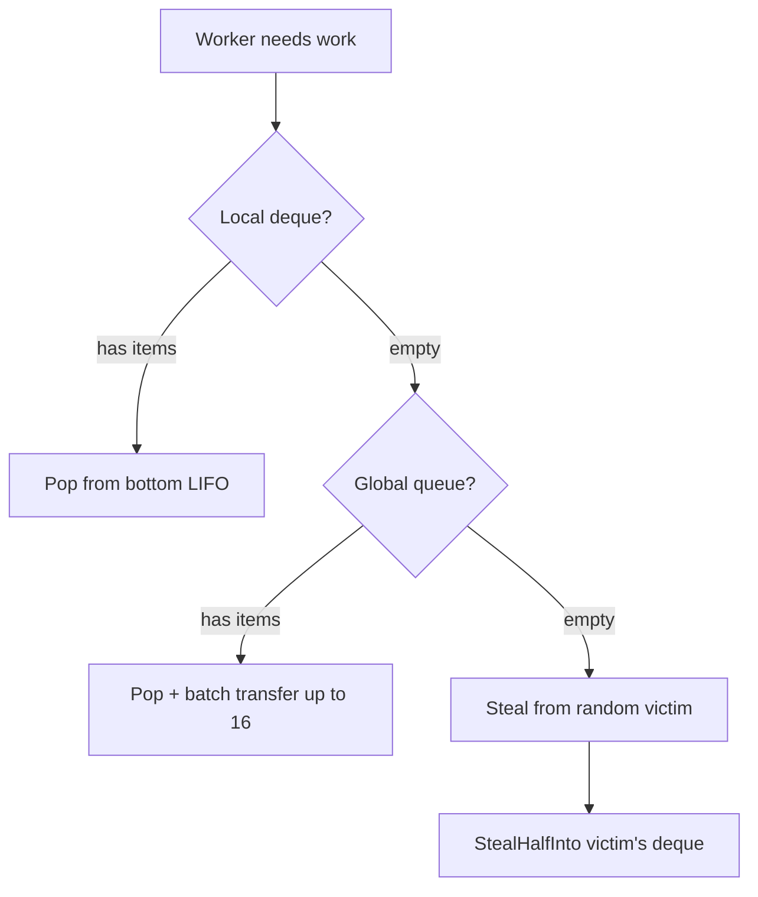
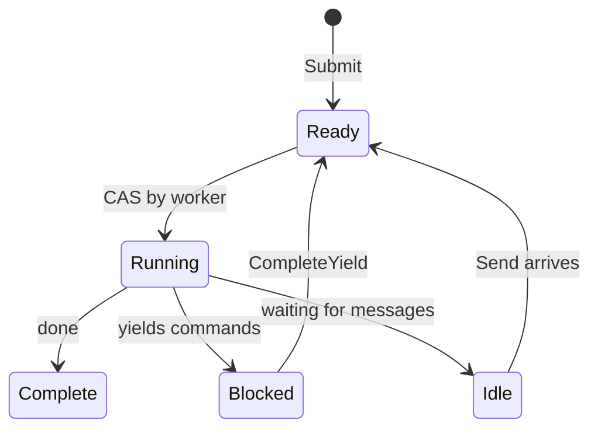

# Scheduler

The scheduler executes processes using a work-stealing design. Workers maintain local deques and steal from each other when idle.

## Process Interface

The scheduler works with any type implementing the `Process` interface:

```go
type Process interface {
    Init(ctx context.Context, method string, input payload.Payloads) error
    Step(events []Event, out *StepOutput) error
    Close()
}
```

| Method | Purpose |
|--------|---------|
| `Init` | Prepare process with entry method name and input arguments |
| `Step` | Advance state machine with incoming events, write yields to output |
| `Close` | Release resources |

The `method` parameter in `Init` specifies which entry point to invoke. A process instance can expose multiple entry points, and the caller selects which one to execute. This also serves as verification that the scheduler is initiating the process correctly.

The scheduler calls `Step()` repeatedly, passing events (yield completions, messages) and collecting yields (commands to dispatch). The process writes its status and any yields to the `StepOutput` buffer.

```go
type Event struct {
    Type  EventType  // EventYieldComplete or EventMessage
    Tag   uint64     // Correlation tag for yield completions
    Data  any        // Result data or message payload
    Error error      // Error if yield failed
}
```

## Structure

The scheduler spawns `GOMAXPROCS` workers by default. Each worker has a local deque for cache-friendly LIFO access. A global FIFO queue handles new submissions and cross-worker transfers. Processes are tracked by PID for message routing.

## Work Finding



Workers check sources in priority order:

| Priority | Source | Pattern |
|----------|--------|---------|
| 1 | Local deque | LIFO pop, lock-free, cache-friendly |
| 2 | Global queue | FIFO pop with batch transfer |
| 3 | Other workers | Steal half from victim's deque |

When popping from global, workers take one item and batch-transfer up to 16 more to their local deque.

## Chase-Lev Deque

Each worker owns a Chase-Lev work-stealing deque:

```go
type Deque struct {
    buffer atomic.Pointer[dequeBuffer]
    top    atomic.Int64  // Thieves steal from here (CAS)
    bottom atomic.Int64  // Owner pushes/pops here
}
```

The owner pushes and pops from the bottom (LIFO) without synchronization. Thieves steal from the top (FIFO) using CAS. This gives the owner cache-friendly access to recently-pushed items while distributing older work to stealers.

`StealHalfInto` takes half the items in one CAS operation, reducing contention.

## Adaptive Spinning

Before blocking on the condition variable, workers spin adaptively:

| Spin Count | Action |
|------------|--------|
| < 4 | Tight loop |
| 4-15 | Yield thread (`runtime.Gosched`) |
| >= 16 | Block on condition variable |

## Process States



| State | Description |
|-------|-------------|
| Ready | Queued for execution |
| Running | Worker is executing Step() |
| Blocked | Waiting for yield completion |
| Idle | Waiting for messages |
| Complete | Execution finished |

A wakeup flag handles races: if a handler calls `CompleteYield` while the worker still owns the process (Running), it sets the flag. The worker checks the flag after dispatching and re-queues if set.

## Event Queue

Each process has an MPSC (multi-producer, single-consumer) event queue:

- **Producers**: Command handlers (`CompleteYield`), message senders (`Send`)
- **Consumer**: Worker drains events in `Step()`

## Message Routing

The scheduler implements `relay.Receiver` to route messages to processes. When `Send()` is called, it looks up the target PID in `byPID` map, pushes the message as an event to the process queue, and wakes the process if idle by pushing it to the global queue.

## Shutdown

On shutdown, the scheduler sends cancel events to all running processes and waits for them to complete or timeout. Workers exit once no work remains.

## See Also

- [Command Dispatch](internals/dispatch.md) - How yields reach handlers
- [Process Model](concepts/process-model.md) - High-level concepts
