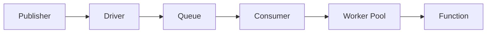

# Queue

Wippy provides a queue system for asynchronous message processing with configurable drivers and consumers.

## Architecture



- **Driver** - Backend implementation (memory, AMQP, Redis)
- **Queue** - Logical queue bound to a driver
- **Consumer** - Connects queue to handler with concurrency settings
- **Worker Pool** - Concurrent message processors

Multiple queues can share a driver. Multiple consumers can process from the same queue.

## Entry Kinds

| Kind | Description |
|------|-------------|
| `queue.driver.memory` | In-memory queue driver |
| `queue.queue` | Queue declaration with driver reference |
| `queue.consumer` | Consumer that processes messages |

## Driver Configuration

### Memory Driver

In-memory driver for development and testing.

```yaml
- name: memory_driver
  kind: queue.driver.memory
  lifecycle:
    auto_start: true
```

<note>
Additional drivers (AMQP, Redis, SQS) are planned. The driver interface allows swapping backends without changing queue or consumer configuration.
</note>

## Queue Configuration

```yaml
- name: tasks
  kind: queue.queue
  driver: app.queue:memory_driver
```

| Field | Type | Required | Description |
|-------|------|----------|-------------|
| `driver` | Registry ID | Yes | Reference to queue driver |
| `options` | Map | No | Driver-specific options |

<note>
The memory driver has no configuration options. External drivers (AMQP, Redis, SQS) define their own options for queue behavior like durability, max length, and TTL.
</note>

## Consumer Configuration

```yaml
- name: task_consumer
  kind: queue.consumer
  queue: app.queue:tasks
  func: app.queue:task_handler
  concurrency: 4
  prefetch: 20
  lifecycle:
    auto_start: true
    depends_on:
      - app.queue:tasks
```

| Field | Default | Max | Description |
|-------|---------|-----|-------------|
| `queue` | Required | - | Queue registry ID |
| `func` | Required | - | Handler function registry ID |
| `concurrency` | 1 | 1000 | Parallel worker count |
| `prefetch` | 10 | 10000 | Message buffer size |

<tip>
Consumers respect call context and can be subject to security policies. Configure actor and policies at the lifecycle level. See <a href="system-security.md">Security</a>.
</tip>

### Worker Pool

Workers run as concurrent goroutines:

```
concurrency: 3, prefetch: 10

1. Driver delivers up to 10 messages to buffer
2. 3 workers pull from buffer concurrently
3. As workers finish, buffer refills
4. Backpressure when all workers busy and buffer full
```

## Handler Function

Consumer functions receive message data and return success or error:

```lua
local json = require("json")
local logger = require("logger")

local function handler(body)
    local data = json.decode(body)

    logger.info("Processing", {task_id = data.id})

    local result, err = process_task(data)
    if err then
        return nil, err  -- Nack: requeue message
    end

    return result  -- Ack: remove from queue
end

return handler
```

```yaml
- name: task_handler
  kind: function.lua
  source: file://task_handler.lua
  modules:
    - json
    - logger
```

### Acknowledgment

| Handler Result | Action | Effect |
|----------------|--------|--------|
| Return value | Ack | Message removed from queue |
| Return error | Nack | Message requeued (driver-dependent) |

## Publishing Messages

From Lua code:

```lua
local queue = require("queue")

queue.publish("app.queue:tasks", {
    id = "task-123",
    action = "process",
    data = payload
})
```

See [Queue Module](lua-queue.md) for full API.

## Graceful Shutdown

On consumer stop:

1. Stop accepting new deliveries
2. Cancel worker contexts
3. Wait for in-flight messages (with timeout)
4. Return error if workers don't finish in time

## See Also

- [Queue Module](lua/storage/queue.md) - Lua API reference
- [Queue Consumers Guide](guides/queue-consumers.md) - Consumer patterns and worker pools
- [Supervision](guides/supervision.md) - Consumer lifecycle management
