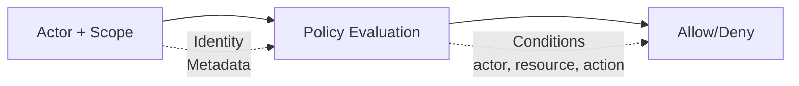

# Security Model

Wippy implements attribute-based access control. Every request carries an actor (who) and a scope (what policies apply). Policies evaluate access based on the action, resource, and metadata from both actor and resource.



## Entry Kinds

| Kind | Description |
|------|-------------|
| `security.policy` | Declarative policy with conditions |
| `security.policy.expr` | Expression-based policy |
| `security.token_store` | Token storage and validation |

## Actors

An actor represents who is performing an action.

```lua
local security = require("security")

-- Create actor with metadata
local actor = security.new_actor("user:123", {
    role = "admin",
    team = "backend",
    department = "engineering",
    clearance = 3
})

-- Access actor properties
local id = actor:id()        -- "user:123"
local meta = actor:meta()    -- {role="admin", ...}
```

### Actor in Context

```lua
-- Get current actor from context
local actor = security.actor()
if not actor then
    return nil, errors.new({ kind = errors.PERMISSION_DENIED, message = "No actor in context" })
end
```

## Policies

Policies define access rules with actions, resources, conditions, and effects.

### Declarative Policy

```yaml
# src/security/_index.yaml
version: "1.0"
namespace: app.security

entries:
  # Admin full access
  - name: admin_policy
    kind: security.policy
    policy:
      actions: "*"
      resources: "*"
      effect: allow
      conditions:
        - field: actor.meta.role
          operator: eq
          value: admin
    groups:
      - admin

  # Read-only access
  - name: readonly_policy
    kind: security.policy
    policy:
      actions:
        - "*.read"
        - "*.get"
        - "*.list"
      resources: "*"
      effect: allow
    groups:
      - default

  # Resource owner access
  - name: owner_policy
    kind: security.policy
    policy:
      actions:
        - read
        - write
        - delete
      resources: "document:*"
      effect: allow
      conditions:
        - field: meta.owner
          operator: eq
          value_from: actor.id
    groups:
      - default

  # Deny confidential without clearance
  - name: deny_confidential
    kind: security.policy
    policy:
      actions: "*"
      resources: "document:*"
      effect: deny
      conditions:
        - field: meta.classification
          operator: eq
          value: confidential
        - field: actor.meta.clearance
          operator: lt
          value: 3
    groups:
      - security
```

### Policy Structure

```yaml
policy:
  actions: "*" | "action" | ["action1", "action2"]
  resources: "*" | "resource" | ["res1", "res2"]
  effect: allow | deny
  conditions:  # Optional
    - field: "field.path"
      operator: "eq"
      value: "static_value"
      # OR
      value_from: "other.field.path"
```

### Expression-Based Policy

For complex logic, use expression policies:

```yaml
- name: flexible_access
  kind: security.policy.expr
  policy:
    actions:
      - read
      - write
    resources: "file:*"
    effect: allow
    expression: |
      (actor.meta.role == "editor" && action == "write") ||
      (action == "read" && meta.public == true) ||
      actor.id == meta.owner
  groups:
    - editors
```

## Conditions

Conditions allow dynamic policy evaluation based on actor, action, resource, and metadata.

### Field Paths

| Path | Description |
|------|-------------|
| `actor.id` | Actor's unique identifier |
| `actor.meta.*` | Actor metadata (supports nesting) |
| `action` | The action being performed |
| `resource` | The resource identifier |
| `meta.*` | Resource metadata |

### Operators

| Operator | Description | Example |
|----------|-------------|---------|
| `eq` | Equals | `actor.meta.role eq "admin"` |
| `ne` | Not equals | `meta.status ne "deleted"` |
| `lt` | Less than | `meta.priority lt 5` |
| `gt` | Greater than | `actor.meta.clearance gt 2` |
| `lte` | Less than or equal | `meta.size lte 1000` |
| `gte` | Greater than or equal | `actor.meta.level gte 3` |
| `in` | Value in array | `action in ["read", "write"]` |
| `nin` | Value not in array | `meta.status nin ["deleted", "archived"]` |
| `exists` | Field exists | `meta.owner exists true` |
| `nexists` | Field not exists | `meta.deleted nexists true` |
| `contains` | String contains | `resource contains "sensitive"` |
| `ncontains` | String not contains | `resource ncontains "public"` |
| `matches` | Regex match | `resource matches "^doc:.*"` |
| `nmatches` | Regex not match | `actor.id nmatches "^system:.*"` |

### Condition Examples

```yaml
# Match actor role
conditions:
  - field: actor.meta.role
    operator: eq
    value: admin

# Compare fields
conditions:
  - field: meta.owner
    operator: eq
    value_from: actor.id

# Numeric comparison
conditions:
  - field: actor.meta.clearance
    operator: gte
    value: 3

# Array membership
conditions:
  - field: actor.meta.role
    operator: in
    value:
      - admin
      - moderator

# Pattern matching
conditions:
  - field: resource
    operator: matches
    value: "^api:/v[0-9]+/admin/.*"

# Multiple conditions (AND)
conditions:
  - field: actor.meta.department
    operator: eq
    value: engineering
  - field: meta.environment
    operator: eq
    value: production
```

## Scopes

Scopes combine multiple policies into a security context.

```lua
local security = require("security")

-- Get policies
local admin_policy = security.policy("app.security:admin_policy")
local readonly_policy = security.policy("app.security:readonly_policy")

-- Create scope with policies
local scope = security.new_scope()
scope = scope:with(admin_policy)
scope = scope:with(readonly_policy)

-- Scopes are immutable - :with() returns new scope
```

### Named Scopes (Policy Groups)

Load all policies from a group:

```lua
-- Load scope with all policies in group
local scope, err = security.named_scope("app.security:admin")
```

Policies are assigned to groups via the `groups` field:

```yaml
- name: admin_policy
  kind: security.policy
  policy:
    # ...
  groups:
    - admin      # This policy is in "admin" group
    - default    # Can be in multiple groups
```

### Scope Operations

```lua
-- Add policy
local new_scope = scope:with(policy)

-- Remove policy
local new_scope = scope:without("app.security:temp_policy")

-- Check if policy is in scope
local has = scope:contains("app.security:admin_policy")

-- Get all policies
local policies = scope:policies()
```

## Policy Evaluation

### Evaluation Flow

```
1. No actor or no scope in context → strict mode decides (deny by default)
2. Check each policy in scope
3. If ANY policy returns Deny → Result is Deny
4. If at least one Allow and no Deny → Result is Allow
5. No applicable policies → Result is Undefined
```

An access check passes only on `Allow`. `Undefined` denies access, exactly like `Deny` — strict mode plays no part once an actor and a scope are both present.

### Evaluation Results

| Result | Meaning |
|--------|---------|
| `allow` | Access granted |
| `deny` | Access explicitly denied |
| `undefined` | No policy matched |

```lua
-- Evaluate directly
local result = scope:evaluate(actor, "read", "document:123", {
    owner = "user:456",
    classification = "internal"
})

if result == "deny" then
    return nil, errors.new({ kind = errors.PERMISSION_DENIED, message = "Access denied" })
elseif result == "undefined" then
    -- No policy matched - access checks treat this as denied
end
```

### Quick Permission Check

```lua
-- Check against current context's actor and scope
local allowed = security.can("read", "document:123", {
    owner = "user:456"
})

if not allowed then
    return nil, errors.new({ kind = errors.PERMISSION_DENIED, message = "Access denied" })
end
```

## Token Stores

Token stores provide secure token creation, validation, and revocation.

### Configuration

```yaml
# src/auth/_index.yaml
version: "1.0"
namespace: app.auth

entries:
  # Register environment variable
  - name: os_env
    kind: env.storage.os

  - name: AUTH_SECRET_KEY
    kind: env.variable
    variable: AUTH_SECRET_KEY
    storage: app.auth:os_env

  # Backing store for tokens
  - name: token_data
    kind: store.memory
    lifecycle:
      auto_start: true

  # Token store
  - name: tokens
    kind: security.token_store
    store: app.auth:token_data
    token_length: 32
    default_expiration: "24h"
    token_key: ${env:AUTH_SECRET_KEY}
```

### Token Store Options

| Option | Default | Description |
|--------|---------|-------------|
| `store` | required | Backing key-value store reference |
| `token_length` | 32 | Token size in bytes (256 bits) |
| `default_expiration` | 24h | Default token TTL |
| `token_key` | none | HMAC-SHA256 signing key (direct value, or `${env:NAME}` to pull from the [env registry](system/env.md)) |

Use `token_key: ${env:NAME}` in production to avoid embedding secrets in entries. The legacy `token_key_env` directive resolves the same way but is deprecated; prefer `${env:NAME}`.

### Creating Tokens

```lua
local security = require("security")

-- Get token store
local store, err = security.token_store("app.auth:tokens")
if err then
    return nil, err
end

-- Create actor and scope
local actor = security.new_actor("user:123", {
    role = "user",
    email = "user@example.com"
})

local scope, _ = security.named_scope("app.security:default")

-- Create token
local token, err = store:create(actor, scope, {
    expiration = "7d",  -- Override default expiration
    meta = {
        device = "mobile",
        ip = "192.168.1.1"
    }
})

if err then
    return nil, err
end

-- Token format: base64_token.hmac_signature (if token_key set)
-- Example: "dGVzdHRva2VuMTIz.a1b2c3d4e5f6"
```

### Validating Tokens

```lua
-- Validate token
local actor, scope, err = store:validate(token)
if err then
    return nil, errors.new({ kind = errors.PERMISSION_DENIED, message = "Invalid token" })
end

-- Actor and scope are reconstructed from stored data
print(actor:id())  -- "user:123"
```

### Revoking Tokens

```lua
-- Revoke single token
local ok, err = store:revoke(token)

-- Close store when done
store:close()
```

## Context Flow

Security context propagates through function calls.

### Setting Context

```lua
local funcs = require("funcs")

-- Call function with security context
local result, err = funcs.new()
    :with_actor(actor)
    :with_scope(scope)
    :call("app.api:protected_endpoint", data)
```

### Context Inheritance

| Component | Inherits |
|-----------|----------|
| Actor | Yes - passes to child calls |
| Scope | Yes - passes to child calls |
| Strict mode | No - application-wide |

Functions and spawned processes both inherit the caller's security context. A spawned process starts on a frame forked from the spawner's, which carries the spawner's actor and scope, and the `security:` block on its own entry modifies that inherited context. When the entry declares no block, the process keeps the spawner's actor and scope unchanged; a spawner that has neither produces a child with neither, which strict mode denies. A declared block that names an `actor` replaces the inherited actor, and its `policies` and `groups` are merged into the inherited scope; a block that omits `actor` keeps the spawner's actor, and one that omits both `policies` and `groups` keeps the spawner's scope.

## Declaring Security on Entries

A security block is the same shape everywhere it appears:

| Field | Type | Description |
|-------|------|-------------|
| `actor.id` | string | Actor identity; replaces the inherited actor |
| `actor.meta` | map | Actor attributes policies evaluate |
| `policies` | list | Policy registry IDs, merged into the scope |
| `groups` | list | Policy group registry IDs, whose policies are merged into the scope |

`policies` and `groups` are **registry IDs in `namespace:name` form**. A bare name does not resolve — unlike the `groups:` field on a policy entry, which defaults to the policy's own namespace, these references carry no default namespace.

Resolution is atomic and fail-closed. Every listed policy and group is resolved before anything is installed; if any one of them is missing, empty, or contains no policies, the whole configuration fails and no actor and no partial scope is applied. A caller therefore never crosses a boundary holding half a context.

### Process Entries

`process.lua`, `process.lua.bc`, `function.lua`, and `function.lua.bc` entries take a top-level `security:` block that applies to every execution of that entry:

```yaml
- name: worker_process
  kind: process.lua
  source: file://worker.lua
  method: main
  security:
    actor:
      id: "service:worker"
      meta:
        role: worker
        service: true
    policies:
      - app.security:worker_policy
    groups:
      - app.security:workers
```

The block is applied when the process starts, on both `process.host` and `terminal.host`. A resolution failure aborts the spawn rather than starting the process with a weaker context.

### Service Lifecycle

Supervised services take the same block under `lifecycle`, resolved once when the service controller is created and sealed for the life of the service:

```yaml
- name: worker
  kind: process.service
  process: app:worker_process
  host: app:processes
  lifecycle:
    auto_start: true
    security:
      actor:
        id: "service:worker"
      groups:
        - app.security:workers
```

### CLI Commands

A command entry declares `meta.command.security`, applied only when the entry is launched as a CLI command — the operator running `wippy run <name>` is the trust anchor for that context. It never affects an ordinary spawn of the same entry. The block is validated strictly: unknown fields are rejected, an empty block is rejected, and `security` without a command `name` is rejected. See [Command security](guides/cli.md#command-security).

## Strict Mode

Strict mode decides what happens when a request carries no actor and no scope. It is **on by default**, so an incomplete context is denied. Turning it off is an explicit choice, made in the runtime config file (`.wippy.yaml`), not in the module manifest `wippy.yaml`:

```yaml
# .wippy.yaml
security:
  strict_mode: false
```

| Mode | Missing Context | Behavior |
|------|-----------------|----------|
| Strict (default) | No actor/scope | Deny |
| Permissive (`strict_mode: false`) | No actor/scope | Allow |

Strict mode changes nothing once an actor and a scope are present: evaluation is deny-by-default either way. It only governs the incomplete case, which is why a process that runs without a declared security context fails every check under the default. Give such a process a `security:` block, or start it through a path that supplies one.

## Authentication Flow

Token validation in an HTTP handler:

```lua
local http = require("http")
local security = require("security")

local function protected_handler()
    local req = http.request()
    local res = http.response()

    -- Extract and validate token
    local auth = req:header("Authorization")
    if not auth then
        return res:set_status(401):write_json({error = "Missing authorization"})
    end

    local token = auth:gsub("^Bearer%s+", "")
    local store, _ = security.token_store("app.auth:tokens")
    local actor, scope, err = store:validate(token)
    if err then
        return res:set_status(401):write_json({error = "Invalid token"})
    end

    -- Check permission
    if not security.can("api.users.read", "users") then
        return res:set_status(403):write_json({error = "Forbidden"})
    end

    res:write_json({user = actor:id()})
end

return { handler = protected_handler }
```

Token creation during login:

```lua
local actor = security.new_actor("user:" .. user.id, {role = user.role})
local scope, _ = security.named_scope("app.security:" .. user.role)

local store, _ = security.token_store("app.auth:tokens")
local token, err = store:create(actor, scope, {expiration = "24h"})
```

## Runtime Trust Boundaries

Policy evaluation governs what code may do. Three separate mechanisms govern what code is admitted and where a context may travel.

### Module Integrity

Every module in `wippy.lock` carries an artifact digest. At boot, a download is verified against both the digest pinned in the lock and the digest the hub served, and already-vendored packs are re-verified against the lock before they are loaded; a mismatch is a non-retryable integrity failure that is not worked around — the module is not loaded. `wippy install` verifies a fresh download only against the digest and size the hub served, deletes the file and fails on mismatch, and then writes the served digest back into the lock, so a pinned digest is re-established by install rather than enforced by it; only packs already in the vendor directory are checked against the lock's digest. Extracted module directories carry their own recorded digest and tree digest and are checked the same way, so a modified vendored tree is detected rather than trusted. See [Dependency Management](guides/dependency-management.md#integrity-verification).

### Cluster Internode Identity

Nodes in a cluster authenticate each other. Each node holds an ed25519 identity key and the map of peer public keys it trusts; the mesh handshake is mutual, binding an HMAC over the shared gossip secret to an ed25519 signature over a transcript covering both node IDs and both nonces. A peer that is not in the trusted map, or whose gossip-advertised key disagrees with the trusted entry, is rejected. There is no unauthenticated mode: a node without an identity cannot join the mesh. See [Internode identity](guides/cluster.md#internode-identity).

### Temporal Propagation

A security context that crosses into Temporal is carried as a signed header rather than as plain workflow input. The actor, its metadata, and the policy IDs are serialized into a `wippy-security` envelope and signed with the client's HMAC key, audienced to the specific workflow or activity ID. The receiving worker verifies the signature and the audience and resolves every named policy locally before the workflow or activity runs; any failure fails the execution. A workflow running under a security context also refuses unsigned signals, so an external Temporal client cannot drive it. See [Workflows](temporal/workflows.md#security-context) and [Temporal overview](temporal/overview.md#security-context-propagation).

## Best Practices

1. **Least privilege** - Grant minimum required permissions
2. **Deny by default** - Use explicit allow policies, enable strict mode
3. **Use policy groups** - Organize policies by role/function
4. **Sign tokens** - Always set `token_key` from an `${env:NAME}` reference in production
5. **Short expiration** - Use shorter token lifetimes for sensitive operations
6. **Condition on context** - Use dynamic conditions over static policies
7. **Audit sensitive actions** - Log security-relevant operations

## Security Module Reference

| Function | Description |
|----------|-------------|
| `security.actor()` | Get current actor from context |
| `security.scope()` | Get current scope from context |
| `security.can(action, resource, meta?)` | Check permission |
| `security.new_actor(id, meta?)` | Create new actor |
| `security.new_scope(policies?)` | Create empty or seeded scope |
| `security.policy(id)` | Get policy by ID |
| `security.named_scope(group_id)` | Get scope with all group policies |
| `security.token_store(id)` | Get token store |
