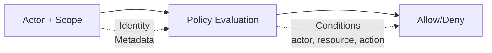

# Security Model

Wippy implements attribute-based access control with actors and policy scopes. Policies evaluate actions and resources using actor and resource metadata.

This page is a configuration and API reference. Complete examples name their required registry entries; shorter Lua and YAML fences illustrate one operation or configuration fragment in an existing security context.



## Entry Kinds

| Kind | Description |
|------|-------------|
| `security.policy` | Declarative policy with conditions |
| `security.policy.expr` | Expression-based policy |
| `security.token_store` | Token storage and validation |

## Actors

An actor identifies the principal performing an action.

```lua
local security = require("security")

-- Create actor with metadata
local actor = security.new_actor("user:123", {
    role = "admin",
    team = "backend",
    department = "engineering",
    clearance = 3
})

-- Access actor properties
local id = actor:id()        -- "user:123"
local meta = actor:meta()    -- {role="admin", ...}
```

### Actor in Context

```lua
-- Get current actor from context
local errors = require("errors")

local actor = security.actor()
if not actor then
    return nil, errors.new({
        kind = errors.PERMISSION_DENIED,
        message = "No actor in context"
    })
end
```

## Policies

Policies define access rules with actions, resources, conditions, and effects.

### Declarative Policy

```yaml
# src/security/_index.yaml
version: "1.0"
namespace: app.security

entries:
  # Admin full access
  - name: admin_policy
    kind: security.policy
    policy:
      actions: "*"
      resources: "*"
      effect: allow
      conditions:
        - field: actor.meta.role
          operator: eq
          value: admin
    groups:
      - admin

  # Read-only access
  - name: readonly_policy
    kind: security.policy
    policy:
      actions:
        - "*.read"
        - "*.get"
        - "*.list"
      resources: "*"
      effect: allow
    groups:
      - default

  # Resource owner access
  - name: owner_policy
    kind: security.policy
    policy:
      actions:
        - read
        - write
        - delete
      resources: "document:*"
      effect: allow
      conditions:
        - field: meta.owner
          operator: eq
          value_from: actor.id
    groups:
      - default

  # Deny confidential without clearance
  - name: deny_confidential
    kind: security.policy
    policy:
      actions: "*"
      resources: "document:*"
      effect: deny
      conditions:
        - field: meta.classification
          operator: eq
          value: confidential
        - field: actor.meta.clearance
          operator: lt
          value: 3
    groups:
      - security
```

### Policy Structure

```text
policy:
  actions: "*" | "action" | ["action1", "action2"]
  resources: "*" | "resource" | ["res1", "res2"]
  effect: allow | deny
  conditions:  # Optional
    - field: "field.path"
      operator: "eq"
      value: "static_value"
      # OR
      value_from: "other.field.path"
```

### Expression-Based Policy

For complex logic, use expression policies:

```yaml
- name: flexible_access
  kind: security.policy.expr
  policy:
    actions:
      - read
      - write
    resources: "file:*"
    effect: allow
    expression: |
      (actor.meta.role == "editor" && action == "write") ||
      (action == "read" && meta.public == true) ||
      actor.id == meta.owner
  groups:
    - editors
```

## Conditions

Conditions evaluate actor, action, resource, and metadata fields at runtime.

### Field Paths

| Path | Description |
|------|-------------|
| `actor.id` | Actor's unique identifier |
| `actor.meta.*` | Actor metadata (supports nesting) |
| `action` | The action being performed |
| `resource` | The resource identifier |
| `meta.*` | Resource metadata |

### Operators

| Operator | Description | Example |
|----------|-------------|---------|
| `eq` | Equals | `actor.meta.role eq "admin"` |
| `ne` | Not equals | `meta.status ne "deleted"` |
| `lt` | Less than | `meta.priority lt 5` |
| `gt` | Greater than | `actor.meta.clearance gt 2` |
| `lte` | Less than or equal | `meta.size lte 1000` |
| `gte` | Greater than or equal | `actor.meta.level gte 3` |
| `in` | Value in array | `action in ["read", "write"]` |
| `nin` | Value not in array | `meta.status nin ["deleted", "archived"]` |
| `exists` | Field exists | `meta.owner exists true` |
| `nexists` | Field not exists | `meta.deleted nexists true` |
| `contains` | String contains | `resource contains "sensitive"` |
| `ncontains` | String not contains | `resource ncontains "public"` |
| `matches` | Regex match | `resource matches "^doc:.*"` |
| `nmatches` | Regex not match | `actor.id nmatches "^system:.*"` |

### Condition Examples

```yaml
# Match actor role
conditions:
  - field: actor.meta.role
    operator: eq
    value: admin

# Compare fields
conditions:
  - field: meta.owner
    operator: eq
    value_from: actor.id

# Numeric comparison
conditions:
  - field: actor.meta.clearance
    operator: gte
    value: 3

# Array membership
conditions:
  - field: actor.meta.role
    operator: in
    value:
      - admin
      - moderator

# Pattern matching
conditions:
  - field: resource
    operator: matches
    value: "^api:/v[0-9]+/admin/.*"

# Multiple conditions (AND)
conditions:
  - field: actor.meta.department
    operator: eq
    value: engineering
  - field: meta.environment
    operator: eq
    value: production
```

## Scopes

A scope combines policies into a security context.

```lua
local security = require("security")

-- Get policies
local admin_policy, admin_err = security.policy("app.security:admin_policy")
if admin_err then return nil, admin_err end
local readonly_policy, readonly_err = security.policy("app.security:readonly_policy")
if readonly_err then return nil, readonly_err end

-- Create scope with policies
local scope = security.new_scope()
scope = scope:with(admin_policy)
scope = scope:with(readonly_policy)

-- Scopes are immutable - :with() returns new scope
```

### Named Scopes (Policy Groups)

Load the policies assigned to a group:

```lua
-- Load scope with all policies in group
local scope, err = security.named_scope("app.security:admin")
if err then return nil, err end
```

Policies are assigned to groups via the `groups` field:

```yaml
- name: admin_policy
  kind: security.policy
  policy:
    # ...
  groups:
    - admin      # This policy is in "admin" group
    - default    # Can be in multiple groups
```

### Scope Operations

```lua
-- Add policy
local new_scope = scope:with(policy)

-- Remove policy
local new_scope = scope:without("app.security:temp_policy")

-- Check if policy is in scope
local has = scope:contains("app.security:admin_policy")

-- Get all policies
local policies = scope:policies()
```

### Module Permissions

Strict mode applies permission checks to actor, policy, and scope construction as well as token operations:

| Action | Resource | Used by | Denial behavior |
|--------|----------|---------|-----------------|
| `security.actor.create` | Actor ID | `security.new_actor` | Raises a Lua error |
| `security.policy.get` | Policy registry ID | `security.policy` | Returns `nil, error` |
| `security.policy_group.get` | Policy-group ID | `security.named_scope` | Returns `nil, error` |
| `security.scope.create` | `custom`, `with`, or `without` | `security.new_scope`, `scope:with`, `scope:without` respectively | Raises a Lua error |

Grant only the operations and IDs a caller needs. The actor, scope, and token examples on this page assume these permissions are present in addition to their operation-specific token permissions.

## Policy Evaluation

### Evaluation Flow

```
1. Evaluate policies until a deny is found or the scope is exhausted
2. If ANY policy returns Deny → Result is Deny
3. If at least one Allow and no Deny → Result is Allow
4. No applicable policies → Result is Undefined
```

### Evaluation Results

| Result | Meaning |
|--------|---------|
| `allow` | Access granted |
| `deny` | Access explicitly denied |
| `undefined` | No policy matched |

```lua
local errors = require("errors")

-- Evaluate directly
local result = scope:evaluate(actor, "read", "document:123", {
    owner = "user:456",
    classification = "internal"
})

if result == "deny" then
    return nil, errors.new({
        kind = errors.PERMISSION_DENIED,
        message = "Access denied"
    })
elseif result == "undefined" then
    -- No policy matched; treat this as denied unless the caller handles it explicitly.
end
```

### Quick Permission Check

```lua
local errors = require("errors")

-- Check against current context's actor and scope
local allowed = security.can("read", "document:123", {
    owner = "user:456"
})

if not allowed then
    return nil, errors.new({
        kind = errors.PERMISSION_DENIED,
        message = "Access denied"
    })
end
```

## Token Stores

Token stores create, validate, and revoke authentication tokens.

The Lua operations are permission-gated. The active scope must allow
`security.token_store.get` for acquisition and `security.token.create`,
`security.token.validate`, or `security.token.revoke` for the corresponding
operation. This applies in the default strict mode as well as in explicitly
configured security contexts. Examples that create an actor or load a named
scope also require `security.actor.create` and `security.policy_group.get`.

### Configuration

```yaml
# src/auth/_index.yaml
version: "1.0"
namespace: app.auth

entries:
  # Register environment variable
  - name: os_env
    kind: env.storage.os

  - name: AUTH_SECRET_KEY
    kind: env.variable
    variable: AUTH_SECRET_KEY
    storage: app.auth:os_env

  # Backing store for tokens
  - name: token_data
    kind: store.memory
    lifecycle:
      auto_start: true

  # Token store
  - name: tokens
    kind: security.token_store
    store: app.auth:token_data
    token_length: 32
    default_expiration: "24h"
    token_key: ${env:AUTH_SECRET_KEY}
```

### Token Store Options

| Option | Default | Description |
|--------|---------|-------------|
| `store` | required | Backing key-value store reference |
| `token_length` | 32 | Token size in bytes (256 bits) |
| `default_expiration` | 24h | Default token TTL |
| `token_key` | none | HMAC-SHA256 signing key (direct value, or `${env:NAME}` to pull from the [env registry](system/env.md)) |

Use `token_key: ${env:NAME}` in production to avoid embedding secrets in entries. The legacy `token_key_env` directive also reads the environment registry but preserves the inline or zero value for a missing or empty lookup; a modern placeholder without a default fails when its variable is missing. The legacy directive is deprecated.

### Creating Tokens

```lua
local security = require("security")

-- Get token store
local store, err = security.token_store("app.auth:tokens")
if err then
    return nil, err
end

-- Create actor and scope
local actor = security.new_actor("user:123", {
    role = "user",
    email = "user@example.com"
})

local scope, scope_err = security.named_scope("app.security:default")
if scope_err then
    store:close()
    return nil, scope_err
end

-- Create token
local token, create_err = store:create(actor, scope, {
    expiration = "7d",  -- Override default expiration
    meta = {
        device = "mobile",
        ip = "192.168.1.1"
    }
})
store:close()
if create_err then return nil, create_err end
return token

-- Token format: base64_token.hmac_signature (if token_key set)
-- Example: "dGVzdHRva2VuMTIz.a1b2c3d4e5f6"
```

### Validating Tokens

```lua
local errors = require("errors")

-- Validate token
local actor, scope, err = store:validate(token)
store:close()
if err then
    return nil, errors.new({
        kind = errors.PERMISSION_DENIED,
        message = "Invalid token"
    })
end

-- Actor and scope are reconstructed from stored data
print(actor:id())  -- "user:123"
```

### Revoking Tokens

```lua
-- Revoke single token
local ok, err = store:revoke(token)
if err then
    store:close()
    return nil, err
end

-- Close store when done
store:close()
return ok
```

## Context Flow

Actor and scope are inheritable frame context. Function calls and spawned
processes inherit both unless the caller supplies a replacement context.
Explicitly changing a spawned process's actor or scope requires the
`process.security` permission. Changing the security context of a function call
through `funcs.new():with_actor(...)` or `:with_scope(...)` instead requires
`funcs.security` on `security`.

### Setting Context

```lua
local funcs = require("funcs")

-- Call function with security context
local caller, err = funcs.new():with_actor(actor)
if err then return nil, err end
caller, err = caller:with_scope(scope)
if err then return nil, err end
local result, call_err = caller:call("app.api:protected_endpoint", data)
if call_err then return nil, call_err end
```

### Context Inheritance

| Component | Inherits |
|-----------|----------|
| Actor | Yes - passes to child calls and spawned processes |
| Scope | Yes - passes to child calls and spawned processes |
| Strict mode | No - application-wide |

## Service-Level Security

Configure a default actor and policies for a service:

```yaml
- name: worker_service
  kind: process.lua
  source: file://worker.lua
  lifecycle:
    auto_start: true
    security:
      actor:
        id: "service:worker"
        meta:
          role: worker
          service: true
      policies:
        - app.security:worker_policy
      groups:
        - workers
```

## Strict Mode

Strict mode is enabled by default and denies access when either actor or scope
is missing. Set it to `false` only when a deployment intentionally needs the
legacy permissive behavior:

```yaml
# .wippy.yaml
security:
  strict_mode: true
```

| `strict_mode` | Missing Context | Behavior |
|------|-----------------|----------|
| `false` | Actor or scope missing | Allow (permissive) |
| `true` (default) | Actor or scope missing | Deny |

When both actor and scope are present, policies are always evaluated. An
`undefined` result is not converted to allow by disabling strict mode;
`security.can(...)` returns `false` unless evaluation returns `allow`.

## Authentication Flow

Token validation in an HTTP handler:

```lua
local http = require("http")
local security = require("security")

local function protected_handler()
    local req, req_err = http.request()
    if req_err then return nil, req_err end
    local res, res_err = http.response()
    if res_err then return nil, res_err end

    local function respond(status, body)
        local content_type_err = res:set_header("Content-Type", "application/json")
        if content_type_err then return nil, content_type_err end
        local status_err = res:set_status(status)
        if status_err then return nil, status_err end
        local write_err = res:write_json(body)
        if write_err then return nil, write_err end
        return true
    end

    -- Extract and validate token
    local auth, header_err = req:header("Authorization")
    if header_err then return nil, header_err end
    if not auth then
        return respond(http.STATUS.UNAUTHORIZED, {error = "Missing authorization"})
    end

    local token = auth:match("^Bearer%s+(.+)$")
    if not token then
        return respond(http.STATUS.UNAUTHORIZED, {error = "Expected a bearer token"})
    end
    local store, store_err = security.token_store("app.auth:tokens")
    if store_err then
        return respond(http.STATUS.INTERNAL_ERROR, {error = "Token store unavailable"})
    end

    local actor, scope, validate_err = store:validate(token)
    store:close()
    if validate_err then
        return respond(http.STATUS.UNAUTHORIZED, {error = "Invalid token"})
    end

    -- Evaluate the actor and scope reconstructed from this token.
    if scope:evaluate(actor, "api.users.read", "users") ~= "allow" then
        return respond(http.STATUS.FORBIDDEN, {error = "Forbidden"})
    end

    return respond(http.STATUS.OK, {user = actor:id()})
end

return { handler = protected_handler }
```

Token creation during login:

```lua
local actor = security.new_actor("user:" .. user.id, {role = user.role})
local scope, scope_err = security.named_scope("app.security:" .. user.role)
if scope_err then return nil, scope_err end

local store, store_err = security.token_store("app.auth:tokens")
if store_err then return nil, store_err end
local token, token_err = store:create(actor, scope, {expiration = "24h"})
store:close()
if token_err then return nil, token_err end
return token
```

## Best Practices

1. **Least privilege** - Grant minimum required permissions
2. **Deny by default** - Use explicit allow policies, enable strict mode
3. **Use policy groups** - Organize policies by role/function
4. **Sign tokens** - Always set `token_key` from an `${env:NAME}` reference in production
5. **Short expiration** - Use shorter token lifetimes for sensitive operations
6. **Condition on context** - Use dynamic conditions over static policies
7. **Audit sensitive actions** - Log security-relevant operations

## Security Module Reference

| Function | Description |
|----------|-------------|
| `security.actor()` | Get current actor from context |
| `security.scope()` | Get current scope from context |
| `security.can(action, resource, meta?)` | Check permission |
| `security.new_actor(id, meta?)` | Create new actor |
| `security.new_scope(policies?)` | Create empty or seeded scope |
| `security.policy(id)` | Get policy by ID |
| `security.named_scope(group_id)` | Get scope with all group policies |
| `security.token_store(id)` | Get token store |
