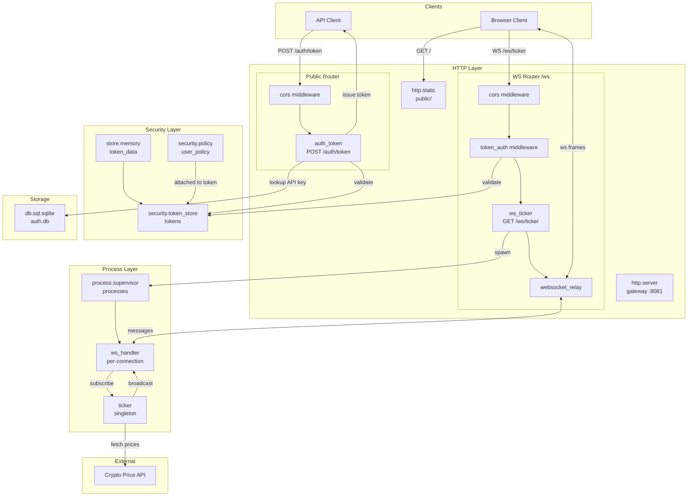

# Crypto Ticker

Build a real-time crypto ticker with API key authentication and WebSocket streaming. This tutorial demonstrates token-based security, middleware configuration, and process-based WebSocket handling.

## Architecture



## Security Flow

1. **API Key Exchange**: Client POSTs API key to `/auth/token`. Handler validates against database, creates an actor with the `user_policy`, and issues an HMAC-signed token.

2. **Token Authentication**: WebSocket connections go through `token_auth` middleware which validates the Bearer token and restores the security context (actor + policies).

3. **Process Spawning**: The WebSocket endpoint spawns a handler process. Because the token includes the `user_policy`, the spawn is authorized.

4. **Message Routing**: The `websocket_relay` middleware routes WebSocket frames to the handler process as messages.

## Configuration

Complete `_index.yaml`:

```yaml
version: "1.0"
namespace: app

entries:
  # Database for API keys
  - name: db
    kind: db.sql.sqlite
    file: "./data/auth.db"
    lifecycle:
      auto_start: true

  # Token backing store
  - name: token_data
    kind: store.memory
    lifecycle:
      auto_start: true

  # Token store with HMAC signing
  - name: tokens
    kind: security.token_store
    store: app:token_data
    token_length: 32
    default_expiration: "1h"
    token_key: "demo-secret-key-change-in-production"

  # Security policy for authenticated users
  - name: user_policy
    kind: security.policy
    policy:
      actions: "*"
      resources: "*"
      effect: allow
    groups:
      - user

  # Process host
  - name: processes
    kind: process.host
    lifecycle:
      auto_start: true

  # Database migration
  - name: migrate
    kind: process.lua
    source: file://migrate.lua
    method: main
    modules: [sql, logger, crypto]

  - name: migrate-service
    kind: process.service
    process: app:migrate
    host: app:processes
    lifecycle:
      auto_start: true

  # Ticker broadcaster
  - name: ticker
    kind: process.lua
    source: file://ticker.lua
    method: main
    modules: [logger, time, json, crypto]

  - name: ticker-service
    kind: process.service
    process: app:ticker
    host: app:processes
    lifecycle:
      auto_start: true

  # WebSocket handler (spawned per connection)
  - name: ws_handler
    kind: process.lua
    source: file://ws_handler.lua
    method: main
    modules: [logger, json]

  # HTTP server
  - name: gateway
    kind: http.service
    addr: ":8081"
    lifecycle:
      auto_start: true

  # Public router (no auth)
  - name: public_router
    kind: http.router
    meta:
      server: app:gateway
    middleware:
      - cors
    options:
      cors.allow.origins: "*"

  # WebSocket router (with auth)
  - name: ws_router
    kind: http.router
    meta:
      server: app:gateway
    prefix: /ws
    middleware:
      - cors
      - token_auth
    options:
      cors.allow.origins: "*"
      token_auth.store: "app:tokens"
    post_middleware:
      - websocket_relay
    post_options:
      wsrelay.allowed.origins: "*"

  # Static files
  - name: public_fs
    kind: fs.directory
    directory: ./public

  - name: static
    kind: http.static
    meta:
      server: app:gateway
    path: /
    fs: app:public_fs
    static_options:
      spa: true
      index: index.html

  # Auth token exchange
  - name: auth_token
    kind: function.lua
    source: file://auth_token.lua
    method: handler
    modules: [http, sql, crypto, security, json]

  - name: auth_token.endpoint
    kind: http.endpoint
    meta:
      router: app:public_router
    method: POST
    path: /auth/token
    func: app:auth_token

  # WebSocket ticker endpoint
  - name: ws_ticker
    kind: function.lua
    source: file://ws_ticker.lua
    method: handler
    modules: [http, json, security, logger]

  - name: ws_ticker.endpoint
    kind: http.endpoint
    meta:
      router: app:ws_router
    method: GET
    path: /ticker
    func: app:ws_ticker
```

For production, use `token_key_env` to read the HMAC key from an environment variable instead of hardcoding it. See [Environment System](system/env.md).

## Token Exchange

`auth_token.lua` - validates API keys and issues HMAC-signed tokens:

```lua
local http = require("http")
local sql = require("sql")
local security = require("security")

local function handler()
    local req = http.request()
    local res = http.response()

    local body, parse_err = req:body_json()
    if parse_err then
        res:set_status(http.STATUS.BAD_REQUEST)
        res:write_json({error = "invalid JSON"})
        return
    end

    local api_key = body.api_key
    if not api_key or #api_key == 0 then
        res:set_status(http.STATUS.BAD_REQUEST)
        res:write_json({error = "api_key required"})
        return
    end

    local db, db_err = sql.get("app:db")
    if db_err then
        res:set_status(http.STATUS.INTERNAL_ERROR)
        res:write_json({error = "database unavailable"})
        return
    end

    local rows, query_err = db:query(
        "SELECT user_id, role FROM api_keys WHERE api_key = ?",
        {api_key}
    )
    db:release()

    if query_err or #rows == 0 then
        res:set_status(http.STATUS.UNAUTHORIZED)
        res:write_json({error = "invalid API key"})
        return
    end

    local user = rows[1]

    -- Create actor with user identity
    local actor = security.new_actor("user:" .. user.user_id, {
        role = user.role,
        user_id = user.user_id
    })

    -- Attach user_policy to the scope
    local policy, _ = security.policy("app:user_policy")
    local scope = policy and security.new_scope({policy}) or security.new_scope()

    -- Issue HMAC-signed token
    local store, store_err = security.token_store("app:tokens")
    if store_err then
        res:set_status(http.STATUS.INTERNAL_ERROR)
        res:write_json({error = "token store unavailable"})
        return
    end

    local token, token_err = store:create(actor, scope, {
        expiration = "1h",
        meta = {ip = req:remote_addr()}
    })
    store:close()

    if token_err then
        res:set_status(http.STATUS.INTERNAL_ERROR)
        res:write_json({error = "token creation failed"})
        return
    end

    res:write_json({
        token = token,
        user_id = user.user_id,
        role = user.role,
        expires_in = 3600
    })
end

return { handler = handler }
```

## WebSocket Endpoint

`ws_ticker.lua` - spawns a handler process for each authenticated connection:

```lua
local http = require("http")
local json = require("json")
local security = require("security")
local logger = require("logger")

local function handler()
    local req = http.request()
    local res = http.response()

    if req:method() ~= http.METHOD.GET then
        res:set_status(http.STATUS.METHOD_NOT_ALLOWED)
        res:write_json({error = "method not allowed"})
        return
    end

    -- Actor is set by token_auth middleware
    local actor = security.actor()
    if not actor then
        res:set_status(http.STATUS.UNAUTHORIZED)
        res:write_json({error = "authentication required"})
        return
    end

    local user_id = actor:id()

    -- Spawn handler process (authorized by user_policy in token)
    local pid, err = process.spawn("app:ws_handler", "app:processes", user_id)
    if err then
        logger:error("spawn failed", {error = tostring(err)})
        res:set_status(http.STATUS.INTERNAL_ERROR)
        res:write_json({error = "failed to create handler"})
        return
    end

    -- Configure websocket_relay to route messages to handler
    res:set_header("X-WS-Relay", json.encode({
        target_pid = tostring(pid),
        metadata = {user_id = user_id, auth_time = os.time()}
    }))
end

return { handler = handler }
```

## Connection Handler

The `websocket_relay` middleware automatically sends lifecycle messages to the handler process:
- `ws.join` - Connection established, includes `client_pid` for sending responses
- `ws.message` - Client sent a message
- `ws.leave` - Connection closed (sent automatically on disconnect)

`ws_handler.lua` - handles these lifecycle messages:

```lua
local logger = require("logger")
local json = require("json")

local function main(user_id)
    local inbox = process.inbox()
    local client_pid = nil
    local subscribed = false

    logger:info("handler started", {user_id = user_id})

    while true do
        local msg, ok = inbox:receive()
        if not ok then break end

        local topic = msg:topic()
        local data = msg:payload():data()

        if topic == "ws.join" then
            client_pid = data.client_pid

            -- Subscribe with our PID for crash monitoring
            process.send("ticker", "subscribe", {
                client_pid = client_pid,
                handler_pid = process.pid()
            })
            subscribed = true

            -- Send welcome
            process.send(client_pid, "ws.send", {
                type = "text",
                data = json.encode({type = "welcome", user_id = user_id})
            })

            logger:info("client joined", {user_id = user_id, client_pid = client_pid})

        elseif topic == "ws.message" then
            local content = json.decode(data.data)
            if content and content.type == "ping" then
                process.send(client_pid, "ws.send", {
                    type = "text",
                    data = json.encode({type = "pong"})
                })
            end

        elseif topic == "ws.leave" then
            -- Relay sends this automatically on disconnect
            logger:info("client left", {user_id = user_id, reason = data.reason})
            if subscribed then
                process.send("ticker", "unsubscribe", {handler_pid = process.pid()})
            end
            break
        end
    end

    return 0
end

return { main = main }
```

## Broadcasting

`ticker.lua` - maintains subscriptions and broadcasts price updates:

```lua
local logger = require("logger")
local time = require("time")
local json = require("json")
local crypto = require("crypto")

-- handler_pid -> client_pid mapping
local subscriptions = {}

local prices = {
    ["BTC-USD"] = 42000.00,
    ["ETH-USD"] = 2500.00,
    ["SOL-USD"] = 95.00
}

local function broadcast(message)
    local data = json.encode(message)
    for _, client_pid in pairs(subscriptions) do
        process.send(client_pid, "ws.send", {type = "text", data = data})
    end
end

local function update_prices()
    for symbol, price in pairs(prices) do
        local bytes = crypto.random.bytes(2)
        local rand = (bytes:byte(1) * 256 + bytes:byte(2)) / 65535.0
        local factor = (rand - 0.5) * 0.002
        prices[symbol] = price * (1 + factor)
        prices[symbol] = tonumber(string.format("%.2f", prices[symbol]))
    end
end

local function get_updates()
    local updates = {}
    for symbol, price in pairs(prices) do
        table.insert(updates, {symbol = symbol, price = price, timestamp = os.time()})
    end
    return updates
end

local function main()
    local inbox = process.inbox()
    local events = process.events()

    local ticker, ticker_err = time.ticker("10ms")
    if ticker_err then
        logger:error("failed to create ticker", {error = tostring(ticker_err)})
        return 1
    end
    local tick_ch = ticker:response()

    process.registry.register("ticker")
    logger:info("ticker started", {pid = process.pid()})

    while true do
        local r = channel.select {
            inbox:case_receive(),
            events:case_receive(),
            tick_ch:case_receive()
        }

        if r.channel == tick_ch then
            update_prices()
            if next(subscriptions) then
                broadcast({type = "ticker", data = get_updates()})
            end

        elseif r.channel == events then
            local event = r.value
            if event.kind == process.event.EXIT then
                -- Handler exited, remove subscription
                if subscriptions[event.from] then
                    logger:info("handler exited", {handler_pid = event.from})
                    subscriptions[event.from] = nil
                end
            end

        else
            local msg = r.value
            local topic = msg:topic()
            local data = msg:payload():data()

            if topic == "subscribe" then
                local handler_pid = data.handler_pid
                local client_pid = data.client_pid

                subscriptions[handler_pid] = client_pid
                process.monitor(handler_pid)

                logger:info("subscribed", {handler_pid = handler_pid, client_pid = client_pid})

                process.send(client_pid, "ws.send", {
                    type = "text",
                    data = json.encode({type = "ticker", data = get_updates()})
                })

            elseif topic == "unsubscribe" then
                subscriptions[data.handler_pid] = nil
                logger:info("unsubscribed", {handler_pid = data.handler_pid})
            end
        end
    end
end

return { main = main }
```

## Database Migration

`migrate.lua` - creates the API keys table and generates a demo key:

```lua
local sql = require("sql")
local logger = require("logger")
local crypto = require("crypto")

local function main()
    local db, err = sql.get("app:db")
    if err then
        logger:error("failed to connect", {error = tostring(err)})
        return 1
    end

    local _, exec_err = db:execute([[
        CREATE TABLE IF NOT EXISTS api_keys (
            id INTEGER PRIMARY KEY AUTOINCREMENT,
            api_key TEXT UNIQUE NOT NULL,
            user_id TEXT NOT NULL,
            role TEXT NOT NULL DEFAULT 'user',
            created_at INTEGER NOT NULL
        )
    ]])

    if exec_err then
        db:release()
        logger:error("migration failed", {error = tostring(exec_err)})
        return 1
    end

    -- Check if demo key exists
    local rows, _ = db:query("SELECT api_key FROM api_keys WHERE user_id = ?", {"demo"})
    if #rows == 0 then
        local demo_key, key_err = crypto.random.string(32)
        if key_err then
            db:release()
            return 1
        end

        db:execute(
            "INSERT INTO api_keys (api_key, user_id, role, created_at) VALUES (?, ?, ?, ?)",
            {demo_key, "demo", "user", os.time()}
        )
        logger:info("demo API key created", {api_key = demo_key})
    else
        logger:info("demo API key exists", {api_key = rows[1].api_key})
    end

    db:release()
    return 0
end

return { main = main }
```

## Running

```bash
wippy init
wippy run
```

Open http://localhost:8081 and enter the demo API key shown in logs.

## Key Points

| Concept | Implementation |
|---------|----------------|
| Token signing | `security.token_store` with HMAC key |
| Token validation | `token_auth` middleware on router |
| Authorization | `security.policy` attached to token scope |
| WebSocket lifecycle | `websocket_relay` sends ws.join/ws.leave automatically |
| Handler cleanup | `process.monitor(handler_pid)` detects crashes |
| Subscription map | `subscriptions[handler_pid] = client_pid` |

## See Also

- [WebSocket Relay](http/websocket-relay.md) - Middleware configuration
- [Security Module](lua/security/security.md) - Actors, policies, token stores
- [Process Management](lua/core/process.md) - Spawning and messaging
