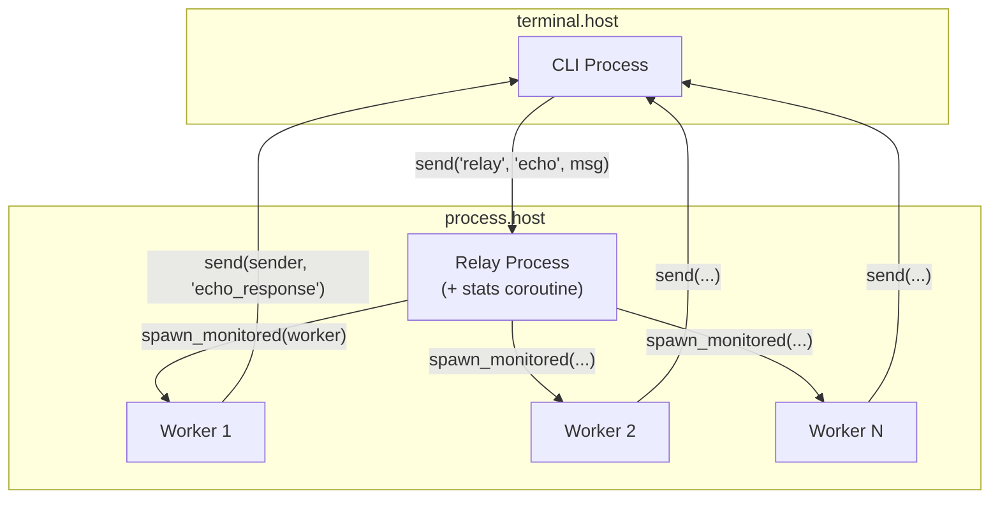

# Echo Service

Build a CLI echo service that uses multiple Wippy processes, channels, coroutines, message passing, and process monitoring.

**Classification:** Runnable tutorial. It provides the complete registry and Lua
sources for a local, single-node CLI application, plus startup and verification
steps.

## Overview

This tutorial creates a CLI client that sends messages to a relay service, which spawns workers to process each message. It demonstrates:

- **Process spawning** — Create child processes dynamically
- **Message passing** — Communicate between processes with send and receive operations
- **Channels and select** — Wait on multiple event sources
- **Coroutines** — Run concurrent work within a process
- **Process registration** — Find processes by name
- **Monitoring** — Track child-process lifecycles

## Prerequisites

- Wippy runtime `v0.3.32a` available as `wippy`. Confirm it with
  `wippy version --short`.
- An interactive terminal.
- An empty working directory. Create the project and source directory before adding
  the files below:

  ```bash
  mkdir echo-service
  cd echo-service
  mkdir src
  ```

## Architecture


```mermaid
flowchart TB
    subgraph terminal["terminal.host"]
        CLI["CLI Process"]
    end

    subgraph processes["process.host"]
        Relay["Relay Process<br/>(+ stats coroutine)"]
        W1["Worker 1"]
        W2["Worker 2"]
        W3["Worker N"]
    end

    CLI -->|"send('relay', 'echo', msg)"| Relay
    Relay -->|"spawn_monitored(worker)"| W1
    Relay -->|"spawn_monitored(...)"| W2
    Relay -->|"spawn_monitored(...)"| W3
    W1 -->|"send(sender, 'echo_response')"| CLI
    W2 -->|"send(...)"| CLI
    W3 -->|"send(...)"| CLI
```

## Project Structure

```
echo-service/
├── wippy.lock
└── src/
    ├── _index.yaml
    ├── cli.lua
    ├── relay.lua
    └── worker.lua
```

## Entry Definitions

Create `src/_index.yaml`:

```yaml
version: "1.0"
namespace: app

entries:
  # Capabilities used by the CLI, relay, and workers in strict mode
  - name: process-policy
    kind: security.policy
    policy:
      actions:
        - process.host
        - process.registry.register
        - process.send
        - process.spawn
        - process.spawn.monitored
      resources: "*"
      effect: allow

  - name: terminal
    kind: terminal.host
    lifecycle:
      auto_start: true

  - name: processes
    kind: process.host
    lifecycle:
      auto_start: true

  - name: cli
    kind: process.lua
    source: file://cli.lua
    method: main
    modules:
      - io
      - time
    security:
      actor:
        id: app:cli
      policies:
        - app:process-policy

  - name: relay
    kind: process.lua
    source: file://relay.lua
    method: main
    modules:
      - logger
      - time
    security:
      actor:
        id: app:relay
      policies:
        - app:process-policy

  - name: relay-service
    kind: process.service
    process: app:relay
    host: app:processes
    lifecycle:
      auto_start: true

  - name: worker
    kind: process.lua
    source: file://worker.lua
    method: main
    modules:
      - time
    security:
      actor:
        id: app:worker
      policies:
        - app:process-policy
```

## The Relay Process

The relay registers itself, handles messages, spawns workers, and runs a stats coroutine.

Create `src/relay.lua`:

```lua
local logger = require("logger")
local time = require("time")

local stats = {
    messages = 0,
    workers_spawned = 0
}

local function stats_reporter()
    while true do
        time.sleep("5s")
        logger:info("stats", {
            messages = stats.messages,
            workers_spawned = stats.workers_spawned
        })
    end
end

local function main()
    local inbox = process.inbox()
    local events = process.events()

    local _, register_err = process.registry.register("relay")
    if register_err then
        error("cannot register relay: " .. tostring(register_err))
    end
    logger:info("relay started", {pid = process.pid()})

    coroutine.spawn(stats_reporter)

    while true do
        local r = channel.select {
            inbox:case_receive(),
            events:case_receive()
        }

        if r.channel == events then
            local event = r.value
            if event.kind == process.event.EXIT then
                logger:info("worker exited", {
                    from = event.from,
                    result = event.result
                })
            end
        else
            local msg = r.value
            if msg:topic() == "echo" then
                local echo = msg:payload():data()
                stats.messages = stats.messages + 1

                local worker_pid, err = process.spawn_monitored(
                    "app:worker",
                    "app:processes",
                    echo.sender,
                    echo.data
                )

                if err then
                    logger:error("spawn failed", {error = tostring(err)})
                else
                    stats.workers_spawned = stats.workers_spawned + 1
                end
            end
        end
    end
end

return { main = main }
```

### Key Patterns {id="relay-key-patterns"}

**Coroutine Spawning**

```lua
coroutine.spawn(stats_reporter)
```

This starts a coroutine that shares memory with the main function. Coroutines yield at I/O operations such as `time.sleep`.

**Channel Select**

```lua
local r = channel.select {
    inbox:case_receive(),
    events:case_receive()
}
```

This waits on multiple channels. `r.channel` identifies the selected channel, and `r.value` contains its data.

**Payload Extraction**

```lua
local echo = msg:payload():data()
```

Messages have `msg:topic()` for the topic string and `msg:payload():data()` for the payload.

**Spawn with Monitoring**

```lua
local worker_pid, err = process.spawn_monitored("app:worker", "app:processes", ...)
```

This spawns the worker and starts monitoring it. When the worker exits, the relay receives an `EXIT` event.

## The Worker Process

Workers receive arguments directly and send responses to the sender.

Create `src/worker.lua`:

```lua
local function main(sender_pid, data)
    local response = {
        data = string.upper(data),
        worker = process.pid()
    }

    local _, send_err = process.send(sender_pid, "echo_response", response)
    if send_err then
        error("cannot send echo response: " .. tostring(send_err))
    end

    return 0
end

return { main = main }
```

## The CLI Process

The CLI sends messages to the relay's registered name and waits for each response with a timeout.

Create `src/cli.lua`:

```lua
local io = require("io")
local time = require("time")

local reset = "\027[0m"
local function dim(s) return "\027[2m" .. s .. reset end
local function green(s) return "\027[32m" .. s .. reset end
local function yellow(s) return "\027[33m" .. s .. reset end
local function cyan(s) return "\027[36m" .. s .. reset end

local function main()
    local inbox = process.inbox()

    -- Wait for relay to register its name
    local deadline = time.after("5s")
    while not process.registry.lookup("relay") do
        local tick = time.after("50ms")
        local r = channel.select { deadline:case_receive(), tick:case_receive() }
        if r.channel == deadline then
            io.print("relay not ready")
            return 1
        end
    end

    io.print(cyan("Echo Client"))
    io.print(dim("Type messages to echo. Ctrl+C to exit.\n"))

    while true do
        local _, write_err = io.write(yellow("> "))
        if write_err then
            io.eprint("cannot write prompt:", write_err)
            return 1
        end

        local _, flush_err = io.flush()
        if flush_err then
            io.eprint("cannot flush prompt:", flush_err)
            return 1
        end

        local input, read_err = io.readline()
        if read_err then
            io.eprint("cannot read input:", read_err)
            return 1
        end

        if not input or #input == 0 then
            break
        end

        local msg = {
            sender = process.pid(),
            data = input
        }
        local _, err = process.send("relay", "echo", msg)
        if err then
            io.print(dim("  error: " .. tostring(err)))
        else
            local timeout = time.after("2s")
            local r = channel.select {
                inbox:case_receive(),
                timeout:case_receive()
            }

            if r.channel == timeout then
                io.print(dim("  timeout"))
            else
                local msg = r.value
                if msg:topic() == "echo_response" then
                    local resp = msg:payload():data()
                    io.print(green("  " .. resp.data))
                    io.print(dim("  from worker: " .. resp.worker))
                end
            end
        end
    end

    io.print("\nGoodbye!")
    return 0
end

return { main = main }
```

### Key Patterns {id="cli-key-patterns"}

**Send by Name**

```lua
process.send("relay", "echo", msg)
```

`process.send` accepts a registered name as its target and returns an error when that name cannot be resolved.

**Timeout Pattern**

```lua
local timeout = time.after("2s")
local r = channel.select {
    inbox:case_receive(),
    timeout:case_receive()
}
if r.channel == timeout then
    -- timed out
end
```

## Running

```bash
wippy init
wippy run -x app:cli
```

Example output:

```
Echo Client
Type messages to echo. Ctrl+C to exit.

> hello world
  HELLO WORLD
  from worker: {app:processes|0x00004}
```

The worker PID is generated at runtime and will differ. Enter several lines to
confirm that each response is uppercase. Submit an empty line to exit cleanly.

## Troubleshooting and Cleanup

- `relay not ready` means the auto-started relay did not register within five
  seconds. Check the runtime log for a relay startup, policy, or registry error.
- `not allowed to spawn` or `not allowed to send` means the process entries do not
  have the `app:process-policy` security context shown above.
- `no terminal host found` means the `terminal.host` entry is missing. If your
  project has multiple terminal hosts, add `--host app:terminal` to the run command.
- A timeout after sending means the worker did not return a response. Check the
  relay log for a spawn failure and confirm `app:worker` and `app:processes` match
  the entry names.
- Submit an empty line to exit the CLI. Press Ctrl+C if the runtime remains active;
  after leaving the directory, delete `echo-service/` if it was only a disposable
  exercise.

## Next Steps

- [Process Management](../lua/core/process.md) — Process API reference
- [Channels](../lua/core/channel.md) — Channel API reference
- [Time and Duration](../lua/core/time.md) — Time API reference
