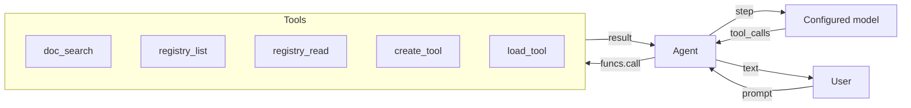
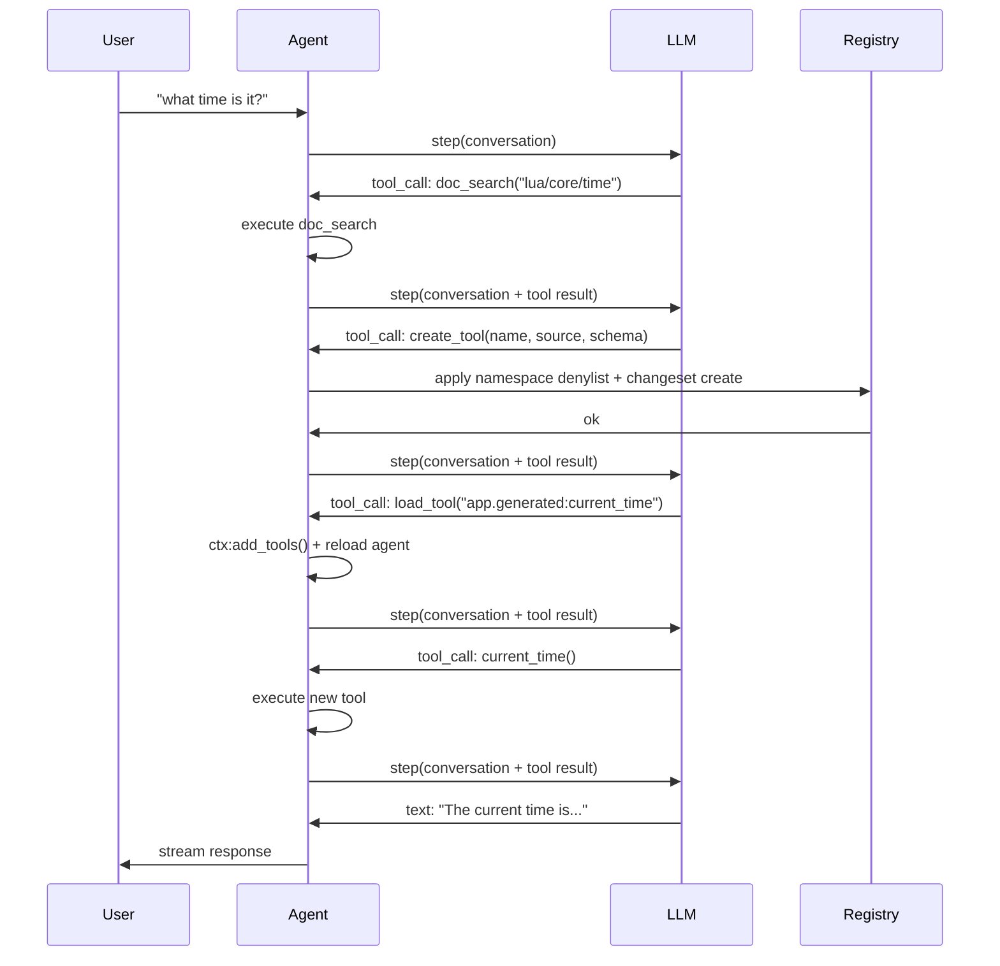
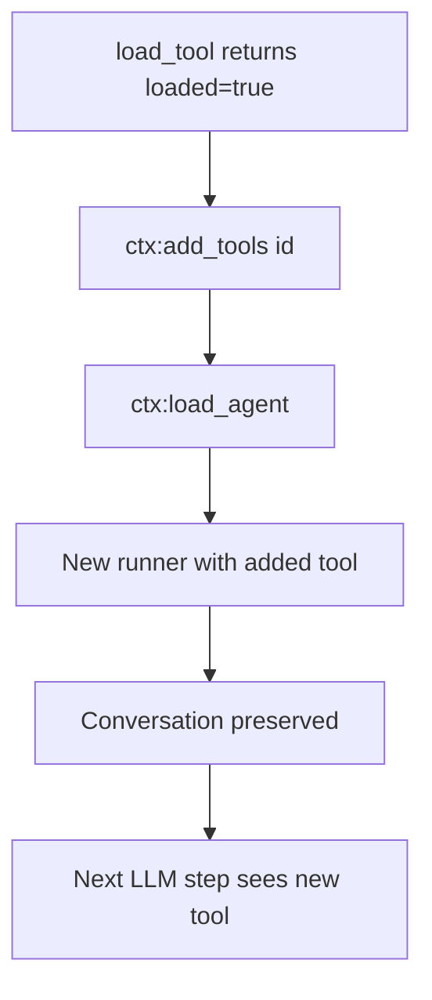
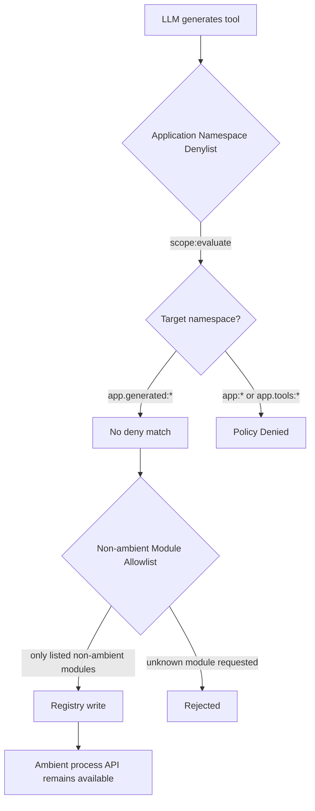

# Micro AGI

Study an agent that reads documentation, generates Lua tools, registers them at runtime, and loads them into its active session.

**Classification: reference implementation walkthrough.** The snippets explain the
published `wippy/micro-agi` module but are intentionally not a complete source tree.
Run the Hub module to exercise the implementation; use the LLM Agent tutorial when
you need a self-contained build.

## What the Package Demonstrates

A terminal agent that:

- Streams answers from an LLM.
- Searches Wippy documentation for APIs.
- Inspects the registry for existing capabilities.
- Creates and loads tools when a capability is missing.
- Compresses conversation history when it approaches the context limit.



## Architecture

The agent runs as a Wippy process with access to the registry. When the LLM decides it needs a capability it doesn't have, it uses the self-modification loop:



Tools are registry entries. To create one, the agent writes a `function.lua` entry with inline Lua source in `data.source`; the runtime then compiles and loads that entry.

## Published Package Structure

The package owns all of these files. This page reproduces `doc_search.lua` and the
contracts that matter to the architecture, but abbreviates the registry helpers,
changeset plumbing, dynamic-loader helpers, and the agent loop. In particular, the
`create_tool`, `load_tool`, and `agent.lua` sections are excerpts, not files that can
be copied verbatim. The complete registry definitions for `registry_list` and
`registry_read` also remain in the published module.

```
micro-agi/
├── .wippy.yaml
├── wippy.yaml
└── src/
    ├── _index.yaml
    ├── README.md
    ├── agent.lua
    └── tools/
        ├── _index.yaml
        ├── doc_search.lua
        ├── registry_list.lua
        ├── registry_read.lua
        ├── create_tool.lua
        └── load_tool.lua
```

## Infrastructure

The package uses this `.wippy.yaml` configuration:

```yaml
version: "1.0"

logger:
  encoding: console
```

## Entry Definitions

The following selected `src/_index.yaml` entries show the infrastructure, security
policies, models, agent, and process:

```yaml
version: "1.0"
namespace: app

entries:
  - name: definition
    kind: ns.definition
    readme: file://README.md
    meta:
      title: Micro AGI
      description: Self-modifying development agent that builds its own tools at runtime
      depends_on: [wippy/llm, wippy/agent]

  - name: os_env
    kind: env.storage.os

  - name: processes
    kind: process.host
    lifecycle:
      auto_start: true

  - name: __dep.llm
    kind: ns.dependency
    component: wippy/llm
    version: "*"
    parameters:
      - name: env_storage
        value: app:os_env
      - name: process_host
        value: app:processes

  - name: __dep.agent
    kind: ns.dependency
    component: wippy/agent
    version: "*"
    parameters:
      - name: process_host
        value: app:processes
```

### Security Policies

Two `security.policy` entries form an application-level namespace denylist:

```yaml
  - name: deny_core_ns
    kind: security.policy
    policy:
      actions: "*"
      resources: "app:*"
      effect: deny
    groups:
      - agent_security

  - name: deny_tools_ns
    kind: security.policy
    policy:
      actions: "*"
      resources: "app.tools:*"
      effect: deny
    groups:
      - agent_security
```

These policies are loaded as a named scope (`app:agent_security`) by
`create_tool`. The helper rejects an explicit `deny` for `app:*` (core entries,
models, and the agent definition) or `app.tools:*` (built-in tools), but treats
the unmatched `undefined` result for `app.generated:*` as passing its bespoke
filter. This is not Wippy runtime authorization: guarded operations require an
explicit `allow` from the execution context, including the security-module
operations shown below and `registry.apply` inside `changes:apply()`.

See [Security Model](../system/security.md) for details on policy evaluation.

### Models

Two models serve different purposes:

```yaml
  - name: gpt-5.1
    kind: registry.entry
    meta:
      name: gpt-5.1
      type: llm.model
      title: GPT-5.1
      comment: Reasoning model
      capabilities: [generate, tool_use, structured_output, vision, thinking]
      class: [reasoning]
      priority: 210
    max_tokens: 400000
    output_tokens: 128000
    pricing:
      input: 1.25
      output: 10
    providers:
      - id: wippy.llm.openai:provider
        options:
          reasoning_model_request: true
        provider_model: gpt-5.1

  - name: gpt-4.1-nano
    kind: registry.entry
    meta:
      name: gpt-4.1-nano
      type: llm.model
      title: GPT-4.1 Nano
      comment: Compression model
      capabilities: [generate, tool_use, structured_output]
      class: [fast]
      priority: 100
    max_tokens: 1047576
    output_tokens: 32768
    pricing:
      input: 0.1
      output: 0.4
    providers:
      - id: wippy.llm.openai:provider
        provider_model: gpt-4.1-nano
```

GPT-5.1 handles reasoning and tool use. GPT-4.1 Nano handles context compression.

### Agent Definition

```yaml
  - name: dev_assistant
    kind: registry.entry
    meta:
      type: agent.gen1
      name: dev_assistant
      title: Dev Assistant
      comment: Wippy development assistant
    prompt: |
      Self-modifying Wippy development agent. You run inside Wippy runtime
      with access to docs, registry, and dynamic tool creation.

      Rules:
      - NEVER fabricate, guess, or hallucinate facts. If you need real data,
        use or build a tool to get it. Only state what a tool actually returned.
      - Maximum 2-3 sentences per response. No bullet lists. No disclaimers.
      - Never say "I can't" or "I don't have". Build the tool and do it.
      - Act first, explain only if asked.

      To gain new capabilities: doc_search the API, create_tool with Lua source,
      load_tool, call it. All in one turn.
    model: gpt-5.1
    thinking_effort: 10
    max_tokens: 2048
    tools:
      - "app.tools:*"
```

The prompt gives the agent three operating rules:

- **Use retrieved data** — use tools for external facts.
- **Create missing capabilities** — build a tool when an allowed capability is absent.
- **Prioritize actions** — perform the requested operation before explaining it.

### Process

```yaml
  - name: agent
    kind: process.lua
    meta:
      command:
        name: agent
        short: Start dev assistant
    source: file://agent.lua
    method: main
    modules: [io, json, funcs, registry, time, security]
    imports:
      prompt: wippy.llm:prompt
      agent_context: wippy.agent:context
      compress: wippy.llm.util:compress
```

The process runs as a terminal command. `create_tool` applies the package's
denylist before writing, but that filter does not supply the command's runtime
security context.

Imports:

- `prompt` — Conversation builder
- `agent_context` — Agent loading and dynamic tool management
- `compress` — LLM-based text compression for context management

## Tools

Create `src/tools/_index.yaml` with five tools:

### doc_search

Fetches Wippy documentation via the `wippy.ai/llm` API. Supports two modes: fetch a page by path, or search by query.

```lua
local http_client = require("http_client")
local json = require("json")

local BASE_URL = "https://wippy.ai/llm"
local MAX_CHARS = 8000

local function fetch_page(path)
    local url = BASE_URL .. "/path/en/" .. path
    local resp, err = http_client.get(url, {
        headers = { ["User-Agent"] = "wippy-agent/1.0" },
    })
    if err then
        return nil, tostring(err)
    end
    if resp.status_code ~= 200 then
        return nil, "HTTP " .. resp.status_code
    end

    local body = resp.body or ""
    if #body > MAX_CHARS then
        body = body:sub(1, MAX_CHARS) .. "\n... (truncated)"
    end
    return body, nil
end

local function search_docs(query)
    local url = BASE_URL .. "/search?q=" .. http_client.encode_uri(query)
    local resp, err = http_client.get(url, {
        headers = { ["User-Agent"] = "wippy-agent/1.0" },
    })
    if err then
        return { error = tostring(err) }
    end
    if resp.status_code ~= 200 then
        return { error = "HTTP " .. resp.status_code }
    end

    local body = resp.body or ""
    if #body > MAX_CHARS then
        body = body:sub(1, MAX_CHARS) .. "\n... (truncated)"
    end

    return { results = body }
end

local function handler(input)
    if input.path then
        local content, err = fetch_page(input.path)
        if err then
            return { error = err }
        end
        return { path = input.path, content = content }
    end

    if input.query then
        return search_docs(input.query)
    end

    return { error = "provide either 'path' or 'query'" }
end

return { handler = handler }
```

### create_tool

This tool evaluates the package's namespace denylist and creates a
`function.lua` registry entry with inline Lua source.

The `modules` field on the generated entry controls which non-ambient runtime modules the
tool can require. The `process` module is ambient for every executable Lua entry, so
omitting it is not a security boundary; process operations still rely on runtime security
policies.

```lua
local registry = require("registry")
local json = require("json")
local security = require("security")

local NAMESPACE = "app.generated"
local MAX_SOURCE_LEN = 16000
local MAX_NAME_LEN = 64

local ALLOWED_MODULES = {
    time = true, json = true, http_client = true, expr = true,
    text = true, base64 = true, yaml = true, crypto = true,
    hash = true, uuid = true,
}
```

**Denylist evaluation** — `create_tool` loads the `agent_security` named scope.
Writes to `app:*` or `app.tools:*` are rejected when the scope returns `deny`;
an unmatched `app.generated:*` target returns `undefined` and passes this
application filter:

```lua
local actor = security.new_actor("service:agent", { role = "agent" })
local scope, scope_err = security.named_scope("app:agent_security")
if scope_err then
    return { error = "failed to load security scope: " .. tostring(scope_err) }
end

local result = scope:evaluate(actor, action, id)
if result == "deny" then
    return { error = "policy denied: " .. action .. " on " .. id }
end
```

This check does not authorize the registry mutation. The current command also
needs a runtime actor and scope that explicitly allow the security-module calls
and `registry.apply`.

**Registry write** — the entry is written with source in `data.source` and only the allowed modules:

```lua
local entry = {
    id = id,
    kind = "function.lua",
    meta = {
        type = "tool",
        title = input.name,
        comment = input.description,
        input_schema = schema,
        llm_alias = input.name,
        llm_description = input.description,
    },
    data = {
        source = input.source,
        modules = modules,
        method = "handler",
    },
}

local snap = registry.snapshot()
local changes = snap:changes()
if existing then
    changes:update(entry)
else
    changes:create(entry)
end
local _, apply_err = changes:apply()
if apply_err then
    return { error = "failed to apply registry change: " .. tostring(apply_err) }
end
```

The generated tool is stored in the registry rather than written to a source file.

### load_tool

Validates the entry is a tool and signals the agent loop to reload:

```lua
local function handler(input)
    local entry, err = registry.get(input.id)
    if err then
        return { error = tostring(err) }
    end
    if not entry then
        return { error = "not found: " .. input.id }
    end
    if not entry.meta or entry.meta.type ~= "tool" then
        return { error = "not a tool (meta.type != 'tool'): " .. input.id }
    end

    return {
        loaded = true,
        id = entry.id,
        alias = entry.meta.llm_alias or input.id,
        description = entry.meta.llm_description or "",
    }
end
```

The agent loop detects `loaded = true` in the result and calls `ctx:add_tools(id)` followed by `ctx:load_agent()` to recompile the agent with the new tool.

## Agent Loop

The agent loop in `src/agent.lua` handles streaming, tool execution, dynamic loading, and context compression.

### Streaming

Uses the same coroutine + channel pattern from the [LLM Agent tutorial](./llm-agent.md):

```lua
coroutine.spawn(function()
    local response, err = session.runner:step(session.conversation, {
        stream_target = {
            reply_to = process.pid(),
            topic = STREAM_TOPIC,
        },
    })
    done_ch:send({ response = response, err = err })
end)
```

### Tool Execution

Tools are called via `funcs.call()`. `pcall` catches raised Lua errors, while the normal
second return from `funcs.call()` carries invocation errors:

```lua
local ok, result, call_err = pcall(funcs.call, tc.registry_id, args)
if not ok then
    results[tc.id] = { error = tostring(result) }
elseif call_err then
    results[tc.id] = { error = tostring(call_err) }
else
    results[tc.id] = result
end
```

### Dynamic Tool Loading

When `load_tool` returns `loaded = true`, the agent reloads itself:



```lua
local function handle_tool_loading(tool_calls, results)
    local reload_needed = false
    for _, tc in ipairs(tool_calls) do
        if tc.name == "load_tool" then
            local result = results[tc.id]
            if result and result.loaded then
                session.ctx:add_tools(result.id)
                reload_needed = true
            end
        end
    end
    if reload_needed then
        reload_agent()
    end
end
```

The conversation is preserved across reloads because it lives in the prompt builder, not in the runner.

### Context Compression

When prompt tokens exceed 300K (75% of the 400K context window), the conversation is compressed using GPT-4.1 Nano:

```lua
if response.tokens and response.tokens.prompt_tokens
    and response.tokens.prompt_tokens > PROMPT_TOKEN_LIMIT then
    try_compress()
end
```

Compression extracts message content, calls `compress.to_size()` targeting 4000 characters, and replaces the conversation with a summary:

```lua
local summary, compress_err = compress.to_size(COMPRESS_MODEL, full_text, COMPRESS_TARGET)
if compress_err then
    return nil, compress_err
end
session.conversation = prompt.new()
session.conversation:add_system("Conversation summary:\n\n" .. summary)
```

## Security Model

An application denylist and module-level access controls constrain generated
tools, but they do not replace runtime authorization.



### Namespace Denylist

| Policy | Resources | Effect |
|--------|-----------|--------|
| `deny_core_ns` | `app:*` | deny |
| `deny_tools_ns` | `app.tools:*` | deny |

`create_tool` loads the `agent_security` policy group and evaluates the target
entry ID. It deliberately treats `undefined` as "not denied" for this
application-level filter. Wippy's guarded authorization does not: it permits an
operation only on explicit `allow`. The context that runs this code must still
carry the required runtime permissions.

This prevents the agent from:
- Modifying its own prompt or agent definition (`app:dev_assistant`)
- Overwriting its built-in tools (`app.tools:*`)
- Changing infrastructure entries (`app:processes`, etc.)

### Module Access Control

Generated tools declare non-ambient capabilities in `data.modules`, and `create_tool`
accepts only names from `ALLOWED_MODULES`. An undeclared non-ambient module cannot be
required. The runtime still injects `process` into every executable Lua entry, including a
generated tool, so process operations must be constrained with security policies rather
than by omitting `process` from `data.modules`.

This tutorial does not define policies for `process.spawn` or `process.exec`. Its generated
tools are therefore not a complete sandbox: add runtime policies for ambient process
operations before allowing untrusted tool source.

## Run and Current Package Limitation

The published artifact is the Hub module. Start in a fresh empty directory that
does not contain `wippy.lock`; Hub bootstrap rejects an unrelated or multi-root
lock. The first run creates the deployment lock, and later runs from the same
directory reuse that matching lock.

```bash
mkdir micro-agi-deploy
cd micro-agi-deploy
wippy run wippy/micro-agi agent
```

The command downloads the selected module version, resolves its declared
dependencies, and invokes its `agent` command.

It still requires the provider credentials and model configuration expected by
that module, plus registry/network access for Hub download and documentation
search. This page does not provide a local clone or lockfile, so it does not
claim a reproducible source build.

At the reviewed release, `wippy/micro-agi` v0.3.1 declares no
`meta.command.security` context for `agent`. With default strict mode, the
guarded tool paths—including `funcs.call`, registry reads and writes, and the
documentation search HTTP request—do not receive the explicit allows they
require. The tool and self-modification flows above are therefore reference
designs, not successful default-strict-mode runs. Do not disable strict mode to
make an untrusted code generator work; the package should first add a least-
privilege command scope for its required actions.

## Next Steps

- [LLM Agent](./llm-agent.md) — Build a basic agent from scratch
- [Agent Module](../framework/agents.md) — Agent framework reference
- [Registry](../concepts/registry.md) — Registry concepts
- [Security Model](../system/security.md) — Declarative security policies
- [Entry Kinds](../guides/entry-kinds.md) — Available entry types
