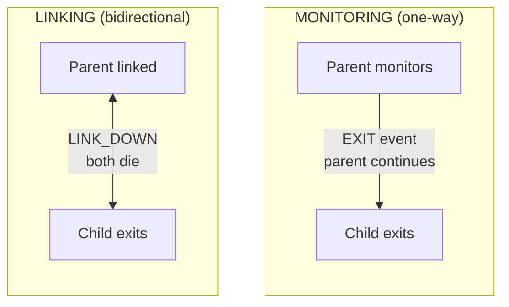

# Process Supervision

Monitor and link processes to build fault-tolerant systems.

## Monitoring vs Linking

**Monitoring** provides one-way observation:
- Parent monitors child
- Child exits, parent receives EXIT event
- Parent continues running

**Linking** creates bidirectional fate-sharing:
- Parent and child are linked
- Either process fails, both terminate
- Unless `trap_links=true` is set



## Process Monitoring

### Spawn with Monitoring

Use `process.spawn_monitored()` to spawn and monitor in one call:

```lua
local function main()
    local events_ch = process.events()

    -- Spawn worker and start monitoring
    local worker_pid, err = process.spawn_monitored(
        "app.workers:task_worker",
        "app:processes"
    )
    if err then
        return nil, "spawn failed: " .. tostring(err)
    end

    -- Wait for worker to complete
    local event = events_ch:receive()

    if event.kind == process.event.EXIT then
        print("Worker exited:", event.from)
        if event.result then
            print("Result:", event.result.value)
        end
        if event.result and event.result.error then
            print("Error:", event.result.error)
        end
    end
end
```

### Monitor Existing Process

Call `process.monitor()` to start monitoring an already-running process:

```lua
local function main()
    local time = require("time")
    local events_ch = process.events()

    -- Spawn without monitoring
    local worker_pid, err = process.spawn(
        "app.workers:long_worker",
        "app:processes"
    )
    if err then
        return nil, "spawn failed: " .. tostring(err)
    end

    -- Start monitoring later
    local ok, monitor_err = process.monitor(worker_pid)
    if monitor_err then
        return nil, "monitor failed: " .. tostring(monitor_err)
    end

    -- Cancel the worker
    time.sleep("5ms")
    process.cancel(worker_pid, "100ms")

    -- Receive EXIT event
    local event = events_ch:receive()
    if event.kind == process.event.EXIT then
        print("Worker terminated:", event.from)
    end
end
```

### Stop Monitoring

Use `process.unmonitor()` to stop receiving EXIT events:

```lua
local function main()
    local time = require("time")
    local events_ch = process.events()

    -- Spawn and monitor
    local worker_pid, err = process.spawn_monitored(
        "app.workers:long_worker",
        "app:processes"
    )

    time.sleep("5ms")

    -- Stop monitoring
    local ok, unmon_err = process.unmonitor(worker_pid)
    if unmon_err then
        return nil, "unmonitor failed: " .. tostring(unmon_err)
    end

    -- Cancel worker
    process.cancel(worker_pid, "100ms")

    -- No EXIT event will be received (we unmonitored)
    local timeout = time.after("200ms")
    local result = channel.select {
        events_ch:case_receive(),
        timeout:case_receive(),
    }

    if result.channel == events_ch then
        return nil, "should not receive event after unmonitor"
    end
end
```

## Process Linking

### Explicit Linking

Use `process.link()` to create a bidirectional link:

```lua
-- Worker that links to a target process
local function worker_main()
    local time = require("time")
    local events_ch = process.events()
    local inbox_ch = process.inbox()

    -- Enable trap_links to receive LINK_DOWN events
    process.set_options({ trap_links = true })

    -- Receive target PID from sender
    local msg = inbox_ch:receive()
    local target_pid = msg:payload():data()
    local sender = msg:from()

    -- Create bidirectional link
    local ok, err = process.link(target_pid)
    if err then
        return nil, "link failed: " .. tostring(err)
    end

    -- Notify sender we're linked
    process.send(sender, "linked", process.pid())

    -- Wait for LINK_DOWN when target exits
    local timeout = time.after("3s")
    local result = channel.select {
        events_ch:case_receive(),
        timeout:case_receive(),
    }

    if result.channel == events_ch then
        local event = result.value
        if event.kind == process.event.LINK_DOWN then
            return "LINK_DOWN_RECEIVED"
        end
    end

    return nil, "no LINK_DOWN received"
end
```

### Spawn with Link

Use `process.spawn_linked()` to spawn and link in one call:

```lua
local function parent_main()
    -- Enable trap_links to handle child death
    process.set_options({ trap_links = true })

    local events_ch = process.events()

    -- Spawn and link to child
    local child_pid, err = process.spawn_linked(
        "app.workers:child_worker",
        "app:processes"
    )
    if err then
        return nil, "spawn_linked failed: " .. tostring(err)
    end

    -- If child dies, we receive LINK_DOWN
    local event = events_ch:receive()
    if event.kind == process.event.LINK_DOWN then
        print("Child died:", event.from)
    end
end
```

## Trap Links

By default, when a linked process fails, the current process also fails. Set `trap_links=true` to receive LINK_DOWN events instead.

### Default Behavior (trap_links=false)

Without `trap_links`, linked process failure terminates the current process:

```lua
local function worker_main()
    local events_ch = process.events()

    -- trap_links is false by default
    local opts = process.get_options()
    print("trap_links:", opts.trap_links)  -- false

    -- Spawn linked worker that will fail
    local child_pid, err = process.spawn_linked(
        "app.workers:error_worker",
        "app:processes"
    )

    -- When child errors, THIS process terminates
    -- We never reach this point
    local event = events_ch:receive()
end
```

### With trap_links=true

Enable `trap_links` to receive LINK_DOWN events and survive:

```lua
local function worker_main()
    -- Enable trap_links
    process.set_options({ trap_links = true })

    local events_ch = process.events()

    -- Spawn linked worker that will fail
    local child_pid, err = process.spawn_linked(
        "app.workers:error_worker",
        "app:processes"
    )

    -- Wait for LINK_DOWN event
    local event = events_ch:receive()

    if event.kind == process.event.LINK_DOWN then
        print("Child failed, handling gracefully")
        return "LINK_DOWN_RECEIVED"
    end
end
```

## Cancellation

### Send Cancel Signal

Use `process.cancel()` to gracefully terminate a process:

```lua
local function main()
    local time = require("time")
    local events_ch = process.events()

    -- Spawn and monitor worker
    local worker_pid, err = process.spawn_monitored(
        "app.workers:long_worker",
        "app:processes"
    )

    time.sleep("5ms")

    -- Cancel with 100ms timeout for cleanup
    local ok, cancel_err = process.cancel(worker_pid, "100ms")
    if cancel_err then
        return nil, "cancel failed: " .. tostring(cancel_err)
    end

    -- Wait for EXIT event
    local event = events_ch:receive()
    if event.kind == process.event.EXIT then
        print("Worker cancelled:", event.from)
    end
end
```

### Handle Cancellation

Worker receives CANCEL event through `process.events()`:

```lua
local function worker_main()
    local events_ch = process.events()
    local inbox_ch = process.inbox()

    while true do
        local result = channel.select {
            inbox_ch:case_receive(),
            events_ch:case_receive(),
        }

        if result.channel == events_ch then
            local event = result.value
            if event.kind == process.event.CANCEL then
                -- Cleanup resources
                cleanup()
                return "cancelled gracefully"
            end
        else
            -- Process inbox message
            handle_message(result.value)
        end
    end
end
```

## Supervision Topologies

### Star Topology

Parent with multiple children linking back to it:

```lua
-- Parent worker spawns children that link TO parent
local function star_parent_main()
    local time = require("time")
    local events_ch = process.events()
    local child_count = 10

    -- Enable trap_links to see children die
    process.set_options({ trap_links = true })

    local children = {}

    -- Spawn children
    for i = 1, child_count do
        local child_pid, err = process.spawn(
            "app.workers:linker_child",
            "app:processes"
        )
        if err then
            error("spawn child failed: " .. tostring(err))
        end

        -- Send parent PID to child
        process.send(child_pid, "inbox", process.pid())
        children[child_pid] = true
    end

    -- Wait for all children to confirm link
    for i = 1, child_count do
        local msg = process.inbox():receive()
        if msg:topic() ~= "linked" then
            error("expected linked confirmation")
        end
    end

    -- Trigger failure - all children should receive LINK_DOWN
    error("PARENT_STAR_FAILURE")
end
```

Child worker that links to parent:

```lua
local function linker_child_main()
    local events_ch = process.events()
    local inbox_ch = process.inbox()

    -- Receive parent PID
    local msg = inbox_ch:receive()
    local parent_pid = msg:payload():data()

    -- Link to parent
    process.link(parent_pid)

    -- Confirm link
    process.send(parent_pid, "linked", process.pid())

    -- Wait for LINK_DOWN when parent dies
    local event = events_ch:receive()
    if event.kind == process.event.LINK_DOWN then
        return "parent_died"
    end
end
```

### Chain Topology

Linear chain where each node links to its parent:

```lua
-- Chain root: A -> B -> C -> D -> E
local function chain_root_main()
    local time = require("time")

    -- Spawn first child
    local child_pid, err = process.spawn_linked(
        "app.workers:chain_node",
        "app:processes",
        4  -- depth remaining
    )
    if err then
        error("spawn failed: " .. tostring(err))
    end

    -- Wait for chain to build
    time.sleep("100ms")

    -- Trigger cascade - all linked processes die
    error("CHAIN_ROOT_FAILURE")
end
```

Chain node spawns next node and links:

```lua
local function chain_node_main(depth)
    local time = require("time")

    if depth > 0 then
        -- Spawn next in chain
        local child_pid, err = process.spawn_linked(
            "app.workers:chain_node",
            "app:processes",
            depth - 1
        )
        if err then
            error("spawn failed: " .. tostring(err))
        end
    end

    -- Wait for parent to die (triggers our death via LINK_DOWN)
    time.sleep("5s")
end
```

## Worker Pool with Supervision

### Configuration

```yaml
# src/_index.yaml
version: "1.0"
namespace: app

entries:
  - name: processes
    kind: process.host
    host:
      workers: 16
    lifecycle:
      auto_start: true
```

```yaml
# src/supervisor/_index.yaml
version: "1.0"
namespace: app.supervisor

entries:
  - name: pool
    kind: process.lua
    source: file://pool.lua
    method: main
    modules:
      - time
    lifecycle:
      auto_start: true
```

### Supervisor Implementation

```lua
-- src/supervisor/pool.lua
local function main(worker_count)
    local time = require("time")
    worker_count = worker_count or 4

    -- Enable trap_links to handle worker deaths
    process.set_options({ trap_links = true })

    local events_ch = process.events()
    local workers = {}

    local function start_worker(id)
        local pid, err = process.spawn_linked(
            "app.workers:task_worker",
            "app:processes",
            id
        )
        if err then
            print("Failed to start worker " .. id .. ": " .. tostring(err))
            return nil
        end

        workers[pid] = {id = id, started_at = os.time()}
        print("Worker " .. id .. " started: " .. pid)
        return pid
    end

    -- Start initial pool
    for i = 1, worker_count do
        start_worker(i)
    end

    print("Supervisor started with " .. worker_count .. " workers")

    -- Supervision loop
    while true do
        local timeout = time.after("60s")
        local result = channel.select {
            events_ch:case_receive(),
            timeout:case_receive(),
        }

        if result.channel == timeout then
            -- Periodic health check
            local count = 0
            for _ in pairs(workers) do count = count + 1 end
            print("Health check: " .. count .. " active workers")

        elseif result.channel == events_ch then
            local event = result.value

            if event.kind == process.event.LINK_DOWN then
                local dead_worker = workers[event.from]
                if dead_worker then
                    workers[event.from] = nil
                    local uptime = os.time() - dead_worker.started_at
                    print("Worker " .. dead_worker.id .. " died after " .. uptime .. "s, restarting")

                    -- Brief delay before restart
                    time.sleep("100ms")
                    start_worker(dead_worker.id)
                end
            end
        end
    end
end

return { main = main }
```

## Process Configuration

### Worker Definition

```yaml
# src/workers/_index.yaml
version: "1.0"
namespace: app.workers

entries:
  - name: task_worker
    kind: process.lua
    source: file://task_worker.lua
    method: main
    modules:
      - time
```

### Worker Implementation

```lua
-- src/workers/task_worker.lua
local function main(worker_id)
    local time = require("time")
    local events_ch = process.events()
    local inbox_ch = process.inbox()

    print("Task worker " .. worker_id .. " started")

    while true do
        local timeout = time.after("5s")
        local result = channel.select {
            inbox_ch:case_receive(),
            events_ch:case_receive(),
            timeout:case_receive(),
        }

        if result.channel == events_ch then
            local event = result.value
            if event.kind == process.event.CANCEL then
                print("Worker " .. worker_id .. " cancelled")
                return "cancelled"
            elseif event.kind == process.event.LINK_DOWN then
                print("Worker " .. worker_id .. " linked process died")
                return nil, "linked_process_died"
            end

        elseif result.channel == inbox_ch then
            local msg = result.value
            local topic = msg:topic()
            local payload = msg:payload():data()

            if topic == "work" then
                print("Worker " .. worker_id .. " processing: " .. payload)
                time.sleep("100ms")
                process.send(msg:from(), "result", "completed: " .. payload)
            end

        elseif result.channel == timeout then
            -- Idle timeout
            print("Worker " .. worker_id .. " idle")
        end
    end
end

return { main = main }
```

## Process Host Configuration

The process host controls how many OS threads execute processes:

```yaml
# src/_index.yaml
version: "1.0"
namespace: app

entries:
  - name: processes
    kind: process.host
    host:
      workers: 16  # Number of OS threads
    lifecycle:
      auto_start: true
```

Workers setting:
- Controls parallelism for CPU-bound work
- Typically set to number of CPU cores
- All processes share this thread pool

## Key Concepts

**Monitoring** (one-way observation):
- Use `process.spawn_monitored()` or `process.monitor()`
- Receive EXIT events when monitored process terminates
- Parent continues running after child exits

**Linking** (bidirectional fate-sharing):
- Use `process.spawn_linked()` or `process.link()`
- By default: if either process fails, both terminate
- With `trap_links=true`: receive LINK_DOWN events instead

**Cancellation**:
- Use `process.cancel(pid, timeout)` for graceful shutdown
- Worker receives CANCEL event via `process.events()`
- Has timeout duration to cleanup before force termination

## Event Types

| Event | Triggered By | Required Setup |
|-------|--------------|----------------|
| `EXIT` | Monitored process exits | `spawn_monitored()` or `monitor()` |
| `LINK_DOWN` | Linked process fails | `spawn_linked()` or `link()` with `trap_links=true` |
| `CANCEL` | `process.cancel()` called | None (always delivered) |

## Next Steps

- [Processes](processes.md) - Process fundamentals
- [Channels](channels.md) - Message passing patterns
- [Process Module](lua/core/process.md) - API reference
