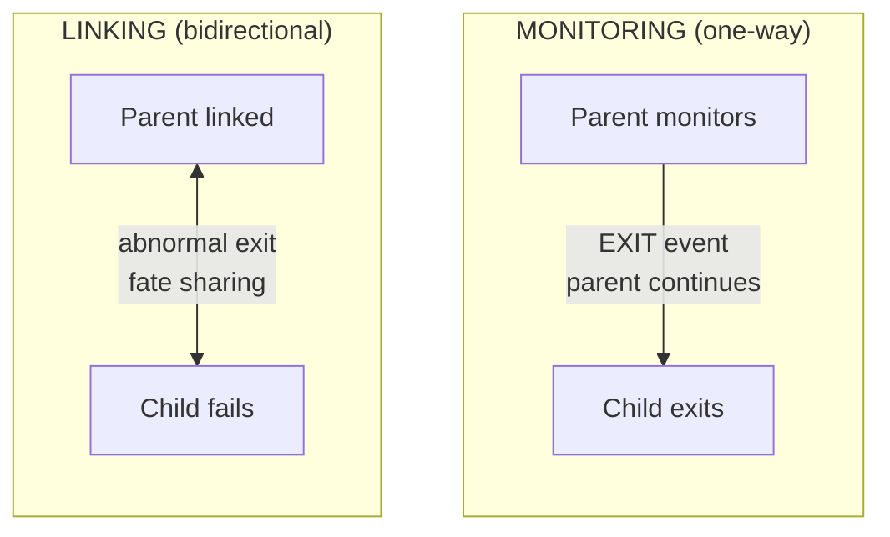

# Process Supervision Recipes

Use monitoring and linking to observe process exits, propagate failures, handle cancellation, and restart workers.

**Classification:** Partial recipe. The lifecycle snippets are independent, and the
worker-pool section supplies its core entries but not the separate control process
needed to trigger and verify a restart.

## Context and Dependencies

The snippets target Wippy runtime `v0.3.32a` and assume an executable Lua entry, a
running `process.host` named `app:processes`, and project-defined worker entries such
as `app.workers:task_worker`. The `process` and `channel` APIs are ambient globals.
Any snippet that calls `time.*` requires the `time` module in its entry and
`local time = require("time")` in its source.

Process spawn, host selection, monitoring, linking, sending, cancellation, and
termination are guarded operations. Attach an actor and narrowly scoped allow
policies to each executable entry that uses them. The worker-pool configuration
below includes the policies needed by that recipe; the isolated snippets do not.

## Monitoring vs Linking

**Monitoring** provides one-way observation:

- A parent monitors a child.
- When the child exits, the parent receives an `EXIT` event.
- The parent continues running.

**Linking** creates bidirectional fate-sharing:

- A parent and child are linked.
- If either process exits abnormally, the other also terminates.
- Setting `trap_links=true` changes failures into events that the process can handle.


```mermaid
flowchart TB
    subgraph Monitoring["MONITORING (one-way)"]
        direction TB
        P1[Parent monitors] -->|EXIT event<br/>parent continues| C1[Child exits]
    end

    subgraph Linking["LINKING (bidirectional)"]
        direction TB
        P2[Parent linked] <-->|abnormal exit<br/>fate sharing| C2[Child fails]
    end
```

## Process Monitoring

### Spawn with Monitoring

Use `process.spawn_monitored()` to spawn and monitor in one call:

```lua
local function main()
    local events_ch = process.events()

    -- Spawn worker and start monitoring
    local worker_pid, err = process.spawn_monitored(
        "app.workers:task_worker",
        "app:processes"
    )
    if err then
        return nil, "spawn failed: " .. tostring(err)
    end

    -- Wait for worker to complete
    local event = events_ch:receive()

    if event.kind == process.event.EXIT then
        print("Worker exited:", event.from)
        if event.result then
            print("Result:", event.result.value)
        end
        if event.result and event.result.error then
            print("Error:", event.result.error)
        end
    end
end
```

### Monitor Existing Process

Call `process.monitor()` to start monitoring an already-running process:

```lua
local function main()
    local time = require("time")
    local events_ch = process.events()

    -- Spawn without monitoring
    local worker_pid, err = process.spawn(
        "app.workers:long_worker",
        "app:processes"
    )
    if err then
        return nil, "spawn failed: " .. tostring(err)
    end

    -- Start monitoring later
    local ok, monitor_err = process.monitor(worker_pid)
    if monitor_err then
        return nil, "monitor failed: " .. tostring(monitor_err)
    end

    -- Cancel the worker
    time.sleep("5ms")
    local _, cancel_err = process.cancel(worker_pid)
    if cancel_err then
        return nil, "cancel failed: " .. tostring(cancel_err)
    end

    -- Receive EXIT event
    local event = events_ch:receive()
    if event.kind == process.event.EXIT then
        print("Worker terminated:", event.from)
    end
end
```

### Stop Monitoring

Use `process.unmonitor()` to stop receiving EXIT events:

```lua
local function main()
    local time = require("time")
    local events_ch = process.events()

    -- Spawn and monitor
    local worker_pid, err = process.spawn_monitored(
        "app.workers:long_worker",
        "app:processes"
    )
    if err then
        return nil, "spawn failed: " .. tostring(err)
    end

    time.sleep("5ms")

    -- Stop monitoring
    local ok, unmon_err = process.unmonitor(worker_pid)
    if unmon_err then
        return nil, "unmonitor failed: " .. tostring(unmon_err)
    end

    -- Cancel worker
    local _, cancel_err = process.cancel(worker_pid)
    if cancel_err then
        return nil, "cancel failed: " .. tostring(cancel_err)
    end

    -- No EXIT event will be received (we unmonitored)
    local timeout = time.after("200ms")
    local result = channel.select {
        events_ch:case_receive(),
        timeout:case_receive(),
    }

    if result.channel == events_ch then
        return nil, "should not receive event after unmonitor"
    end
end
```

## Process Linking

### Explicit Linking

Use `process.link()` to create a bidirectional link:

```lua
-- Worker that links to a target process
local function worker_main()
    local time = require("time")
    local events_ch = process.events()
    local inbox_ch = process.inbox()

    -- Enable trap_links to receive LINK_DOWN events
    local _, options_err = process.set_options({ trap_links = true })
    if options_err then
        return nil, "set_options failed: " .. tostring(options_err)
    end

    -- Receive target PID from sender
    local msg = inbox_ch:receive()
    local target_pid = msg:payload():data()
    local sender = msg:from()

    -- Create bidirectional link
    local ok, err = process.link(target_pid)
    if err then
        return nil, "link failed: " .. tostring(err)
    end

    -- Notify sender we're linked
    local _, send_err = process.send(sender, "linked", process.pid())
    if send_err then
        return nil, "confirmation failed: " .. tostring(send_err)
    end

    -- Wait for LINK_DOWN when target exits with an error
    local timeout = time.after("3s")
    local result = channel.select {
        events_ch:case_receive(),
        timeout:case_receive(),
    }

    if result.channel == events_ch then
        local event = result.value
        if event.kind == process.event.LINK_DOWN then
            return "LINK_DOWN_RECEIVED"
        end
    end

    return nil, "no LINK_DOWN received"
end
```

### Spawn with Link

Use `process.spawn_linked()` to spawn and link in one call:

```lua
local function parent_main()
    -- Enable trap_links to handle child death
    local _, options_err = process.set_options({ trap_links = true })
    if options_err then
        return nil, "set_options failed: " .. tostring(options_err)
    end

    local events_ch = process.events()

    -- Spawn and link to child
    local child_pid, err = process.spawn_linked(
        "app.workers:child_worker",
        "app:processes"
    )
    if err then
        return nil, "spawn_linked failed: " .. tostring(err)
    end

    -- If the child exits with an error, we receive LINK_DOWN
    local event = events_ch:receive()
    if event.kind == process.event.LINK_DOWN then
        print("Child died:", event.from)
    end
end
```

The target or child must exit abnormally for these examples to receive
`LINK_DOWN`; the explicit-link example also requires that failure to occur within
its three-second wait window. Normal completion does not emit this event.

## Trap Links

By default, when a linked process fails, the current process also fails. Set `trap_links=true` to receive LINK_DOWN events instead.

### Default Behavior (trap_links=false)

Without `trap_links`, linked process failure terminates the current process:

```lua
local function worker_main()
    local events_ch = process.events()

    -- trap_links is false by default
    local opts = process.get_options()
    print("trap_links:", opts.trap_links)  -- false

    -- Spawn linked worker that will fail
    local child_pid, err = process.spawn_linked(
        "app.workers:error_worker",
        "app:processes"
    )
    if err then
        return nil, "spawn_linked failed: " .. tostring(err)
    end

    -- When child errors, THIS process terminates
    -- We never reach this point
    local event = events_ch:receive()
end
```

### With trap_links=true

Enable `trap_links` to receive LINK_DOWN events and survive:

```lua
local function worker_main()
    -- Enable trap_links
    local _, options_err = process.set_options({ trap_links = true })
    if options_err then
        return nil, "set_options failed: " .. tostring(options_err)
    end

    local events_ch = process.events()

    -- Spawn linked worker that will fail
    local child_pid, err = process.spawn_linked(
        "app.workers:error_worker",
        "app:processes"
    )
    if err then
        return nil, "spawn_linked failed: " .. tostring(err)
    end

    -- Wait for LINK_DOWN event
    local event = events_ch:receive()

    if event.kind == process.event.LINK_DOWN then
        print("Child failed, handling gracefully")
        return "LINK_DOWN_RECEIVED"
    end
end
```

## Cancellation

### Send Cancel Signal

Use `process.cancel()` to request graceful cancellation from a process:

```lua
local function main()
    local time = require("time")
    local events_ch = process.events()

    -- Spawn and monitor worker
    local worker_pid, err = process.spawn_monitored(
        "app.workers:long_worker",
        "app:processes"
    )
    if err then
        return nil, "spawn failed: " .. tostring(err)
    end

    time.sleep("5ms")

    -- Cancel the worker
    local ok, cancel_err = process.cancel(worker_pid)
    if cancel_err then
        return nil, "cancel failed: " .. tostring(cancel_err)
    end

    -- Wait for EXIT event
    local event = events_ch:receive()
    if event.kind == process.event.EXIT then
        print("Worker cancelled:", event.from)
    end
end
```

### Handle Cancellation

The worker receives the `CANCEL` event through `process.events()`:

`cleanup()` and `handle_message()` below are application callbacks that the recipe
does not define.

```lua
local function worker_main()
    local events_ch = process.events()
    local inbox_ch = process.inbox()

    while true do
        local result = channel.select {
            inbox_ch:case_receive(),
            events_ch:case_receive(),
        }

        if result.channel == events_ch then
            local event = result.value
            if event.kind == process.event.CANCEL then
                -- Cleanup resources
                cleanup()
                return "cancelled gracefully"
            end
        else
            -- Process inbox message
            handle_message(result.value)
        end
    end
end
```

## Supervision Topologies

### Star Topology

A parent can coordinate multiple children that link back to it:

```lua
-- Parent worker spawns children that link TO parent
local function star_parent_main()
    local time = require("time")
    local events_ch = process.events()
    local child_count = 10

    -- Enable trap_links to see children die
    local _, options_err = process.set_options({ trap_links = true })
    if options_err then
        error("set_options failed: " .. tostring(options_err))
    end

    local children = {}

    -- Spawn children
    for i = 1, child_count do
        local child_pid, err = process.spawn(
            "app.workers:linker_child",
            "app:processes"
        )
        if err then
            error("spawn child failed: " .. tostring(err))
        end

        -- Send parent PID to child
        local _, send_err = process.send(child_pid, "inbox", process.pid())
        if send_err then
            error("send parent PID failed: " .. tostring(send_err))
        end
        children[child_pid] = true
    end

    -- Wait for all children to confirm link
    for i = 1, child_count do
        local msg = process.inbox():receive()
        if msg:topic() ~= "linked" then
            error("expected linked confirmation")
        end
    end

    -- Trigger failure - all children should receive LINK_DOWN
    error("PARENT_STAR_FAILURE")
end
```

Child worker that links to parent:

```lua
local function linker_child_main()
    -- Enable trap_links to receive LINK_DOWN events
    local _, options_err = process.set_options({ trap_links = true })
    if options_err then
        return nil, "set_options failed: " .. tostring(options_err)
    end

    local events_ch = process.events()
    local inbox_ch = process.inbox()

    -- Receive parent PID
    local msg = inbox_ch:receive()
    local parent_pid = msg:payload():data()

    -- Link to parent
    local _, link_err = process.link(parent_pid)
    if link_err then
        return nil, "link failed: " .. tostring(link_err)
    end

    -- Confirm link
    local _, send_err = process.send(parent_pid, "linked", process.pid())
    if send_err then
        return nil, "confirmation failed: " .. tostring(send_err)
    end

    -- Wait for LINK_DOWN when parent dies
    local event = events_ch:receive()
    if event.kind == process.event.LINK_DOWN then
        return "parent_died"
    end
end
```

### Chain Topology

In a linear chain, each node links to its parent:

```lua
-- Chain root: A -> B -> C -> D -> E
local function chain_root_main()
    local time = require("time")

    -- Spawn first child
    local child_pid, err = process.spawn_linked(
        "app.workers:chain_node",
        "app:processes",
        4  -- depth remaining
    )
    if err then
        error("spawn failed: " .. tostring(err))
    end

    -- Wait for chain to build
    time.sleep("100ms")

    -- Trigger cascade - all linked processes die
    error("CHAIN_ROOT_FAILURE")
end
```

Chain node spawns next node and links:

```lua
local function chain_node_main(depth)
    if depth > 0 then
        -- Spawn next in chain
        local child_pid, err = process.spawn_linked(
            "app.workers:chain_node",
            "app:processes",
            depth - 1
        )
        if err then
            error("spawn failed: " .. tostring(err))
        end
    end

    -- Block until parent death kills us via LINK_DOWN (default trap_links=false)
    process.inbox():receive()
end
```

## Worker Pool with Supervision

### Configuration

```yaml
# src/_index.yaml
version: "1.0"
namespace: app

entries:
  - name: supervision-policy
    kind: security.policy
    policy:
      actions:
        - process.host
        - process.send
        - process.spawn
        - process.spawn.linked
      resources: "*"
      effect: allow

  - name: processes
    kind: process.host
    host:
      workers: 16
    lifecycle:
      auto_start: true
```

```yaml
# src/supervisor/_index.yaml
version: "1.0"
namespace: app.supervisor

entries:
  - name: pool
    kind: process.lua
    source: file://pool.lua
    method: main
    modules:
      - time
    security:
      actor:
        id: app.supervisor:pool
      policies:
        - app:supervision-policy

  - name: pool-service
    kind: process.service
    process: app.supervisor:pool
    host: app:processes
    input:
      - 4
    lifecycle:
      auto_start: true
```

### Supervisor Implementation

```lua
-- src/supervisor/pool.lua
local function main(worker_count)
    local time = require("time")
    worker_count = worker_count or 4

    -- Enable trap_links to handle worker deaths
    local _, options_err = process.set_options({ trap_links = true })
    if options_err then
        error("set_options failed: " .. tostring(options_err))
    end

    local events_ch = process.events()
    local workers = {}

    local function start_worker(id)
        local pid, err = process.spawn_linked(
            "app.workers:task_worker",
            "app:processes",
            id
        )
        if err then
            print("Failed to start worker " .. id .. ": " .. tostring(err))
            return nil
        end

        workers[pid] = {id = id, started_at = os.time()}
        print("Worker " .. id .. " started: " .. pid)
        return pid
    end

    -- Start initial pool
    for i = 1, worker_count do
        start_worker(i)
    end

    print("Supervisor started with " .. worker_count .. " workers")

    -- Supervision loop
    while true do
        local timeout = time.after("60s")
        local result = channel.select {
            events_ch:case_receive(),
            timeout:case_receive(),
        }

        if result.channel == timeout then
            -- Periodic health check
            local count = 0
            for _ in pairs(workers) do count = count + 1 end
            print("Health check: " .. count .. " active workers")

        elseif result.channel == events_ch then
            local event = result.value

            if event.kind == process.event.LINK_DOWN then
                local dead_worker = workers[event.from]
                if dead_worker then
                    workers[event.from] = nil
                    local uptime = os.time() - dead_worker.started_at
                    print("Worker " .. dead_worker.id .. " died after " .. uptime .. "s, restarting")

                    -- Brief delay before restart
                    time.sleep("100ms")
                    start_worker(dead_worker.id)
                end
            end
        end
    end
end

return { main = main }
```

## Process Configuration

### Worker Definition

```yaml
# src/workers/_index.yaml
version: "1.0"
namespace: app.workers

entries:
  - name: task_worker
    kind: process.lua
    source: file://task_worker.lua
    method: main
    modules:
      - time
    security:
      actor:
        id: app.workers:task_worker
      policies:
        - app:supervision-policy
```

### Worker Implementation

```lua
-- src/workers/task_worker.lua
local function main(worker_id)
    local time = require("time")
    local events_ch = process.events()
    local inbox_ch = process.inbox()

    print("Task worker " .. worker_id .. " started")

    while true do
        local timeout = time.after("5s")
        local result = channel.select {
            inbox_ch:case_receive(),
            events_ch:case_receive(),
            timeout:case_receive(),
        }

        if result.channel == events_ch then
            local event = result.value
            if event.kind == process.event.CANCEL then
                print("Worker " .. worker_id .. " cancelled")
                return "cancelled"
            elseif event.kind == process.event.LINK_DOWN then
                print("Worker " .. worker_id .. " linked process died")
                return nil, "linked_process_died"
            end

        elseif result.channel == inbox_ch then
            local msg = result.value
            local topic = msg:topic()
            local payload = msg:payload():data()

            if topic == "work" then
                print("Worker " .. worker_id .. " processing: " .. payload)
                time.sleep("100ms")
                local _, send_err = process.send(msg:from(), "result", "completed: " .. payload)
                if send_err then
                    return nil, "send result failed: " .. tostring(send_err)
                end
            end

        elseif result.channel == timeout then
            -- Idle timeout
            print("Worker " .. worker_id .. " idle")
        end
    end
end

return { main = main }
```

## Process Host Settings

The `app:processes` entry defined in [Configuration](#configuration) uses the
following host setting:

```yaml
# Within the app:processes entry in src/_index.yaml
host:
  workers: 16  # Worker goroutines (default: NumCPU)
```

The `workers` setting:

- Controls parallelism for CPU-bound work.
- Is typically set to the number of CPU cores.
- Applies to the scheduler pool shared by all processes on the host.

## Event Types

| Event | Triggered By | Required Setup |
|-------|--------------|----------------|
| `EXIT` | Monitored process exits | `spawn_monitored()` or `monitor()` |
| `LINK_DOWN` | Linked process fails | `spawn_linked()` or `link()` with `trap_links=true` |
| `CANCEL` | `process.cancel()` called | The target consumes `process.events()` |

## Using the Supervisor Pool Recipe

The displayed pool starts and supervises workers, but it is not a complete runnable
tutorial: it intentionally omits a control process, that process's termination
policy, and a deterministic assertion of the restart. After incorporating the recipe
into an application, initialize and run that application normally:

```bash
wippy init
wippy run
```

The supervisor autostarts and spawns four workers. To verify restart behavior, add a
trusted control entry that discovers a worker PID, has `process.terminate` permission
for that PID, terminates it, and checks that the supervisor starts a replacement.

An abnormal worker exit makes the pool receive `LINK_DOWN`; it waits 100 ms and
respawns the worker under the same id. A graceful `process.cancel()` lets the worker
exit cleanly, which does not raise `LINK_DOWN` and therefore does not trigger a
restart. Stop the application with Ctrl+C when verification is complete.

## Next Steps

- [Processes](tutorials/processes.md) — Process fundamentals
- [Channels](tutorials/channels.md) — Message-passing patterns
- [Process Module](lua/core/process.md) — Process API reference
