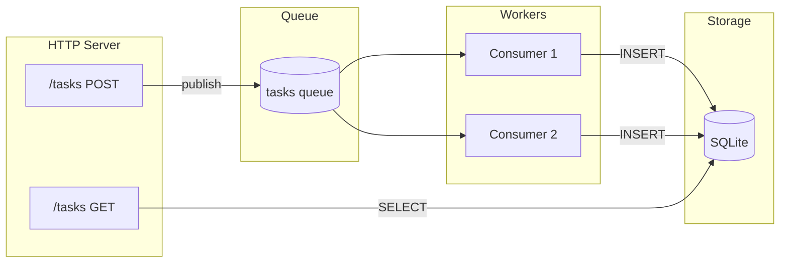

# Task Queue

Build a REST API that queues tasks for background processing with database persistence.

## Overview

This tutorial creates a task management API demonstrating:

- **REST endpoints** - POST tasks, GET results
- **Queue publishing** - Async job dispatch
- **Queue consumers** - Background workers
- **Database persistence** - SQLite storage
- **Migrations** - One-shot process that exits



## Project Structure

```
task-queue/
├── wippy.lock
└── src/
    ├── _index.yaml
    ├── migrate.lua
    ├── create_task.lua
    ├── list_tasks.lua
    └── process_task.lua
```

## Entry Definitions

Create `src/_index.yaml`:

```yaml
version: "1.0"
namespace: app

entries:
  # SQLite database
  - name: db
    kind: db.sql.sqlite
    file: "./data/tasks.db"
    lifecycle:
      auto_start: true

  # Memory queue driver
  - name: queue_driver
    kind: queue.driver.memory
    lifecycle:
      auto_start: true

  # Tasks queue
  - name: tasks_queue
    kind: queue.queue
    driver: app:queue_driver

  # HTTP server
  - name: gateway
    kind: http.service
    addr: ":8080"
    lifecycle:
      auto_start: true

  # Router
  - name: router
    kind: http.router
    meta:
      server: app:gateway

  # Migration process (runs once, exits)
  - name: migrate
    kind: process.lua
    source: file://migrate.lua
    method: main
    modules:
      - sql
      - logger

  # Migration service (auto-starts, exits on success)
  - name: migrate-service
    kind: process.service
    process: app:migrate
    host: app:processes
    lifecycle:
      auto_start: true

  # Process host
  - name: processes
    kind: process.host
    lifecycle:
      auto_start: true

  # API handlers
  - name: create_task
    kind: function.lua
    source: file://create_task.lua
    method: handler
    modules:
      - http
      - queue
      - uuid

  - name: list_tasks
    kind: function.lua
    source: file://list_tasks.lua
    method: handler
    modules:
      - http
      - sql

  # Queue worker
  - name: process_task
    kind: function.lua
    source: file://process_task.lua
    method: main
    modules:
      - queue
      - sql
      - logger
      - time
      - json

  # Endpoints
  - name: create_task.endpoint
    kind: http.endpoint
    meta:
      router: app:router
    method: POST
    path: /tasks
    func: app:create_task

  - name: list_tasks.endpoint
    kind: http.endpoint
    meta:
      router: app:router
    method: GET
    path: /tasks
    func: app:list_tasks

  # Queue consumer
  - name: task_consumer
    kind: queue.consumer
    queue: app:tasks_queue
    func: app:process_task
    concurrency: 2
    prefetch: 5
    lifecycle:
      auto_start: true
```

## Migration Process

Create `src/migrate.lua`:

```lua
local sql = require("sql")
local logger = require("logger")

local function main()
    local db, err = sql.get("app:db")
    if err then
        logger:error("failed to connect", {error = tostring(err)})
        return 1
    end

    local _, exec_err = db:execute([[
        CREATE TABLE IF NOT EXISTS tasks (
            id TEXT PRIMARY KEY,
            payload TEXT NOT NULL,
            status TEXT NOT NULL DEFAULT 'pending',
            result TEXT,
            created_at INTEGER NOT NULL,
            processed_at INTEGER
        )
    ]])

    db:release()

    if exec_err then
        logger:error("migration failed", {error = tostring(exec_err)})
        return 1
    end

    logger:info("migration complete")
    return 0
end

return { main = main }
```

<tip>
Returning 0 signals success. The supervisor won't restart a process that exits normally with code 0.
</tip>

## Create Task Endpoint

Create `src/create_task.lua`:

```lua
local http = require("http")
local queue = require("queue")
local uuid = require("uuid")

local function handler()
    local req, req_err = http.request()
    local res, res_err = http.response()

    if not req or not res then
        return nil, "failed to get HTTP context"
    end

    local body, parse_err = req:body_json()
    if parse_err then
        res:set_status(http.STATUS.BAD_REQUEST)
        res:write_json({error = "invalid JSON"})
        return
    end

    if not body.action then
        res:set_status(http.STATUS.BAD_REQUEST)
        res:write_json({error = "action required"})
        return
    end

    local task_id = uuid.v4()
    local task = {
        id = task_id,
        action = body.action,
        data = body.data or {},
        created_at = os.time()
    }

    local ok, err = queue.publish("app:tasks_queue", task)
    if err then
        res:set_status(http.STATUS.INTERNAL_SERVER_ERROR)
        res:write_json({error = "failed to queue task"})
        return
    end

    res:set_status(http.STATUS.ACCEPTED)
    res:write_json({
        id = task_id,
        status = "queued"
    })
end

return { handler = handler }
```

## List Tasks Endpoint

Create `src/list_tasks.lua`:

```lua
local http = require("http")
local sql = require("sql")

local function handler()
    local req, req_err = http.request()
    local res, res_err = http.response()

    if not req or not res then
        return nil, "failed to get HTTP context"
    end

    local db, db_err = sql.get("app:db")
    if db_err then
        res:set_status(http.STATUS.INTERNAL_SERVER_ERROR)
        res:write_json({error = "database unavailable"})
        return
    end

    local status_filter = req:query("status")

    local query = sql.builder.select("id", "payload", "status", "result", "created_at", "processed_at")
        :from("tasks")
        :order_by("created_at DESC")
        :limit(100)

    if status_filter then
        query = query:where({status = status_filter})
    end

    local rows, query_err = query:run_with(db):query()
    db:release()

    if query_err then
        res:set_status(http.STATUS.INTERNAL_SERVER_ERROR)
        res:write_json({error = "query failed"})
        return
    end

    res:set_status(http.STATUS.OK)
    res:write_json({
        tasks = rows,
        count = #rows
    })
end

return { handler = handler }
```

## Queue Worker

Create `src/process_task.lua`:

```lua
local queue = require("queue")
local sql = require("sql")
local logger = require("logger")
local time = require("time")
local json = require("json")

local function main(task)
    local msg, msg_err = queue.message()
    if msg_err then
        logger:error("failed to get message", {error = tostring(msg_err)})
        return false
    end

    logger:info("processing task", {
        id = task.id,
        action = task.action
    })

    -- Simulate work
    time.sleep("100ms")

    -- Process based on action
    local result
    if task.action == "uppercase" then
        result = {output = string.upper(task.data.text or "")}
    elseif task.action == "sum" then
        local nums = task.data.numbers or {}
        local total = 0
        for _, n in ipairs(nums) do
            total = total + n
        end
        result = {output = total}
    else
        result = {output = "processed"}
    end

    -- Store in database
    local db, db_err = sql.get("app:db")
    if db_err then
        logger:error("database unavailable", {error = tostring(db_err)})
        return false
    end

    local insert = sql.builder.insert("tasks")
        :columns("id", "payload", "status", "result", "created_at", "processed_at")
        :values(
            task.id,
            json.encode(task),
            "completed",
            json.encode(result),
            task.created_at,
            os.time()
        )

    local _, exec_err = insert:run_with(db):exec()
    db:release()

    if exec_err then
        logger:error("failed to store result", {error = tostring(exec_err)})
        return false
    end

    logger:info("task completed", {id = task.id})
    return true
end

return { main = main }
```

<note>
Returning `true` acknowledges the message. Returning `false` causes the message to be requeued or sent to a dead-letter queue.
</note>

## Running the Service

Initialize and run:

```bash
mkdir -p data
wippy init
wippy run
```

Test the API:

```bash
# Create a task
curl -X POST http://localhost:8080/tasks \
  -H "Content-Type: application/json" \
  -d '{"action": "uppercase", "data": {"text": "hello world"}}'

# Response: {"id": "550e8400-...", "status": "queued"}

# Wait a moment for processing, then list tasks
curl http://localhost:8080/tasks

# Response: {"tasks": [...], "count": 1}

# Filter by status
curl "http://localhost:8080/tasks?status=completed"
```

## Message Flow

1. **POST /tasks** receives request, generates UUID, publishes to queue
2. **Queue consumer** picks up message (2 concurrent workers)
3. **Worker** processes task, writes result to SQLite
4. **GET /tasks** reads completed tasks from database

## Concepts Demonstrated

| Concept | API | Description |
|---------|-----|-------------|
| REST endpoints | `http.request()`, `http.response()` | Handle HTTP requests |
| Queue publishing | `queue.publish(id, data)` | Send async jobs |
| Queue consuming | `queue.message()` | Access message in handler |
| Database queries | `sql.get()`, `db:query()` | Read data |
| Query builder | `sql.builder.insert()` | Build SQL safely |
| Migrations | Process returning 0 | One-shot setup tasks |
| Concurrency | `concurrency: 2` | Parallel workers |

## Next Steps

- [HTTP Module](lua/http/http.md) - Request/response handling
- [Queue Module](lua/storage/queue.md) - Message queue operations
- [SQL Module](lua/storage/sql.md) - Database access
- [Queue Consumers](guides/queue-consumers.md) - Queue configuration
