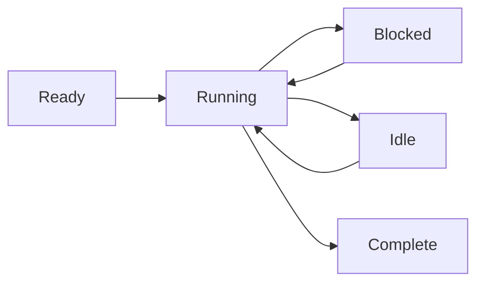

# Modelo de Procesos

Wippy ejecuta codigo en procesos aislados: maquinas de estado ligeras que se comunican mediante paso de mensajes. Este enfoque basado en el modelo de actores elimina errores de estado compartido y hace que la programacion concurrente sea predecible.

## Ejecucion de Maquina de Estado

Cada proceso sigue el mismo patron: inicializar, avanzar a traves de la ejecucion cediendo en operaciones bloqueantes, y cerrar cuando completa. El planificador multiplexa miles de procesos a traves de un pool de workers, ejecutando otros procesos mientras uno espera por I/O.

Los procesos soportan multiples yields concurrentes: puede iniciar varias operaciones asincronas y esperar a que cualquiera o todas completen. Esto permite I/O paralelo eficiente sin crear procesos adicionales.



Los procesos no estan limitados a Lua. El runtime soporta cualquier implementacion de maquina de estado: procesos basados en Go y modulos WebAssembly estan planeados.

<warning>
Los procesos son ligeros pero no gratuitos. Cada proceso comienza con aproximadamente 13KB de overhead base. Las asignaciones dinamicas y el crecimiento del heap se agregan durante la ejecucion.
</warning>

## Hosts de Procesos

Wippy ejecuta multiples hosts de procesos dentro de un solo runtime, cada uno con diferentes capacidades y limites de seguridad. Los procesos del sistema ejecutando funciones privilegiadas pueden vivir en un host, aislados de hosts ejecutando sesiones de usuario. Los hosts pueden restringir lo que los procesos pueden hacer; en Erlang necesitaria nodos separados para este nivel de aislamiento.

Algunos hosts son especializados. El host Terminal, por ejemplo, ejecuta un solo proceso pero le otorga acceso a operaciones de I/O que otros hosts deniegan. Esto le permite mezclar niveles de confianza en un solo despliegue: servicios del sistema con acceso completo junto a codigo de usuario aislado.

## Modelo de Seguridad

Cada proceso se ejecuta bajo una identidad de actor y politica de seguridad. Tipicamente este es el usuario que inicio la llamada, pero los procesos del sistema se ejecutan bajo un actor de sistema con diferentes privilegios.

El control de acceso funciona en multiples niveles. Los procesos individuales tienen sus propios niveles de acceso. El envio de mensajes entre hosts puede ser prohibido basado en la politica de seguridad: un proceso de usuario aislado podria no estar autorizado a enviar mensajes a hosts del sistema en absoluto. La politica adjunta al actor actual determina que operaciones estan permitidas.

## Creando Procesos

Cree procesos en segundo plano con `process.spawn()`:

```lua
local pid = process.spawn("app.workers:handler", "app:processes", arg1, arg2)
```

El primer argumento es la entrada del registro, el segundo es el host de procesos, y los argumentos restantes se pasan al proceso.

Las variantes de spawn controlan las relaciones de ciclo de vida:

| Funcion | Comportamiento |
|----------|----------|
| `spawn` | Disparar y olvidar |
| `spawn_monitored` | Recibir eventos EXIT cuando el hijo termina |
| `spawn_linked` | Bidireccional: cualquier crash notifica al otro |

## Paso de Mensajes

Los procesos se comunican mediante mensajes, nunca memoria compartida:

```lua
process.send(target_pid, "topic", payload)
```

Los mensajes del mismo remitente llegan en orden. Los mensajes de diferentes remitentes pueden intercalarse. La entrega es de tipo disparar y olvidar: use patrones de solicitud-respuesta cuando necesite confirmacion.

<note>
Los procesos pueden registrarse en un registro de nombres local y ser direccionados por nombre en lugar de PID (ej., `session_manager`). El registro global para direccionamiento entre nodos esta planeado.
</note>

## Supervision

Cualquier proceso puede supervisar a otros monitoreandolos. Un proceso crea hijos con monitoreo, observa eventos EXIT, y los reinicia en caso de fallo. Esto sigue la filosofia "dejalo fallar" de Erlang: los procesos fallan en condiciones inesperadas, y el proceso monitor maneja la recuperacion.

```lua
local worker = process.spawn_monitored("app.workers:handler", "app:processes")
local event = process.events():receive()

if event.kind == process.event.EXIT and event.result.error then
    worker = process.spawn_monitored("app.workers:handler", "app:processes")
end
```

A nivel raiz, el runtime proporciona servicios que inician y supervisan procesos de larga duracion, similar a systemd en Linux. Defina una entrada `process.service` para que el runtime gestione un proceso:

```yaml
- name: worker.service
  kind: process.service
  process: app.workers:handler
  host: app:processes
  lifecycle:
    auto_start: true
    restart:
      max_attempts: 5
      delay: 1s
```

El servicio inicia automaticamente, reinicia en caso de fallo con backoff, y se integra con la gestion de ciclo de vida del runtime.

## Actualizacion de Procesos

Los procesos en ejecucion pueden actualizar su codigo sin perder identidad. Llame a `process.upgrade()` para cambiar a una nueva definicion mientras preserva PID, buzon y relaciones de supervision:

```lua
process.upgrade("app.workers:v2", current_state)
```

El primer argumento es la nueva entrada del registro (o nil para recargar la definicion actual). Los argumentos adicionales se pasan a la nueva version, permitiendole llevar estado a traves de la actualizacion. El proceso reanuda la ejecucion con el nuevo codigo inmediatamente.

Esto habilita la recarga de codigo en caliente durante desarrollo y actualizaciones sin tiempo de inactividad en produccion. El runtime cachea los protos compilados, asi que las actualizaciones no pagan el costo de compilacion repetidamente. Si una actualizacion falla por cualquier razon, el proceso falla y aplica la semantica normal de supervision: un padre monitor puede reiniciarlo con la version anterior o escalar el fallo.

## Planificacion

El planificador de actores usa work-stealing a traves de nucleos de CPU. Cada worker tiene una cola local para localidad de cache, con una cola global para distribucion. Los procesos ceden en operaciones bloqueantes, permitiendo que miles se ejecuten concurrentemente en un punado de threads.
