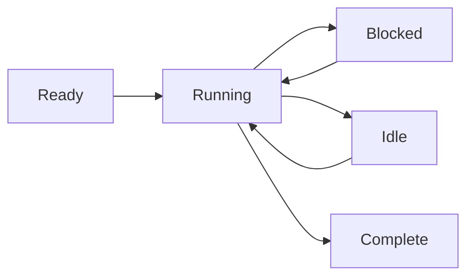

# Modelo de Procesos

Wippy ejecuta código en procesos aislados: máquinas de estado ligeras que se comunican mediante paso de mensajes. Este enfoque basado en el modelo de actores elimina errores de estado compartido y hace que la programación concurrente sea predecible.

## Ejecución de Máquina de Estado

Cada proceso sigue el mismo patrón: inicializar, avanzar a través de la ejecución cediendo en operaciones bloqueantes, y cerrar cuando completa. El planificador multiplexa miles de procesos a través de un pool de workers, ejecutando otros procesos mientras uno espera por I/O.

Los procesos soportan múltiples yields concurrentes: puede iniciar varias operaciones asíncronas y esperar a que cualquiera o todas completen. Esto permite I/O paralelo eficiente sin crear procesos adicionales.



Los procesos no están limitados a Lua. El runtime soporta cualquier implementación de máquina de estado: procesos basados en Go y módulos WebAssembly están planeados.

<warning>
Los procesos son ligeros pero no gratuitos. Cada proceso comienza con aproximadamente 13KB de overhead base. Las asignaciones dinámicas y el crecimiento del heap se agregan durante la ejecución.
</warning>

## Hosts de Procesos

Wippy ejecuta múltiples hosts de procesos dentro de un solo runtime, cada uno con diferentes capacidades y límites de seguridad. Los procesos del sistema ejecutando funciones privilegiadas pueden vivir en un host, aislados de hosts ejecutando sesiones de usuario. Los hosts pueden restringir lo que los procesos pueden hacer; en Erlang necesitaría nodos separados para este nivel de aislamiento.

Algunos hosts son especializados. El host Terminal, por ejemplo, ejecuta un solo proceso pero le otorga acceso a operaciones de I/O que otros hosts deniegan. Esto le permite mezclar niveles de confianza en un solo despliegue: servicios del sistema con acceso completo junto a código de usuario aislado.

## Modelo de Seguridad

Cada proceso se ejecuta bajo una identidad de actor y política de seguridad. Típicamente este es el usuario que inició la llamada, pero los procesos del sistema se ejecutan bajo un actor de sistema con diferentes privilegios.

El control de acceso funciona en múltiples niveles. Los procesos individuales tienen sus propios niveles de acceso. El envío de mensajes entre hosts puede ser prohibido basado en la política de seguridad: un proceso de usuario aislado podría no estar autorizado a enviar mensajes a hosts del sistema en absoluto. La política adjunta al actor actual determina qué operaciones están permitidas.

## Creando Procesos

Cree procesos en segundo plano con `process.spawn()`:

```lua
local pid = process.spawn("app.workers:handler", "app:processes", arg1, arg2)
```

El primer argumento es la entrada del registro, el segundo es el host de procesos, y los argumentos restantes se pasan al proceso.

Las variantes de spawn controlan las relaciones de ciclo de vida:

| Función | Comportamiento |
|----------|----------|
| `spawn` | Disparar y olvidar |
| `spawn_monitored` | Recibir eventos EXIT cuando el hijo termina |
| `spawn_linked` | Bidireccional: cualquier crash notifica al otro |

## Paso de Mensajes

Los procesos se comunican mediante mensajes, nunca memoria compartida:

```lua
process.send(target_pid, "topic", payload)
```

Los mensajes del mismo remitente llegan en orden. Los mensajes de diferentes remitentes pueden intercalarse. La entrega es de tipo disparar y olvidar: use patrones de solicitud-respuesta cuando necesite confirmación.

<note>
Los procesos pueden registrarse en un registro de nombres local y ser direccionados por nombre en lugar de PID (ej., `session_manager`). El registro global para direccionamiento entre nodos está planeado.
</note>

## Supervisión

Cualquier proceso puede supervisar a otros monitoreándolos. Un proceso crea hijos con monitoreo, observa eventos EXIT, y los reinicia en caso de fallo. Esto sigue la filosofía "dejarlo fallar" de Erlang: los procesos fallan en condiciones inesperadas, y el proceso monitor maneja la recuperación.

```lua
local worker = process.spawn_monitored("app.workers:handler", "app:processes")
local event = process.events():receive()

if event.kind == process.event.EXIT and event.result.error then
    worker = process.spawn_monitored("app.workers:handler", "app:processes")
end
```

A nivel raíz, el runtime proporciona servicios que inician y supervisan procesos de larga duración, similar a systemd en Linux. Defina una entrada `process.service` para que el runtime gestione un proceso:

```yaml
- name: worker.service
  kind: process.service
  process: app.workers:handler
  host: app:processes
  lifecycle:
    auto_start: true
    restart:
      max_attempts: 5
      delay: 1s
```

El servicio inicia automáticamente, reinicia en caso de fallo con backoff, y se integra con la gestión de ciclo de vida del runtime.

## Actualización de Procesos

Los procesos en ejecución pueden actualizar su código sin perder identidad. Llame a `process.upgrade()` para cambiar a una nueva definición mientras preserva PID, buzón y relaciones de supervisión:

```lua
process.upgrade("app.workers:v2", current_state)
```

El primer argumento es la nueva entrada del registro (o nil para recargar la definición actual). Los argumentos adicionales se pasan a la nueva versión, permitiéndole llevar estado a través de la actualización. El proceso reanuda la ejecución con el nuevo código inmediatamente.

Esto habilita la recarga de código en caliente durante desarrollo y actualizaciones sin tiempo de inactividad en producción. El runtime cachea los protos compilados, así que las actualizaciones no pagan el costo de compilación repetidamente. Si una actualización falla por cualquier razón, el proceso falla y aplica la semántica normal de supervisión: un padre monitor puede reiniciarlo con la versión anterior o escalar el fallo.

## Planificación

El planificador de actores usa work-stealing a través de núcleos de CPU. Cada worker tiene una cola local para localidad de caché, con una cola global para distribución. Los procesos ceden en operaciones bloqueantes, permitiendo que miles se ejecuten concurrentemente en un puñado de threads.
